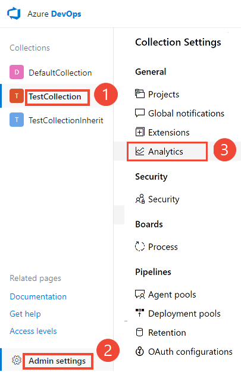
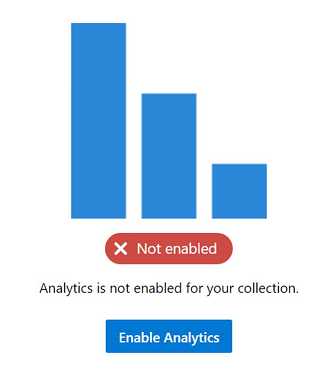
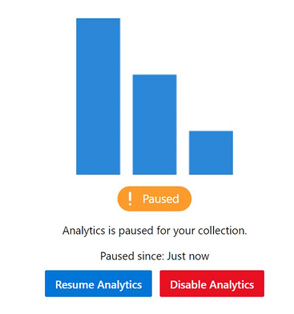
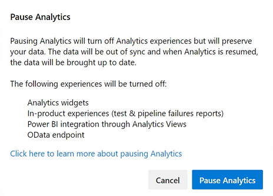
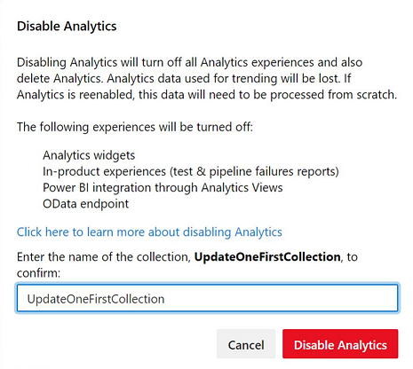
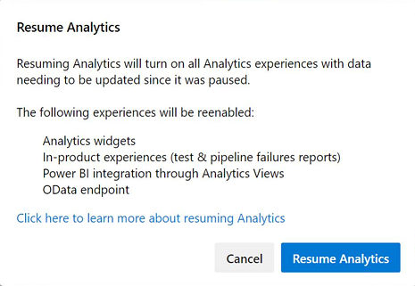
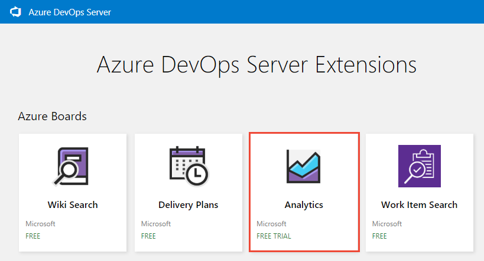
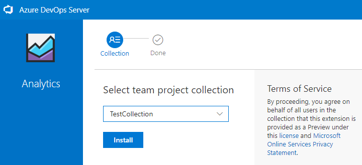
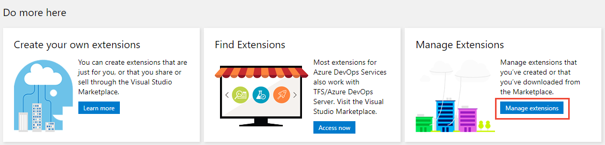
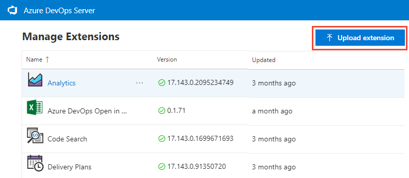

# Enable or install Analytics

[!INCLUDE [temp](../../_shared/version-azure-devops-2019.md)]

Analytics is currently in Preview. It is free to use while it remains in Preview. For Azure DevOps Server 2019, you [install the Analytics extension](#install-analytics) from your local marketplace. For Azure DevOps Server 2019.1, you [enable Analytics](#enable-analytics). You install or enable Analytics for each project collection for which you want to generate reports. 

> [!NOTE]  
> The Analytics Marketplace extension and Analytics is **not supported** for TFS 2018 or earlier versions.

Analytics supports access to Analytics widgets for all projects defined in the project collection. To learn more, see [What is Analytics?](../powerbi/what-is-analytics.md) and [Widgets based on Analytics](analytics-widgets.md). 

## Prerequisites (Azure DevOps Server 2019.1)

- You must have installed and configured your Azure DevOps Server. For details, see [Install and configure Azure DevOps on-premises](/azure/devops/server/install/get-started).
- You must have added at least one project collection. To add project collections, see [Manage project collections](/azure/devops/server/admin/manage-project-collections). 
- To enable, pause, disable, or resume Analytics, you must be a member of the [Project collection administrators](../../organizations/security/set-project-collection-level-permissions.md) group with [**Edit collection-level information** permissions](../../organizations/security/permissions.md#collection).  

## Enable Analytics

If you have upgraded to Azure DevOps Server 2019.1, you can enable Analytics for a project collection with the following steps. Otherwise, for Azure DevOps Server 2019, see [Install Analytics](#install-analytics). 

> [!NOTE]  
> Analytics is automatically enabled for all newly created project collections. 

1. From a web browser, choose (1) the project collection, (2) <strong>Admin settings</strong>, and then (3) <strong>Analytics</strong>.  

	> [!div class="mx-imgBorder"]  
	>  

2. Choose <strong>Enable Analytics</strong>.  
	<!--- Update image --> 
	> [!div class="mx-imgBorder"]  
	>  

	Once enabled, Analytics staging jobs begin to populate the Analytics data tables. This process could take some time depending on the size of your collection. To learn more about the data tables, see [Analytics data model(../extend-analytics/data-model-analytics-service.md).

## Pause or disable Analytics

If you have upgraded to Azure DevOps Server 2019.1, you can pause or disable Analytics for a project collection with the following steps. Otherwise, for Azure DevOps Server 2019, the equivalent actions are to [Disable or uninstall the Analytics extension](#disable-analytics-extension). 

You can only pause or disable Analytics that has been previously enabled.  

1. From the Analytics admin page, choose <strong>Pause Analytics</strong> or <strong>Disable Analytics</strong>. 
	<!--- Update image --> 
	> [!div class="mx-imgBorder"]  
	>  

2. Confirm that you want to pause or disable the service. 
	<!--- Update image --> 
	> [!div class="mx-imgBorder"]  
	>    

## Resume Analytics

For Azure DevOps Server 2019.1, you can resume Analytics after you've paused it for a project collection. Resuming the service will re-enable staging jobs, which will update the data tables and make them current, updating since the time it was paused.  

1.  From the Analytics admin page, choose <strong>Resume Analytics</strong>. 
	<!--- Update image --> 
	> [!div class="mx-imgBorder"]  
	>  

3. Confirm that you want to resume the service. 
	<!--- Update image --> 
	> [!div class="mx-imgBorder"]  
	>  

	Once enabled, Analytics staging jobs begin to populate the Analytics data tables. This process could take some time depending on the size of your collection. 

## What happens if I pause or disable Analytics? 

Pausing Analytics (2019.1) or disabling the Analytics extension (2019), disables the following features:
- [Analytics widgets](analytics-widgets.md)
- [Analytics in-context reports, such as pipeline and test reports](overview.md#incontext-reports)
- [Power BI integration using Analytics views](../powerbi/what-are-analytics-views.md)
- [OData endpoint queries](../extend-analytics/index.md) 

Pausing Analytics preserves your data but stops staging jobs from updating your data. You can resume the service later and your data will then be updated. 

Disabling Analytics (2019.1) or removing the Analytics extension (2019), turns off all Analytics staging jobs and deletes the Analytics data stored in the Analytics tables. All Analytics data that captures historical trends is lost. It does not delete any other data stored in your collection. You can't undo this action. Once historical data and trending data is deleted, you can't restore it. Re-enabling Analytics will not restore the historical data. 

With Analytics disabled or removed, the following actions occur: 
- No staging jobs are run, and the Analytics tables won't have updated information.  
- Table data is deleted, and if Analytics is re-enabled, all data will have to be repopulated from scratch.

> [!NOTE] 
> Disabling Analytics in Azure DevOps Server 2019.1 is the same as uninstalling the Analytics extension for Azure DevOps Server 2019.

<!--- QUESTION: when would an admin want to pause the service? when they are performing maintenance or moving a server? --> 

To learn more about the data tables, see [Analytics data model](../extend-analytics/data-model-analytics-service.md).

## Prerequisites (Azure DevOps Server 2019)

- You must have installed and configured your Azure DevOps Server. For details, see [Install and configure Azure DevOps on-premises](/azure/devops/server/install/get-started).
- You must have added at least one project collection. To add project collections, see [Manage project collections](/azure/devops/server/admin/manage-project-collections). 
- To install an extension, you must be a member of the [Project collection administrators](../../organizations/security/set-project-collection-level-permissions.md) group with [**Edit collection-level information** permissions](../../organizations/security/permissions.md#collection) If you don't have permissions, you can [request extensions](../../marketplace/request-extensions.md) instead.
- To upload an extension, you must be a member of the [Azure DevOps Server Administrators](/azure/devops/server/admin/add-administrator-tfs#server) group with [**Edit instance-level information** permissions](../../organizations/security/permissions.md#server). 
    - 

## Install the Analytics extension  

If you haven't upgraded to Azure DevOps Server 2019.1, you can install the Analytics extension to gain access to Analytics widgets and reports for your project collection. The Analytics extension is shipped within the on-premises installer. Installing the extension simply enables the functionality. There isn't any need to download extension files manually to install.  

> [!TIP]
> The Analytics extension appears in the local gallery for Azure DevOps Server so that there isn't any need to download it from the Azure DevOps Marketplace. 

1. From a web browser, choose (1) the project collection, (2) <strong>Admin settings</strong>, and then (3) <strong>Extensions</strong>. 

	 

2. Choose <strong>Browse local extensions</strong>.  

	> [!div class="mx-imgBorder"]  
	>    

	> [!NOTE]    
	> Installing the extension from the local marketplace is identical to installing from the hosted marketplace. The only difference is the hosted marketplace shows extension ratings and user comments.

3. The local Marketplace opens in a new browser tab. Choose the Analytics extension card.  

	> [!div class="mx-imgBorder"]  
	>    

4. Choose <strong>Get it free</strong>. 

	> [!div class="mx-imgBorder"]  
	>    

5. Select the project collection and then choose **Install**.  

	> [!div class="mx-imgBorder"]  
	>  

6. Upon completion of install, you'll see an image similar to the following. Choose <strong>Proceed to collection</strong> to return to the web portal for your collection.  

	> [!div class="mx-imgBorder"]  
	>    

	Optionally, if you want to install the Analytics extension on additional project collections, choose the browser back button. 

<a id="disable-analytics-extension" />

## Disable or uninstall the Analytics extension

If you choose to disable the Analytics extension, it will stop any jobs from running. Analytics data will be out of sync and associated features won't be available. However, no data is deleted.  Uninstalling the Analytics extension deletes the data from the Analytics database tables. Upon re-install of the extension, the data is re-populated from scratch.

1. Open the extensions menu and choose **Manage Extensions**.

   

1. In the **Manage** tab, open the shortcut menu for the extension.

   

2. Choose **Disable** or **Uninstall** as required.

## Restore the Analytics extension if removed from the deployment

If you remove the Analytics extension from your deployment, you can install the extension from the online marketplace to restore it. If you are unable to use the online marketplace due to your server setup&mdash;for example, your firewall blocks some outgoing connections&mdash;you can restore it to the local marketplace using the following steps.

1. Open **Collection settings** following the instructions provided in the section [Install the Analytics extension](#connected-tfs). 

	Choose **Extensions**, and then **Browse local extensions**.

2. Scroll to the bottom of the page, and choose **Manage Extensions**.

	> [!div class="mx-imgBorder"]  
	>    

3. Choose **Upload extension** and then choose **click to upload**. Browse to the folder containing the Microsoft.TeamFoundation.Extension.Analytics.vsix file.  

	> [!div class="mx-imgBorder"]  
	>    

	The .vsix file can be found in your application-tier folder installation in the following path.

	`C:\Program Files\Azure DevOps Server 2019\Tools\Deploy\TfsServicingFiles\Extensions\Microsoft.TeamFoundation.Extension.Analytics.vsix`

	Uploading the extension restores it to the local marketplace. From there, you can install it to a collection.

## How to determine if your server is disconnected?

If you're server is disconnected from the Internet, you must install Analytics from the local marketplace. 

You can determine if your Azure DevOps Server is in a disconnected state by checking to see if the connected icon and server name appear at the top when browsing the hosted marketplace. 

> [!div class="mx-imgBorder"]  
>    

When you navigate to the Marketplace from your on-premises server, an error doesn't display if you're not connected. It simply switches to the cloud service context.  

## Known issue

If you use a public URL to install the extension, for example `https://OnPrem.MyCompany.com`, you may encounter a callback error, such as a TLS/SSL error. 

To resolve this issue, you can install the extension from a machine that hosts the application tier and point to the local machine URL, for example `https://myMachineName`.

## Related articles

- [What is Analytics](../powerbi/what-is-analytics.md)
- [Data available from Analytics](../powerbi/data-available-in-analytics.md)
- [Grant permissions to access Analytics](../powerbi/analytics-security.md)
- [The Reporting Roadmap](../powerbi/reporting-roadmap.md) 
- [Extension FAQs](../../marketplace/faq-extensions.md) 

