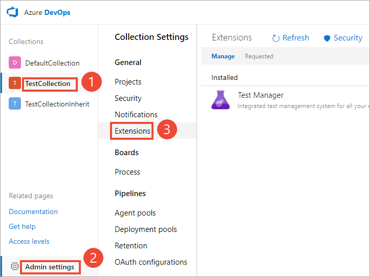
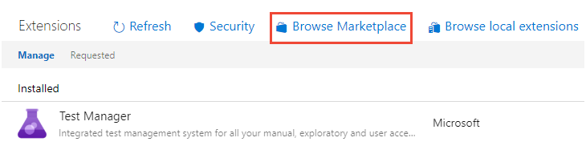
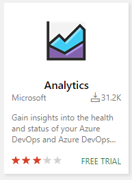
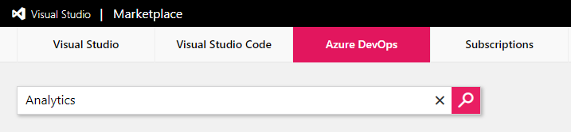
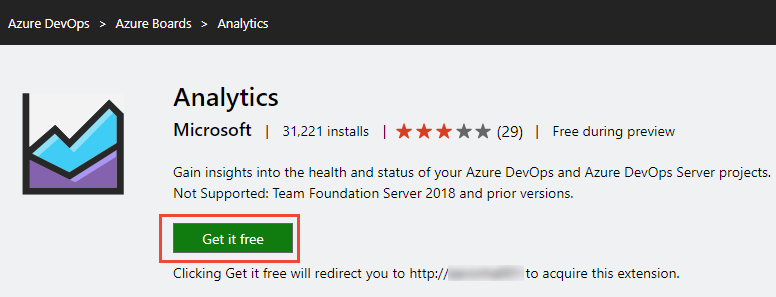
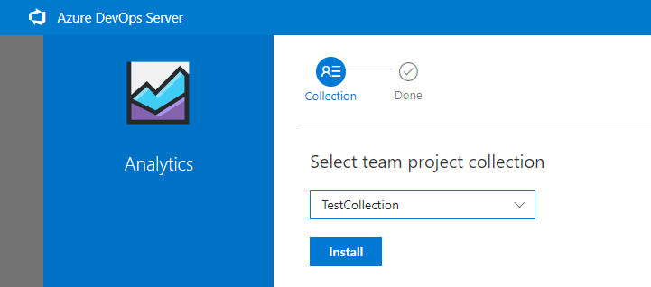
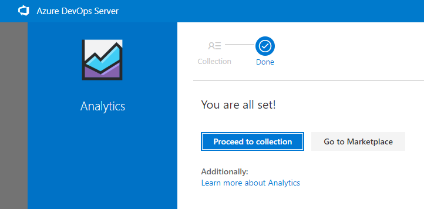
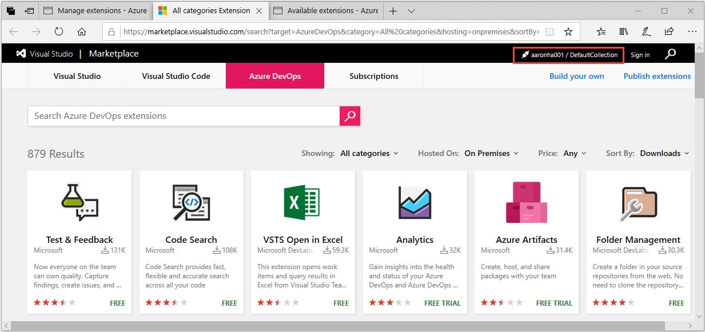
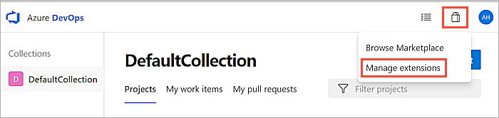
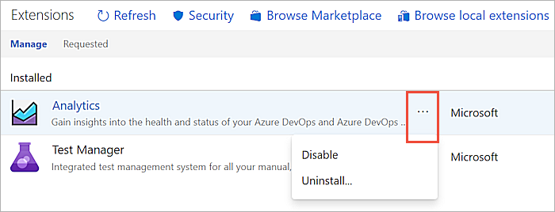

# Install the Analytics extension on Azure DevOps Server

[!INCLUDE [temp](../../_shared/version-azure-devops-2019.md)]

The Analytics extension for Azure DevOps Server 2019 is currently in Preview. It is free to install and use while it remains in Preview. The Analytics extension adds the Analytics service and access to Analytics widgets to all projects defined in your project collection. To learn more, see [What is the Analytics service?](../powerbi/what-is-analytics.md) and [Widgets based on the Analytics service](analytics-widgets.md). 

To use the Analytics service, you need to install the Analytics extension on each project collection where you plan to generate reports. The recommended method for installing the extension is from the web portal for the project collection administrative settings.

You can review the extension by going to the [Azure DevOps Marketplace, Analytics extension](https://marketplace.visualstudio.com/items?itemName=ms.vss-analytics). 

> [!NOTE]   
> The Analytics Marketplace extension is **not supported** for TFS 2018 or earlier versions.

<!---
- Install from the web portal 
- Download and then upload to your server, choose this option when you're disconnected from the Azure DevOps Server

-->

## Prerequisites 

- You must have installed and configured your Azure DevOps Server. For details, see [Install and configure Azure DevOps on-premises](/azure/devops/server/install/get-started).
- You must have added at least one project collection. To add project collections, see [Manage project collections](/azure/devops/server/admin/manage-project-collections). 
- To install an extension, you must be a member of the [Project collection administrators](../../organizations/security/set-project-collection-level-permissions.md) group with [**Edit collection-level information** permissions](../../organizations/security/permissions.md#collection) If you don't have permissions, you can [request extensions](../../marketplace/request-extensions.md) instead.
- To upload an extension, you must be a member of the 
[Azure DevOps Server Administrators](/azure/devops/server/admin/add-administrator-tfs#server) group with [**Edit instance-level information** permissions](../../organizations/security/permissions.md#server). 

## Install the Analytics extension from the Marketplace  

The Analytics extension is shipped within the on-premises installer. Installing the extension simply enables the functionality. There isn't any need to download extension files manually to install. Also, the on-premises Analytics extension updates with standard updates made to Azure DevOps Server.  

> [!TIP]
> The Analytics extension appears in the local gallery for Azure DevOps Server so that there isn't any need to download it from the Azure DevOps Marketplace. 

1. From a web browser, choose (1) the project collection, (2) <strong>Admin settings</strong>, and then (3) <strong>Extensions</strong>. 

	 

2. Choose <strong>Browse Marketplace</strong>. Or, if your server is disconnected from the Internet, choose <strong>Browse local extensions</strong>. ([How do I know that I'm disconnected from the Internet?](#disconnected)). 

	> [!div class="mx-imgBorder"]  
	>    

	> [!NOTE]    
	> Installing the extension from the local marketplace is identical to installing from the hosted marketplace. The only difference is the hosted marketplace shows extension ratings and user comments.

3. The Marketplace opens in a new browser tab. Choose the Analytics extension card.  

	> [!div class="mx-imgBorder"]  
	>    

	If the Analytics card doesn't appear, then you can search for it.  

	> [!div class="mx-imgBorder"]  
	>   

	Or, copy the [Analytics extension](https://marketplace.visualstudio.com/items?itemName=ms.vss-analytics) link into your web browser. 

4. Choose <strong>Get it free</strong> to be redirected to the web portal and install for the selected collection.  

	> [!div class="mx-imgBorder"]  
	>    

4. Verify the selected collection and then choose <strong>Install</strong>.  

	> [!div class="mx-imgBorder"]  
	>    

5. Upon completion of install, you'll see an image similar to the following. Choose <strong>Proceed to collection</strong> to return to the web portal for your collection.  

	> [!div class="mx-imgBorder"]  
	>    

	Optionally, if you want to install the Analytics extension on additional project collections, choose the browser back button. 

## How to determine if your server is disconnected?

You can determine if your Azure DevOps Server is in a disconnected state by checking to see if the connected icon and server name appear at the top when browsing the hosted marketplace. 

> [!div class="mx-imgBorder"]  
>    

When you navigate to the Marketplace from your on-premises server, an error doesn't display if you're not connected. It simply switches to the cloud service context.  

## Disable or uninstall the Analytics extension

If you choose to disable the Analytics extension, it will stop any jobs from running. Data from the Analytics service will be out of sync and associated features won't be available. However, no data is deleted.  Uninstalling the Analytics extension deletes the data from the Analytics database tables. Upon re-install of the extension, the data is re-populated from scratch.

0. Open the extensions menu and choose **Manage Extensions**.

   

0. In the **Manage** tab, open the shortcut menu for the extension.

   

0. Choose **Disable** or **Uninstall** as required.

## Known issue

If you use a public URL to install the extension, for example `https://OnPrem.MyCompany.com`, you may encounter a callback error, such as a TLS/SSL error. 

To resolve this issue, you can install the extension from a machine that hosts the application tier and point to the local machine URL, for example `https://myMachineName`.

## Related articles

- [What is Analytics](../powerbi/what-is-analytics.md)
- [Data available from the Analytics Service](../powerbi/data-available-in-analytics.md)
- [Grant permissions to access the Analytics service](../powerbi/analytics-security.md)
- [The Reporting Roadmap](../powerbi/reporting-roadmap.md) 
- [Install extensions](../../marketplace/install-extension.md) 
- [Extension FAQs](../../marketplace/tfs-extension-faqs.md) 
- [Developing extensions](http://aka.ms/vsoextensions) 
- [Publishing extensions](http://aka.ms/vsmarketplace-publish)

