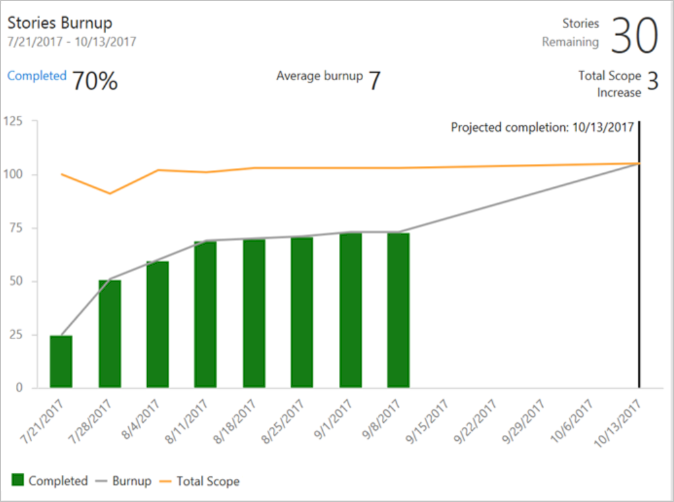

# Widgets based on Analytics

[!INCLUDE [temp](../includes/version-azure-devops.md)]

::: moniker range=">= azure-devops-2020"
Analytics supports several dashboard widgets that take advantage of the power of the service. Using these widgets, you and your team can gain valuable insights into the health and status of your work. 
::: moniker-end

::: moniker range="azure-devops-2019"
Analytics supports several dashboard widgets that take advantage of the power of the service. Once you [enable or install Analytics](../dashboards/analytics-extension.md) on a project collection, you can add these widgets to your dashboard. You must be an organization owner or a member of the [Project Collection Administrator group](../../organizations/security/set-project-collection-level-permissions.md) to add extensions or enable the service. Using these widgets, you and your team can gain valuable insights into the health and status of your work. 
::: moniker-end

You add an Analytics widget to a dashboard the same way you add any other type of widget. For details, see [Add a widget to your dashboard](add-widget-to-dashboard.md). 

## Prerequisites

- Analytics widget data is calculated from the Analytics service.  

::: moniker range="< azure-devops"
- For Analytics widgets to display correctly, the Analytics service must be enabled on your on-premises Azure DevOps Server. To learn more, see [Install/uninstall or enable/disable the Analytics service](../../report/dashboards/analytics-extension.md).

::: moniker-end

[!INCLUDE [temp](../includes/boards-disabled.md)]

## Burndown

The Burndown widget lets you display a trend of remaining work across multiple teams and multiple sprints. You can use it to create a release burndown, a bug burndown, or a burndown on any scope of work over time. It will help you answer questions like: 

* Will we complete the scope of work by the targeted completion date? If not, what is the projected completion date?
* What kind of scope creep does my project have?
* What is the projected completion date for my project?

**Burndown widget showing a release Burndown**

To learn more, see [Configure a Burndown or Burnup widget](configure-burndown-burnup-widgets.md).  

## Burnup

The Burnup widget lets you display a trend of completed work across multiple teams and multiple sprints. You can use it to create a release burnup, a bug burnup, or a burnup on any scope of work over time. When completed work meets total scope, your project is done! 

**Burnup widget showing a release Burnup**

To learn more, see [Configure a Burndown or Burnup widget](configure-burndown-burnup-widgets.md).  

## Sprint Burndown widget 

The Analytics-based Sprint Burndown widget adds a team's burndown chart for a sprint to the dashboard. This widget supports several configuration options, including selecting a team, iteration, and time period. Teams use the burndown chart to mitigate risk and check for scope creep throughout the sprint cycle. 

**Sprint Burndown widget**

> [!div class="mx-imgBorder"] 
> 

To learn more, see [Configure and monitor sprint burndown](configure-sprint-burndown.md).  

## Cumulative Flow Diagram (CFD)

The CFD widget shows the count of work items (over time) for each column of a Kanban board. This allows you to see patterns in your team's development cycle over time. It will help you answer questions like: 
* Is there a bottleneck in my process? 
* Am I consistently delivering value to my users? 

**Cumulative flow diagram widget showing 30 days of data**

 

To learn more, see [Cumulative flow diagram widget](cumulative-flow.md).  

## Cycle Time

The Cycle time widget will help you analyze the time it takes for your team to complete work items once they begin actively working on them. A lower cycle time is typically indicative of a healthier team process. Using the Cycle time widget you will be able to answer questions like: 
* On average, how long does it take my team to build a feature or fix a bug? 
* Are bugs costing my team a lot of development time?

**Cycle time widget showing 30 days of data**

 

To learn more, see [Cycle time and lead time control charts](cycle-time-and-lead-time.md).  

## Lead Time

The Lead time widget will help you analyze the time it takes to deliver work from your backlog. Lead time measures the total time elapsed from the creation of work items to their completion. Using the Lead time widget you will be able to answer questions like: 
* How long does it take for work requested by a customer to be delivered?
* Did work items take longer than usual to complete?

**Lead time widget showing 60 days of data**

 

To learn more, see [Cycle time and lead time control charts](cycle-time-and-lead-time.md). 

## Velocity

The Velocity widget will help you learn how much work your team can complete during a sprint. The widget shows the team's velocity by Story Points, work item count, or any custom field. You can also compare the work delivered against your plan and track work completed late. Using the Velocity widget, you will be able to answer questions like:
* On average, what is the velocity of my team?
* Is my team consistently delivering what we planned?
* How much work can we commit to deliver in upcoming sprints? 

**Velocity widget showing 8 sprints of data based on Story Points**

 

To learn more, see [Configure and view Velocity widgets](team-velocity.md).  

## Test Results Trend (Advanced)

With the Test Results Trend (Advanced) widget, you can track the test quality of your pipelines over time. Tracking test quality and improving test collateral are essential tasks to maintaining a healthy DevOps pipeline.  

The widget shows a trend of your test results for either build or release pipelines. You can track the daily count of tests, pass rates, and test duration. The highly configurable widget allows you to use it for a wide variety of scenarios. 

You can find outliers in your test results and answer questions like:
- *What tests taking longer to run than usual?*
- *What micro services are affecting my pass rate?*

**Test trend widget showing passed test results and pass rate for the last 7 days grouped by Priority**

To learn more, see [Configure a test results widget](configure-test-results-trend.md).
