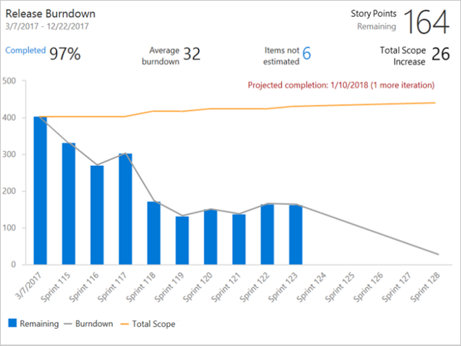
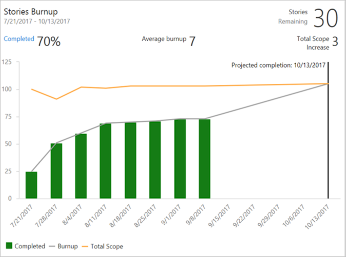
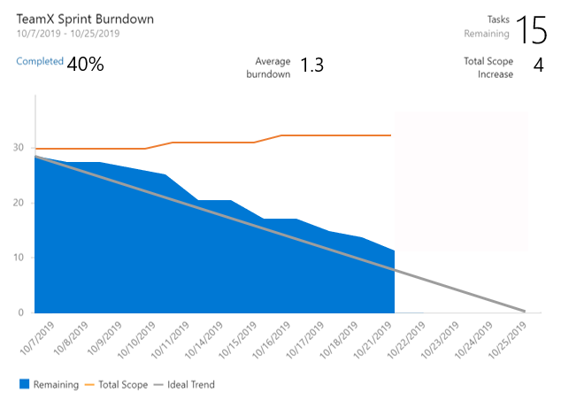
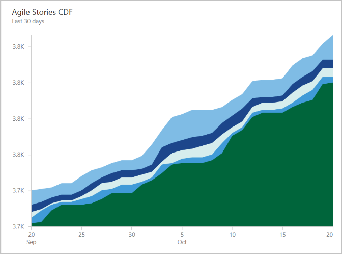
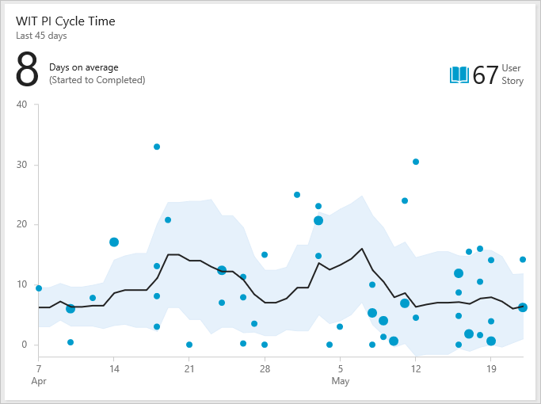
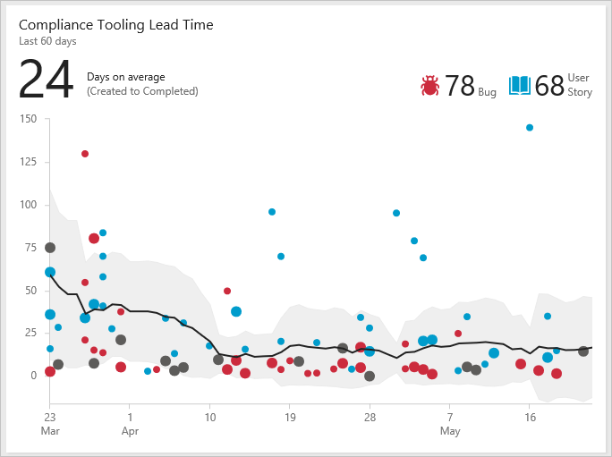
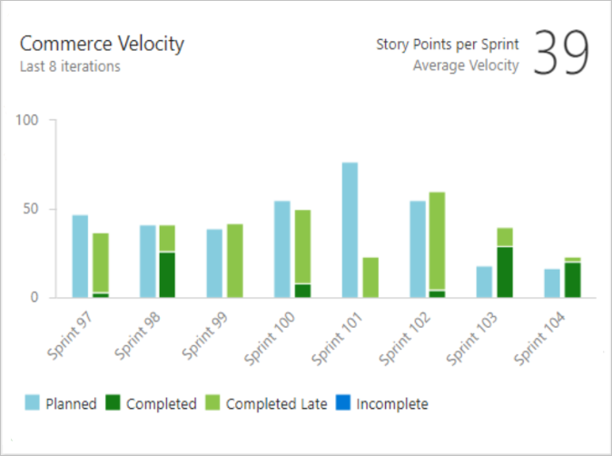
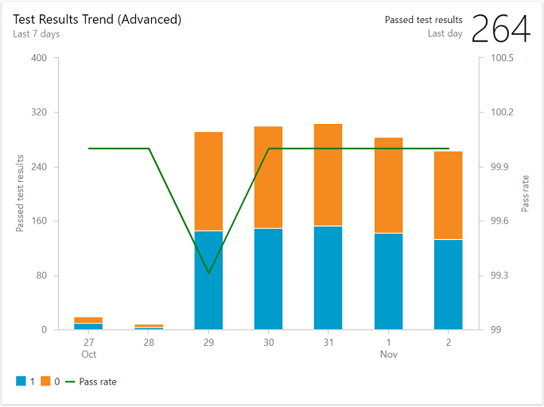

# Widgets based on Analytics data

[!INCLUDE [version-lt-eq-azure-devops](../../includes/version-lt-eq-azure-devops.md)]

Analytics widgets provide valuable insights into the health and status of your work. Add an Analytics widget to a dashboard the same way you add any other type of widget. For details, see [Add a widget to your dashboard](add-widget-to-dashboard.md). 

## Prerequisites

::: moniker range="azure-devops"

The Analytics service is enabled for all Azure DevOps Services organizations.

|Category  | Requirements |
|-------------|-------------|
| **Permissions** | **View analytics** permission set to **Allow** at the project level. By default, all project members have this permission. |
| **Access levels** | At least **Stakeholder** access. |

::: moniker-end
::: moniker range="< azure-devops"

|Category  | Requirements |
|-------------|-------------|
| **Permissions** | **View analytics** permission set to **Allow** at the project level. By default, all project members have this permission. |
| **Access levels** | At least **Stakeholder** access. |
| **Services** | [Analytics service enabled](../../report/dashboards/analytics-extension.md). |
 
::: moniker-end

[!INCLUDE [temp](../includes/boards-disabled.md)]

## Burndown widget

The Burndown widget displays a trend of remaining work across multiple teams and sprints. Use it to create a release burndown, a bug burndown, or a burndown on any scope of work over time. It helps you answer questions like:

* Will you complete the scope of work by the targeted date? If not, what is the projected completion date?
* How much scope creep does your project have?

**Burndown widget showing a release burndown**

For more information, see [Configure a burndown or burnup widget](configure-burndown-burnup-widgets.md).  

## Burnup widget

The Burnup widget displays a trend of completed work across multiple teams and sprints. Use it to create a release burnup, a bug burnup, or a burnup on any scope of work over time. When completed work meets total scope, your project is done.

**Burnup widget showing a release burnup**

For more information, see [Configure a burndown or burnup widget](configure-burndown-burnup-widgets.md).  

## Sprint Burndown widget 

The Analytics-based Sprint Burndown widget adds a team's burndown chart for a sprint to the dashboard. This widget supports several configuration options, including selecting a team, iteration, and time period. Teams use the burndown chart to mitigate risk and check for scope creep throughout the sprint cycle. 

**Sprint Burndown widget**

> [!div class="mx-imgBorder"] 
> 

For more information, see [Configure and monitor sprint burndown](configure-sprint-burndown.md).  

## Cumulative Flow Diagram (CFD) widget

The CFD widget shows the count of work items for each column of a board over time. It helps you see patterns in your team's development cycle and answer questions like:
* Is there a bottleneck in your process? 
* Are you consistently delivering value to your users? 

**Cumulative flow diagram widget showing 30 days of data**

For more information, see [Cumulative flow diagram widget](cumulative-flow.md).  

## Cycle Time widget

The Cycle Time widget helps you analyze the time it takes for your team to complete work items once they begin actively working on them. A lower cycle time typically indicates a healthier process. The widget helps you answer questions like:
* On average, how long does it take your team to build a feature or fix a bug? 
* Are bugs costing your team many development hours?

**Cycle Time widget showing 30 days of data**

For more information, see [Cycle Time and lead time control charts](cycle-time-and-lead-time.md).  

## Lead Time widget

The Lead Time widget helps you analyze the time it takes to deliver work from your backlog. Lead time measures the total time elapsed from the creation of work items to their completion. The widget helps you answer questions like:
* How long does it take for work requested by a customer to be delivered?
* Do work items take longer than usual to complete?

**Lead Time widget showing 60 days of data**

For more information, see [Cycle Time and lead time control charts](cycle-time-and-lead-time.md). 

## Velocity widget

The Velocity widget helps you learn how much work your team can complete during a sprint. The widget shows velocity by Story Points, work item count, or any custom field. You can compare work delivered against your plan and track work completed late. The widget helps you answer questions like:
* On average, what is the velocity of your team?
* Is your team consistently delivering what you planned?
* How much work can you commit to deliver in upcoming sprints? 

**Velocity widget showing eight sprints of data based on Story Points**

For more information, see [Configure and view Velocity widgets](team-velocity.md).  

## Test Results Trend (Advanced)

The Test Results Trend (Advanced) widget helps you track pipeline test quality over time. Tracking test quality and improving test collateral are essential to maintaining a healthy DevOps pipeline.

The widget shows a trend of your test results for either build or release pipelines. You can track the daily count of tests, pass rates, and test duration. The widget is highly configurable for a wide variety of scenarios.

The widget helps you find outliers in your test results and answer questions like:
- What tests take longer to run than usual?
- What microservices are affecting your pass rate?

**Test trend widget showing passed test results and pass rate for the last seven days grouped by Priority**

For more information, see [Configure a test results widget](configure-test-results-trend.md).

## Related content

- [Add a widget to a dashboard](add-widget-to-dashboard.md)
- [What is Analytics?](../powerbi/what-is-analytics.md)
- [Add and manage dashboards](dashboards.md)
