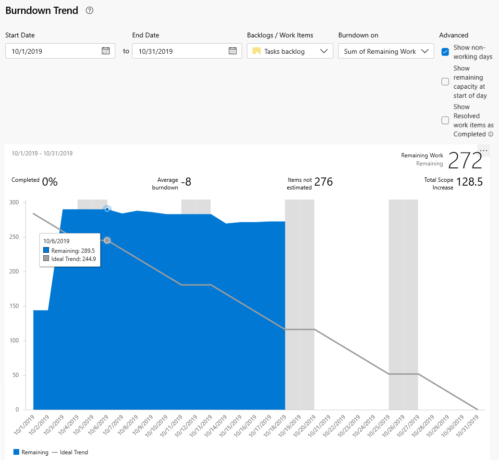

# Burndown guidance

[!INCLUDE [temp](../includes/version-azure-devops-all.md)]

Review your sprint burndown chart throughout your sprint cycle to check for these indicators:  

> [!div class="checklist"]   
> * Is remaining work getting updated regularly? Flat spaces within the blue area indicate a lack of updates.  
> * Is remaining work increasing instead of decreasing? Increases can indicate work that wasn't estimated or planned. Both signal a need for the team to discuss how they'll complete the sprint tasks on time.  
> * Based on the actual burn rate, does the team feel confident that they'll complete the work by the end of the sprint?    

To configure or view sprint burndown charts, see [Sprint burndown](configure-sprint-burndown.md).

## Scope management  

By estimating remaining work of tasks for each backlog item, teams better understand what they can accomplish within a sprint. Because the sprint tasks define the overall sprint scope, defining the remaining work leads to a well-defined sprint scope. Anything that is not represented by a task in the sprint should be considered out of scope for the sprint.

::: moniker range=">= azure-devops-2020"

As the team makes progress, divergences from the ideal trend line help the team monitor divergences from scope. 

> [!div class="mx-imgBorder"]  
>  

[!INCLUDE [temp](../../includes/note-working-days-off.md)]

Increases instead of decreases within the blue graph may indicate:

- Poor estimates made to tasks 
- Discovery of new work not accounted for in sprint planning 
- Scope creep, additional work not agreed to by the team. 
 
Whatever the cause, teams should come together quickly to determine how to remedy the increased workload. 

Solutions may include reassigning tasks or recruiting additional resources. The team should move all non-essential sprint work to the backlog and consider it during the next sprint planning meeting.

::: moniker-end

::: moniker range="<= azure-devops-2019"

As the team makes progress, divergences from the ideal trend line help the team monitor divergences from scope. 
<table>
<tr valign="top">
<td width="35%">

Increases instead of decreases within the blue graph may indicate:
 
<ul>
<li>Poor estimates made to tasks</li>
<li>Discovery of new work not accounted for in sprint planning</li>
<li>Scope creep, additional work not agreed to by the team.</li>
</ul>

Whatever the cause, teams should come together quickly to determine how to remedy the increased workload.

Solutions may include reassigning tasks or recruiting additional resources. The team should move all non-essential sprint work to the backlog and consider it during the next sprint planning meeting.

</td>
<td>

</td>
</tr>
</table>

::: moniker-end

## Mitigate risk through daily inspection

::: moniker range=">= azure-devops-2020"

Your burn-down chart shows you if your project is on schedule. A daily check can mitigate risks and provide early warning of potential schedule or cost overruns, two metrics associated with traditional project management. 

For example, when the actual remaining work (blue area) goes flat for a while, or remains high above the ideal trend line, the team is at risk of not meeting their sprint commitments.

> [!div class="mx-imgBorder"]  
> 

Teams should meet immediately to course correct and either reassign work, recruit more resources, or reset expectations.

  
::: moniker-end

::: moniker range="<= azure-devops-2019"

Your burn-down chart shows you if your project is on schedule. A daily check can mitigate risks and provide early warning of potential schedule or cost overruns, two metrics associated with traditional project management. 

<table>
<tr valign="top">
<td width="35%">

For example, when the actual remaining work (blue area) goes flat for a period of time, or remains high above the ideal trend line, the team is at risk of not meeting their sprint commitments.

Teams should meet immediately to course correct and either reassign work, recruit more resources, or reset expectations.

</td>
<td>

</td>
</tr>
</table>
  
::: moniker-end

## Next steps

In addition to the sprint burndown chart, teams can review the velocity at which they work sprint over sprint. The velocity chart tracks how many backlog items your team works on in a sprint.  

You can use your team [velocity](team-velocity.md) as input into the [forecast](../../boards/sprints/forecast.md) tool to help plan your sprints.   

### Industry resources
 
- [Understanding the Scrum Burndown Chart](https://www.methodsandtools.com/archive/scrumburndown.php)  
- [Task sizing in Agile software development](https://www.solutionsiq.com/task-sizing-in-agile-software-development/)  

<!---
For on-premises TFS deployments, you can [specify the format that appears&mdash;**h** for hours or **d** for days&mdash;for the remaining work field](../../reference/xml/process-configuration-xml-element.md#fields).  
--> 