# Track progress with status and trend query-based charts 

[!INCLUDE [temp](../includes/version-azure-devops-all.md)]

You can quickly view the status of work in progress by charting the results of a [flat-list query](../../boards/queries/using-queries.md). Different chart views such as pie, column, pivot, or trend are supported. Charts support viewing a count of work items or a sum of values for select numeric fields, such as Story Points, Effort, or Remaining Work. Group work by State, Assigned To, or other system defined or custom field.    

In this article you'll learn how to perform the following tasks:  

::: moniker range="azure-devops"
> [!div class="checklist"]    
> * Construct a flat-list query to support your chart
> * Create and share your query-based chart 
> * Create a status pie, column, bar, or pivot chart
> * Create a trend chart 
> * Add a query chart to a dashboard
> * Configure a query widget    
> * Group a **Chart by Work Items** widget by tags  
::: moniker-end

::: moniker range="< azure-devops"
> [!div class="checklist"]    
> * Construct a flat-list query to support your chart
> * Create and share your query-based chart 
> * Create a status pie, column, bar, or pivot chart
> * Create a trend chart 
> * Add a chart to a dashboard
> * Configure a query widget    
::: moniker-end

::: moniker range=">= azure-devops-2019"

For example, the following image illustrates two different charts created from the same flat-list query. The pie chart groups the 19 bugs by state, and the bar chart groups the bugs by assignment and their current status.

> [!div class="mx-imgBorder"]  
>    

::: moniker-end

::: moniker range="<= tfs-2018"

For example, the following image illustrates four different charts created from the same flat-list query. The pie chart groups the 146 active bugs by priority, and the bar chart groups the bugs by team and their triage status. The last two chart show two different trend views of the active bugs over the last two weeks.  
  
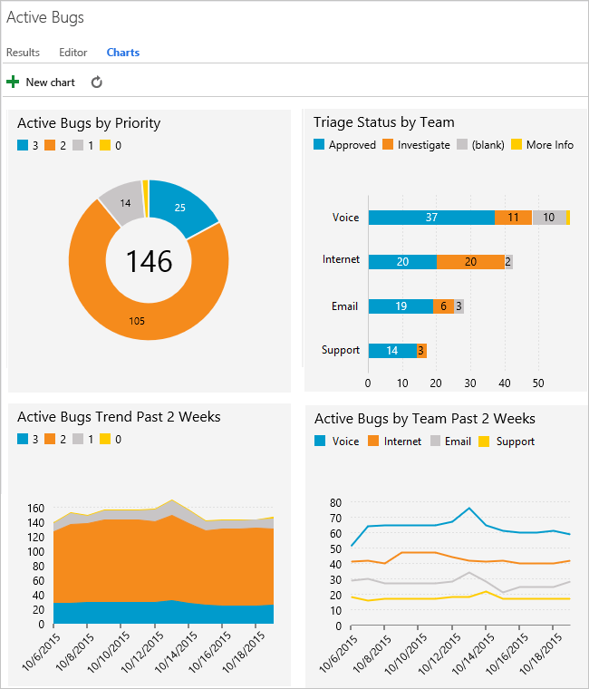

::: moniker-end

## Prerequisites

By default, users with **Basic** access or higher can create charts. Users with **Stakeholder** access can't view or create charts from the **Queries** page, however, they can view charts added to a team dashboard. For details, see [About access levels](../../organizations/security/access-levels.md).

::: moniker range="azure-devops"

* You must connect to a project. If you don't have a project yet, [create one](../../boards/get-started/sign-up-invite-teammates.md). 
* To create a chart, you must be added to a project as a member of the **Contributors** or **Project Administrators** security group. To get added, [Add users to a project or team](../../organizations/security/add-users-team-project.md). 
* To add a chart to a team dashboard, you must be a member of the team, be a team administrator, or be a member of the **Project Administrators** security group.
* You can add charts to [multiple team dashboards](dashboards.md) and get access to the [widget catalog](widget-catalog.md), which is another way to add charts to a dashboard. 

> [!NOTE]  
> Users with **Stakeholder** access for a public project have full access to query chart features just like users with **Basic** access. For details, see [About access levels](../../organizations/security/access-levels.md).

::: moniker-end

::: moniker range=">= tfs-2017 <= azure-devops-2020"

* You must connect to a project. If you don't have a project yet, [create one](../../organizations/projects/create-project.md).
* To create a chart, you must be added to a project as a member of the **Contributors** or **Project Administrators** security group. To get added, [Add users to a project or team](../../organizations/security/add-users-team-project.md). 
* To add a chart to a team dashboard, you must be a member of the team, be a team administrator, or be a member of the **Project Administrators** security group.
* You can add charts to [multiple team dashboards](dashboards.md) and get access to the [widget catalog](widget-catalog.md), which is another way to add charts to a dashboard. 

::: moniker-end 


::: moniker range="tfs-2015"

* You must connect to a project. If you don't have a project yet, [create one](../../organizations/projects/create-project.md).
* To create a chart, you must be added to a project as a member of the **Contributors** or **Project Administrators** security group. To get added, [Add users to a project or team](../../organizations/security/add-users-team-project.md). 
* To add a chart to a team dashboard, you must be a member of the team, be a team administrator, or be a member of the **Project Administrators** security group.
* You can pin charts to a team homepage, and with TFS 2015.1 and later versions, you can add charts to [multiple team dashboards](dashboards.md) and get access to the [widget catalog](widget-catalog.md)  

::: moniker-end

::: moniker range="tfs-2013"

* You must connect to a project. If you don't have a project yet, [create one](../../organizations/projects/create-project.md).
* To create a chart, you must be added to a project as a member of the **Contributors** or **Project Administrators** security group. To get added, [Add users to a project or team](../../organizations/security/add-users-team-project.md). 

::: moniker-end

To learn more about default groups, see [Get started with permissions, Permission inheritance and security groups](../../organizations/security/about-permissions.md#inheritance).


## Create a flat-list query  

When creating a query to support your chart, follow these guidelines. 

- Always choose the **Flat list of work items** query type. Other query types aren't supported for charting. For more information, see [Define a query, Define a flat-list query](../../boards/queries/using-queries.md#flat-list). 
- Add those fields to either a query clause or the column options that you want to use within your chart. You can group charts by any field except date-time, free-form text, and tag fields. For example: 
	- To group by Status, include the **State** field 
	- To group by work assignments, include the **Assigned To** field
	- To group by sprints or iterations, include the **Iteration Path**    
	- To group by team, include the **Node Name** field which displays the leaf node of the Area Path 
	- To group by a custom field, include it.  
- To sum a numeric column, include the corresponding field in your query clause or column options. For additional examples of charts created from numeric fields, see [Query by a numeric field](../../boards/queries/query-numeric.md). 
- If you plan to add your query to a dashboard, save your query as a Shared query.

::: moniker range="azure-devops"

-  You can't group charts by the following field data types:
	-  ID
	-  Date-time, such as Created Date, Changed Date 
	-  Plain text, such as Title 
	-  Rich-text, such as Description, Repro Steps 
	-  Tags (You can filter a query using tags, however you can't use tags to configure your chart).
> [!NOTE]   
> You can't group a query-based chart by tags, however, you can group a **Chart for Work Items** widget by tags that you add to a dashboard.  
> 
::: moniker-end

::: moniker range="< azure-devops"

-  You can't group charts by the following field data types:
	-  ID
	-  Date-time, such as Created Date, Changed Date 
	-  Plain text, such as Title 
	-  Rich-text, such as Description, Repro Steps 
	-  Tags (You can filter a query using tags, however you can't use tags to configure your chart).
::: moniker-end

### Chart availability

- Charts saved under **Shared Queries** are viewable by all team members, except members with Stakeholder access, and can be added to dashboards.   
- Charts that you create for queries under your **My Queries** folder are visible only to you.   
- You can copy and email the URL of any chart page to share it with a project member. 
- To create similar charts for tests, see [Track your test results](../../test/track-test-status.md).   


### Display of areas and iterations

When you select **Area Path** or **Iteration Path**, only the leaf node appears in the chart. The leaf node is the last node of the full path. For example, ```Phone``` is the leaf node of ```FabrikamFiber/Fabrikam Website/Phone```. If your query contains a mixed level of leaf nodes, your chart might not reflect expected results.  

Choose the **Node Name** field, the area path leaf node, to see if that improves your results. 

Charts display in browsers that support Scalable Vector Graphics (SVG). This includes Edge, Internet Explorer 9 and later versions, Chrome, Firefox and Safari on Mac. Charts aren't optimized for mobile or touch displays.  


::: moniker range=">= azure-devops-2020"
> [!NOTE]   
> Internet Explorer is no longer supported for Azure DevOps Services, nor for Azure DevOps Server 2020.1.   

::: moniker-end


### Sort by Value or Label 

Most charts allow you to choose how you want to sort the data. 

- **Value**: Sorts data by the numeric value 
- **Label**: Sorts by the label selected for grouping the data
 
### Limited display of series 

::: moniker range="> tfs-2018"

When a chart contains more than eight or 12 items within the data series, values in the 9 or 13-plus items are consolidated into a set labeled "other"?  

  

Display of query chart widgets you configure through a dashboard may exceed the query-chart limit. 

::: moniker-end 


::: moniker range="<= tfs-2018"

When a chart contains more than seven items within the data series, values in the eight-plus items are consolidated into a set labeled "other"?   

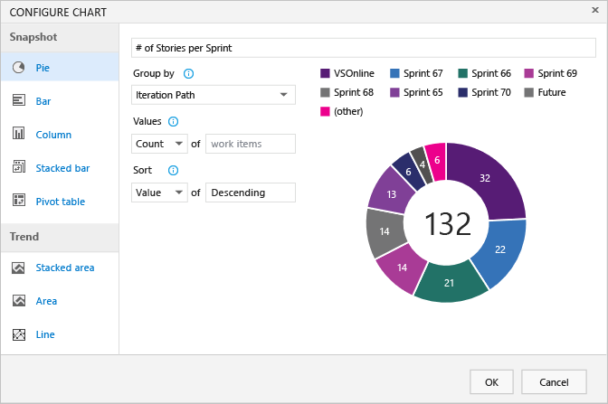  

::: moniker-end 

[!INCLUDE [temp](../../boards/includes/image-differences-with-wits.md)]

## Create a query-based chart  

1. From **Queries**, open the chart editor for a flat list query. You must belong to the Contributors group to create charts. 

   ::: moniker range=">= azure-devops-2019"  
   > [!div class="mx-imgBorder"]  
   >    
   ::: moniker-end  

   ::: moniker range="<= tfs-2018"  
   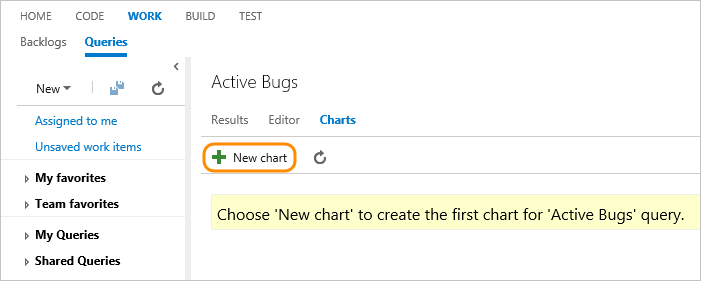  
   ::: moniker-end  

	If you have Stakeholder access, the **Charts** and **New Chart** links won't appear. 

2. Select the chart type and field for grouping values. When you use pie, bar, and column charts, select a single field to view a count of work items.  
   ::: moniker range=">= azure-devops-2019"  
   > [!div class="mx-imgBorder"]  
   > 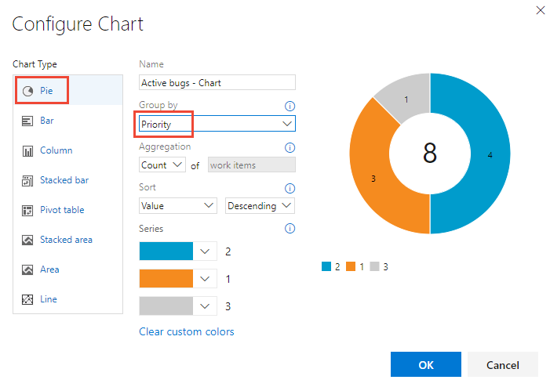  
   ::: moniker-end  

   ::: moniker range="<= tfs-2018"  
     
   ::: moniker-end  

   If you don't see the field you want in the **Group by** drop-down list, [add the field as a column to the query and save the query](../../boards/backlogs/set-column-options.md). Also, the **Aggregation** options depend on the fields used in the query or those selected from the **Column Options**.  

   If you receive an error message when you close the chart editor, you need to request [Basic access](../../organizations/security/change-access-levels.md).

3. To sort the results, choose **Value** or **Label** as the sort option and then **Ascending** or **Descending**.  

   ::: moniker range=">= azure-devops-2019"  
   To change a color, simply choose a color from the Series set of color pickers.   
   > [!div class="mx-imgBorder"]  
   >   
   ::: moniker-end  

   ::: moniker range="<= tfs-2018"  
   To change a color, simply choose a color on the chart and pick a new color from the color picker.  
   ::: moniker-end  

Charts automatically update when you edit the query or refresh the query results.  

<a id="pie-chart" /> 

## Add a Pie chart

Use a pie chart to show group percentages with six or fewer categories. Good examples of pie charts are: 

- Active Bugs Status, group by State
- User Story Status, group by State 
- User Story Progress, group by Completed, In Progress, or Cut 

For example, the following query filters User Stories based on the State for Cut, In Progress, and Completed since the start of the year. 

> [!div class="mx-imgBorder"]  
> 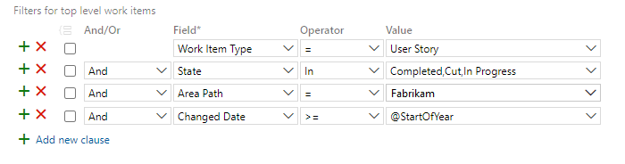 

The pie chart configuration is as shown in the following image. 

> [!div class="mx-imgBorder"]  
> 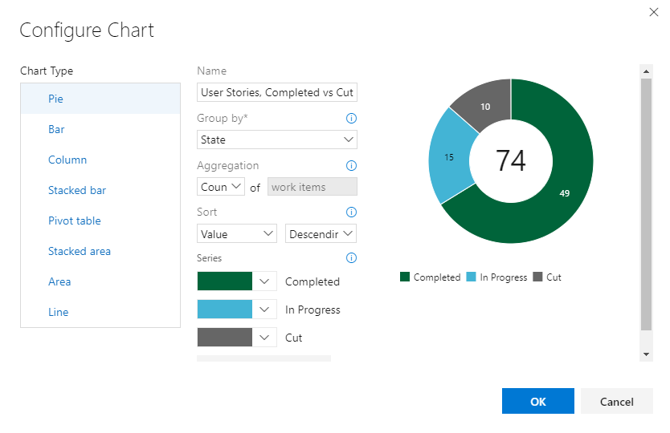  
The combined query and chart configuration yield the following pie chart. 

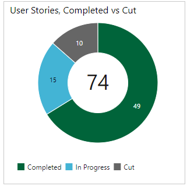  

## Add a Stacked bar chart  

A stacked bar chart lets you track progress against two field values. Node Name will display the last leaf within an area path. Use this when you want to show data across teams, and each node corresponds to a team.  

::: moniker range=">= azure-devops-2019"  
> [!div class="mx-imgBorder"]  
>    
::: moniker-end  

::: moniker range="<= tfs-2018"  
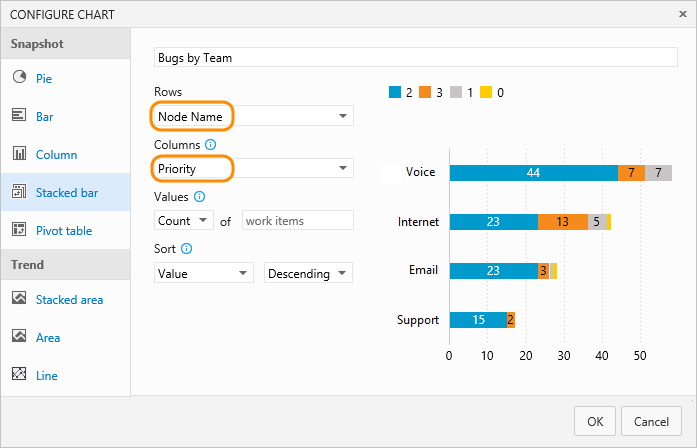
::: moniker-end  


## Add a Pivot table  

The Pivot table displays a table of configurable rows and columns, with columns showing a count of work items or sum of a numeric field. Choose a Pivot table when you want to compare across areas the work being performed. 

The following image shows an example of active bugs assigned to developers and their current state.  

> [!div class="mx-imgBorder"]  
> 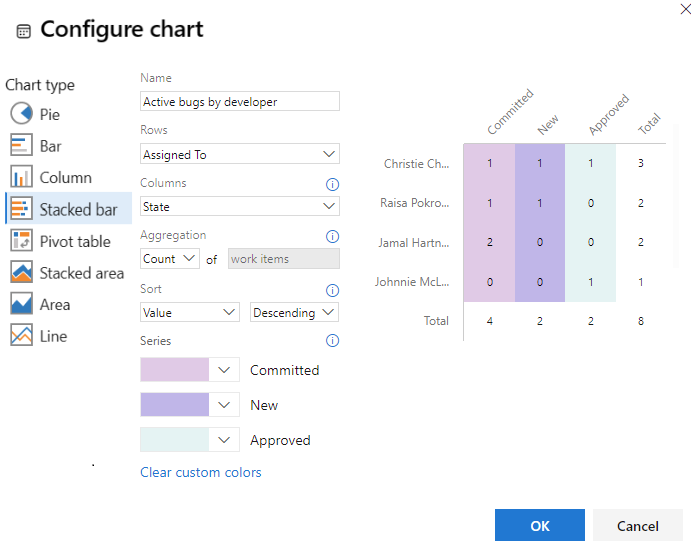 

## Add a Trend chart  

Trend charts let you view progress over time. You can select a rolling period ranging from the last week to the last year (earlier versions of TFS may have limited selections).  

::: moniker range=">= azure-devops-2019"  
> [!div class="mx-imgBorder"]  
> 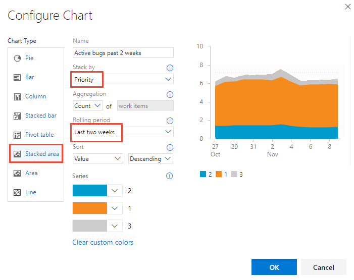   
::: moniker-end  

::: moniker range="<= tfs-2018"  
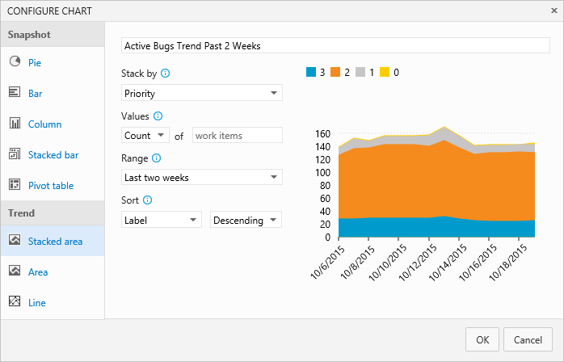
::: moniker-end  

Trend data is extracted from the work tracking data store. Like most data stores, the schema of the relational database is designed and optimized for the online transactional processing of data. As the tool or plug-in performs an activity, it writes the latest information to the operational store. Therefore, data in the operational store is constantly changing and being updated, and all data is current.


## Add a Burndown chart  

Burndown charts are useful for determining how quickly work is progressing based on a numeric field value, such as Story Points, Effort, or Remaining Work, or on a count of work items. 

To create a burndown chart, make sure to add the numeric field you want to your query. To view a burndown chart of tasks, choose the **Sum** operator for **Remaining Work**.  

::: moniker range=">= azure-devops-2019"  
> [!div class="mx-imgBorder"]  
> 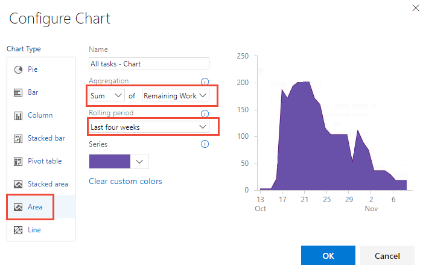   


In addition to query-based burndown charts, you can [Configure a Burndown or Burnup widget](configure-burndown-burnup-widgets.md). 


::: moniker-end  

::: moniker range="<= tfs-2018"  
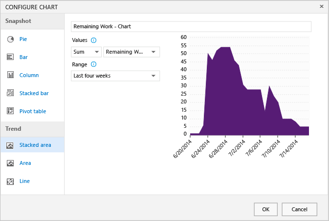
::: moniker-end  


## Add chart to a dashboard 

To add a chart to a dashboard, you must be a [team administrator](../../organizations/settings/add-team-administrator.md) or have permissions to edit a dashboard (default settings). You can only add charts defined for shared queries.

Choose the :::image type="icon" source="../../media/icons/actions-icon.png" border="false"::: actions icon for the chart you want to add, and select **Add to dashboard**.  

::: moniker range=">= azure-devops-2019"  
> [!div class="mx-imgBorder"]  
>    

In the dialog that opens, select the team dashboard to add the chart to. 

> [!div class="mx-imgBorder"]  
> 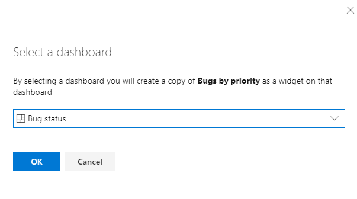  

::: moniker-end  

::: moniker range="<= tfs-2018"  
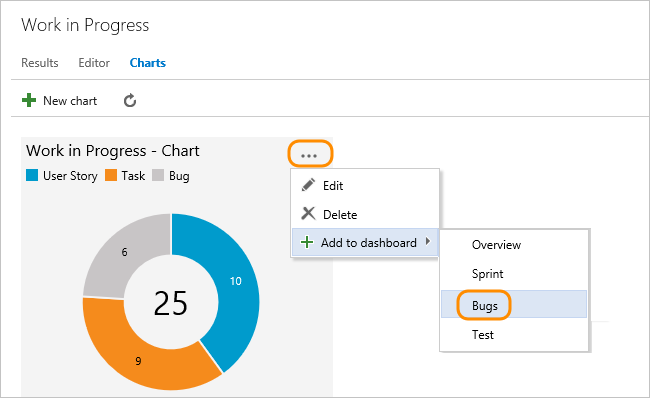
::: moniker-end  

To add other types of charts, such as test results and build summary charts, see [Add widgets and chart to a dashboard](add-widget-to-dashboard.md). 
 
::: moniker range="<= tfs-2015"

> [!NOTE]  
> For TFS 2013 and TFS 2015, you can pin charts to the team homepage. For TFS 2015.1 and later versions, you can add charts to [multiple team dashboards](dashboards.md) and get access to the [widget catalog](widget-catalog.md). 
::: moniker-end

::: moniker range=">= tfs-2015"
<a id="add-chart-widget"></a> 

## Add a chart widget to a dashboard   
 
If you've already defined your [flat list query](../../boards/queries/using-queries.md), you can add and configure a chart to a dashboard using the *Chart for work items* widget.  
::: moniker-end  

::: moniker range=">= azure-devops-2019"

1. From the web portal, open the [dashboard](dashboards.md) you want to add the chart to.  

2. To add widgets to the dashboard, choose :::image type="icon" source="media/icons/edit-icon.png" border="false"::: **Edit**.  The widget catalog will automatically open. Add all the widgets that you want and drag their tiles into the sequence you want. 

	If you don't see these icons, then you need to be added as a [team administrator](../../organizations/settings/add-team-administrator.md) or get permissions to edit dashboards. 

3. Choose the **Chart for work items** widget and then choose **Add**.  

	 

4. Choose the widget's :::image type="icon" source="../../media/icons/dashboard-configure.png" border="false"::: gear icon to open the Configuration dialog. 

	> [!div class="mx-imgBorder"]  
	>    

5. Give the chart a title, select the flat list query on which the chart is based, and choose the chart type.   

	Based on your chart type, specify values for the remaining fields. Change a chart color simply by choosing another color from those shown.   

	> [!NOTE]  
	> All rules for configuring charts described previously in this article apply to configuring the chart for work items widget. 

6. After you save your changes, you'll see the new chart has been added to the dashboard. 

	  

7. Drag the tile anywhere on the dashboard to put it where you want it. 

8. When you're finished with your changes, choose **Done Editing** to exit dashboard edit mode.

::: moniker-end

::: moniker range="tfs-2015"
The widget requires TFS 2015.2 or a later version. You add it to a team dashboard from the [widget catalog](widget-catalog.md). 
::: moniker-end

::: moniker range=">=tfs-2015 <= tfs-2018"

1. From the web portal, open the [team dashboard](dashboards.md) you want to add the chart to.   

2. To add widgets to the dashboard, choose :::image type="icon" source="media/icons/edit-icon.png" border="false"::: **Edit**. The widget catalog will automatically open.  Add all the widgets that you want and drag their tiles into the sequence you want. 

	If you don't see these icons, then you need to be added as a [team administrator](../../organizations/settings/add-team-administrator.md) or a member of the Project Administrators group. 

3. Choose the **Chart for work items** widget and then choose **Add**. 

	 

4. Choose the widget's :::image type="icon" source="media/icons/gear-icon.png" border="false"::: gear icon to open the configuration dialog. 

	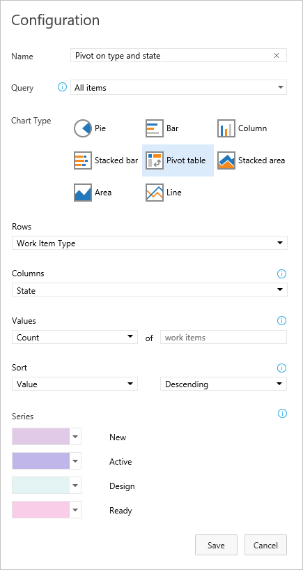 

5. Give the chart a title, select the flat list query on which the chart is based, and choose the chart type.   

	Based on your chart type, specify values for the remaining fields. Change a chart color simply by choosing another color from those shown.   

	> [!NOTE]  
	> All rules for configuring charts described previously in this article apply to configuring the chart for work items widget. 

6. After you save your changes, you'll see the new chart has been added to the dashboard. 

	  

7. Drag the tile anywhere on the dashboard to put it where you want it. 

8. When you're finished with your changes, choose  to exit dashboard editing.  

::: moniker-end

::: moniker range="azure-devops"

<a id="group-by-tags"></a> 

## Group by Tags chart 

> [!NOTE]   
> You can't group a query-based chart by tags, however, you can group a **Chart for Work Items** widget by tags that you add to a dashboard. This feature is in public preview. To enable it, see [Manage or enable features](../../project/navigation/preview-features.md) and turn on **Enable group by tags for work item chart widget on dashboard**. 

To group a chart by tags, perform the same steps provided in the previous section. Make sure that your flat-list query contains **Tags** in the query clause or as a column option. Then, choose **Tags** for the **Group by** selection. To filter the chart to show only some tags, choose the **Selected tags** radio button and then choose the tags you want the chart to display.  

:::image type="content" source="media/charts/configure-chart-widget-tags.png" alt-text="Screenshot of Chart by Work Items, Configure, Group by Tags.":::

To learn more about using tags, see [Add tags to work items](../../boards/queries/add-tags-to-work-items.md). 

::: moniker-end

::: moniker range=">= azure-devops-2019"

## Widgets and Analytics data

::: moniker-end

::: moniker range=">= azure-devops-2020"

Analytics provides a number of [additional widgets based on Analytics data](../dashboards/analytics-widgets.md).  
 
::: moniker-end

::: moniker range="azure-devops-2019"

Analytics provides a number of [additional widgets based on Analytics data](../dashboards/analytics-widgets.md). The Analytics service is in preview for Azure DevOps Server 2019. 
 
::: moniker-end

::: moniker range="< azure-devops"

## Query-based charts versus Excel-generated PivotCharts  

Query-based charts generate data from the work item tracking data store and therefore displays the most recent data. [Excel PivotCharts](../create-status-and-trend-excel-reports.md) access data published to the Analysis Services cube, which is refreshed every two hours by default. Excel charts require your project's project collection is configured with SQL Server Reporting Services and Analysis Services. 

::: moniker-end

## Related articles

- [Cumulative flow diagram](cumulative-flow.md)  
- [Team velocity](team-velocity.md)  
- [View/configure sprint burndown](configure-sprint-burndown.md)  
- [Test progress and test results](../../test/track-test-status.md)  
- [Add widgets and chart to a dashboard](add-widget-to-dashboard.md)
- [Widget catalog charts](widget-catalog.md)