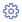

# Track progress by creating status and trend query-based charts 

[!INCLUDE [temp](../_shared/version-azure-devops-all.md)]

You can quickly view the status of work in progress by charting the results of a [flat-list query](../../boards/queries/using-queries.md). You can create several types of charts&mdash;such as pie, column, or trend&mdash;for the same query.  Charts support viewing a count of work items or a sum of values for select numeric fields, such as Remaining Work or Original Estimate. 

> [!NOTE]  
> For examples of queries based on numeric fields, see [Query by numeric fields](../../boards/queries/query-numeric.md). For information on creating charts that track test progress and results, see [Track test status](../../test/track-test-status.md).  


::: moniker range=">= azure-devops-2019"

For example, the following image illustrates two different charts created from the same flat-list query. The pie chart groups the 19 bugs by state, and the bar chart groups the bugs by assignment and their current status.

> [!div class="mx-imgBorder"]  
>    

::: moniker-end

::: moniker range="<= tfs-2018"

For example, the following image illustrates four different charts created from the same flat-list query. The pie chart groups the 146 active bugs by priority, and the bar chart groups the bugs by team and their triage status. The last two chart show two different trend views of the active bugs over the last two weeks.  


::: moniker-end

## Prerequisites

By default, users with **Basic** access or higher can create charts from a flat list query. Users with **Stakeholder** access can't view or create charts from the **Queries** page, however, they can view charts added to a team dashboard. For details, see [About access levels](/azure/devops/organizations/security/access-levels).

::: moniker range="azure-devops"

* You must connect to a project. If you don't have a project yet, [create one](/azure/devops/boards/get-started/sign-up-invite-teammates). 
* To create a chart, you must be added to a project as a member of the **Contributors** or **Project Administrators** security group. To get added, [Add users to a project or team](/azure/devops/organizations/security/add-users-team-project). 
* To add a chart to a team dashboard, you must be a member of the team, be a team administrator, or be a member of the **Project Administrators** security group.
* You can add charts to [multiple team dashboards](dashboards.md) and get access to the [widget catalog](widget-catalog.md), which is another way to add charts to a dashboard. 

> [!NOTE]  
> Users with **Stakeholder** access for a public project have full access to query chart features just like users with **Basic** access. For details, see [About access levels](/azure/devops/organizations/security/access-levels).

::: moniker-end

::: moniker range=">= tfs-2017 <= azure-devops-2019"

* You must connect to a project. If you don't have a project yet, [create one](/azure/devops/organizations/projects/create-project).
* To create a chart, you must be added to a project as a member of the **Contributors** or **Project Administrators** security group. To get added, [Add users to a project or team](/azure/devops/organizations/security/add-users-team-project). 
* To add a chart to a team dashboard, you must be a member of the team, be a team administrator, or be a member of the **Project Administrators** security group.
* You can add charts to [multiple team dashboards](dashboards.md) and get access to the [widget catalog](widget-catalog.md), which is another way to add charts to a dashboard. 

::: moniker-end 


::: moniker range="tfs-2015"

* You must connect to a project. If you don't have a project yet, [create one](/azure/devops/organizations/projects/create-project).
* To create a chart, you must be added to a project as a member of the **Contributors** or **Project Administrators** security group. To get added, [Add users to a project or team](/azure/devops/organizations/security/add-users-team-project). 
* To add a chart to a team dashboard, you must be a member of the team, be a team administrator, or be a member of the **Project Administrators** security group.
- You can pin charts to a team homepage, and with TFS 2015.1 and later versions, you can add charts to [multiple team dashboards](dashboards.md) and get access to the [widget catalog](widget-catalog.md)  

::: moniker-end

::: moniker range="tfs-2013"

* You must connect to a project. If you don't have a project yet, [create one](/azure/devops/organizations/projects/create-project).
* To create a chart, you must be added to a project as a member of the **Contributors** or **Project Administrators** security group. To get added, [Add users to a project or team](/azure/devops/organizations/security/add-users-team-project). 

::: moniker-end

To learn more about default groups, see [About permissions and groups](../../organizations/security/about-permissions.md).


## Create a query-based chart  

1.	From **Queries**, open the chart editor for a flat list query. You must belong to the Contributors group to create charts. Stakeholders can view charts but not create them. 

	::: moniker range=">= azure-devops-2019"  
	> [!div class="mx-imgBorder"]  
	>    
	::: moniker-end  
	::: moniker range="<= tfs-2018"  
	  
	::: moniker-end  

2.	Select the chart type and field for grouping values. When you use pie, bar, and column charts, select a single field to view a count of work items.  
	::: moniker range=">= azure-devops-2019"  
	> [!div class="mx-imgBorder"]  
	>   
	::: moniker-end  
	::: moniker range="<= tfs-2018"  
	  
	::: moniker-end  
	If you don't see the field you want in the **Group by** drop-down list, [add the field as a column to the query and save the query](../../boards/backlogs/set-column-options.md). You can group by any field except date-time and free-form text fields. For example: 
	- To group by work assignments, include the **Assigned To** in the query or column options   
	- To group by sprints or iterations, include the **Iteration Path** in the query or column options    
	- To group by team, include the **Area Path** or **Node Name** in the query or column options  
	- To group by a custom field, include it in a query clause or column options.

	If you receive an error message when you close the chart editor, you need to request [Basic access](../../organizations/security/change-access-levels.md).

3.	To sort the results, choose **Value** or **Label** as the sort option and then **Ascending** or **Descending**.  
	::: moniker range=">= azure-devops-2019"  
	To change a color, simply choose a color from the Series set of color pickers.   
	> [!div class="mx-imgBorder"]  
	>   
	::: moniker-end  
	::: moniker range="<= tfs-2018"  
	To change a color, simply choose a color on the chart and pick a new color from the color picker.  
	::: moniker-end  

Charts automatically update when you edit the query or refresh the query results.  


### Stacked bar chart  

A stacked bar chart lets you track progress against two field values. Node Name will display the last leaf within the hierarchy of area paths. Use this when you want to show data across teams.  
::: moniker range=">= azure-devops-2019"  
> [!div class="mx-imgBorder"]  
>    
::: moniker-end  
::: moniker range="<= tfs-2018"  

::: moniker-end  

### Trend chart  

Trend charts let you view progress over time. You can select a rolling period ranging from the last week to the last year (earlier versions of TFS may have limited selections).  

::: moniker range=">= azure-devops-2019"  
> [!div class="mx-imgBorder"]  
>    
::: moniker-end  
::: moniker range="<= tfs-2018"  

::: moniker-end  

Trend data is extracted from the work tracking data store. Like most data stores, the schema of the relational database is designed and optimized for the online transactional processing of data. As the tool or plug-in performs an activity, it writes the latest information to the operational store. Therefore, data in the operational store is constantly changing and being updated, and all data is current.


### Burndown chart  

Choose the **Sum** operator for **Remaining Work** to view a burndown chart of tasks. 
::: moniker range=">= azure-devops-2019"  
> [!div class="mx-imgBorder"]  
>    
::: moniker-end  
::: moniker range="<= tfs-2018"  

::: moniker-end  

## Add a chart to a team dashboard 

To add a chart to your team's home page, you must be a [team administrator](../../organizations/settings/add-team-administrator.md) or have permissions to edit a dashboard (default settings). You can only add charts defined for shared queries.

Choose the  actions icon for the chart you want to add, and select **Add to dashboard**.  

::: moniker range=">= azure-devops-2019"  
> [!div class="mx-imgBorder"]  
>    

In the dialog that opens, select the team dashboard to add the chart to. 

> [!div class="mx-imgBorder"]  
>   

::: moniker-end  

::: moniker range="<= tfs-2018"  

::: moniker-end  

To add other types of charts, such as test results and build summary charts, see [Add widgets and chart to a dashboard](add-widget-to-dashboard.md). 
 
::: moniker range=">= tfs-2013 <= tfs-2015"

> [!NOTE]  
> For TFS 2013 and TFS 2015, you can pin charts to the team homepage. For TFS 2015.1 and later versions, you can add charts to [multiple team dashboards](dashboards.md) and get access to the [widget catalog](widget-catalog.md). 
::: moniker-end

::: moniker range=">= tfs-2015"
<a id="add-chart-widget"></a> 

## Add chart widget to a dashboard   
 
If you've already defined your [flat list query](../../boards/queries/using-queries.md), you can add and configure a chart to a team dashboard using the *Chart for work items* widget.  
::: moniker-end  

::: moniker range=">= azure-devops-2019"
1. From the web portal, open the [team dashboard](dashboards.md) you want to add the chart to.   

2. To add widgets to the dashboard, choose  **Edit**.  The widget catalog will automatically open. Add all the widgets that you want and drag their tiles into the sequence you want. 

	If you don't see these icons, then you need to be added as a [team administrator](../../organizations/settings/add-team-administrator.md) or get permissions to edit dashboards. 

3. Choose the **Chart for work items** widget and then choose **Add**. 

	 

4. Choose the widget's  gear icon to open the Configuration dialog. 

	> [!div class="mx-imgBorder"]  
	>    

5. Give the chart a title, select the flat list query on which the chart is based, and choose the chart type.   

	Based on your chart type, specify values for the remaining fields. Change a chart color simply by choosing another color from those shown.   

	> [!NOTE]  
	> All rules for configuring charts described previously in this article apply to configuring the chart for work items widget. 

6. After you save your changes, you'll see the new chart has been added to the dashboard. 

	  

7. Drag the tile anywhere on the dashboard to put it where you want it. 

8. When you're finished with your changes, choose **Done Editing** to exit dashboard edit mode.

::: moniker-end

::: moniker range="tfs-2015"
The widget requires TFS 2015.2 or a later version. You add it to a team dashboard from the [widget catalog](widget-catalog.md). 
::: moniker-end

::: moniker range=">=tfs-2015 <= tfs-2018"
1. From the web portal, open the [team dashboard](dashboards.md) you want to add the chart to.   

2. To add widgets to the dashboard, choose  **Edit**. The widget catalog will automatically open.  Add all the widgets that you want and drag their tiles into the sequence you want. 

	If you don't see these icons, then you need to be added as a [team administrator](../../organizations/settings/add-team-administrator.md) or a member of the Project Administrators group. 

3. Choose the **Chart for work items** widget and then choose **Add**. 

	 

4. Choose the widget's  gear icon to open the configuration dialog. 

	 

5. Give the chart a title, select the flat list query on which the chart is based, and choose the chart type.   

	Based on your chart type, specify values for the remaining fields. Change a chart color simply by choosing another color from those shown.   

	> [!NOTE]  
	> All rules for configuring charts described previously in this article apply to configuring the chart for work items widget. 

6. After you save your changes, you'll see the new chart has been added to the dashboard. 

	  

7. Drag the tile anywhere on the dashboard to put it where you want it. 

8. When you're finished with your changes, choose  to exit dashboard editing.  

::: moniker-end


## Related articles

Now you know how to create status and trend charts for work items. A few things to keep in mind...

- To create similar charts for tests, see [Track your test results](../../test/track-test-status.md)    
- Charts you create for queries that are saved under Shared Queries are viewable by all team members and can be added to team dashboards or pinned to a team homepage   
- Charts that you create for queries under your My Queries folder are visible only to you   
- You can copy and email the URL of any chart page to share it with a team member 
- For additional examples of charts created from numeric fields, see [Query by a numeric field](../../boards/queries/query-numeric.md). 

Also, from the web portal, you can view the following charts:  

- [Cumulative flow diagram](cumulative-flow.md)  
- [Team velocity](team-velocity.md)  
- [Sprint burndown charts](../../boards/sprints/sprint-burndown.md)  
- [Test progress and test results](../../test/track-test-status.md)  
- [Add widgets and chart to a dashboard](add-widget-to-dashboard.md)
- [Widget catalog charts](widget-catalog.md)    

[!INCLUDE [temp](../../boards/_shared/image-differences-with-wits.md)]

### Fields that show up in the chart editor

For fields to appear in the chart editor, you must add the field to either the query filter criteria or a displayed column. 

You can't select fields for groupings that aren't supported, such as ID, Title, Tags, date-time fields, Description, Repro Steps, and other HTML and long text fields.  

### Charts and the display of areas and iterations

When you select **Area Path** or **Iteration Path**, only the leaf node appears in the chart. The leaf node is the last node of the full path. For example, ```Phone``` is the leaf node of ```FabrikamFiber/Fabrikam Website/Phone```. If your query contains a mixed level of leaf nodes, your chart might not reflect expected results.  

Use ```Node Name```, the area path leaf node, to see if that improves your results. 

Charts display in browsers that support Scalable Vector Graphics (SVG). This includes Internet Explorer 9 and Internet Explorer 10, Chrome, Firefox and Safari on Mac. Charts have not been optimized for mobile or touch displays. 

### Why some charts don't show all the field values in the results 

When a chart contains more than seven items within the data series, values in the eight-plus items are consolidated into a set labeled "other"?   

  


::: moniker range=">= azure-devops-2019"

### Widgets and the Analytics Service 

The Analytics service, which is in preview, provides a number of [additional widgets based on the Analytics Service](../dashboards/analytics-widgets.md).  
 
::: moniker-end

::: moniker range=">= tfs-2013 <= tfs-2018"

### Query-based charts versus Excel-generated PivotCharts  

Query-based charts generate data from the work item tracking data store and therefore displays the most recent data. [Excel PivotCharts](../excel/create-status-and-trend-excel-reports.md) access data published to the Analysis Services cube, which is refreshed every two hours by default. 
::: moniker-end

[add-a-team]: ../../organizations/settings/add-teams.md
[team-assets]: ../../organizations/settings/manage-teams.md
[add-team-members]: ../../organizations/settings/add-teams.md#add-team-members
[add-team-admin]: ../../organizations/settings/add-team-administrator.md
