# Configure a Burndown or Burnup widget 

[!INCLUDE [temp](../_shared/version-azure-devops.md)]

The Burndown and Burnup widgets provide the flexibility to create burndown or burnup charts for any type of scope, worked on by any number of teams, within any defined period of time. Burndown charts focus on remaining work within a specific time period, while Burnup charts focus on completed work. 

Both burndown and burnup charts help answer the question: **Are we on track to complete this set of work by the end date?**

Use this article to learn how to:

> [!div class="checklist"]
> * Interpret a Burndown or Burnup widget
> * Configure the Burndown or Burnup widgets  
> * Use burndown metrics 
> * Work with a burndown chart    
> * Configure a sprint burndown     

A burndown chart is a useful tool to track completion of a predefined scope of work over a predefined period of time. For example, a sprint burndown tracks the sprint backlog completion by end of the sprint. A release burndown tracks the release backlog completion by the end of the release. A bug burndown chart can also be used to track completion of a set of bugs by a certain date. 

**Burndown widget configured to display a Release Burndown**

**Burndown widget configured to display a Bug Burndown**
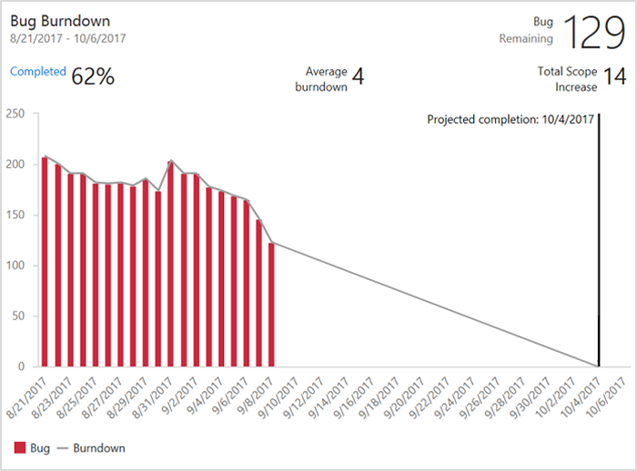

 
## Burndown and burnup metrics 
Burndown and burnup charts provide an easy way to monitor progress across teams and sprints by showing work remaining over time. Work remaining is the vertical axis and time is the horizontal axis. You can define remaining work to be calculated as a sum of a particular field, such as Story Points, or count of a particular work item type. 
In addition, each chart calculates and displays the average burndown or burnup rate and added scope over the course of the project. The Burndown chart calculates a projected completion date for when the work is expected to be done based on historical burndown and scope increase. Using burndown, teams can stay on top of their progress and see the immediate impact of their work on their delivery date. 

To help you answer the question: *Are we on track to complete this set of work by the end date?*, the widgets provide these useful metrics:
* Percentage work complete
* Average burndown rate
* Total scope increase
* Number of work items not estimated with Story Points (or whichever field you are burning down on)
* Projected burndown, based on historical burndown rate
* Projected scope increase, based on historical scope increase rate
* Projected completion date, based on historical burndown and scope increase rates.

## Interpret a Burndown or Burnup widget chart
Looking at the burndown chart, a team can not only get immediate insight as to their progress, but also learn about their rhythm and behavior. Most burndown lines are not straight lines. The team never moves at exactly one fixed velocity and scope might be added on the way. For example, if your projected completion date as moved, you may want to ask
* Are we adding too much scope?
* Is the average burnrate changing, and if so, why?

The burndown chart also helps the teams understand if the release is at risk. If the projected end date exceeds the release target date, you may need to reduce scope or lengthen your project. Burndown can also indicate that progress is greater than anticipated, providing the uncommon, but wonderful option of adding scope. 

As the following diagram shows, charts based on the Burndown and Burnup widgets   provide a number of calculated elements. 

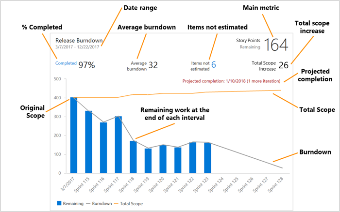

| Element | Description|  
|---------|------------| 
|**Date&nbsp;range**|The  start and end date of the burndown. When burndown is plotted by iterations the end date is the end of the last iteration |
|**Main&nbsp;metric**|Current remaining work based on the selected burndown method.| 
|**%&nbsp;Completed**|The percentage of work completed based on original scope. You may choose or press **% Completed** to see the full list of completed work items.| 
|**Average&nbsp;burndown**|Average work completed per interval or iteration.| 
|**Items&nbsp;not&nbsp;estimated**|Shows only when burning down on a Sum of a field. It represents the current number of items that do not have a value in the selected **Burndown&nbsp;on** field. You may choose or press the number to see a full list of work items without estimates.|
|**Total&nbsp;Scope&nbsp;Increase** |show how much work was added to the original scope since the burndown started.|
|**Projected&nbsp;completion** |Calculates the projected completion date based on the remaining work and historical burndown and scope increase rates. If the projected completion date is before the specified **End Date**, it will draw a vertical line on the interval/iteration when the work should be complete. If the projected completion date is after the specified **End Date**, then it will display the projected completion date and how many additional intervals/iterations are needed to complete the work.|
|**Original&nbsp;Scope** |Original scope is all remaining work as of the specified **Start Date**. The chart burns down from the original scope. **% Complete** and **Total Scope Increase** are calculated based on your original scope.|
|**Total&nbsp;Scope** |Represents to the total scope of the burndown. The plotted points include both completed and remaining work. The total scope line tells you how much scope change your project has. For past data points, the plotted total scope represents actual total scope as of the end of each interval/iteration. For future data points, the plotted total scope represents a projected scope change, based on past scope changes.|
|**Burndown**|Represents the burndown. The burndown line tells you how fast you are burning down the work. For past data points, the plotted burndown represents actual burndown as of the end of each interval/iteration. For future data points, the plotted burndown represents a projected burndown, based on past burndown.

[!INCLUDE [temp](../_shared/analytics-widgets-prerequisites.md)]

## Add the widget to your dashboard   
The Configuration dialog for the Burndown and Burnup widgets is the same. You configure these widgets for one or more teams. To learn more about teams, see [Add teams](../../organizations/settings/add-teams.md).

::: moniker range="azure-devops"
1. If you haven't yet [added the Burndown widget to your dashboard](../add-widget-to-dashboard.md), do that now.  
1. Choose the 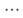 actions icon and select the **Configure** option to open the configuration dialog.  
::: moniker-end

::: moniker range="azure-devops-2019"
1. If you haven't yet added the [Analytics Marketplace extension](../dashboards/analytics-extension.md), do that now.    
1. If you haven't yet [added the Burndown widget to your dashboard](../add-widget-to-dashboard.md), do that now.  
1. Choose the  actions icon and select the **Configure** option to open the configuration dialog.  
::: moniker-end

## Choose the teams and work items to chart  
1. Modify the **Title** of the widget and select your preferred **Size**. The Burndown widget can scale up to 10x10.    
1. Select the **Teams** you want to track.   
	Select at least one **Project** and one **Team**.   
	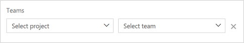    
	If you wish to track progress across teams, just add more teams using the team selector. You may also select teams from other projects.  
	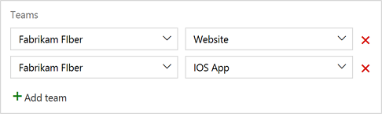  
	The Burndown chart will display the burndown of remaining work for all selected teams.   

   > [!NOTE]   
   > While you can select teams from other projects, all of the available configuration options&mdash;**Work items**, **Field criteria**, and **Burndown on** will show selections from your **current project**.   
   > The list of selectable backlogs, work item types, and fields are based on your current project. 
   > 
   > For example, if you select a work item type that doesn't exist in another project, the burndown will not include work items from that project. If you select a field that doesn't exist in another project, that field will be considered blank for the burndown. 
   > Therefore, a burndown created across multiple projects will only work if the [Process](../..//boards/work-items/guidance/choose-process.md) for those projects are the same, or at least very similar.

1. Choose your work items. The burndown can include work based on items in your **Backlog** or by **Work item type**.   
	You can select a **Backlog**, which include all the work items in that backlog.    
	If you select the Stories backlog you are presented with an additional option:  **Include bugs on the Stories backlog**. Place a checkmark in the box to include bugs along with user stories in your burndown.

	This option is presented for the PBI Backlog for Scrum projects, and the Requirements backlog for CMMI projects.   
	  

   > [!NOTE]   
   > If your project has been customized using a [Hosted XML process](../../organizations/settings/work/hosted-xml-process-model.md) and has created a customized bug work item category name, then the Burndown and Burnup widgets won't be able to query for work items within that category. To query for bugs, the customized bug work item type must belong to the default **Bug Category**, reference name `Microsoft.BugCategory`.  
   
	You can also select **Work item type** to burndown on a specific work item type. In the list, you will find all the project's work item types including [custom work item types](../../organizations/settings/work/customize-process-wit.md).   
	  

   > [!NOTE]   
   > When setting filters in this step or the following step, it is important to understand how filters are applied to historical data. Read [Filters applied to historical data](../powerbi/analytics-historical-filtering.md) for more information.

1. (Optional) Select field criteria to limit the work items that appear in the chart.  
	You can filter by any field available in your project, even a specific tag.   For example, you can narrow your burndown to top priority items by adding a filter **Priority <= 2**.      
	  
	You may add multiple field criteria, by selecting **Add criteria**. For example, you can also select a custom field such as Release, to create a burndown chart of only those items assigned to a specific release.    
	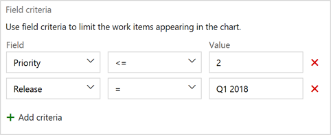  
   
	> [!NOTE]  
	> All field criteria are AND-ed together. That is, work items must match all the field criteria to be included in the burndown or burnup chart.

## Choose how you want to calculate burndown or burnup 
1. Select how you want to calculate burndown or burnup, by a count of work items or a sum based on a selected field.  
	Here, we choose to base the burndown on a count of work items.   
	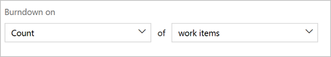  
	And, here we choose a sum based on Story Points.   
	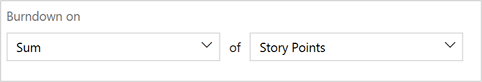  
	
	> [!NOTE]  
	> Burndown works best when aggregating size fields like story points. If you choose to Burndown on fields that change during the sprint, like Remaining Work for Tasks, the calculation of "Items not Estimated" will grow as items are closed. 

	<!---You can select from one of several fields such as Remaining Work, Total Remaining, Average Burn Rate, and Projected Completion Date.  You may select to burndown by on a count of work items -->

## Choose the time period and plotting interval  
1. Select the time period. You can select from one of the following options to define your time period:

   | Option | Purpose for burndown | 
   | --- | --- | 
   | **Start Date** | Determines the original scope baseline. The chart burns down from the original scope. **% Complete** and **Total Scope Increase** are calculated based on your original scope. 
   | **End Date** | Specifies the target date of completion. Your goal is to burndown the original scope of work by the **End Date**.
   | **Plotting Interval** | Here you select the intervals to plot between the **Start Date** and **End Date**. Average Burndown is based on the selected interval. You can plot burndown based on daily/weekly/monthly intervals or based on an iteration schedule. 

	### Plot based on an iteration schedule
   
	After selecting the **Start Date**, set **Plot burndown by** to **Iteration**. You can select iterations from your current project.  
	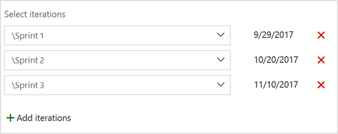
   
	Add multiple iterations by selecting **Add iterations**.
   
	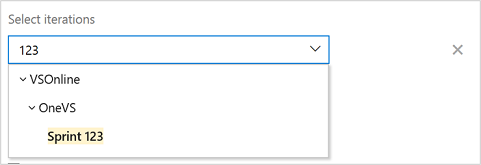
   
	The iteration selection box support search, so you can simply type a partial name of an iteration and it will find the closest match.  
	

	The selectable iterations are based on the **current project**, even if you selected teams from other projects. Since the burndown chart plots remaining work based on the end date of the iteration, it calculates remaining work across all teams/projects, based on that iteration end date. For example, if an iteration ends on 11/10/2017, the burndown chart calculates remaining work as of 11/10/2017, counting or summing all work items for every team/project. Therefore, a cross-project burndown will work when plotting by iterations, as long as you are OK with having all the teams reporting on the same iteration schedule.

	The burndown chart uses the end date of each iteration to plot the remaining work for that iteration.

	> [!NOTE]   
	> The Average Burndown assumes that every iteration is the same length. It does not consider iterations that are different lengths. Additionally, it assumes that the interval between the **Start Date** and the first iteration is a full iteration, even if the length of time between **Start Date** and the first iteration's end date does not match your typical length of iteration. For best results, enter a **Start Date** that is the same as the first iteration's start date. 

	If you select to plot based on an iteration schedule, you will not be able to select **End Date**. The burndown assumes the **End Date** is the last iteration's end date.

	### Plot based on a daily, weekly, or monthly interval
	After selecting the **Start Date**, set **Plot burndown by** to **Date**. Specify the **End Date** for your burndown. 
	You can set **Plot interval** to Days, Weeks, or Months.  
	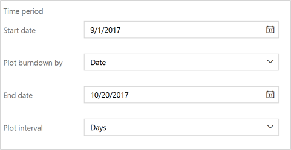

	If you select **Weeks**, then you'll be able to select the **Last day of week**. The remaining work for each interval will be calculated based on that day.  
	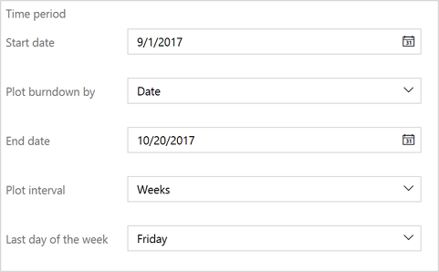

	If you select **Months**, then burndown will be calculated based the last day of each month.  

	> [!NOTE]    
	> The **Average Burndown** assumes that every interval is the same length. It does not consider months that are different lengths. Additionally, it assumes that the interval between the **Start Date** and the first month is a full month, even if the length of time between **Start Date** and the first month's end date does not match your typical length of a month. For example, a **Start Date** of 11/15/2017, would plot the first month as 10/31/2017, but would be counted as a full month for your **Average Burndown**. For best results, enter a **Start Date** that is the same as the first month's start date. **This is also true when plotting by weekly intervals.**

## Choose additional options 
Check the boxes of the following options that you want to add to your chart.    
* **Show burndown**: Displays both the historical and projected future burndown
* **Show total scope**: Displays both the historical and projected scope increase
* **Show completed work**: In addition to remaining work, it also displays completed work as stack bar
* **Plot remaining using work item type color**: Displays remaining work based on the work item type color, rather than the default blue color. If multiple work items are included, then it stacks colors by work item type.

## Example: Configuring the Burndown widget to act as a Sprint Burndown 
One of the most common burndowns is the sprint burndown. A Sprint burndown is useful to determine if your team is on track to complete their sprint plan. You can use the following example on how to configure your Burndown widget to represent a sprint burndown. For this example we'll choose to show burndown for the Fabrikam Fiber - Website team for Sprint 120. The sprint starts on 10/30/2017  and ends on 11/19/2017.

1. Select a single team that you want to burndown for.

	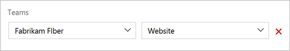    

2. Choose your work items. For this example choose the story backlog.

	 

3. Select the iteration path you want to create the sprint burndown for. Add a field criteria on "Iteration Path" to match your sprint. You can also choose to add other field criteria like Priority to filter your burndown.

	

4. Select how you want to calculate burndown. You can use Count of work items, or sum of any field.

	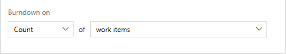 

4. Set the start date to be the first day of your sprint. For example, 10/22/2017.

6. Set **Plot burndown by** to Date.
7.	Set the end date to be the last day of your sprint. For example 11/9/2017.

	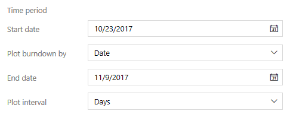 

8. Save your configuration. This widget now shows a daily burndown of the Fabrikam Fiber - Website team for Sprint 120. The burndown shows a count of work items completed per day. To change the sprint this widget is monitoring, for example Sprint 121, you will need to manually change the dates in the widget configuration.

## Configure the Burnup widget
Configuring the Burnup widget is exactly like configuring the Burndown widget, except that it plots work completed, rather than work remaining.

**Burnup Widget displaying a Stories Burnup**

## Try this next
> [!div class="nextstepaction"]
> [Burndown guidance](burndown-guidance.md) 

## Related articles 
- [Define iteration paths (aka sprints) and configure team iterations](../../organizations/settings/set-iteration-paths-sprints.md)
- [Add a custom field to a work item type](../../organizations/settings/work/customize-process-field.md)
- [Applying filters to historical data](../powerbi/analytics-historical-filtering.md)

####Industry resources 
* [Managing Myopia with Release Burndowns](https://www.scrumalliance.org/community/articles/2010/may/managing-myopia-with-release-burndowns)

