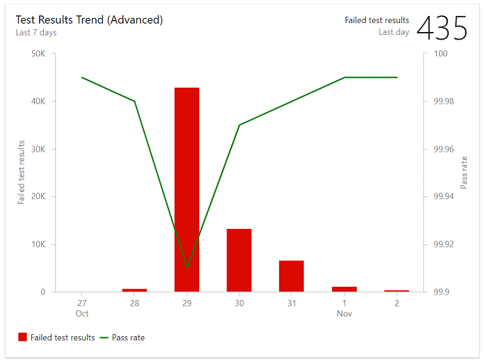
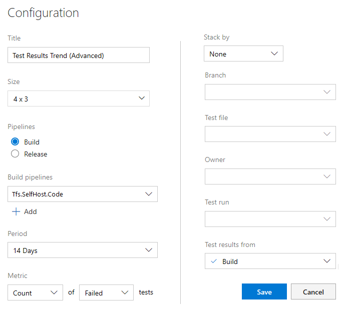

# Configure the Test Results Trend (Advanced) widget 

[!INCLUDE [temp](../_shared/version-azure-devops-cloud.md)]

Teams track their test collateral health&mdash;for example, test pass percentage, test failures, and test duration&mdash;to ensure effective continuous testing in a pipeline. 
With the test results trend widget, you can monitor test trends over a period of time, detect patterns around test failures, test duration, and more, and generate actionable insights.

**Example Test Results Trend widget showing pass percentage and test failure for last 7 days**  

 

In this article you'll learn:

> [!div class="checklist"]  
> * The type of insights you can get by monitoring Test Results Trend charts  
> * Prerequisites for gaining actionable insights from the Test Results Trend charts  
> * How to install and configure the Test Results Trend widget 

> [!NOTE]   
> The Test Results Trend (Advanced) widget is based on the Analytics Service. The Analytics Service is generally available for Azure DevOps Services and in preview as an extension for Azure DevOps Server 2019. For TFS 2017 and TFS 2018, you can use the Test Results Trend widget. 

## Insights supported with Test Results Trend charts

With the Test Results Trend charts, you can gain the following insights:  
- Identify if test health is improving over time by monitoring trends of failures and average pass rate on each day
- Identify long running tests which are impacting a pipeline's efficiency by monitoring the average test duration on each day
- Identify patterns in test outcomes. *Has the test recently started to fail? Or, has the test always failed for the selected period? Or, is the test showing non-deterministic behavior?*  
- Obtain insights into specific areas of interest to you based on test file, branch, or stage you own by configuring specific filters.  
- Obtain insights into a specific area you test by configuring the widget to focus on a test file, branch or stage. 

Test Results Trend charts require that you set up continuous testing in your build pipeline. To get deeper insights and data you can view the Test Failure report in the pipeline. To learn more, see details [Analyze test results](../../pipelines/test/test-analytics.md#view-test-analytics-for-builds). 

## Prerequisites
In order to configure the Test Results Trend widget, you must have the following in place:  

::: moniker range="azure-devops"

- You must be a member of a project. If you haven't been added as a project member, [get added now](/azure/devops/organizations/accounts/add-organization-users-from-user-hub). 
- Set up continuous testing for your build pipeline. For details, see [Run unit tests with your builds](../../pipelines/languages/dotnet-core.md#run-your-tests).
- To add a widget to a team dashboard, you need to be a member of the team. You must have **Basic** access or greater, have [dashboard permissions](/azure/devops/report/dashboards/dashboard-permissions), or be a [team admin](/azure/devops/organizations/settings/add-team-administrator) or project admin. Default settings provide all team members with permissions.
- **Pipelines**  must be enabled. If disabled, none of the Analytics widgets for pipelines will display. To re-enable it, see [Turn an Azure DevOps service on or off](/azure/devops/organizations/settings/set-services).

::: moniker-end

::: moniker range="azure-devops-2019"

- You must be a member of a project. If you haven't been added as a project member, [get added now](/azure/devops/organizations/security/add-users-team-project).  
-  Set up continuous testing for your build pipeline. For details, see [Run unit tests with your builds](../../pipelines/languages/dotnet-core.md#run-your-tests).
- Have installed the [Analytics Marketplace extension](../dashboards/analytics-extension.md). You must be a member of the [Project Collection Administrator group](/azure/devops/organizations/security/set-project-collection-level-permissions) to add extensions.
- To add a widget to a team dashboard, you need to be a member of the team. You must have **Basic** access or greater, have [dashboard permissions](/azure/devops/report/dashboards/dashboard-permissions), or be a [team admin](/azure/devops/organizations/settings/add-team-administrator) or project admin.
- **Pipelines** must be enabled. If disabled, none of the Analytics widgets for pipelines will display. To re-enable it, see [Turn an Azure DevOps service on or off](/azure/devops/organizations/settings/set-services).

::: moniker-end

## Configure the Test Results Trend (Advanced) widget    

You can configure your Test Results Trend (Advanced) widget to show results for either build or release pipelines. 

0. From your team's dashboard, choose the  actions icon for the Test Results Trend (Advanced) widget you want to configure and select **Configure**.
	
	Modify the **Title** and choose either **Build** or **Release** for the type of **Pipelines** that you'll select.
   
	> [!div class="mx-imgBorder"]  
	>   

	Choose the  plus icon to add one or more pipelines. 

0. Next, choose the **Period**, and then choose the metrics that you want to track. Optionally, apply filters for **Branch**, **Test file**, **Owner**, and **Test run**.   

4. Choose **Save** when done. 

	The following image shows a chart with pass rate and test results for last 7 days. 
   
	

## Try this next

> [!div class="nextstepaction"]
> [Test Analytics report](../../pipelines/test/test-analytics.md#view-test-analytics-for-builds). 
