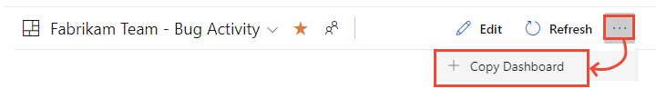
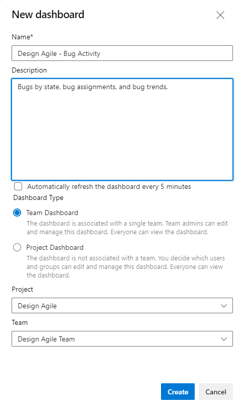

# Copy a dashboard 

[!INCLUDE [temp](../../includes/version-vsts-only.md)] 

Use **Copy Dashboard** to create a copy of a team or project dashboard. You can copy a dashboard to a different team, the same team, or a different project. This feature minimizes the work required to build similar dashboards from scratch.  
 
> [!NOTE]  
> The **Copy Dashboard** feature is currently in preview. To access the feature, you must enable the **Copy Dashboard Experience**. To learn how, see [Manage or enable features](../../project/navigation/preview-features.md). 
> This feature copies the widgets to a new dashboard, but doesn't reconfigure them based on a selected team. Support for that function is planned for a later release. 

To add a team or project, see [Add a team](../../organizations/settings/add-teams.md) or [Create a project](../../organizations/projects/create-project.md) 

## Prerequisites  

- You must be a member of a project. If you don't have a project yet, [create one](../../organizations/accounts/set-up-vs.md). 
- If you haven't been added as a project member, [get added now](../../organizations/accounts/add-organization-users.md).
- Anyone with access to a project, including [stakeholders](../../organizations/security/get-started-stakeholder.md), can view dashboards.
- To add, edit, or manage a team dashboard, you must have **Basic** access or greater and be a [team admin](../../organizations/settings/add-team-administrator.md), a project admin, or have [dashboard permissions](../dashboards/dashboard-permissions.md). In general, you need to be a team member for the currently selected team to edit dashboards.

## Open the dashboard you want to copy

All dashboards are associated with either a team or a project. From the **Overview>Dashboards** page, you can browse all dashboards and see which team they belong to, or if they are a project dashboard.  

1. Open a web browser, connect to your project, and choose **Overview>Dashboards**. The dashboard directory page opens. 

	> [!div class="mx-imgBorder"]  
	> 

	It lists dashboards in the following order: 
	- Your last visited dashboard
	- Your favorited dashboards
	- All dashboards of teams that you belong to
	- All dashboards defined for the project in alphabetical order. 

	Choose the :::image type="icon" source="../../media/icons/filter-icon.png" border="false"::: filter icon to filter the list by keyword or team. Keywords apply to dashboard titles, descriptions, and team names.

	> [!div class="mx-imgBorder"]  
	>    

1.  If you need to switch to a different project, choose the :::image type="icon" source="../../media/icons/project-icon.png" border="false"::: Azure DevOps logo to [browse all projects](../../project/navigation/go-to-project-repo.md).  

1. If you open a dashboard, you can choose a different dashboard from the directory list, or from the selector. To return to the dashboard directory, choose the **Browse all dashboards** option. 
 
	> [!div class="mx-imgBorder"]
	>   
 
## Copy the dashboard 

1. From the dashboard page, choose :::image type="icon" source="../../media/icons/actions-icon.png" border="false"::: **More actions** and then choose **Copy Dashboard**.  

	> [!div class="mx-imgBorder"]  
	>   

	If you don't see the :::image type="icon" source="../../media/icons/actions-icon.png" border="false"::: **More actions** icon, make sure that you've enabled the **Copy Dashboard Experience** preview feature. See [Manage or enable features](../../project/navigation/preview-features.md).

2. Enter a **Name** and **Description** for the new dashboard. To copy the dashboard as a team dashboard, choose **Team Dashboard** and then select the **Project** and the **Team**. To copy the dashboard as a project dashboard, choose **Project Dashboard** and then the **Project**. 

	Here we choose to copy a team dashboard to another team dashboard. 
	> [!div class="mx-imgBorder"]  
	>   

	Choose **Create**. 

	The page updates to reflect the new dashboard. Only the widgets have been copied. 

3.  Open each widget as needed to configure it to the specific project or team. 
 

## Try this next 

> [!div class="nextstepaction"]
> [Add a widget to a dashboard](add-widget-to-dashboard.md)
  
## Related articles

- [Add a team](../../organizations/settings/add-teams.md)
- [Widget catalog](widget-catalog.md)
- [Marketplace widgets](https://marketplace.visualstudio.com/search?term=widget&target=VSTS&category=All%20categories&sortBy=Relevance)

 