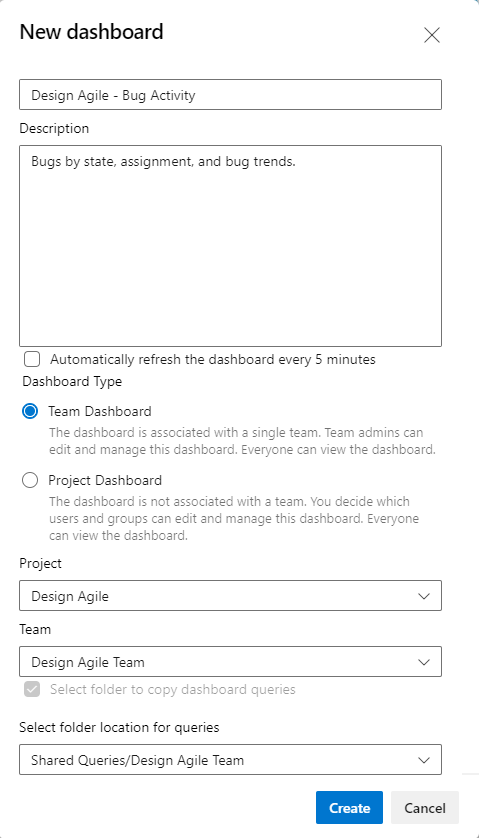

# Copy a dashboard 

[!INCLUDE [version-gt-eq-2022](../../includes/version-gt-eq-2022.md)] 

Use **Copy Dashboard** to create a copy of a team or project dashboard. You can copy a dashboard to a different team, the same team, or a different project. The copy operation copies the widgets defined on one dashboard to a new dashboard, and reconfigures them based on a selected team. This feature minimizes the work required to build similar dashboards from scratch.  
 
> [!NOTE]  
> The **Copy Dashboard** feature is currently in preview and enabled by default. To access the feature, the **Copy Dashboard Experience** must be enabled. To learn how, see [Manage or enable features](../../project/navigation/preview-features.md). 

To create a dashboard for a team or project, see [Add, rename, and delete dashboards](dashboards.md). To add a team or project, see [Add a team](../../organizations/settings/add-teams.md) or [Create a project](../../organizations/projects/create-project.md) 

## Prerequisites  

- You must be a member of a project. If you don't have a project yet, [create one](../../organizations/accounts/set-up-vs.md). If you haven't been added as a project member, [get added now](../../organizations/accounts/add-organization-users.md).
- Anyone with access to a project, including [stakeholders](../../organizations/security/get-started-stakeholder.md), can view dashboards. However, to view queries or work items displayed in a dashboard widget, you must have permissions to view the query and work items. To learn more, see [Set permissions on queries and query folders](../../boards/queries/set-query-permissions.md) and [Set work tracking permissions](../../organizations/security/set-permissions-access-work-tracking.md).
- To add, edit, or manage a team dashboard, you must have **Basic** access or greater and be a [team admin](../../organizations/settings/add-team-administrator.md), a project admin, or have [dashboard permissions](../dashboards/dashboard-permissions.md). In general, you need to be a team member for the currently selected team to edit dashboards.
- When copying a dashboard as a team dashboard, you should be a member of the team. Otherwise, you may be able to copy it, but later won't be able to edit it. Also, when copying a dashboard, you should choose a Shared Queries folder to copy queries to that you have permissions to edit and contribute queries to. 

## Open the dashboard you want to copy

All dashboards are associated with either a team or a project. From the **Overview>Dashboards** page, you can browse all dashboards and see which team they belong to, or if they're a project dashboard.  

1. Open a web browser, connect to your project, and select **Overview>Dashboards**. The dashboard directory page opens. 

	> [!div class="mx-imgBorder"]  
	> 

	It lists dashboards in the following order: 
	- Your last visited dashboard
	- Your favorited dashboards
	- All dashboards of teams that you belong to
	- All dashboards defined for the project in alphabetical order. 

	Select the :::image type="icon" source="../../media/icons/filter-icon.png" border="false"::: filter icon to filter the list by keyword or team. Keywords apply to dashboard titles, descriptions, and team names.

	> [!div class="mx-imgBorder"]  
	>    

1.  If you need to switch to a different project, select the :::image type="icon" source="../../media/icons/project-icon.png" border="false"::: Azure DevOps logo to [browse all projects](../../project/navigation/go-to-project-repo.md).  

1. If you open a dashboard, you can select a different dashboard from the directory list, or from the selector. To return to the dashboard directory, select the **Browse all dashboards** option. 
 
	> [!div class="mx-imgBorder"]
	>   
 
## Copy the dashboard 

1. From the dashboard page, select :::image type="icon" source="../../media/icons/actions-icon.png" border="false"::: **More actions** and then select **Copy Dashboard**.  

	> [!div class="mx-imgBorder"]  
	>   

	If you don't see the :::image type="icon" source="../../media/icons/actions-icon.png" border="false"::: **More actions** icon, make sure that you've enabled the **Copy Dashboard Experience** preview feature. See [Manage or enable features](../../project/navigation/preview-features.md).

1. Enter a **Name** and **Description** for the new dashboard. To copy the dashboard as a team dashboard, select **Team Dashboard** and then select the **Project** and the **Team**. To copy the dashboard as a project dashboard, select **Project Dashboard** and then the **Project**. 

	Here we choose to copy the Fabrikam Fiber project - Fabrikam Team Bug Activity dashboard to the Design Agile project, Design Agile team dashboard. 

	> [!div class="mx-imgBorder"]  
	>   

	Check the **Select folder to copy dashboard queries** checkbox to choose the folder into which dashboard queries will be copied. Make sure to select a folder where you have permissions to contribute queries. When copying dashboards to a different project, this checkbox is automatically selected and requires you to select a folder in the project. 
  
1. Select **Create**. Make sure you specify a unique name for the dashboard. 

	The page updates to reflect the new dashboard. The widgets and layout appear the same as the dashboard selected for copy.  

	In the background, a folder with the name of the new dashboard is created in **Shared Queries**. All the queries for the new dashboard are copied to that folder. Query names remain the same. Widgets with a team configuration are updated with the new team. Widgets with a team configuration that are copied from a team dashboard to a project dashboard retain the original configuration.

	:::image type="content" source="media/copy-dashboard/shared-query-folder-created.png" alt-text="Screenshot of Shared Queries folder created with copy dashboard experience.":::

	Open each query that was copied to adjust it if needed. You can rename the queries and the dashboard widgets will automatically update to reflect the new name.

1. Open each widget copied to the new dashboard as needed to verify or modify the configuration.  
 

## Next steps

> [!div class="nextstepaction"]
> [Add a widget to a dashboard](add-widget-to-dashboard.md)
  
## Related articles

- [Add a team](../../organizations/settings/add-teams.md)
- [Widget catalog](widget-catalog.md)
- [Marketplace widgets](https://marketplace.visualstudio.com/search?term=widget&target=VSTS&category=All%20categories&sortBy=Relevance)

 