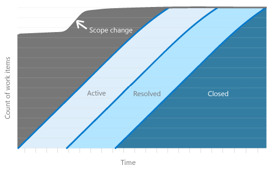
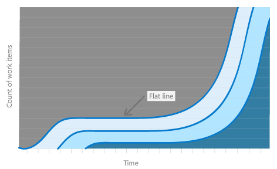
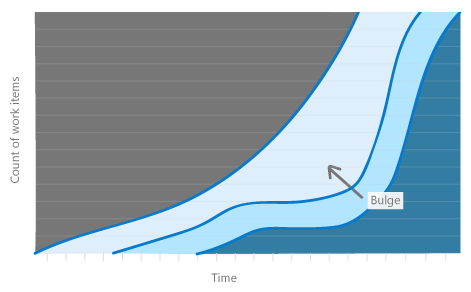
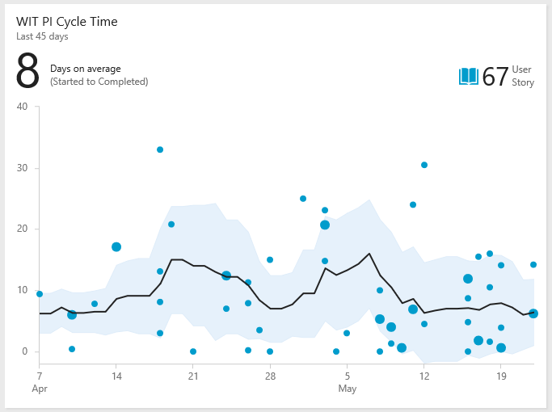

# Cumulative flow, lead time, and cycle time guidance 
[!INCLUDE [temp](../_shared/version-azure-devops-all.md)]

::: moniker range=">= azure-devops-2019" 
You use cumulative flow diagrams (CFD) to monitor the flow of work through a system. The two primary metrics to track, cycle time and lead time, can be extracted from the chart. Or, you can add the [Lead time and cycle time control charts](cycle-time-and-lead-time.md) to your dashboards. 
::: moniker-end

::: moniker range=">= tfs-2013" 
You use cumulative flow diagrams (CFD) to monitor the flow of work through a system. The two primary metrics to track, cycle time and lead time, can be extracted from the chart.  
::: moniker-end

To configure or view CFD charts, see [Configure a cumulative flow chart](cumulative-flow.md).

## Sample charts and primary metrics
<table>
<tbody valign="top">
<tr >
<td width="35%">

The Continuous flow CFD provides the chart most favored by teams that follow a lean process.

However, many teams have begun combining lean practices with Scrum or other methodologies which means they practice lean within the span of an iteration or sprint. In this situation the diagram takes on a slightly different look and provides two additional, and very valuable, pieces of information as shown in the next chart.
 

</td>
<td width="65%">**Continuous flow CFD**  
  
</td>
</tr>

<tr>
<td>

The Fixed period CFD shown here is for a completed sprint. 

The top line represents the scope set for the sprint. And, because the work must be completed by the last day of the sprint, the slope of the Closed state indicates whether or not a team is on track to complete the sprint. The easiest way to think of this view is as a burnup chart.
 

The data is always depicted with the first step in the process as the upper left and the last step in the process as the bottom right. 

</td>
<td>**Fixed period CFD for a completed sprint**  

  

</td>

</tr>

</tbody>
</table>

## Chart metrics  
CFD charts display the count of work items grouped by state/Kanban column over time. The two primary metrics to track, cycle time and lead time, can be extracted from the chart.  

<table>
<tbody valign="top">
<tr>
<th width="18%">Metric</th>
<th>Definition</th>
</tr>

<tr>
<td>Cycle Time  1</td>
<td>Measures the time it takes to move work through a single process or workflow state, calculated by the start of the given process to the start of the subsequent process. 

</td>
</tr>

<tr>
<td>Lead Time  1</td>
<td>*For a continuous flow process:* measures the amount of time it takes from when a request is made (such as adding a proposed user story) until that request is completed (closed).  
 
*For a sprint or fixed period process:* measures the time from when work on a request begins until the work is completed  (i.e. the time from Active to Closed).  
</td>
</tr>

<tr>
<td>Work in Progress</td>
<td>Measures the amount of work or number of work items that are actively being worked.</td>
</tr>

<tr>
<td>Scope</td>
<td>Represents the amount of work committed for the given period of time. Only applies to fixed period processes.</td>
</tr>

</tbody>
</table>

**Note**:
1. The CFD widget (Analytics Service) and built-in CFD chart (work tracking data store) do not provide discrete numbers on Lead Time and Cycle Time. However, the [Lead Time and Cycle Time widgets](cycle-time-and-lead-time.md) do provide these numbers.  

There is a very tight, well defined correlation between Lead Time/Cycle Time and Work in Progress (WIP). The more work in progress, the longer the cycle time which leads to longer lead times. The opposite is also true&mdash;the less work in progress, the shorter the cycle and lead time is because the development team can focus on fewer items. This is a key reason why you can and should set [Work In Progress limits on the Kanban board](../../boards/boards/wip-limits.md).  

The count of work items indicates the total amount of work on a given day. In a fixed period CFD, a change in this count indicates scope change for a given period. In a continuous flow CFD, it indicates the total amount of work in the queue and completed for a given day.  

Decomposing this work into specific Kanban board columns provides a view into where work is in the process. This provides insights on where work is moving smoothly, where there are blockages and where no work is being done at all. It's difficult to decipher a tabular view of the data, however, the visual CFD chart provides clear evidence that something is happening in a given way. 

## Identify issues, take appropriate actions  
The CFD answers several specific questions and based on the answer, actions can be taken to adjust the process to move work through the system. Let's look at each of those questions here.

### Will the team complete work on time?  
This question applies to fixed period CFDs only. You gain an understanding of this by looking at the curve (or progression) of work in the last column of the Kanban board.  

  

In this scenario it may be appropriate to reduce the scope of work in the iteration if it's clear that work, at a steady pace, is not being completed quickly enough. It may indicate the work was under estimated and should be factored into the next sprints planning.  

There may however be other reasons which can be determined by looking at other data on the chart.  

### How is the flow of work progressing?
Is the team completing work at a steady pace? One way to tell this is to look at the spacing between the different columns on the chart. Are they of a similar or uniform distance from each other from beginning to end? Does a column appear to flat-line over a period of multiple days? Or, does it seem to "bulge"?  

Two problems show up visually as flat lines and as bulges. 

<table>
<tbody valign="top">
<tr>
<td width="235">

Flat lines appear when the team doesn't update their work with a regular cadence. The [Kanban board](../../boards/boards/kanban-basics.md) provides the quickest way to transition work from one column to another. 

Flat lines can also appear when the work across one or more processes takes longer than planned for. For this to occur, flat lines must appear across many parts of the system because if only one part of the system or two parts of a system have problems then you'll see a bulge. 

</td>
<td width="35%">**Flat lines**  
  
</td>
</tr>

<tr>
<td>

Bulges occur when work builds up in one part of the system and it isn't moving through a process. 

An example of this may be that testing is taking a long period of time but development is taking a short period of time therefore work is accumulating in the development state (bulges indicate that a succeeding step is having a problem, not necessarily the step in which the bulge is occurring).  

</td>
<td width="65%">**Bulges**  

  

</td>

</tr>

</tbody>
</table>

Mura, the lean term for flat lines and bulges, means unevenness and indicates a form of waste (Muda) in the system. Any unevenness in the system will cause bulges to appear in the CFD.  

Monitoring the CFD for flat lines and bulges supports a key part of the Theory of Constraints project management process. Protecting the slowest area of the system is referred to as the drum-buffer-rope process and is part of how work is planned.  

<!---
 [We don't have a lot of Microsoft documentation on this so we should probably point to externally respected sources that are not our competitors to lend legitimacy to this and provide further reading]. I want to include industry practices here but not dive into a bunch of details. Aaron and Gregg think we should have one.]  
-->

**How do you fix flow problems?**
You can solve the problem of lack of timely updates through daily stand-ups, other regular meetings, or scheduling a daily team reminder email.  

Systemic flat-line problems indicate a more challenging problem (although you should rarely if ever see this). This problem means that work across the system has stopped. This may be the result of process-wide blockages, processes taking a very long time, or work shifting to other opportunities that aren't captured on the board. 

One example of systemic flat-line can occur with a features CFD. Feature work can take much longer than work on user stories because features are composed of several stories. In these situations, either the slope is expected (as in the example above) or the issue is well known and already being raised by the team as an issue, in which case, problem resolution is outside the scope of this article to provide guidance.  

Teams can proactively fix problems that appear as CFD bulges. Depending on where the bulge occurs, the fix may be different. As an example, let's suppose that the bulge occurs in the development process because running tests is taking much longer than writing code, or testers are finding  may be finding a large number of bugs and continually transition the work back to the developers so the developers have a growing list of active work.  

Two potentially easy ways to solve this problem are: 1) Shift developers from the development process to the testing process until the bulge is eliminated or 2) change the order of work such that work that can be done quickly is interwoven with work that takes longer to do. Look for simple solutions to eliminate the bulges. 

> [!NOTE]   
>Because many different scenarios can occur which cause work to proceed unevenly, it's critical that you perform an actual analysis of the problem. The CFD will tell you that there is a problem and approximately where it is but you must investigate to get to the root cause(s). The guidance provided here indicate recommended actions which solve specific problems but which may not apply to your situation. 

### Did the scope change?  
Scope changes apply to fixed period CFDs only. The top line of the chart indicates the scope of work because a sprint is pre-loaded with the work to do on the first day, this becomes a set level of work. Changes to this top line indicate worked was added or removed.  

The one scenario where you can't track scope changes with a CFD occurs when the same number of works are added as removed on the same day. The line would continue to be flat. This is the primary reason why several charts should be used in conjunction with one another to monitor for specific issues. For example, the [sprint burndown chart](../../boards/sprints/sprint-burndown.md) can also show scope changes.   

### Too much work in progress?  
You can easily monitor [whether WIP limits have been exceed from the Kanban board](../../boards/boards/wip-limits.md). However, you can also see monitor it from the CFD.  

Not so oddly, a large amount of work in progress usually shows up as a vertical bulge. The longer there is a large amount of work in progress, the bulge will expand to become an oval which will indicate that the work in progress is negatively affecting the cycle and lead time.  

A good rule of thumb for work in progress is that there should be no more than two items in progress per team member at any given time. The main reason for two items versus stricter limits is because reality frequently intrudes on any software development process.  

Sometimes it takes time to get information from a stakeholder, or it takes more time to acquire necessary software. There are any number of reasons why work might be halted so having a secondary item to switch to provides a little bit of leeway. If both items are blocked, it's time to raise a red flag to get something unblocked&mdash;not just switch to yet another item. As soon as there are a large number of items in progress, the person working on those items will have difficulty context switching, are more likely to forget what they were doing, and likely incur mistakes.  

::: moniker range=">= azure-devops-2019" 
## Lead time versus cycle time   
The diagram below illustrates how lead time differs from cycle time. Lead time is calculated from work item creation to entering a Completed state. Cycle time is calculated from first entering an In Progress state to entering a Completed state. 

#### Illustration of lead time versus cycle time 

If a work item enters a Completed state and then is reactivated and moved out of that state, then any additional time it spends in a Proposed/In Progress state will contribute to its lead/cycle time when it enters a Completed state for the second time.

If your team uses the Kanban board, you'll want to understand how your Kanban columns map to workflow states. For more information on configuring your Kanban board, see [Add columns](../../boards/boards/add-columns.md). 

To learn more about how the system uses the state categories&mdash;Proposed, In Progress, and Completed&mdash;see [Workflow states and state categories](../../boards/work-items/workflow-and-state-categories.md).   

## Plan using estimate delivery times based on lead/cycle times  
You can use the average lead/cycle times and standard deviations to estimate delivery times. 

When you create a work item, you can use your team's average lead time to estimate when your team will complete that work item. Your team's standard deviation tells you the variability of the estimate. Likewise, you can use cycle time and its standard deviation to estimate the completion of a work item once work has begun.  

In the following chart, the average cycle time is 8 days. The standard deviation is +/- 6 days. Using this data, we can estimate that the team will complete future user stories about 2-14 days after they begin work. The narrower the standard deviation, the more predictable your estimates.

#### Example Cycle Time widget

## Identify process issues 
Review your team's control chart for outliers. Outliers often represent an underlying process issue. For example, waiting too long to complete pull request reviews or not resolving an external dependency in a timely manner.

As you can see in the following chart, which shows several outliers, several bugs took significantly longer to complete than the team's average. Investigating why these bugs took longer may help uncover process issues. Addressing the process issues can help reduce your team's standard deviation and improve your team's predictability. 

#### Example Cycle Time widget showing several outliers 

You can also see how process changes affect your lead and cycle time. For example, on May 15th the team made a concerted effort to limit the work in progress and address stale bugs. You can see that the standard deviation narrows after that date, showing improved predictability. 

## Try this next
> [!div class="nextstepaction"]
> [Configure your cumulative flow charts](cumulative-flow.md) or 
> [Configure a lead time or cycle time chart](cycle-time-and-lead-time.md)
::: moniker-end

::: moniker range=">= tfs-2013 <= tfs-2018" 
## Try this next
> [!div class="nextstepaction"]
> [Configure your cumulative flow chart](cumulative-flow.md) 
::: moniker-end