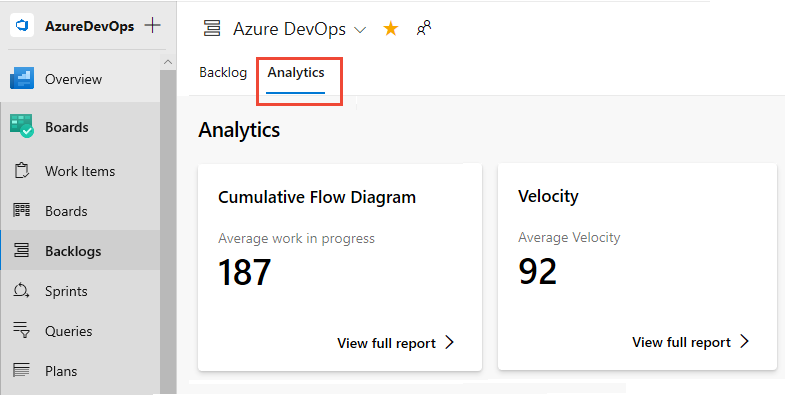
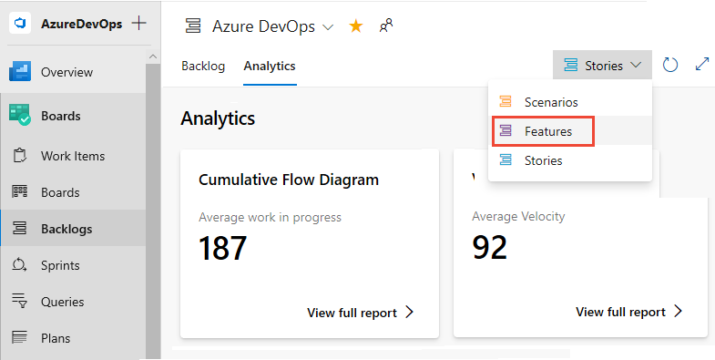
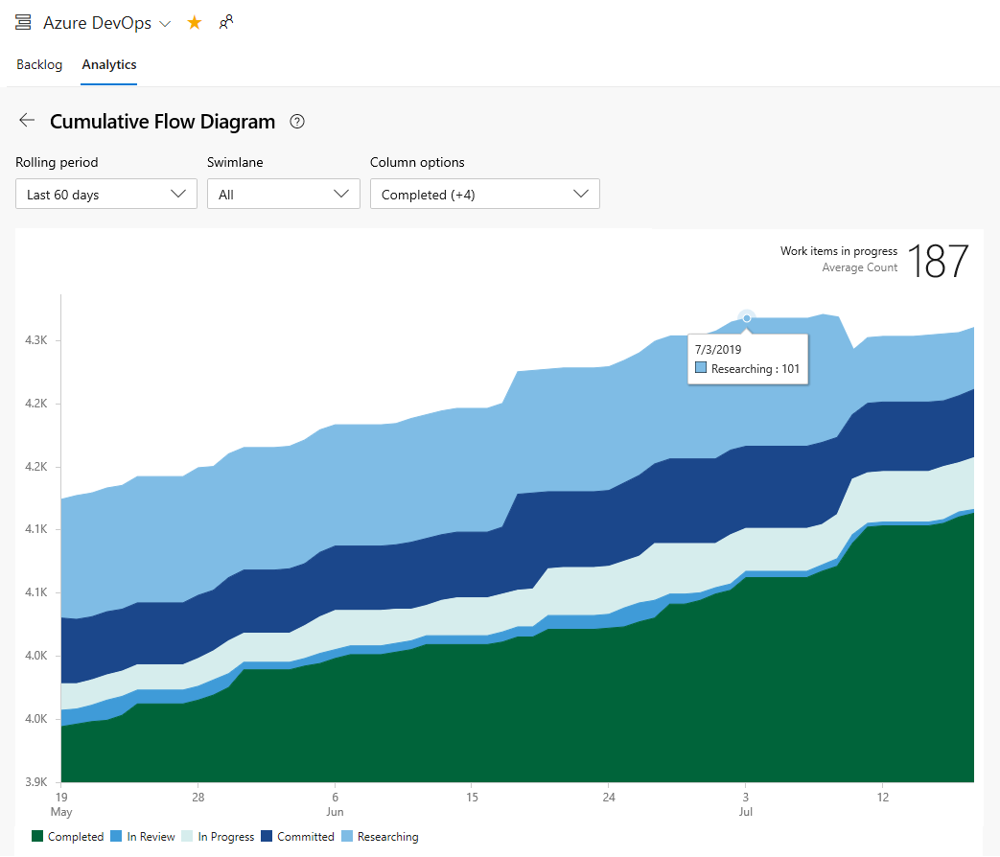
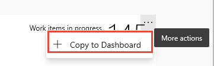
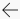
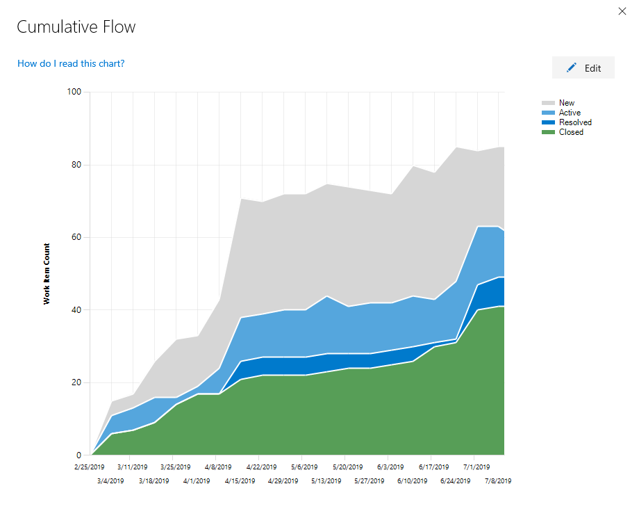

# View/configure a Cumulative Flow Diagram

[!INCLUDE [temp](../_shared/version-azure-devops-all.md)]

::: moniker range=">= azure-devops-2019" 

You use cumulative flow diagrams (CFD) to monitor the flow of work through a system. There are two CFD charts: the in-context report you can view from a team backlog or Kanban board and the CFD widget you can add to a dashboard. 

::: moniker-end

::: moniker range="azure-devops" 

CFDs help teams monitor the count of work items as they progressively move through various workflow states. These diagrams can show the flow of epics, features, user stories, issues, product backlog items, or requirements, depending on the process&mdash;[Agile](../../boards/work-items/guidance/agile-process.md), [Basic](../../boards/get-started/track-issues-tasks.md), [Scrum](../../boards/work-items/guidance/scrum-process.md), or ([CMMI](../../boards/work-items/guidance/cmmi-process.md)&mdash;selected for your project.

::: moniker-end

::: moniker range="azure-devops-2019" 

CFDs help teams monitor the count of work items as they progressively move through various workflow states. These diagrams can show the flow of epics, features, user stories, product backlog items, or requirements, depending on the process&mdash;[Agile](../../boards/work-items/guidance/agile-process.md), [Scrum](../../boards/work-items/guidance/scrum-process.md), or ([CMMI](../../boards/work-items/guidance/cmmi-process.md)&mdash;selected for your project.

::: moniker-end

::: moniker range="azure-devops" 

Use this article to learn how to: 

> [!div class="checklist"] 
> * Configure the Cumulative Flow Diagram widget (Analytics)
> * View and configure the CFD in-context report (Analytics)   

::: moniker-end

::: moniker range="azure-devops-2019" 

Use this article to learn how to: 

> [!div class="checklist"] 
> * Configure the Cumulative Flow Diagram widget (Analytics)  
> * View and configure the CFD in-context report (work tracking data store) 

::: moniker-end

::: moniker range="<= tfs-2018" 

You use cumulative flow diagrams (CFD) to monitor the flow of work through a system. CFDs help teams monitor the count of work items as they progressively move through various workflow states. These diagrams can show the flow of epics, features, user stories, product backlog items, or requirements, depending on the process&mdash;[Agile](../../boards/work-items/guidance/agile-process.md), [Basic](../../boards/get-started/plan-track-work.md), [Scrum](../../boards/work-items/guidance/scrum-process.md), or ([CMMI](../../boards/work-items/guidance/cmmi-process.md)&mdash;selected for your project.

Use this article to learn how to: 

> [!div class="checklist"] 
> * View and configure the CFD in-context report (work tracking data store)  

::: moniker-end

The CFD shows the count of items in each Kanban column for the selected time period. From this chart you can gain an idea of the amount of work in progress and lead time. Work in progress counts unfinished requirements. Lead time indicates the amount of time it takes to complete a requirement once work has started. 

 

For the CFD to provide useful information, you'll want to update the status of work items to reflect progress as it occurs. The quickest way to make these updates is through your [Kanban board](../../boards/boards/kanban-basics.md). 

For usage guidance, see [Cumulative flow, lead time, and cycle time guidance](cumulative-flow-cycle-lead-time-guidance.md).

[!INCLUDE [temp](../_shared/analytics-widgets-prerequisites.md)]

## Open your backlog from the web portal

::: moniker range="azure-devops"

1. Check that you selected the right project, and select **Boards** > **Backlogs**. Then select the correct team from the team selector menu. 

    > [!div class="mx-imgBorder"]  
    > 

    To select another backlog, open the selector and then choose a different team or select the **View Backlog directory** option. Or, enter a keyword in the search box to filter the list of team backlogs for the project.

    > [!div class="mx-imgBorder"]  
    >  

1. To view the in-context reports for the product backlog, check that you selected **Stories** for Agile, **Issues** for Basic, **Backlog items** for Scrum, or **Requirements** for CMMI as the backlog level. Or

    > [!div class="mx-imgBorder"]  
    >  

::: moniker-end

::: moniker range="azure-devops-2019"

1. Check that you selected the right project, and select **Boards** > **Backlogs**. Then select the correct team from the team selector menu. 

	

    To select another backlog, open the selector and then choose a different team or select the  **Browse all backlogs** option. Or, enter a keyword in the search box to filter the list of team backlogs for the project.

    > [!div class="mx-imgBorder"]  
    >  

1. To view the in-context reports for the product backlog, check that you selected **Stories** for Agile, **Issues** for Basic, **Backlog items** for Scrum, or **Requirements** for CMMI as the backlog level. Or

    > [!div class="mx-imgBorder"]  
    >  

::: moniker-end

::: moniker range=">= tfs-2017 <= tfs-2018"

On your web browser, open your team's product backlog and select the team from the project and team selector. Then select **Work** > **Backlogs**. Select the product backlog, which is **Backlog items** for Scrum, **Stories** for Agile, or **Requirements** for CMMI. 

> [!div class="mx-imgBorder"]
>  

To select another team, open the project and team selector. Select a different team, or select the **Browse** option. 

> [!div class="mx-imgBorder"]  
>  

::: moniker-end

::: moniker range="<= tfs-2015"

On your web browser, open your team's product backlog. Select **Boards** > **Backlogs**. 

::: moniker-end

## View the CFD in-context report   

::: moniker range="azure-devops" 

CFD reports are available for each backlog level, both product and portfolio backlogs. Each report provides interactive controls to provide each user the view of interest to them.  

1. You open the CFD for your product or portfolio backlog by choosing **Analytics**. 

	> [!div class="mx-imgBorder"]  
	> 

	The Average work in progress value excludes completed work items. 

1. To choose a portfolio backlog, select it from the backlog selector menu.   

    > [!div class="mx-imgBorder"]  
    >  

1. Next, choose **View full report** for the Cumulative Flow Diagram.  

1. Use the interactive controls to choose the time frame, swimlanes, and workflow states or Kanban board columns. You can choose a Rolling period of 14 days or up to 180 days.  

	Hover over a point in time to show how many work items are in a particular state. The default settings for the Cumulative Flow Diagram-Average work in progress includes completed work items since the team started tracking work. 

	For example, On July 3, 101 items were in a Research state.

	> [!div class="mx-imgBorder"]  
	> 

	The selections you make are only set for you, and persist across sessions until you change them. 

1. To add the report to a dashboard, choose the  actions icon and select **Copy to Dashboard**.

	> [!div class="mx-imgBorder"]  
	>  
	
	Select the dashboard and choose **OK**.  

1. To return to the Analytics summary, choose the back arrow.

::: moniker-end

::: moniker range="azure-devops-2019"  

To open the CFD in-context report for your product or portfolio backlog, choose the image in the upper-right corner of your **Boards>Boards** page. 

> [!div class="mx-imgBorder"]  
> 

The image opens to display a larger view of the CFD. 

> [!div class="mx-imgBorder"]  
> 

::: moniker-end  

::: moniker range="<= tfs-2018"

To open the CFD in-context report for your product or portfolio backlog, choose the image in the upper-right corner of your **Work>Backlogs** page. 

::: moniker-end

::: moniker range="<= azure-devops-2019"  

## Configure the CFD in-context report    

Each team can set their preferences for the in-context cumulative flow charts. 

::: moniker-end

::: moniker range="azure-devops-2019" 

1. Open the [backlog level for which you want to configure](../../boards/boards/kanban-quickstart.md) and then open the common configuration dialog. Choose the  gear icon.  

	> [!div class="mx-imgBorder"]  
	> 

	If you're not a team admin, [get added as one](../../organizations/settings/add-team-administrator.md). Only team and project admins can customize the Kanban boards and CFD charts.  

2. Choose **Cumulative flow** and specify the team's preferences.  

	> [!div class="mx-imgBorder"]  
	> 	

::: moniker-end  

::: moniker range="<= tfs-2018"

1. Open the backlog level for which you want to configure and then open the common configuration dialog. Choose the  gear icon.  

	  

	If you're not a team admin, [get added as one](../../organizations/settings/add-team-administrator.md). Only team and project admins can customize the team Kanban boards and CFD charts.  

2. Choose **Cumulative flow** and specify the team's preferences.  

	  

::: moniker-end

::: moniker range=">= azure-devops-2019" 

## Add the Cumulative Flow Diagram widget to your dashboard   

::: moniker-end

::: moniker range="azure-devops"

1. If you haven't yet configured your Kanban board, do that now. Define the [columns](../../boards/boards/add-columns.md) and [swimlanes](../../boards/boards/expedite-work.md) that support your workflow processes.  
1. If you want fixed scope CFD charts, make sure that you've [defined the sprint iterations](../../boards/sprints/define-sprints.md) for those sprints of interest.  
1. To add a CFD chart to your team dashboard, see [Add a widget to a dashboard](../add-widget-to-dashboard.md). Add the Cumulative Flow Diagram widget.  

	  

1. Choose the  actions icon and select the **Configure** option to open the configuration dialog. Modify the title, and then select the team, backlog level, swimlanes, and time period you want to monitor.  

	   

::: moniker-end

::: moniker range="azure-devops-2019"
1. If you haven't yet [enabled or installed Analytics](analytics-extension.md)], do that now.  
1. If you haven't yet configured your Kanban board, do that now. Define the [columns](../../boards/boards/add-columns.md) and [swimlanes](../../boards/boards/expedite-work.md) that support your workflow processes.  
1. If you want fixed scope CFD charts, make sure that you've [defined the sprint iterations](../../boards/sprints/define-sprints.md) for those sprints of interest.  
1. To add a CFD chart to your team dashboard, see [Add a widget to a dashboard](../add-widget-to-dashboard.md). Add the Cumulative Flow Diagram widget.  

	  

1. Choose the  actions icon and select the **Configure** option to open the configuration dialog. Modify the title, and then select the team, backlog level, swimlanes, and time period you want to monitor.  

	   

::: moniker-end

<a id="configure-widget" /> 
<a id="configure" /> 

::: moniker range=">= azure-devops-2019"

## Configure the CFD widget    

1. For a continuous flow diagram, select Rolling period and specify the number of days you want to view on the chart.  

	Or, for a fixed scope view, choose and specify the Start date. Choose this view if your team employs a Scrumban process or follows a standard sprint process.  

	The main difference between these two types of CFD charts is that the fixed scope CFD will provide information (in most cases) of scope change.   

1. Choose the color. You can distinguish the CFD for different teams by choosing different colors.

2. Choose **Save** when done. The following image shows an example CFD chart showing 30 days of data. 
   
	    

::: moniker-end

## Try this next

> [!div class="nextstepaction"]
> [Cumulative flow, lead time, and cycle time guidance](cumulative-flow-cycle-lead-time-guidance.md) or
> [Kanban basics](../../boards/boards/kanban-basics.md)

## Related articles

- [Add columns](../../boards/boards/add-columns.md)
- [Add swimlanes](../../boards/boards/expedite-work.md) 
- [Define sprint iterations](../../boards/sprints/define-sprints.md)
- [Widget catalog](widget-catalog.md)
- [Marketplace widgets](https://marketplace.visualstudio.com/search?term=widget&target=VSTS&category=All%20categories&sortBy=Relevance)

  