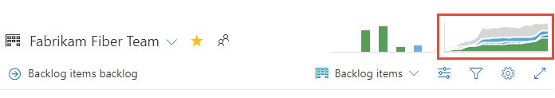

# Configure a cumulative flow chart

[!INCLUDE [temp](../_shared/version-azure-devops-all.md)]

::: moniker range=">= azure-devops-2019" 

You use cumulative flow diagrams (CFD) to monitor the flow of work through a system. There are two CFD charts, the one viewed from the Kanban board and the one you access by adding the CFD widget to your dashboard. 

The CFD widget provides more configuration options than those supported by the default CFD charts shown on the backlog and board pages. With the CFD widget, you can monitor the count of work items as they progressively move through various states which you define. You can configure the CFD chart to monitor the flow of epics, features, user stories, product backlog items, or requirements, depending on the process ([Agile](../../boards/work-items/guidance/agile-process.md), [Scrum](../../boards/work-items/guidance/scrum-process.md), or ([CMMI](../../boards/work-items/guidance/cmmi-process.md)) you've selected.

Use this article to learn how to: 

> [!div class="checklist"] 
> * Configure the Cumulative Flow Diagram widget (Analytics service)  
> * View and configure the built-in Cumulative flow chart (work tracking datastore) 

For usage guidance, see [Cumulative flow, lead time, and cycle time guidance](cumulative-flow-cycle-lead-time-guidance.md).

::: moniker-end

[!INCLUDE [temp](../_shared/analytics-widgets-prerequisites.md)]

::: moniker range=">= tfs-2013 <= tfs-2018" 
You use cumulative flow diagrams (CFD) to monitor the flow of work through a system. Use this article to learn how to: 

> [!div class="checklist"] 
> * View and configure the built-in Cumulative Flow chart (work tracking data store)     

For usage guidance, see [Cumulative flow, lead time, and cycle time guidance](cumulative-flow-cycle-lead-time-guidance.md).
::: moniker-end

::: moniker range=">= azure-devops-2019" 
## Add the widget to your dashboard   

::: moniker-end

::: moniker range="azure-devops"
1. If you haven't yet configured your Kanban board, do that now. Define the [columns](../../boards/boards/add-columns.md) and [swimlanes](../../boards/boards/expedite-work.md) that support your workflow processes.  
1. If you want fixed scope CFD charts, make sure that you've [defined the sprint iterations](../../boards/sprints/define-sprints.md) for those sprints of interest.  
1. To add a CFD chart to your team dashboard, see [Add a widget to a dashboard](../add-widget-to-dashboard.md). Add the Cumulative Flow Diagram widget.  

	  

1. Choose the  actions icon and select the **Configure** option to open the configuration dialog. Modify the title, and then select the team, backlog level, swimlanes, and time period you want to monitor.  

	   

::: moniker-end

::: moniker range="azure-devops-2019"
1. If you haven't yet added the [Analytics Marketplace extension](../dashboards/analytics-extension.md), do that now.    
1. If you haven't yet configured your Kanban board, do that now. Define the [columns](../../boards/boards/add-columns.md) and [swimlanes](../../boards/boards/expedite-work.md) that support your workflow processes.  
1. If you want fixed scope CFD charts, make sure that you've [defined the sprint iterations](../../boards/sprints/define-sprints.md) for those sprints of interest.  
1. To add a CFD chart to your team dashboard, see [Add a widget to a dashboard](../add-widget-to-dashboard.md). Add the Cumulative Flow Diagram widget.  

	  

1. Choose the  actions icon and select the **Configure** option to open the configuration dialog. Modify the title, and then select the team, backlog level, swimlanes, and time period you want to monitor.  

	   

::: moniker-end

<a id="configure-widget" /> 
<a id="configure" /> 
::: moniker range=">= azure-devops-2019"
## Configure the CFD widget    

0. For a continuous flow diagram, select Rolling period and specify the number of days you want to view on the chart.  

	Or, for a fixed scope view, choose and specify the Start date. Choose this view if your team employs a Scrumban process or follows a standard sprint process.  

	The main difference between these two types of CFD charts is that the fixed scope CFD will provide information (in most cases) of scope change.   

0. Choose the color. You can distinguish the CFD for different teams by choosing different colors.

0. Choose **Save** when done. The following image shows an example CFD chart showing 30 days of data. 
   
	    

::: moniker-end

## View the built-in cumulative flow chart 

::: moniker range=">= azure-devops-2019"  

You open the built-in (work tracking datastore) CFD for your product or portfolio backlog by choosing the image in the upper-right corner of your **Boards>Boards** page. 

> [!div class="mx-imgBorder"]  
> 

::: moniker-end  

::: moniker range="<= tfs-2018"

You open the built-in (work tracking datas tore) CFD for your product or portfolio backlog by choosing the image in the upper-right corner of your **Work>Backlogs** page. 

::: moniker-end

The CFD shows the count of items in each Kanban column for the past 30 weeks or less. From this chart you can gain an idea of the amount of work in progress and lead time. Work in progress counts unfinished requirements. Lead time indicates the amount of time it takes to complete a requirement once work has started. 

   

## Configure the built-in cumulative flow chart   

Each team can set their preferences for the built-in cumulative flow charts.  

For the CFD chart to reflect useful information, you'll want to update the status of work items to reflect progress as it occurs. The quickest way to make these updates is through your [Kanban board](../../boards/boards/kanban-basics.md). 

::: moniker range=">= azure-devops-2019" 

1. Open the [backlog level for which you want to configure](../../boards/boards/kanban-quickstart.md) and then open the common configuration dialog. Choose the  gear icon.  

	> [!div class="mx-imgBorder"]  
	> 

	If you're not a team admin, [get added as one](../../organizations/settings/add-team-administrator.md). Only team and project admins can customize the Kanban boards and CFD charts.  

2. Choose **Cumulative flow** and specify the team's preferences.  

	> [!div class="mx-imgBorder"]  
	> 	

::: moniker-end  

::: moniker range="<= tfs-2018"

1. Open the backlog level for which you want to configure and then open the common configuration dialog. Choose the  gear icon.  

	  

	If you're not a team admin, [get added as one](../../organizations/settings/add-team-administrator.md). Only team and project admins can customize the team Kanban boards and CFD charts.  

2. Choose **Cumulative flow** and specify the team's preferences.  

	  

::: moniker-end

## Try this next
> [!div class="nextstepaction"]
> [Cumulative flow, lead time, and cycle time guidance](cumulative-flow-cycle-lead-time-guidance.md) or
> [Kanban basics](../../boards/boards/kanban-basics.md)

  