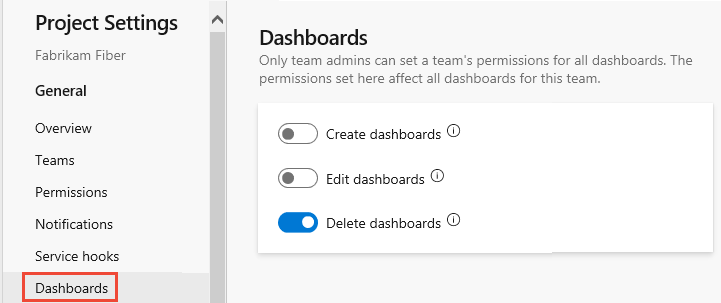
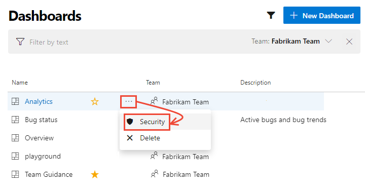
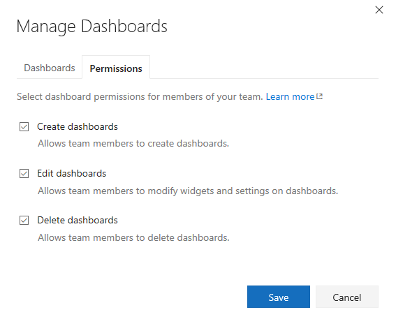
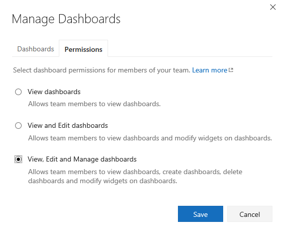
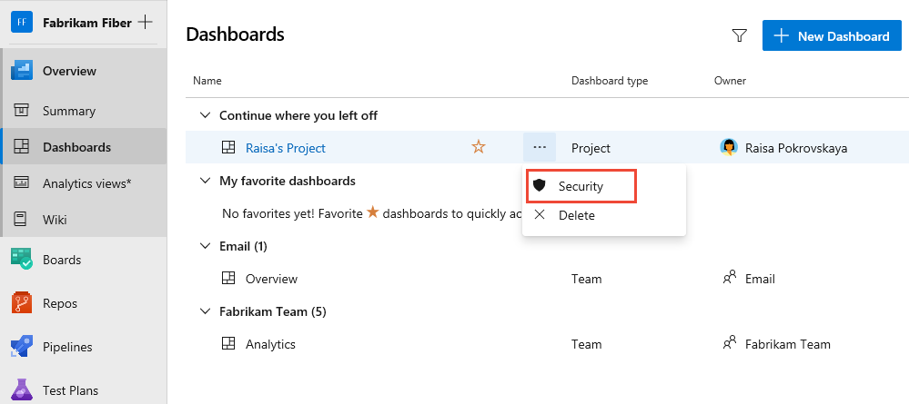
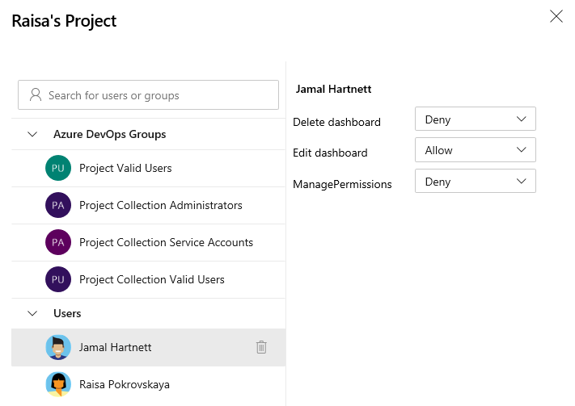

# Set dashboard permissions    

[!INCLUDE [temp](../includes/version-tfs-2017-through-vsts.md)] 

::: moniker range=">= azure-devops-2020"

Dashboards are viewable by all members of the Project Valid Users group. Permissions to edit or delete dashboards or manage permissions can be set for both team or project dashboards. 
 
As a member of the Project Administrators group, you can set the default dashboard permissions for all teams. As a team or project administrator, you can set individual dashboard permissions for team members. The permissions only impact the team members and their team dashboards. 

::: moniker-end

::: moniker range="azure-devops-2019"

As a member of the Project Administrators group, you can set the default dashboard permissions for all teams. As a team or project administrator, you can set individual dashboard permissions for team members. The permissions only impact the team members and their team dashboards.  

::: moniker-end

::: moniker range=">= tfs-2017  <= tfs-2018"  
As a team or project administrator, you can set individual dashboard permissions for team members. The permissions only impact the team members and their team dashboards. 

::: moniker-end

::: moniker range="tfs-2017"  
> [!NOTE]  
> The set dashboard permissions feature is available for TFS 2017.1 and later versions. For TFS 2017 and earlier versions, only team and project administrators can add and edit dashboards.  

::: moniker-end

To learn more about adding and viewing dashboards, see [Add, rename, and delete dashboards](dashboards.md).   

> [!TIP]    
> If a user reports that they can't create or edit a team dashboard, and you've set the permissions to allow them to do so, check that they have been added as a member of the team. This includes adding them as a team member to the default project team. For details, see [Add users to a project or specific team](../../organizations/security/add-users-team-project.md). 

::: moniker range=">= azure-devops-2019"

## Prerequisites  

::: moniker-end

::: moniker range=">= azure-devops-2020"

- If you haven't been added as a team member, [get added now](../../organizations/security/add-users-team-project.md).
- All members of the Project Valid Users group can view dashboards. 
- To add, edit, or manage a team dashboard, you must have **Basic** access or greater and be a [team admin](../../organizations/settings/add-team-administrator.md), a project admin, or have dashboard permissions. In general, you need to be a team member for the currently selected team to edit dashboards.
- To add, edit, or manage project dashboards, you must have **Basic** access or greater, a project admin, or have dashboard permissions. In general, you need to be a team member for the currently selected team to edit dashboards.

::: moniker-end

::: moniker range="azure-devops-2019"

- If you haven't been added as a team member, [get added now](../../organizations/security/add-users-team-project.md).
- All members of the Project Valid Users group can view dashboards. 
- To add, edit, or manage a team dashboard, you must have **Basic** access or greater and be a [team admin](../../organizations/settings/add-team-administrator.md), a project admin, or have dashboard permissions. In general, you need to be a team member for the currently selected team to edit dashboards.

::: moniker-end

::: moniker range=">= azure-devops-2019"

## Set default team dashboard permissions

By default, all team members have permissions to create and edit dashboards for their teams. All members of the Project Administrators or Project Collection Administrators group and team administrators can set the default dashboard permissions for a team.  

::: moniker-end

::: moniker range=">= azure-devops-2020"

1. Choose **Project Settings** and then **Dashboards**.  

	> [!div class="mx-imgBorder"]  
	> 

1. Slide to enable or disable those permissions you want to grant or restrict. Your changes are automatically saved by the system.

::: moniker-end

::: moniker range="azure-devops-2019"

1. Choose **Project Settings** and then **Dashboards**.  

	> [!div class="mx-imgBorder"]  
	> 

1. Check or uncheck those permissions you want to grant or restrict. Your changes are automatically saved by the system.

::: moniker-end

::: moniker range=">= tfs-2017"

## Set individual team dashboard permissions 

> [!NOTE]   
> The dashboard permissions dialog doesn't support granting permissions to other users or groups at this time. You can only change the default settings made for the team.  

::: moniker-end

::: moniker range=">= azure-devops-2020"

1. Open the [Dashboards directory](dashboards.md), choose the :::image type="icon" source="../../media/icons/actions-icon.png" border="false"::: actions icon for the dashboard, and then select the **Security** menu option. 

	> [!div class="mx-imgBorder"]  
	> 

1. Change **Allow** or **Deny** to grant or restrict a permission. 
 
	Here we restrict team members from editing the Analytics dashboard. Only Fabrikam team administrators are able to edit the Analytics dashboard. 

 	> [!div class="mx-imgBorder"]  
	> 

2. Close the dialog. 

::: moniker-end

::: moniker range="azure-devops-2019"

1. Open the [Dashboards directory](dashboards.md), choose the :::image type="icon" source="../../media/icons/actions-icon.png" border="false"::: actions icon for the dashboard, and then select the **Security** menu option. 

	> [!div class="mx-imgBorder"]  
	> 

1. Change **Allow** or **Deny** to grant or restrict a permission. 
 
	Here we restrict team members from editing the Analytics dashboard. Only Fabrikam team administrators are able to edit the Analytics dashboard. 

 	> [!div class="mx-imgBorder"]  
	> 

2. Choose **Save changes** and then **Close**. 

::: moniker-end

::: moniker range="tfs-2017 || tfs-2018"

By default, all team members have permissions to edit dashboards defined for the team. All other valid users of the project have view only permissions, except for administrators. You can change the view, edit, and manage permissions for all team dashboards for members of your team. 

::: moniker-end

::: moniker range="tfs-2018"

1. To change the permissions for a specific dashboard, open the dashboard and then choose the  wrench icon for the dashboard.

	For example, here we open the Manage Dashboards dialog for the Fabrikam Fiber Web team's Test dashboard. 

	 

2. Choose the **Permissions** tab and check those checkboxes to grant or restrict permissions to your team members to edit and manage team dashboards. The default settings, as shown in the illustration, provide all team members permissions to edit and manage dashboards.  

	> [!div class="mx-imgBorder"]
	>    

3. Choose **Save** to save your changes and dismiss the Settings dialog. 

::: moniker-end

::: moniker range="tfs-2017"

1. To change the permissions for a specific dashboard, open the dashboard and then choose the  wrench icon for the dashboard.

	For example, here we open the Manage Dashboards dialog for the Fabrikam Fiber Web team's Test dashboard. 

	 

2. Choose the **Permissions** tab and check those checkboxes to grant or restrict permissions to your team members to edit and manage team dashboards. The default settings, as shown in the illustration, provide all team members permissions to edit and manage dashboards.  

	> [!NOTE]   
	> The dashboard security dialog doesn't support granting permissions to other users or groups.  

	Requires TFS 2017.1 or later version.   

	> [!div class="mx-imgBorder"]
	>  
 
3. Choose **Save** to save your changes and dismiss the Settings dialog. 

::: moniker-end

::: moniker range=">= azure-devops-2020"

## Set permissions for a project dashboard 

1. To set permissions for a project dashboard, open the [Dashboards directory](dashboards.md), choose the :::image type="icon" source="../../media/icons/actions-icon.png" border="false"::: actions icon for the dashboard, and then select the **Security** menu option. 

	> [!div class="mx-imgBorder"]  
	> 

	By default, the creator or owner of the dashboard has all permissions granted to edit, delete, and manage dashboard permissions. 

1. To add another user or group, search for their identity and then choose the permission settings that you want.  

	> [!div class="mx-imgBorder"]  
	> 

1. Close the dialog when finished. 

1. Reopen the security dialog to verify the changes were made. 

 	> [!div class="mx-imgBorder"]  
	> 

::: moniker-end

## Related articles

- [Add, rename, and delete dashboards](dashboards.md)
- [Add users to a project or specific team](../../organizations/security/add-users-team-project.md)
- [Add a team administrator](../../organizations/settings/add-team-administrator.md) 
