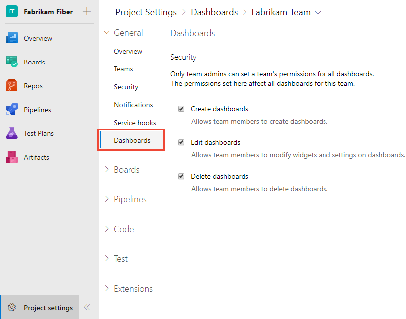
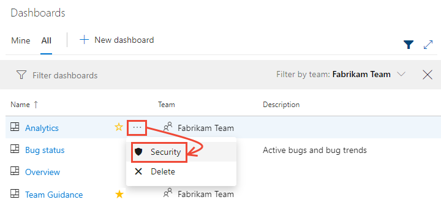
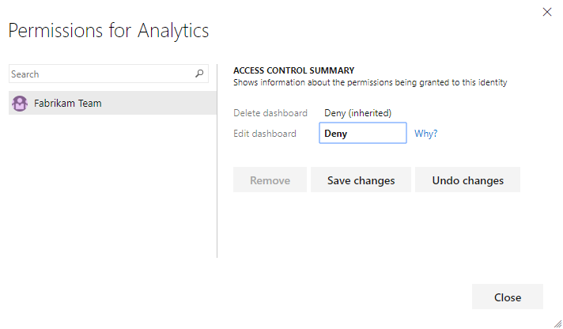
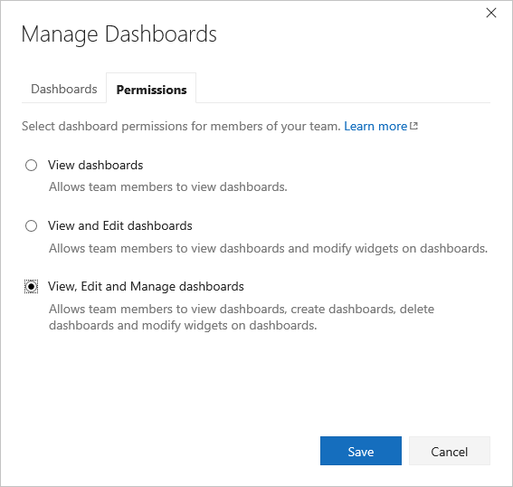

# Set dashboard permissions    

[!INCLUDE [temp](../_shared/version-tfs-2017-through-vsts.md)] 

::: moniker range=">= azure-devops-2019"
As a member of the Project Administrators group, you can set the default dashboard permissions for all teams. As a team or project administrator, you can set individual dashboard permissions for team members. The permissions only affect the team members to which the dashboards belongs. 
::: moniker-end

::: moniker range=">= tfs-2017  <= tfs-2018"  
As a team or project administrator, you can set individual dashboard permissions for team members. The permissions only affect the team members to which the dashboards belongs.  

::: moniker-end

::: moniker range="tfs-2017"  
> [!NOTE]  
> The set dashboard permissions feature is available for TFS 2017.1 and later versions. For TFS 2017 and earlier versions, only team and project administrators can add and edit dashboards.  

::: moniker-end

To learn more about adding and viewing dashboards, see [Add, rename, and delete dashboards](dashboards.md).   

> [!TIP]    
> If a user reports that they can't create or edit a team dashboard, and you've set the permissions to allow them to do so, check that they have been added as a member of the team. This includes adding them as a team member to the default project team. For details, see [Add users to a project or specific team](../../organizations/security/add-users-team-project.md). 

::: moniker range=">= azure-devops-2019"

## Prerequisites  

- If you haven't been added as a team member, [get added now](/azure/devops/organizations/security/add-users-team-project).
- Anyone with access to a project, including [stakeholders](/azure/devops/organizations/security/get-started-stakeholder), can view dashboards.
- To add, edit, or manage a team dashboard, you must have **Basic** access or greater and be a [team admin](/azure/devops/organizations/settings/add-team-administrator), a project admin, or have dashboard permissions. In general, you need to be a team member for the currently selected team to edit dashboards.

::: moniker-end

::: moniker range=">= azure-devops-2019"
## Set default dashboard permissions for a project

By default, all team members have permissions to edit dashboards defined for the team. All other valid users of the project have view only permissions, except for members of the Project Administrators group. You can change the default permissions a project from the Project settings. 

0. Choose **Project Settings** and then **Dashboards**.  

	> [!div class="mx-imgBorder"]  
	> 

0. Check or uncheck those permissions you want to grant or restrict. Your changes are automatically saved by the system.

::: moniker-end

::: moniker range=">= azure-devops-2019"

## Set individual dashboard permissions for team members

0. Open the [Dashboards directory](dashboards.md), choose the  actions icon for the dashboard, and then select the **Security** menu option. 

	> [!div class="mx-imgBorder"]  
	> 

0. Change **Allow** or **Deny** to grant or restrict a permission. 
 
	Here we lock down the permissions for members of the Fabrikam team to edit the Analytics dashboard. 

 	> [!div class="mx-imgBorder"]  
	> 

	> [!NOTE]   
	> The dashboard permissions dialog doesn't support granting permissions to other users or groups at this time.  

0. Choose **Save changes** and then **Close**. 

::: moniker-end

::: moniker range="tfs-2017 || tfs-2018"

## Set individual dashboard permissions for team members

By default, all team members have permissions to edit dashboards defined for the team. All other valid users of the project have view only permissions, except for administrators. You can change the view, edit, and manage permissions for all team dashboards for members of your team. 

::: moniker-end

::: moniker range="tfs-2018"

1. To change the permissions for a specific dashboard, open the dashboard and then choose the  wrench icon for the dashboard.

	For example, here we open the Manage Dashboards dialog for the Fabrikam Fiber Web team's Test dashboard. 

	 

2. Choose the **Permissions** tab and check those checkboxes to grant or restrict permissions to your team members to edit and manage team dashboards. The default settings, as shown in the illustration, provide all team members permissions to edit and manage dashboards.  

	> [!NOTE]   
	> The dashboard security dialog doesn't support granting permissions to other users or groups.  

	> [!div class="mx-imgBorder"]
	>    

3. Choose **Save** to save your changes and dismiss the Settings dialog. 

::: moniker-end

::: moniker range="tfs-2017"
1. To change the permissions for a specific dashboard, open the dashboard and then choose the  wrench icon for the dashboard.

	For example, here we open the Manage Dashboards dialog for the Fabrikam Fiber Web team's Test dashboard. 

	 

2. Choose the **Permissions** tab and check those checkboxes to grant or restrict permissions to your team members to edit and manage team dashboards. The default settings, as shown in the illustration, provide all team members permissions to edit and manage dashboards.  

	> [!NOTE]   
	> The dashboard security dialog doesn't support granting permissions to other users or groups.  

	Requires TFS 2017.1 or later version.   

	> [!div class="mx-imgBorder"]
	>  
 
3. Choose **Save** to save your changes and dismiss the Settings dialog. 

::: moniker-end

## Related articles

- [Add users to a project or specific team](../../organizations/security/add-users-team-project.md)
- [Add a team administrator](../../organizations/settings/add-team-administrator.md)
 
