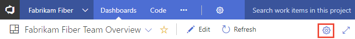
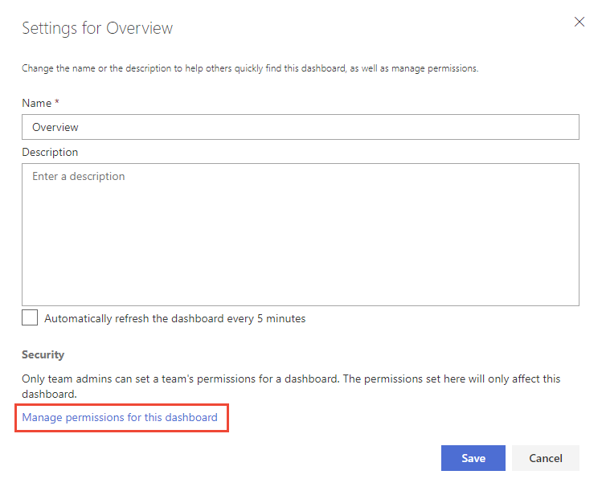
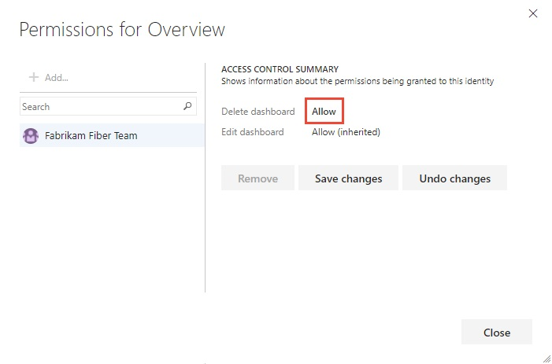

# Set dashboard permissions    

**Azure DevOps Services | TFS 2018 | TFS 2017.1**

As a team admin you can set dashboard permissions for your team. As a member of the Project Administrators group, you can set dashboard permissions for all teams. 

To learn more about adding and viewing dashboards, see [Add and manage dashboards](dashboards.md).   

> [!TIP]    
> If a user reports that they can't create or edit a team dashboard, and you've set the permissions to allow them to do so, check that they have been added as a member of the team. This includes adding them as a team member to the default project team. For details, see [Add users to a project or specific team](../../organizations/security/add-users-team-project.md). 

::: moniker range="tfs-2017"
> [!NOTE]  
> The set dashboard permissions feature is available for TFS 2017.1 and later versions. 
::: moniker-end

::: moniker range="vsts"

By default, all team members have permissions to edit dashboards defined for the team. All other valid users of the project have view only permissions, except for administrators. You can change the edit permissions for specific team dashboards. 

1. To change the permissions for a dashboard, open the dashboard and then choose the  gear icon for the dashboard. 

	For example, here we open the Settings dialog for the Fabrikam Fiber team's Overview dashboard. 

	> [!div class="mx-imgBorder"]  
	>  
	   
2. Choose the **Manage permissions for this dashboard** link.  

	> [!div class="mx-imgBorder"]  
	>    

3. Change the permission settings shown as needed. These permissions are set for members of your team for the specific dashboard. 
 
	Here we change the **Delete dashboard** permission to Allow.  

	> [!div class="mx-imgBorder"]  
	>   

4. Choose **Save** to save your changes and dismiss the Settings dialog. 

::: moniker-end

::: moniker range=">= tfs-2017  <= tfs-2018"  
By default, all team members have permissions to edit dashboards defined for the team. All other valid users of the project have view only permissions, except for administrators. You can change the view, edit, and manage permissions for all team dashboards for members of your team. 

::: moniker-end

::: moniker range="tfs-2017"

> [!NOTE]   
> Setting dashboard permissions requires TFS 2017.1 or later version. For TFS 2017 and earlier versions, only team and project administrators can add and edit dashboards. 

::: moniker-end

::: moniker range=">= tfs-2017  <= tfs-2018"  
1. To change the permissions for a dashboard, open the dashboard and then choose the  wrench icon for the dashboard.

	For example, here we open the Manage Dashboards dialog for the Fabrikam Fiber Web team's Test dashboard. 

	 

2. Choose the **Permissions** tab and check those checkboxes to grant or restrict permissions to your team members to edit and manage your team dashboards. The default settings, as shown in the illustration, provide all team members permissions to edit and manage dashboards.  

	::: moniker range="tfs-2018"  
	> [!div class="mx-imgBorder"]
	>    
	::: moniker-end  
	::: moniker range="tfs-2017"  
	Requires TFS 2017.1 or later version.   

	> [!div class="mx-imgBorder"]
	>  
	::: moniker-end

3. Choose **Save** to save your changes and dismiss the Settings dialog. 

::: moniker-end

## Related articles

- [Add users to a project or specific team](../../organizations/security/add-users-team-project.md)
- [Add a team administrator](../../organizations/settings/add-team-administrator.md)
 
