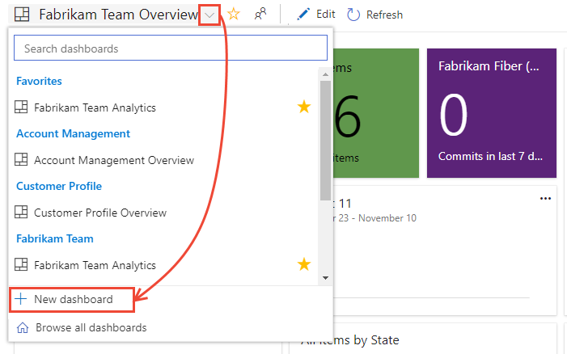

# Add and manage dashboards

**VSTS | TFS 2018 | TFS 2017 | TFS 2015.1**

Share progress and status with your team using configurable team dashboards. Dashboards provide easy-to-read, easy access, real-time information. At a glance, you can make informed decisions without having to drill down into other parts of your team project site. 

The Overview page provides access to a default team dashboard which you can customize by adding, removing, or rearranging the tiles. Each tile corresponds to a widget that provides access to one or more features or functions.   


::: moniker range="tfs-2015"
> [!NOTE]   
> Multiple team dashboards and the [widget catalog](widget-catalog.md) are available from TFS 2015.1 or later versions. For TFS 2015 and earlier versions, you don't have access to multiple team dashboards. Instead, your home page serves as a [single team dashboard](team-dashboard.md). For information on SharePoint dashboards, see [Project portal dashboards](../sharepoint-dashboards/project-portal-dashboards.md).
::: moniker-end

::: moniker range="tfs-2017"
> [!NOTE]   
> For information on SharePoint dashboards, see [Project portal dashboards](../sharepoint-dashboards/project-portal-dashboards.md).
::: moniker-end


::: moniker range="vsts"
[!INCLUDE [temp](../_shared/dashboard-prerequisites-vsts.md)]  
::: moniker-end

::: moniker range=">= tfs-2017 <= tfs-2018"
[!INCLUDE [temp](../_shared/dashboard-prerequisites-tfs-2017-18.md)] 
::: moniker-end

::: moniker range="tfs-2015"
[!INCLUDE [temp](../_shared/dashboard-prerequisites-tfs-2015.md)] 
::: moniker-end
 

::: moniker range=">= tfs-2015"
## Connect to the web portal for your team project 

Open a browser window and choose the **Dashboards** hub. 

 

<!---The URL follows this pattern: 
- VSTS: ```https://{account name}.visualstudio.com/{project name}/_backlogs```  
- Team Foundation Server (on-premises): ```http://{server}:8080/tfs/DefaultCollection/{project name}/_backlogs```  
-->
If you don't see the team or team project you want, click the  project icon to [browse all team projects and teams](../../user-guide/account-home-pages.md).    
::: moniker-end


::: moniker range=">= tfs-2015"

## Select a dashboard to view 

All dashboards are associated with a team. 

::: moniker-end


# [New Dashboards Experience](#tab/new-query-exp) 

::: moniker range="vsts"

To enable the New Dashboard experience, see [Enable preview features](../../project/navigation/preview-features.md).  

1. From the **Dashboards** hub, open the selector and choose  the **Browse all dashboards** option. 
 
	> [!div class="mx-imgBorder"]  
	>   

2. The **Mine** page shows your favorited dashboards, and all dashboards of teams that you belong to. The **All** page (shown below) lists all dashboards defined for the team project in alphabetical order. You can filter the list by team or by keyword.   
 
	> [!div class="mx-imgBorder"]  
	>   

	> [!TIP]
	> You can change the sort order of the list by clicking the column label. However, you can't change the column size of the displayed columns. 
	 
3. To favorite a dashboard, hover over the dashboard and choose the .  

	> [!div class="mx-imgBorder"]  
	>   

	Favoriting a dashboard will cause it to appear on your Favorites page, and appear towards the top in the Dashboards selection menu.
   
::: moniker-end

::: moniker range=">= tfs-2015 <= tfs-2018"
The New Dashboard experience is only available from VSTS at this time. 

::: moniker-end


# [Old Dashboards Experience](#tab/old-query-exp)

::: moniker range=">= tfs-2015"

1. Select the team whose dashboards you want to view. To switch your team focus, see [Switch team project or team focus](../../organizations/settings/switch-team-context.md).

2. Choose the **Dashboards** hub.

3. Choose the name of the dashboard to view it. 

	For example, here we choose to view the Work in Progress dashboard. 

	> [!div class="mx-imgBorder"]  
	>   

::: moniker-end

---

::: moniker range=">= tfs-2015"

## Add and name your dashboard 

Add a new dashboard as needed to support your team's needs. You can also edit and rename any existing dashboards associated with your team. All dashboards are associated with a team. 

::: moniker-end

# [New Dashboards Experience](#tab/new-query-exp) 

::: moniker range="vsts"

To enable the New Dashboard experience, see [Enable preview features](../../project/navigation/preview-features.md).  

1. From the **Dashboards** hub, open the selector and choose the  **New Dashboard** option. 

	> [!div class="mx-imgBorder"]  
	>   

	If you don't see the  **New Dashboard** option, then you're not a team admin for the currently selected team, or you don't have permissions to add and edit dashboards. Either [switch the context to your team](../../organizations/settings/switch-team-context.md?toc=/vsts/report/dashboards/toc.json&bc=/vsts/report/dashboards/breadcrumb/toc.json), or request you be added as a [team admin](../../work/scale/add-team-administrator.md?toc=/vsts/report/dashboards/toc.json&bc=/vsts/report/dashboards/breadcrumb/toc.json). 

2. Enter the name of the dashboard and other information you want to capture. 

	> [!div class="mx-imgBorder"]  
	>   

	Choose **Save**. 

3.  The widget catalog opens. You can add one or more widgets to the dashboard. You can then configure and resize each widget as needed. 

4.	You can move the widgets around the dashboard to place them where you want them. 

5.  When you're done making changes, choose **Done Editing**. 

::: moniker-end

::: moniker range=">= tfs-2015 <= tfs-2018"
The New Dashboard experience is only available from VSTS at this time. 
::: moniker-end


# [Old Dashboards Experience](#tab/old-query-exp)

::: moniker range=">= tfs-2015"

From the **Dashboards** hub, click the  and enter a dashboard name. 

 

If you don't see the , then you're not a team admin for the currently selected team, or you don't have permissions to add and edit dashboards. Either [switch the context to your team](../../organizations/settings/switch-team-context.md?toc=/vsts/report/dashboards/toc.json&bc=/vsts/report/breadcrumb/dashboards/toc.json), or request you be added as a [team admin](../../work/scale/add-team-administrator.md?toc=/vsts/report/dashboards/toc.json&bc=/vsts/report/breadcrumb/dashboards/toc.json). 

With the dashboard selected, you can add [widgets and charts to the dashboard](add-widget-to-dashboard.md). Or, you can [add charts to a team dashboard from the Work, Build, or Test hubs](add-charts-to-dashboard.md).

::: moniker-end

---

::: moniker range=">= tfs-2015"

<a id="manage">  </a> 
## Manage dashboards, reorder and enable auto-refresh

You can rename or delete a dashboard. Also, you can enable auto-refresh, and the dashboard will automatically update every 5 minutes.  

<!---
>[!NOTE]  
>**Feature availability:**  You can  configure the auto-refresh setting for each dashboard on VSTS and for TFS 2015.2 and later versions. For VSTS and TFS 2017.1 and later versions, you can [set dashboard permissions](dashboard-permissions.md). 
-->


::: moniker-end


# [New Dashboards Experience](#tab/new-query-exp) 

::: moniker range="vsts"

- To rename a dashboard, modify it's description, or change it's automatic refresh setting, open the dashboard, click the  gear icon, and change the field options shown. Save your changes. 

- To delete a dashboard, open the **All** dashboards page, open the  actions menu for the dashboard, and choose the **Delete** option.  

	> [!div class="mx-imgBorder"]  
	>   

- To set permissions for a dashboard, choose the **Security** option. For details, see [Set dashboard permissions](dashboard-permissions.md).


::: moniker-end


::: moniker range=">= tfs-2015 <= tfs-2018"
The New Dashboard experience is only available from VSTS at this time. 
::: moniker-end


# [Old Dashboards Experience](#tab/old-query-exp)

::: moniker range=">= tfs-2015"

1. To manage dashboards, click the  wrench icon.

	 

2. Drag and drop the dashboards into the sequence you want them to appear.  

	 

3. (Optional) Select the Auto-refresh checkbox when you want the dashboard to refresh every five minutes. 
 
4. To delete a dashboard, click the  .

5. Choose Save to save your changes. 

You can also [manage dashboard permissions](dashboard-permissions.md).   
::: moniker-end

::: moniker range="tfs-2015"
<!---
### TFS 2015
-->
1. To manage dashboards, click the  gear icon.
 
	 

2. Drag and drop the dashboards into the sequence you want them to appear.  

	   

3. (Optional) Select the Auto-refresh checkbox when you want the dashboard to refresh every five minutes. The Auto-refresh feature requires TFS 2015.2 or later version.   

4. To delete a dashboard, click the .

5. Choose Save to save your changes. 

::: moniker-end

---

::: moniker range=">= tfs-2015"
## Move or delete a widget from a dashboard  

> [!NOTE]  
> Just as you have to be a team admin, a project admin, or have the necessary permissions to add items to a dashboard, you must have the [necessary permissions](#permissions) to remove items.  


::: moniker-end

# [New Dashboards Experience](#tab/new-query-exp) 

::: moniker range="vsts"

Choose  to modify your dashboard. 

You can then add widgets or drag tiles to reorder their sequence on the dashboard. 

To remove a widget, click the  actions icon and select the **Delete** option from the menu.  

> [!div class="mx-imgBorder"]  
>  

When you're finished with your changes, choose **Done Editing** to exit dashboard editing.

> [!TIP]   
> When you're in dashboard edit mode, you can remove, rearrange, and configure widgets, as well as add new widgets. Once you leave edit mode, the widget tiles remain locked, reducing the chances of accidentally moving a widget.  

::: moniker-end


::: moniker range=">= tfs-2015"
The New Dashboard experience is only available from VSTS at this time. 
::: moniker-end


# [Old Dashboards Experience](#tab/old-query-exp)

::: moniker range=">= tfs-2017"

Click  to modify your dashboard. You can then drag tiles to reorder their sequence on the dashboard. 

To remove a widget, click the widget's  or  delete icons. 

When you're finished with your changes, click  to exit dashboard editing.

> [!TIP]   
> When you're in dashboard edit mode, you can remove, rearrange, and configure widgets, as well as add new widgets. Once you leave edit mode, the widget tiles remain locked, reducing the chances of accidentally moving a widget.  


Note that you can drag and drop a widget from the catalog onto the dashboard.

::: moniker-end

---

::: moniker range=">= tfs-2015"

## Try this next 

As you can see, you can use team dashboards to provide guidance and keep your team in sync, providing visibility across your org about status, trends, and progress. 

> [!div class="nextstepaction"]
> [Add a widget to a dashboard](add-widget-to-dashboard.md)

See these additional resources to help you support your team:  
- [Review the widget catalog](widget-catalog.md)
- [Review Marketplace widgets](https://marketplace.visualstudio.com/search?term=widget&target=VSTS&category=All%20categories&sortBy=Relevance)


### Extensibility 

Using the REST API service, you can [create a dashboard widget](../../extend/develop/add-dashboard-widget.md). To learn more about the REST APIs for dashboards and widgets, see [Dashboards (API)](https://docs.microsoft.com/en-us/rest/api/vsts/dashboard/dashboards).  

::: moniker-end

<!---  
Only dashboard owners can change the configuration of their dashboards.  

To add a widget, click . The [Widget catalog](widget-catalog.md) provides descriptions of each available widget.   
To add an item, see [add items to the dashboard](#pin-items). 

You can reorder dashboard widgets through drag-and-drop. And remove widgets or items.

Click  to [add another dashboard.  

 Or add items to this dashboard and re-sequence tiles. Each tile provides team members quick access to the progress of their builds, work item status and trends, Git repositories or version control folders.

## Add items to a dashboard 

You add an item to the team dashboard from the code, work, and build pages.  

1.  If you aren't a team administrator, [get added as one](#add-team-admin).  

2.	Add a work item query from its context menu.</p>

	

	To add a source control folder or a build definition, open the corresponding page and access the pin feature in the same way.    

3.	To add a chart, go to the query's Charts page and add it to your selected dashboard or the team homepage.  

	  

4.	Drag tiles or widgets to reorder their sequence on the dashboard.    

	Using Internet Explorer 10 or Internet Explorer 11, you can also tab to a tile and press Shift+L or Shift+R to move the selected tile to the left or to the right.

5.	Choose a tile, widget, or link to open it. 


<a id="pin-items">  </a> 
### Add an item or a chart to your dashboard 

You add an item to a dashboard from the code, work, and build pages. 

First, make sure you have the team context selected from the Queries page to which you want to add a query or chart. 

For example, select the context menu of a query that you want to add to the dashboard. This is the same as adding a query tile widget. 

  

And, you can add a chart to a team dashboard in a similar way.  

  


<a id="edit-dashboard"></a>
## Add widgets to your dashboard

>[!NOTE]  
><b>Feature availability: </b>Dashboard edit mode controls shown appear from VSTS or TFS 2015.2 or later version. Some functionality differs when you connect to an application server running TFS 2015.1 or later version.   

### Add a widget  

Click  to modify a dashboard. Click  to add a widget to the dashboard.
  
> [!NOTE]  
> **Feature availability:**  From VSTS and TFS 2017 and later versions, you can drag and drop a widget from the catalog onto the dashboard. 

The [widget catalog](widget-catalog.md) describes all the available widgets, many of which are scoped to the selected team context.  

 

### Configure a widget  
After you add the widget, you may need to configure it. For example, to configure the Query tile widget, click the  or the  to open the configuration dialog.


And then select the query and specify any rules you want. (For TFS 2015.1 and later versions, you can only specify the green and red flag limits.)  

#### Configuration dialog for query tile  

  

--> 
