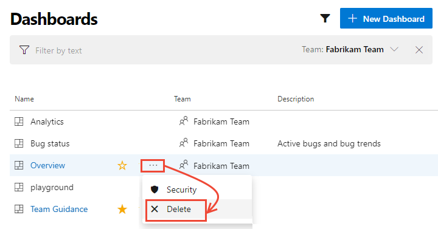

# Add, rename, and delete dashboards in Azure DevOps

[!INCLUDE [temp](../_shared/version-ts-tfs-2015-2016.md)] 

Share progress and status with your team using configurable team dashboards. Dashboards provide easy-to-read, easy access, real-time information. At a glance, you can make informed decisions without having to drill down into other parts of your project. 

The Overview page provides access to a default team dashboard which you can customize by adding, removing, or rearranging the tiles. Each tile corresponds to a widget that provides access to one or more features or functions.   

::: moniker range="tfs-2015"
> [!NOTE]   
> Multiple team dashboards and the [widget catalog](widget-catalog.md) are available from TFS 2015.1 or later versions. For TFS 2015 and earlier versions, you don't have access to multiple team dashboards. Instead, your home page serves as a [single team dashboard](team-dashboard.md). For information on SharePoint dashboards, see [Project portal dashboards](../sharepoint-dashboards/project-portal-dashboards.md).
::: moniker-end

::: moniker range="tfs-2017"
> [!NOTE]   
> For information on SharePoint dashboards, see [Project portal dashboards](../sharepoint-dashboards/project-portal-dashboards.md).
::: moniker-end

[!INCLUDE [temp](../_shared/dashboard-prerequisites.md)]  

## Connect to your project 

All dashboards are associated with a team.

::: moniker range=">= azure-devops-2019"  

Open a web browser, connect to your project, and choose **Overview>Dashboards**. The dashboard directory page opens. 

> [!div class="mx-imgBorder"]  
> 

It lists dashboards in the following order: 
- Your last visited dashboard
- Your favorited dashboards
- All dashboards of teams that you belong to
- All dashboards defined for the project in alphabetical order. 

Choose the  filter icon to filter the list by keyword or team. Keywords apply to dashboard titles, descriptions, and team names.

> [!div class="mx-imgBorder"]  
>    

If you need to switch to a different project, choose the  Azure DevOps logo to [browse all projects](../../project/navigation/go-to-project-repo.md).  

::: moniker-end  

::: moniker range=">= tfs-2015 <= tfs-2018"  
Open a web browser, connect to your project, and choose **Dashboards**. 

 

If you need to switch to a different project, choose the  Azure DevOps logo to [browse all projects](../../project/navigation/go-to-project-repo.md).  

::: moniker-end

<a id="choose-dashboard" />

::: moniker range=">= azure-devops-2019"
## Select a dashboard 

0. Choose a dashboard from the directory list, or from the selector. To return to the dashboard directory, choose the **Browse all dashboards** option. 
 
	> [!div class="mx-imgBorder"]
	>   
	 
0. To favorite a dashboard, hover over the dashboard and choose the .  

	> [!div class="mx-imgBorder"]
	>   

	Favoriting a dashboard will cause it to appear under **My Favorites dashboards** list on the dashboards directory. Also, it will appear towards the top in the **Dashboards** selector and in your [personal Favorites list](../../project/navigation/set-favorites.md). . 

::: moniker-end

::: moniker range=">= tfs-2015  <= tfs-2018"  

## Select a dashboard 

1. Select the team whose dashboards you want to view. To switch your team focus, see [Switch project, repo or team](../../project/navigation/go-to-project-repo.md#switch-team-context).

2. From **Dashboards**, choose the name of the dashboard to view it. 

	For example, here we choose to view the Work in Progress dashboard. 

	> [!div class="mx-imgBorder"]  
	>   

::: moniker-end  

## Add a dashboard 

Add a new dashboard as needed to support your team's needs. You can also edit and rename any existing dashboards associated with your team.

::: moniker range=">= azure-devops-2019"

1. From the Dashboards directory, choose **New Dashboard**. Or, when viewing a dashboard, open the selector and choose the  **New Dashboard** option. 

	> [!div class="mx-imgBorder"]  
	>   

	If you don't see the  **New Dashboard** option, then you're not a team admin for the currently selected team, or you don't have permissions to add and edit dashboards. Either [switch the context to your team](../../project/navigation/go-to-project-repo.md?toc=/azure/devops/report/dashboards/toc.json&bc=/azure/devops/report/dashboards/breadcrumb/toc.json), or request you be added as a [team admin](../../organizations/settings/add-team-administrator.md?toc=/azure/devops/report/dashboards/toc.json&bc=/azure/devops/report/dashboards/breadcrumb/toc.json). 

2. Enter the name of the dashboard and other information you want to capture. 

	> [!div class="mx-imgBorder"]  
	>   

	Choose **Save**. 

3.  The widget catalog opens. You can add one or more widgets to the dashboard. You can then configure and resize each widget as needed. 

4.	You can move the widgets around the dashboard to place them where you want them. 

5.  When you're done making changes, choose **Done Editing**. 
::: moniker-end

::: moniker range=">= tfs-2015  <= tfs-2018"  
From **Dashboards**, choose the  and enter a dashboard name. 

 

If you don't see the , then you're not a team admin for the currently selected team, or you don't have permissions to add and edit dashboards. Either [switch the context to your team](../../project/navigation/go-to-project-repo.md?toc=/azure/devops/report/dashboards/toc.json&bc=/azure/devops/report/breadcrumb/dashboards/toc.json), or request you be added as a [team admin](../../organizations/settings/add-team-administrator.md?toc=/azure/devops/report/dashboards/toc.json&bc=/azure/devops/report/breadcrumb/dashboards/toc.json). 

With the dashboard selected, you can add [widgets and charts to the dashboard](add-widget-to-dashboard.md). Or, you can [add charts to a team dashboard from the Work, Build, or Test pages](add-charts-to-dashboard.md).
::: moniker-end

 
## Rename, delete, and enable auto-refresh  

You can rename or delete a dashboard. Also, you can enable auto-refresh, and the dashboard will automatically update every 5 minutes.  

::: moniker range=">= tfs-2015 <= tfs-2017"  
> [!NOTE]  
> You can configure the auto-refresh setting for each dashboard for TFS 2015.2 and later versions. For TFS 2017.1 and later versions, you can [set dashboard permissions](dashboard-permissions.md). 
::: moniker-end

::: moniker range=">= azure-devops-2019"
- To rename a dashboard, modify it's description, or change it's automatic refresh setting, open the dashboard, choose the  gear icon, and change the field options shown. Save your changes. 

- To delete a dashboard, open the Dashboards directory, choose the  actions icon for the dashboard, and select the **Delete** menu option.  

	> [!div class="mx-imgBorder"]
	>   

- To set permissions for a dashboard, choose the **Security** option. For details, see [Set dashboard permissions](dashboard-permissions.md).
::: moniker-end

::: moniker range=">= tfs-2017 <= tfs-2018"  
1. To manage dashboards, choose the  wrench icon.

	 

2. Drag and drop the dashboards into the sequence you want them to appear.  

	 

3. (Optional) Select the Auto-refresh checkbox when you want the dashboard to refresh every five minutes. 
 
4. To delete a dashboard, choose the  delete icon.

5. Choose Save to save your changes. 

You can also [manage dashboard permissions](dashboard-permissions.md).   
::: moniker-end

::: moniker range="tfs-2015"
1. To manage dashboards, choose the  gear icon.
 
	 

2. Drag and drop the dashboards into the sequence you want them to appear.  

	   

3. (Optional) Select the Auto-refresh checkbox when you want the dashboard to refresh every five minutes. The Auto-refresh feature requires TFS 2015.2 or later version.   

4. To delete a dashboard, choose the  delete icon.

5. Choose **Save** to save your changes. 
::: moniker-end

## Move or delete a widget 

> [!NOTE]  
> Just as you have to be a team admin, a project admin, or have the necessary permissions to add items to a dashboard, you must have the [necessary permissions](#permissions) to remove items.  

::: moniker range=">= azure-devops-2019"
Choose  **Edit** to modify your dashboard. 

You can then add widgets or drag tiles to reorder their sequence on the dashboard. 

To remove a widget, choose the  actions icon and select the **Delete** option from the menu.  

> [!div class="mx-imgBorder"]  
>  

When you're finished with your changes, choose **Done Editing** to exit dashboard edit mode.

> [!TIP]   
> When you're in dashboard edit mode, you can remove, rearrange, and configure widgets, as well as add new widgets. Once you leave edit mode, the widget tiles remain locked, reducing the chances of accidentally moving a widget.  
::: moniker-end

::: moniker range=">= tfs-2015  <= tfs-2018"  
Choose  to modify your dashboard. You can then drag tiles to reorder their sequence on the dashboard. 

To remove a widget, choose the widget's  or  delete icons. 

When you're finished with your changes, choose  to exit dashboard editing.

> [!TIP]   
> When you're in dashboard edit mode, you can remove, rearrange, and configure widgets, as well as add new widgets. Once you leave edit mode, the widget tiles remain locked, reducing the chances of accidentally moving a widget.  

Note that you can drag and drop a widget from the catalog onto the dashboard.
::: moniker-end

## Try this next 
As you can see, you can use team dashboards to provide guidance and keep your team in sync, providing visibility across your org about status, trends, and progress. 

> [!div class="nextstepaction"]
> [Add a widget to a dashboard](add-widget-to-dashboard.md)
  
## Related articles
- [Review the widget catalog](widget-catalog.md)
- [Review Marketplace widgets](https://marketplace.visualstudio.com/search?term=widget&target=VSTS&category=All%20categories&sortBy=Relevance)

### Extensibility 
Using the REST API service, you can [create a dashboard widget](../../extend/develop/add-dashboard-widget.md). To learn more about the REST APIs for dashboards and widgets, see [Dashboards (API)](/rest/api/azure/devops/dashboard/dashboards).  

