# About dashboards, charts, reports, & widgets   

[!INCLUDE [temp](../includes/version-azure-devops-all.md)]

Gain visibility into your team's progress by adding one or more widgets or charts to your dashboard. Customizable, highly-configurable dashboards provide you and your teams with the flexibility to share information, monitor progress and trends, and improve your workflow processes.  Each team can tailor their dashboards to share information and monitor their progress.  

If you're just starting out, read [Add, rename, and delete dashboards](dashboards.md). If you're looking for instructions on a specific task, in context chart, widget, or report&mdash;review [Dashboards and widgets quick reference](quick-ref.md). To learn about our reporting solutions, read [Reporting Roadmap](../powerbi/reporting-roadmap.md).

[!INCLUDE [temp](../../includes/version-selector-minimize.md)]

## Key concepts

::: moniker range="azure-devops"

- <strong>Dashboards</strong> are customizable interactive signboards that provide real-time information. Dashboards are associated with a team or a project and display configurable charts and widgets.
- <strong>Charts</strong> are query-based status or trend charts derived from a work item query or test results.
- <strong>Widgets</strong> display configurable information and charts on dashboards. The widget catalog provides brief descriptions of those widgets available to you. In addition, you can add widgets provided through the [Azure DevOps Marketplace](https://marketplace.visualstudio.com/azuredevops). 
- <strong>In-context reports</strong> are system-generated charts that support specific services. Examples are team velocity, sprint burndown, and the Cumulative Flow Diagram (CFD), and the Test Failures Report. These reports are displayed on the **Analytics** tab for a specific service and derive data from Analytics.  
- <strong>Power BI reports</strong> allow users to create rich, customized Power BI reports or other reports using OData queries of Analytics data and the returned JSON data.  

::: moniker-end  

::: moniker range="azure-devops-2020"

- <strong>Dashboards</strong> are customizable interactive signboards that provide real-time information. Dashboards are associated with a team and display configurable charts and widgets to show information.
- <strong>Charts</strong> are query-based status or trend charts derived from a work item query or test results. 
- <strong>In-context reports</strong> are system-generated charts that support specific services. Examples are team velocity, sprint burndown, and the Cumulative Flow Diagram (CFD), and the Test Failures Report. These reports are displayed on the **Analytics** tab for a specific service and derive data from Analytics. 
- <strong>Widgets</strong> display configurable information and charts on dashboards. The widget catalog provides brief descriptions of those widgets available to you. In addition, you can add widgets provided through the [Azure DevOps Marketplace](https://marketplace.visualstudio.com/azuredevops).
- <strong>Reports</strong>
	- <strong>Power BI reports</strong>: For project collections that support the Inherited process, allow users to create rich, customized Power BI reports or other reports using OData queries of Analytics data and the returned JSON data.  
	- <strong>SQL Server reports</strong>: For project collections that support the On-premises XML process model, allow users access to out-of-the-box SQL Server reports as well as support to create customized SQL Reports or Excel reports. This requires that the project is [configured to support SQL Server reporting](../admin/add-a-report-server.md).

> [!NOTE]  
> OData (Open Data Protocol) is an ISO/IEC approved, OASIS standard that defines a set of best practices for building and consuming REST APIs. To learn more, see [OData documentation](/odata/).

::: moniker-end  

::: moniker range="azure-devops-2019"

- <strong>Dashboards</strong> are customizable interactive signboards that provide real-time information. Dashboards are associated with a team and display configurable charts and widgets to show information.
- <strong>Charts</strong> are query-based status or trend charts derived from a work item query or test results. 
- <strong>In-context reports</strong> are system-generated charts that support specific services. Examples are team velocity, sprint burndown, and the Cumulative Flow Diagram (CFD), and the Test Failures Report. 
- <strong>Widgets</strong> display configurable information and charts on dashboards. The widget catalog provides brief descriptions of those widgets available to you. In addition, you can add widgets provided through the [Azure DevOps Marketplace](https://marketplace.visualstudio.com/azuredevops).
- <strong>Reports</strong>
	- <strong>Power BI reports</strong>: For project collections that support the Inherited process, allow users to create rich, customized Power BI reports or other reports using OData queries of Analytics data and the returned JSON data.  
	- <strong>SQL Server reports</strong>: For project collections that support the On-premises XML process model, allow users access to out-of-the-box SQL Server reports as well as support to create customized SQL Reports or Excel reports. This requires that the project is [configured to support SQL Server reporting](../admin/add-a-report-server.md).

::: moniker-end  

::: moniker range=">=tfs-2015 <= tfs-2018"

- <strong>Dashboards</strong> are customizable interactive signboards that provide real-time information. Dashboards are associated with a team and display configurable charts and widgets to show information.
- <strong>Charts</strong> are query-based status or trend charts derived from a work item query or test results. 
- <strong>Widgets</strong> display configurable information and charts on dashboards. The widget catalog provides brief descriptions of those widgets available to you. In addition, you can add widgets provided through the [Azure DevOps Marketplace](https://marketplace.visualstudio.com/azuredevops).
- <strong>In-context reports** are system-generated charts that support specific services. Examples are team velocity, sprint burndown, and the Cumulative Flow Diagram (CFD). 
- <strong>Reports</strong> correspond to out-of-the-box SQL Server reports as well as support to create customized SQL Reports or Excel reports. This requires that the project is [configured to support SQL Server reporting](../admin/add-a-report-server.md).

::: moniker-end  

::: moniker range="tfs-2013"
- <strong>Dashboards</strong> are customizable interactive signboards that provide real-time information. Dashboards are associated with a team and display configurable charts that you pin to the dashboard.
- <strong>Charts</strong> are query-based status or trend charts derived from a work item query or test results. 
- <strong>In-context reports</strong> are system-generated charts that support specific services. Examples are team velocity, sprint burndown, and the Cumulative Flow Diagram (CFD). 
- <strong>Reports</strong> correspond to out-of-the-box SQL Server reports as well as support to create customized SQL Reports or Excel reports. This requires that the project is [configured to support SQL Server reporting](../admin/add-a-report-server.md).

::: moniker-end  

::: moniker range=">= tfs-2015"

## Configurable dashboards

With dashboards, you can configure an array of charts and widgets. 

Each team can [add and configure multiple dashboards](dashboards.md) to share information, view status, progress, and trends, and access quick links and other functions. Easily add and rearrange widgets on the dashboard to show recent changes made to view build status, bug trends, and more. 

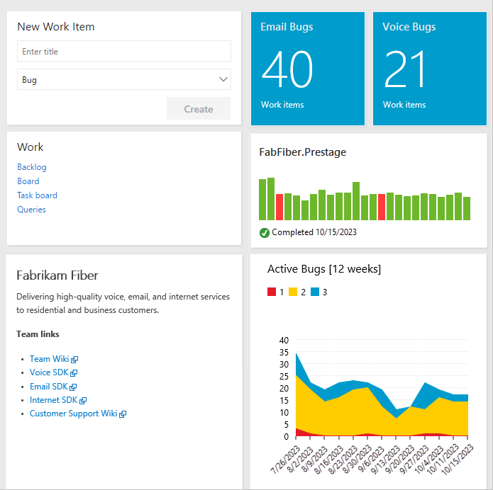

#### Sequence for adding and customizing a dashboard

<em>Click a box below to open the corresponding article.</em> 

[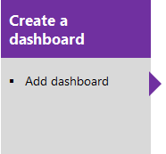](dashboards.md) 

::: moniker-end

## Charts: Work tracking status and trends 

With flat-list queries, you can create various charts to monitor status, progress, and trends. Prior to monitoring work progress and trends, you'll need to have [planned your project and made progress on work you're tracking](../../boards/backlogs/create-your-backlog.md). 

You can open a shared query, create a chart and add it to the dashboard. Once it's been added to the dashboard, you can change the **Chart for work items** widget configuration to resize or change the chart parameters. Or, from the dashboard, you can add a **Chart for work items** widget and choose a shared query and set the chart parameters. Chart types include status&mdash;pie, bar, column, stacked bar, and pivot&mdash;and trend&mdash;stacked area, line, and area&mdash;charts. 

For details, see: 
- [Define a query](../../boards/queries/using-queries.md)
- [Track progress with status and trend query-based charts](charts.md)  

**Sample Agile tool light-weight charts**   

::: moniker range=">= azure-devops-2019"

> [!div class="mx-imgBorder"]  
>    

::: moniker-end

::: moniker range="<= tfs-2018"

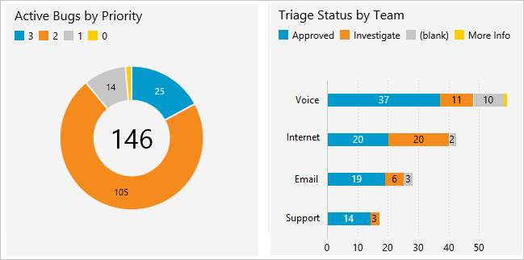   

::: moniker-end

**Sequence for adding query-based charts to a dashboard**  

<em>Click a box below to open the corresponding article.</em> 

[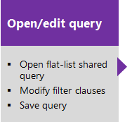](../../boards/queries/using-queries.md)[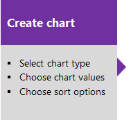](charts.md)   

## Charts: Manual testing progress, results, and trends  

The steps to creating charts that track manual testing progress and results are similar to those for tracking work. The starting point, however, begins with the test plan rather than a query. For example, you can find out how many test cases are ready to run, or how many tests are passing and failing in each test suite. And, just like work item query-based charts, you can add these charts to a dashboard. 
 
For details, see: 
- [Create test plans and test suites](../../test/create-a-test-plan.md)
- [Create manual test cases](../../test/create-test-cases.md)
- [Track test status charts](../../test/track-test-status.md#charts) 

**Sample light-weight test charts** 
  
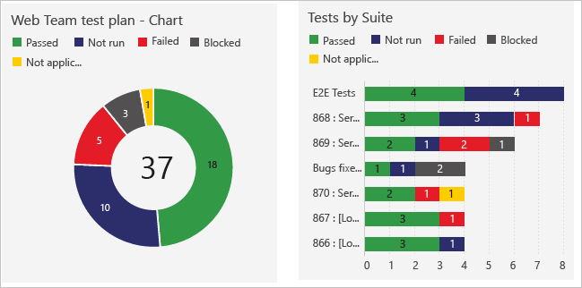

 

::: moniker range=">= tfs-2015"

## Widgets 

You add widgets to a dashboard to display a chart, information, or set of links. Most widgets are configurable. For a description of each supported widget for your platform and version, see the [Widget catalog](widget-catalog.md). Here are the widgets that support the indicated service. 

::: moniker-end 

[!INCLUDE [temp](../includes/widgets-oob.md)]

::: moniker range="tfs-2015"

---
:::row:::
   :::column span="1":::
      **Work**
      - [Chart for work items](widget-catalog.md#chart-wit-widget)  
      - [New Work item](widget-catalog.md#new-work-item-widget)  
      - [Query results](widget-catalog.md#query-results-widget)  
      - [Query tile](widget-catalog.md#query-tile-widget)  
      - [Sprint burndown](widget-catalog.md#sprint-burndown-widget)  
      - [Sprint capacity](widget-catalog.md#sprint-capacity-widget)  
      - [Sprint overview](widget-catalog.md#sprint-overview-widget)  
      - [Work links](widget-catalog.md#work-links-widget)  
      ---
      **Code** 
      - [Code tile](widget-catalog.md#code-tile-widget) 
      - [Pull request](widget-catalog.md#pull-request-widget) 
   :::column-end:::
   :::column span="1":::
      **Build**
      - [Chart for build history](widget-catalog.md#build-history-widget) 
      ---
      **Information and links**  
      - [Markdown](widget-catalog.md#markdown-widget)  
      - [Other links](widget-catalog.md#other-links-widget-2018)  
      - [Team members](widget-catalog.md#team-members-widget) 
      - [Team room](widget-catalog.md#team-room-widget)  
      - [Visual Studio Shortcuts](widget-catalog.md#visual-studio-widget) 
      - [Welcome](widget-catalog.md#how-to-widget) 
   :::column-end:::
:::row-end:::
---

::: moniker-end

::: moniker range=">= tfs-2015"

### Sprint chart widgets 

     

::: moniker-end

::: moniker range=">= azure-devops-2019"

### Sprint scope change

There is no chart or widget that tracks changes to sprint scope. However, you can determine work items added to a sprint or moved out of a sprint using the Query Editor. To learn how, see [About Sprints, Scrum and project management, Sprint scope change](../../boards/sprints/scrum-overview.md#sprint-scope-change). 

::: moniker-end

::: moniker range=">= azure-devops-2019"

### Sample Cumulative Flow Diagram widget 

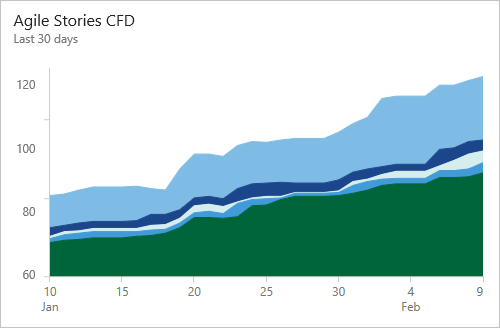   

::: moniker-end

::: moniker range=">= tfs-2015"

### Monitor code activity, build progress and deployment status

With the code tile widgets, you can monitor the activity occurring within a repository or branch folder. Build history displays a histogram of all builds run for a specific build pipeline. Bar color indicates: green-completed, red-failed, and yellow-completed without tests. 

**Code, build, and release chart widgets**  

&nbsp;&nbsp;&nbsp;  
&nbsp;&nbsp;&nbsp;&nbsp;  

::: moniker-end

::: moniker range=">= azure-devops-2019"

### Analytics widgets and reports 

::: moniker-end

::: moniker range=">= azure-devops-2020"

The Analytics service is the reporting platform for Azure DevOps. As described in [What is the Analytics service?](../powerbi/what-is-analytics.md), it replaces the previous platform based on SQL Server Reporting Services. The Analytics service supports Analytics widgets, [in-context Analytics reports](#work-tracking-analytics), and [Analytics views for Power BI reporting](../powerbi/what-are-analytics-views.md). 

::: moniker-end

::: moniker range="azure-devops-2019"

The Analytics service is the reporting platform for Azure DevOps. As described in [What is the Analytics service?](../powerbi/what-is-analytics.md), it replaces the previous platform based on SQL Server Reporting Services. The Analytics service supports Analytics widgets and [Analytics views for Power BI reporting](../powerbi/what-are-analytics-views.md). 

> [!NOTE]   
> Analytics is in preview for Azure DevOps Server 2019 and generally available for Azure DevOps Server 2020 and later versions.  

::: moniker-end

::: moniker range=">= azure-devops-2019"

**Sample Lead time widget**

 

To learn more, see the following articles: 
- [Widgets based on Analytics](../dashboards/analytics-widgets.md)  
- [Add an Analytics widget to a dashboard](../dashboards/add-widget-to-dashboard.md#add-analytics-widget)  

::: moniker-end

 

<a id="work-tracking-analytics" />

## In-context reports: Work tracking 

::: moniker range=">= azure-devops-2020"

Azure Boards provides several in-context reports that derive from Analytics data. From your backlog or board, you can view the Cumulative Flow Diagram and team Velocity reports by selecting the **Analytics** tab. Each report provides interactive controls to provide each user the view of interest to them. From a Sprint backlog, you can view the sprint burndown trend. 

### Cumulative Flow Diagram 

Use the interactive controls to choose the time frame, swimlanes, and workflow states or Kanban board columns.

> [!div class="mx-imgBorder"]  
> 

### Velocity 
Use the interactive controls to choose the count or sum field and number of iterations. 

> [!div class="mx-imgBorder"]  
> 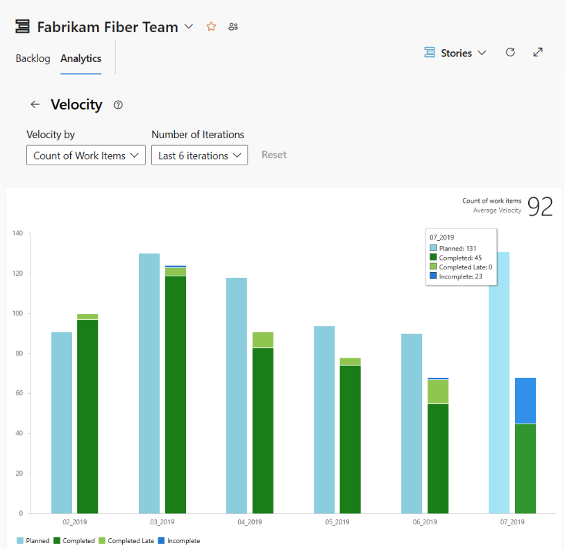

### Sprint Burndown Trend 

Use the interactive controls to choose the start and end of the sprint and count or sum field to use in the burndown. If you don't track Remaining Work in tasks, you can view burndown based on a count of work items/tasks. 

> [!div class="mx-imgBorder"]  
> 

::: moniker-end

::: moniker range="<= azure-devops-2019"

Azure Boards provides several in-context reports that derive from the work tracking data store. From your backlog or board, you can view the Cumulative Flow Diagram and team Velocity reports by choosing the miniature charts that appear on each page. From a Sprint backlog, you can view the sprint burndown.  

### Cumulative Flow Diagram 

The CFD report shows the count of work items in the backlog based on their state over time.  

> [!div class="mx-imgBorder"]  
> 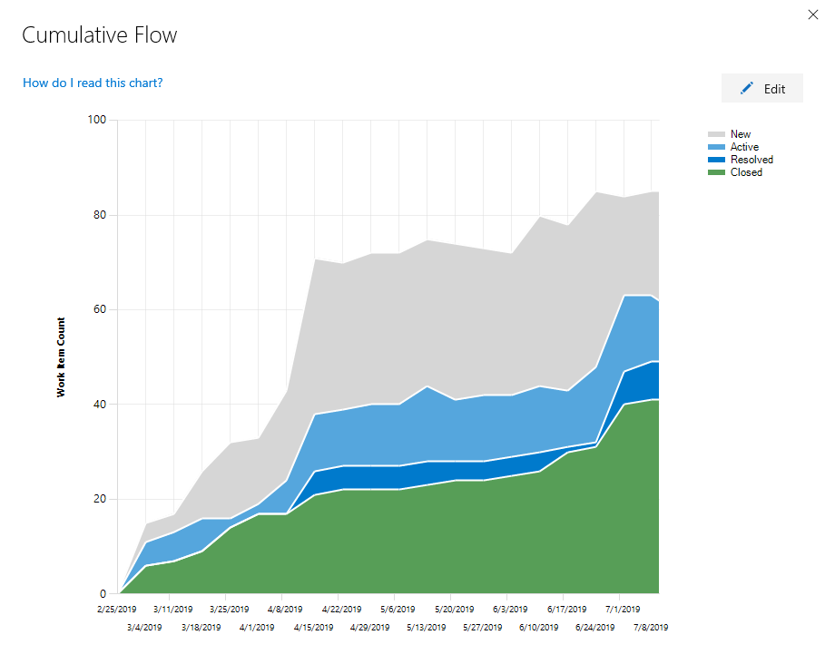

### Velocity 

Velocity is based on the values entered for Effort, Story Points, or Size fields for work items that belong to the Requirement Category. 

  

### Sprint burndown  

Each sprint provides access to two charts. The first [tracks capacity](../../boards/sprints/define-sprints.md) for the team, team activities&mdash;such as Development, Test, Design&mdash;and individual team members. The second tracks the [sprint burndown](configure-sprint-burndown.md) in terms of remaining work. 

| Capacity bars | Burndown  |
|-------| ----- |
| |   |

::: moniker-end

::: moniker range=">= azure-devops-2020"

> [!NOTE]
> You can add the in-context reports to a dashboard using the copy to dashboard option from the report's context menu. 
> 
>   
::: moniker-end 

::: moniker range="<= azure-devops-2019"

> [!NOTE]
> You can't add the in-context reports to a dashboard. However, you may find a comparable widget listed in the [widget catalog](widget-catalog.md) that tracks the same or similar data which you can add to the dashboard. 
::: moniker-end 

To learn more about these reports, see one of the following articles:
- [Cumulative flow](cumulative-flow.md)
- [Team velocity](team-velocity.md)
- [View/configure sprint burndown](configure-sprint-burndown.md)  

<a id="incontext-reports" />  

::: moniker range=">= azure-devops-2019"

## In-context reports: Pipelines and Test 

Several in-context reports are provided for Azure Pipelines. These reports derive from Analytics data. Open a pipeline (or release summary for Test failure) to view the reports and select the **Analytics** tab. Choose **View full report** on a summary card for a detailed report.

> [!div class="mx-imgBorder"]
> 

::: moniker-end

::: moniker range=">= azure-devops-2019"
For more information on each in-context Analytics report for pipeline runs, see the following: 
::: moniker-end
::: moniker range="azure-devops"
- [Historical graph for agent pools (Preview)](../../pipelines/agents/pool-consumption-report.md) 
- [Pipeline pass rate report](../../pipelines/reports/pipelinereport.md#pipeline-pass-rate-report)
- [Test pass rate report](../../pipelines/reports/pipelinereport.md#test-failures-report)
- [Pipeline duration report](../../pipelines/reports/pipelinereport.md#pipeline-duration-report)
- [Test analytics for builds](../../pipelines/test/test-analytics.md)
- [Test analytics for releases](../../pipelines/test/test-analytics.md)

::: moniker-end
 
::: moniker range="azure-devops-2020"
- [Pipeline pass rate report](../../pipelines/reports/pipelinereport.md#pipeline-pass-rate-report)
- [Test pass rate report](../../pipelines/reports/pipelinereport.md#test-failures-report)
- [Pipeline duration report](../../pipelines/reports/pipelinereport.md#pipeline-duration-report)
- [Test analytics for builds](../../pipelines/test/test-analytics.md)
- [Test analytics for releases](../../pipelines/test/test-analytics.md)
::: moniker-end

::: moniker range="azure-devops-2019"
- [Test failures report](../../pipelines/reports/pipelinereport.md#test-failures-report)
::: moniker-end

::: moniker range=">= azure-devops-2020"
In addition, you can use Power BI and OData to create reports based on pipeline and test data. For details, see [Overview of sample reports using OData queries](../powerbi/sample-odata-overview.md)
::: moniker-end

::: moniker range="azure-devops-2019"

## In-context reports: Pipeline Test Failures

Azure Pipelines provides an in-context Test failures report, derived from Analytics data. Open a release summary to view the report and select the **Analytics** tab. Select the summarized card for a detailed report.

> [!div class="mx-imgBorder"]
> 

::: moniker-end

::: moniker range=">= azure-devops-2020"

### Pipeline pass rate report

The **Pipeline pass rate** report provides a trend of pipeline failure and task failure of the pipeline. You can view the pass rate of the pipeline over a configurable period of time (7/14/30 days). You can view additional details in **Task failure details**, which not only highlights the trend, but also list the top failing tasks.

> [!div class="mx-imgBorder"]
> 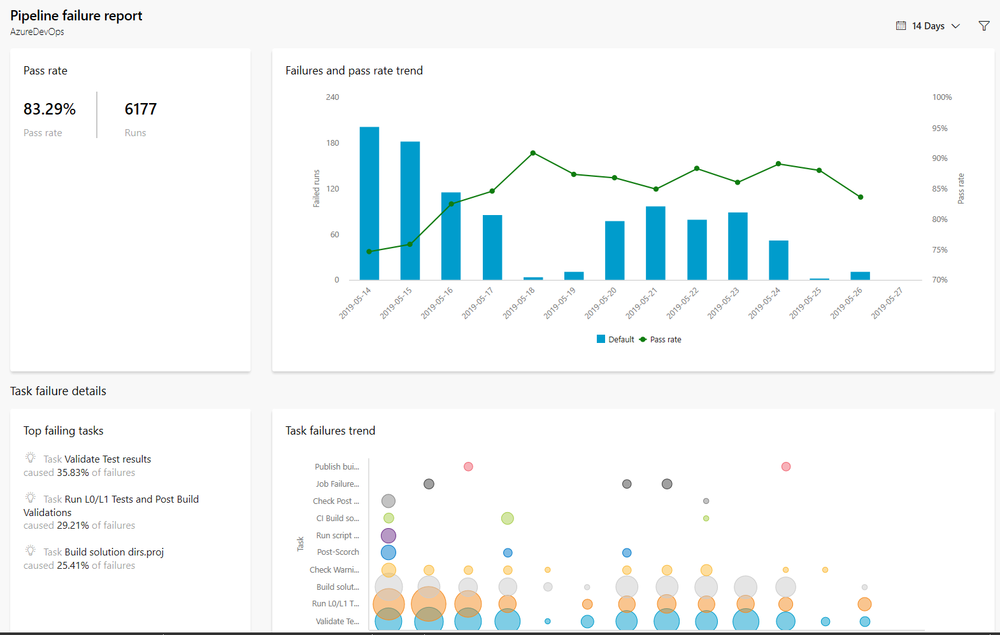

Learn more about the [Pipeline pass rate report](../../pipelines/reports/pipelinereport.md#pipeline-pass-rate-report).

::: moniker-end

### Test failures report

The **Test failures** report provides a granular view of the top failing tests in the pipeline, along with the failure details. Summary charts are also provided for builds that indicate code coverage and test failures or success. 

> [!div class="mx-imgBorder"]
> 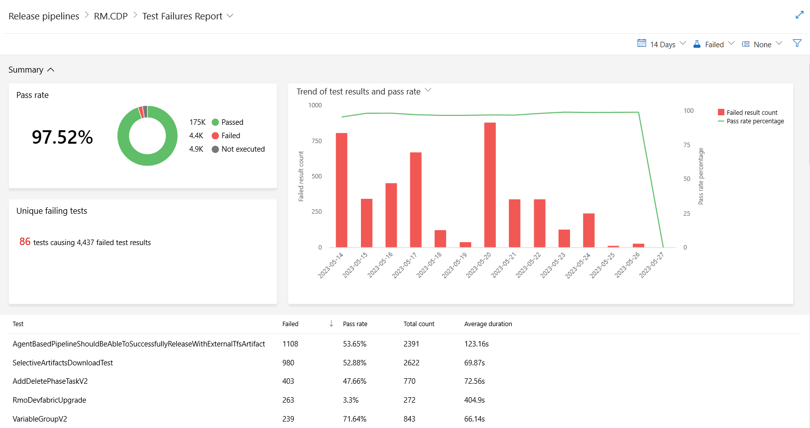

Learn more about the [Test failures report](../../pipelines/test/test-analytics.md#test-failures).

::: moniker range=">= azure-devops-2020"

### Pipeline duration report

The **Pipeline duration** report provides the duration trend of a pipeline. It also highlights the average run time of the total successful runs over a period of time (7/14/30 days) and provides insights on the tasks which have impacted the duration of the pipeline. 

> [!div class="mx-imgBorder"]
> 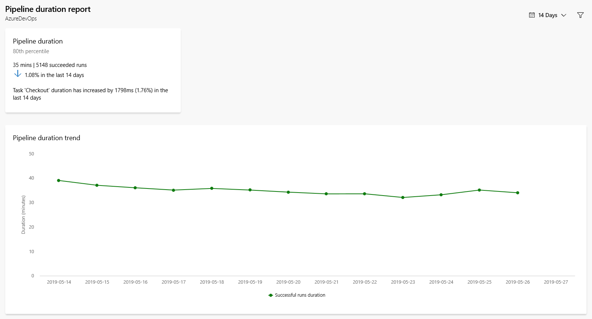

Learn more about the [Pipeline duration report](../../pipelines/reports/pipelinereport.md#pipeline-duration-report).

::: moniker-end

## Add custom work tracking fields

::: moniker range="azure-devops"

You can add data to support reporting requirements by [adding a custom field](../../organizations/settings/work/customize-process-field.md).   
::: moniker-end

::: moniker range=">= azure-devops-2019 < azure-devops"

You can add data to support reporting requirements by adding a custom field [Inheritance process](../../organizations/settings/work/customize-process-field.md) or [On-premises XML process](../../reference/add-modify-field.md).
::: moniker-end

::: moniker range="<= tfs-2018"

You can add data to support reporting requirements by [adding a custom field](../../reference/add-modify-field.md).  
::: moniker-end

::: moniker range=">= tfs-2015"

## Marketplace widgets and extensibility

In addition to the widgets available to your from the widget catalog, you may find additional widgets of interest from the [Marketplace](https://marketplace.visualstudio.com/search?term=webpage%20widget&target=VSTS&sortBy=Relevance).  

Or, you can [create your own widget using the REST API](../../extend/develop/add-dashboard-widget.md). 

::: moniker-end

::: moniker range=">= tfs-2015"

## Try this next

> [!div class="nextstepaction"]
> [Add a widget to a dashboard](add-widget-to-dashboard.md) 
> or
> [Review available widgets](widget-catalog.md) 

::: moniker-end

## Related articles

- [Cross-service integration and collaboration overview](../../cross-service/cross-service-overview.md)

[excel-adhoc-query-report]: ../create-status-and-trend-excel-reports.md
[add-a-team]: ../../organizations/settings/add-teams.md
[team-assets]: ../../organizations/settings/manage-teams.md
[add-team-members]: ../../organizations/settings/add-teams.md#add-team-members
[add-team-admin]: ../../organizations/settings/add-team-administrator.md
   

