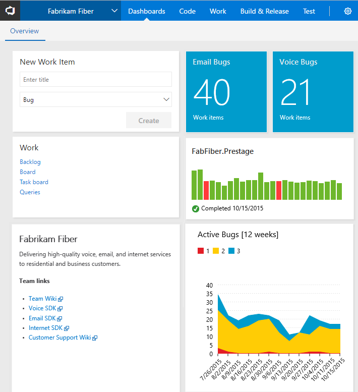
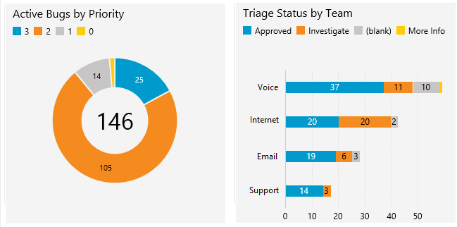
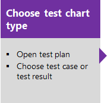
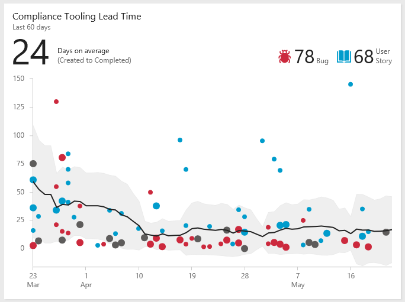

# About dashboards, charts, reports, and widgets   
[!INCLUDE [temp](../_shared/version-azure-devops-all.md)]

Customizable, highly-configurable dashboards provide you and your teams with the flexibility to share information, monitor progress and trends, and improve your workflow processes. 

## Key concepts

::: moniker range="azure-devops"

- <strong>Dashboards</strong> are customizable interactive signboards that provide real-time information. Dashboards are associated with a team and display configurable charts and widgets to show information.
- <strong>Charts</strong> are query-based status or trend charts derived from a work item query or test results.
- <strong>Widgets</strong> display configurable information and charts on dashboards. The widget catalog provides brief descriptions of those widgets available to you. In addition, you can add widgets provided through the [Azure DevOps Marketplace](https://marketplace.visualstudio.com/azuredevops). 
- <strong>In context charts and reports</strong> are system-generated charts that support specific services. Examples are team velocity, sprint burndown, and the Cumulative Flow Diagram (CFD), and the Test Failures Report. 
- <strong>Power BI reports</strong> allow users to create rich, customized Power BI reports or other reports using OData queries of the Analytics service and the returned JSON data.  

::: moniker-end  

::: moniker range="azure-devops-2019"

- <strong>Dashboards</strong> are customizable interactive signboards that provide real-time information. Dashboards are associated with a team and display configurable charts and widgets to show information.
- <strong>Charts</strong> are query-based status or trend charts derived from a work item query or test results. 
- <strong>In context charts and reports</strong> are system-generated charts that support specific services. Examples are team velocity, sprint burndown, and the Cumulative Flow Diagram (CFD), and the Test Failures Report. 
- <strong>Widgets</strong> display configurable information and charts on dashboards. The widget catalog provides brief descriptions of those widgets available to you. In addition, you can add widgets provided through the [Azure DevOps Marketplace](https://marketplace.visualstudio.com/azuredevops).
- <strong>Reports</strong>
	- <strong>Power BI reports</strong>: For project collections that support the Inherited process, allow users to create rich, customized Power BI reports or other reports using OData queries of the Analytics service and the returned JSON data.  
	- <strong>SQL Server reports</strong>: For project collections that support the On-premises XML process model, allow users access to out-of-the-box SQL Server reports as well as support to create customized SQL Reports or Excel reports. This requires that the project is [configured to support SQL Server reporting](../admin/add-a-report-server.md).

::: moniker-end  

::: moniker range=">=tfs-2015 <= tfs-2018"

- <strong>Dashboards</strong> are customizable interactive signboards that provide real-time information. Dashboards are associated with a team and display configurable charts and widgets to show information.
- <strong>Charts</strong> are query-based status or trend charts derived from a work item query or test results. 
- <strong>Widgets</strong> display configurable information and charts on dashboards. The widget catalog provides brief descriptions of those widgets available to you. In addition, you can add widgets provided through the [Azure DevOps Marketplace](https://marketplace.visualstudio.com/azuredevops).
- <strong>In context charts** are system-generated charts that support specific services. Examples are team velocity, sprint burndown, and the Cumulative Flow Diagram (CFD). 
- <strong>Reports</strong> correspond to out-of-the-box SQL Server reports as well as support to create customized SQL Reports or Excel reports. This requires that the project is [configured to support SQL Server reporting](../admin/add-a-report-server.md).

::: moniker-end  

::: moniker range="tfs-2013"
- <strong>Dashboards</strong> are customizable interactive signboards that provide real-time information. Dashboards are associated with a team and display configurable charts that you pin to the dashboard.
- <strong>Charts</strong> are query-based status or trend charts derived from a work item query or test results. 
- <strong>In context charts</strong> are system-generated charts that support specific services. Examples are team velocity, sprint burndown, and the Cumulative Flow Diagram (CFD). 
- <strong>Reports</strong> correspond to out-of-the-box SQL Server reports as well as support to create customized SQL Reports or Excel reports. This requires that the project is [configured to support SQL Server reporting](../admin/add-a-report-server.md).

::: moniker-end  

::: moniker range=">= tfs-2015"

## Configurable dashboards

With dashboards, you can configure an array of charts and widgets. 

Each team can [add and configure multiple dashboards](dashboards.md) to share information, view status, progress, and trends, and access quick links and other functions. Easily add and rearrange widgets on the dashboard to show recent changes made to view build status, bug trends, and more. 

#### Sequence for adding and customizing a dashboard

<em>Click a box below to open the corresponding article.</em> 

 

::: moniker-end

## Charts: Work tracking status and trends

With flat-list queries, you can create various charts to monitor status, progress, and trends. To get started, you can open a shared query and create a chart based on your tracking interests. Chart types include status&mdash;pie, bar, column, stacked bar, and pivot&mdash;and trend&mdash;stacked area, line, and area&mdash;charts.   

### Sample Agile tool light-weight charts   

::: moniker range=">= azure-devops-2019"

> [!div class="mx-imgBorder"]  
>    

::: moniker-end

::: moniker range="<= tfs-2018"

   

::: moniker-end

#### Sequence for adding query-based charts to a dashboard  

<em>Click a box below to open the corresponding article.</em> 

   

Prior to monitoring work progress and trends, you'll need to have [planned your project and made progress on work you're tracking](../../boards/backlogs/create-your-backlog.md). 

## Charts: Manual testing progress, results, and trends  
The steps to creating charts that track manual testing progress and results are similar to those for tracking work. The starting point, however, begins with the test plan rather than a query. For example, you can find out how many test cases are ready to run, or how many tests are passing and failing in each test suite. 

### Sample light-weight test charts 
  

And, just like work item query-based charts, you can add these charts to a dashboard.  

**Sequence for adding test progress and result charts to a dashboard**  

::: moniker range=">= tfs-2015"

## Widgets 

You add widgets to a dashboard to display a chart, information, or set of links. Most widgets are configurable. For a description of each supported widget for your platform and version, see the [Widget catalog](widget-catalog.md). 

### Sprint chart widgets 
      

### Sample Cumulative Flow Diagram widget 

   

::: moniker-end

::: moniker range=">= tfs-2015"

### Monitor code activity, build progress and deployment status

With the code tile widgets, you can monitor the activity occurring within a repo or branch folder. Build history displays a histogram of all builds run for a specific build pipeline. Bar color indicates: green-completed, red-failed, and yellow-completed without tests. 

**Code, build, and release chart widgets**  

&nbsp;&nbsp;&nbsp;  
&nbsp;&nbsp;&nbsp;&nbsp;  

::: moniker-end

::: moniker range="azure-devops"

### Analytics widgets

Analytics widgets provide rich data based on the Analytics service. The Analytics Service is available to all organizations using Azure DevOps Services. 

#### Sample Lead time widget 

 

To learn more, see the following articles: 
- [What is the Analytics Service?](../powerbi/what-is-analytics.md)
- [Widgets based on the Analytics Service](../dashboards/analytics-widgets.md)
::: moniker-end

::: moniker range="azure-devops-2019"
### The Analytics Service and Analytics widgets
The Analytics Service is in preview for Azure DevOps Server 2019. 

#### Sample Lead time widget 

 

To learn more, see the following articles: 
- [Widgets based on the Analytics Service](../dashboards/analytics-widgets.md)  
-  [Add an Analytics widget to a dashboard](../dashboards/add-widget-to-dashboard.md#add-analytics-widget)  
- [What is the Analytics Service?](../powerbi/what-is-analytics.md)  

::: moniker-end

::: moniker range=">= tfs-2015"
### Marketplace widgets

In addition to the widgets available to your from the widget catalog, you may find additional widgets of interest from the [Marketplace](https://marketplace.visualstudio.com/search?term=webpage%20widget&target=VSTS&sortBy=Relevance).  

Or, you can [create your own widget using the REST API](../../extend/develop/add-dashboard-widget.md). 

::: moniker-end

## In-context charts: Work tracking 

There are a number of system-generated charts that you can access from the web portal, but can't add to a dashboard. However, you may find a comparable widget listed in the [widget catalog](widget-catalog.md) that tracks the same or similar data which you can add to the dashboard. These include: 

- [Cumulative flow](cumulative-flow.md)
- [Team velocity](team-velocity.md)
- [Sprint burndown chart](../../boards/sprints/sprint-burndown.md)  

### Sprint charts 
Each sprint provides access to two charts. The first [tracks capacity](../../boards/sprints/define-sprints.md) for the team, team activities&mdash;such as Development, Test, Design&mdash;and individual team members. The second tracks the [sprint burndown](../../boards/sprints/sprint-burndown.md) in terms of remaining work. 

| Capacity bars | Burndown  |
|-------| ----- |
| |   |

::: moniker range=">= azure-devops-2019"

## In-context charts and reports: Pipeline Failures and Test Failures

Two in-context reports provided are the Pipeline Failures and Test Failures reports. These reports derive from the Analytics Service. Open a build or release summary to view the top failing tests report. This report provides a granular view of the top failing tests in the pipeline, along with the failure details. For details, see [Analyze test results](../../pipelines/test/test-analytics.md).

Summary charts are also provided for builds that indicate code coverage and test failures or success. 

::: moniker-end

::: moniker range=">= tfs-2015"

## Try this next

> [!div class="nextstepaction"]
> [Add a widget to a dashboard](add-widget-to-dashboard.md) 
> or
> [Review available widgets](widget-catalog.md) 

::: moniker-end

### Add custom work tracking fields
::: moniker range="azure-devops"

You can add data to support reporting requirements by [adding a custom field](../../organizations/settings/work/customize-process-field.md).   
::: moniker-end

::: moniker range="azure-devops-2019"

You can add data to support reporting requirements by adding a custom field [Inheritance process](../../organizations/settings/work/customize-process-field.md) or [On-premises XML process](../../reference/add-modify-field.md).
::: moniker-end

::: moniker range="<= tfs-2018"

You can add data to support reporting requirements by [adding a custom field](../../reference/add-modify-field.md).  
::: moniker-end

::: moniker range=">= tfs-2015"

### Extensibility 

Using the REST API service, you can [create a custom widget](../../extend/develop/add-dashboard-widget.md). 

::: moniker-end

[excel-adhoc-query-report]: ../excel/create-status-and-trend-excel-reports.md
[add-a-team]: ../../organizations/settings/add-teams.md
[team-assets]: ../../organizations/settings/manage-teams.md
[add-team-members]: ../../organizations/settings/add-teams.md#add-team-members
[add-team-admin]: ../../organizations/settings/add-team-administrator.md
   

