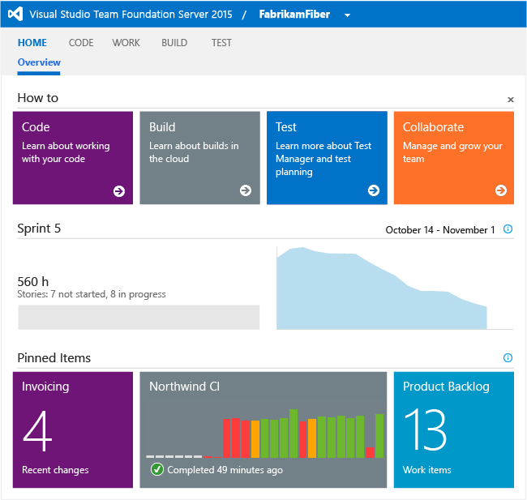
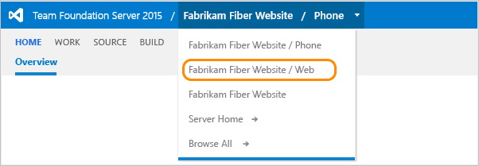

# Pin items to a team dashboard

<b>TFS 2015 | TFS 2013</b>  

> [!NOTE]  
> **Feature availability:** For on-premises TFS, install TFS 2015 Update 1 to get access to [multiple team dashboards](dashboards.md) and [widgets](widget-catalog.md) that you can add to these dashboards.   

Teams can view the progress of work from the team home page. Team administrators can add or pin items to this dashboard and re-sequence tiles. Each tile provides team members quick access to work items, build progress, code changes, and more.

From the web portal, you can view pinned items on the home page, including flat-list query charts.

If you need to add a team first, see [Add teams](../../organizations/settings/add-teams.md).

## Pin items to a dashboard 

You pin an item to the team dashboard from the code, work, and build pages.

1.  If you aren't a team administrator, [get added as one](../../organizations/settings/manage-teams.md).  

2.	Pin a work item query from its context menu.

	  

	To add a source control folder or a build pipeline, open the corresponding page and access the pin feature in the same way.    

3.	To pin a chart, go to the query's Charts page and pin it to your selected dashboard or the team homepage.  

	

4.	Drag tiles to reorder their sequence on the dashboard.    

	Using Internet Explorer 10 or Internet Explorer 11, you can also tab to a tile and press Shift+L or Shift+R to move the selected tile to the left or to the right.

5.	Choose a tile or link to open it. 

###Remove an item or chart from your dashboard 

Choose the ellipses for any tile to remove it from a dashboard. 

![From a dashboard tile, choose the tile ellipses and select remove]](_img/add-a-dashboard-remove-tile.png)

Either choose the context menu for the item that you want to remove and select Unpin from the home page, or drag it from the Team favorites section.  

   

##Related notes

- [Define queries](../../boards/queries/using-queries.md) 
- [Define builds](../../pipelines/overview.md) 
- [Test charts](../../test/track-test-status.md) 

###Switch team context  
 
You navigate to your team context from the top navigation bar.   

  
