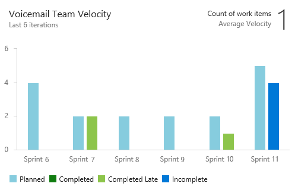
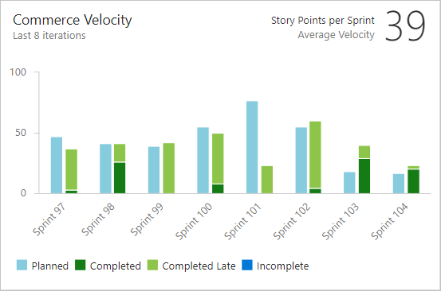

# Configure the Velocity widget 

[!INCLUDE [temp](../_shared/version-azure-devops.md)]

Teams track their velocity to help them determine how much work they can perform sprint-over-sprint. Velocity provides an indication of how much work a team can complete during a sprint based either on a count of work items completed or the sum of estimates made to Effort (PBIs), Story Points (user stories), or Size (requirements). 

**Example: Velocity widget showing six sprints of velocity**  
 

> [!NOTE]
> The Velocity widget is based on the Analytics Service. The Analytics Service is generally available for Azure DevOps Services and in preview as an extension for Azure DevOps Server 2019. For TFS 2018 and earlier versions, you have access to the [velocity chart provided by the work tracking datastore](velocity-chart-data-store.md).

Use this article to learn: 

> [!div class="checklist"]
> * How to configure the Velocity widget 
> * Required and recommended team activities to support velocity tracking      

Once your team has completed a few sprints, they can use their velocity to [forecast](../../boards/sprints/forecast.md) how much of the backlog they can finish within upcoming sprints. For usage guidance, see [Velocity metrics and usage guidance](velocity-guidance.md).

There are two velocity charts, the one you access by adding the Velocity widget to a dashboard, and the one [viewed from the backlog of a team](velocity-chart-data-store.md). The Velocity widget enables you to view more sprints and additional information than that provided by the velocity chart.   
 
[!INCLUDE [temp](../_shared/analytics-widgets-prerequisites.md)]

## Add the widget to your dashboard   

::: moniker range="azure-devops"
0. If you haven't yet [added the Velocity widget to your dashboard](../add-widget-to-dashboard.md), do that now.  

::: moniker-end

::: moniker range="azure-devops-2019"
0. If you haven't yet added the [Analytics Marketplace extension](../dashboards/analytics-extension.md), do that now.  
0. If you haven't yet [added the Velocity widget to your dashboard](../add-widget-to-dashboard.md), do that now.  

::: moniker-end

## Configure the Velocity widget    

You configure your velocity widget for a single team. If you want to view the velocity for several teams, then you must configure a portfolio management team which rolls up from several teams. To learn more about teams, see [Add teams](../../organizations/settings/add-teams.md).  

0. Choose the  actions icon and choose the Configure option to open the configuration dialog. 
	
	Modify the title, select the team, and then choose either the backlog level or work item type to track. Select whether you want to track a count of work items or a sum of a numeric field. The most common summed field is that of Effort, Story Points, or Size.     

	    

0. Specify the number of sprints you want to view. The default is 6 and the maximum is 15.    

0. (Optional) Select the check boxes to show additional information for work completed later than planned for each sprint. 

	**Displayed planned work for iterations:** Check this box to
	display the amount of work planned for an iteration at the start of the iteration. 
	This is useful for comparing your planned work to actual deliverables.
	By default, the count of planned work begins as of the start date of the iteration.   
	
	- <b><i>Days past start date of iteration when planned work is final:</i></b>  Specify a number of days past the start date to count planned work. For example, if the first 2 days of an iteration are for planning, then you can enter "3", and planned work will be counted on the 3rd day. 
	
		For example, if the Iteration starts on 01/01/2018, and 3 backlog items are assigned to the iteration on 01/01/2018 end-of-day, then those 3 backlog item items will be considered as Planned. If your team doesn't complete planning until a few days into the iteration, then you can update the Days past start date of iteration when planned work is final.  

	> [!NOTE]
	> Work is considered Planned if it is assigned to the iteration as-of the Iteration Start Date.   

	

	**Highlight work completed late:** Work items marked complete after the iteration end date are considered to be completed late and will show as light green. 
	This is useful for spotting a trend where work items are marked complete after the iteration is complete.

	- <b><i>Days past end date of iteration after which work is late:</i></b>  Specify a number of days past which a work item is considered late if it's status is still new or in progress.  

		For example, entering 3 days will give the team 3 days after the end of an iteration to mark work items complete or done, before they are considered late.

	> [!NOTE]  
	> A work item is considered late when the work item's Completed Date is later than End Date of the Iteration the work item is _currently_ assigned to.
	> 
	> It will take into account the value you enter for <i>Days past end date of iteration after which work is late<i>.  

0. Choose **Save** when done. The following image shows Velocity based on Story Points and 8 sprints of data. 
   
	  

[!INCLUDE [temp](../_shared/velocity-activities.md)] 

[!INCLUDE [temp](../_shared/add-teams.md)] 

## Try this next

> [!div class="nextstepaction"]
> [Velocity guidance](velocity-guidance.md)
