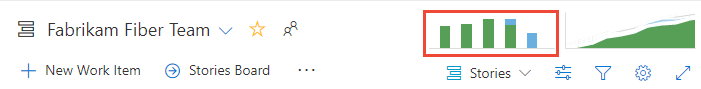
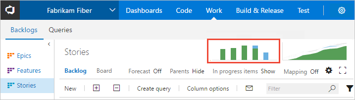

# View and configure team velocity

[!INCLUDE [version-lt-eq-azure-devops](../../includes/version-lt-eq-azure-devops.md)]

Velocity metrics provide useful information, so teams can plan and [forecast](../../boards/sprints/forecast.md) sprints and determine how well they estimate and meet planned commitments. You can get an indication of how much work a team can complete during a sprint based on either **a count of work items completed** or **the sum of estimates made** for effort (product backlog items), story points (user stories), or size (requirements). Use velocity as an aid to determine team capacity and don't confuse it with key performance indicators.  

In this article, learn how to do the following tasks: 

::: moniker range=">= azure-devops-2019"

> [!div class="checklist"] 
> * Open your backlog from the web portal
> * View the velocity chart types
> * View the Velocity in-context report
> * Configure the Velocity widget
> * Support velocity tracking with required and recommended team activities  

::: moniker-end

::: moniker range="tfs-2018" 

> [!div class="checklist"] 
> * Open your backlog from the web portal
> * View the velocity chart types
> * View the Velocity in-context report (work tracking data store) 
> * Support velocity tracking with required and recommended team activities  

::: moniker-end

::: moniker range=">= azure-devops-2019"

## Prerequisites  

::: moniker-end

[!INCLUDE [temp](../includes/analytics-widgets-prerequisites.md)]
- Be aware of the [required and recommended tasks](#required-and-recommended-tasks), listed later in this article.

> [!TIP]
> The images you see from your web portal may differ from the images you see in this article. These differences result from updates made to your web app, options that you or your admin have enabled, and which process was chosen when creating your project—Agile, Basic, Scrum, or CMMI. The Basic process is available with Azure DevOps Server 2019 Update 1 and later versions.

::: moniker range=">= azure-devops-2019"

## Velocity chart types

::: moniker-end

::: moniker range=">= azure-devops-2020"

You have a choice of Velocity charts: the in-context Velocity chart you access from a Backlogs page and the Velocity widget you add to a dashboard. With both these charts, you can quickly determine the information in the following table, which describes the available workflow state categories and their descriptions.

<a id="state-descriptions-table"></a>

Items assigned to a *Proposed* or *Resolved* aren't included in any of the calculations for **Completed**, **Completed Late**, or **Incomplete**. For more information, see [How workflow category states are used in Azure Boards](../../boards/work-items/workflow-and-state-categories.md). The selections you make are only set for you, and persist across sessions until you change them.

|Workflow State  |Description |
|---------|---------|
|Planned    | Calculated based on the number of work items assigned to the sprint before the start of the sprint. If a work item is assigned to the sprint before the start of the sprint, and then assigned to another sprint after the start of the original sprint, it shows as Planned in the original sprint, and then Completed/Completed, Late/Incomplete in the new sprint it's assigned to.     |
|Completed  | Calculated based on the number of work items assigned to the sprint before or after the start of the sprint and completed before the end of the sprint.        |
|Completed Late     |Calculated based on the number of work items assigned to the sprint before or after the start of the sprint but completed after the end of the sprint.          |
|Incomplete    | Calculated based on the number of work items assigned to the sprint before or after the start of the sprint and not yet completed.        |  

Later in this article, learn how to [open the Velocity in-context report](#view-the-velocity-in-context-report) or [add the Velocity widget to a dashboard](#add-the-velocity-widget-to-your-dashboard).

#### [In-context Velocity chart](#tab/in-context)


#### [Velocity widget](#tab/widget)

 

***

You can configure each chart in the following ways: 
- Sum of [Effort, Story Points, or Size fields](../../boards/queries/query-numeric.md) or other supported numeric field assigned to backlog items.
- Count of work items that appear on the backlog
- Number of iterations.   

The widget supports some more configuration options. To configure or view Velocity charts, see [Configure and view Velocity charts](team-velocity.md).
 
::: moniker-end

::: moniker range="azure-devops-2019"

You have a choice of Velocity charts: the in-context Velocity chart you access from a Backlogs page and the Velocity widget you add to a dashboard. With the Velocity widget, you can quickly determine the following information:  
- Planned velocity 
- Actual (completed) velocity 
- Work completed later than planned
- Amount of work not completed   

#### [In-context Velocity chart](#tab/in-context)


#### [Velocity widget](#tab/widget)

 

***

Both of these charts support visualizing team velocity for several sprints. The Velocity widget, however, supports the following configuration options: 
- Sum of [Effort, Story Points, or Size fields](../../boards/queries/query-numeric.md) or other supported numeric field assigned to backlog items.
- Count of work items that appear on the backlog
- Number of iterations   
- Advanced features.

::: moniker-end

::: moniker range="tfs-2018"

The in-context Velocity charts are based on the sum of [Effort, Story Points, or Size fields](../../boards/queries/query-numeric.md) assigned to backlog items. These charts are similar to the one shown in the following image. 

::: moniker-end

## Open your backlog from the web portal

::: moniker range=">= azure-devops-2020" 

1. Sign in to your organization (```https://dev.azure.com/{yourorganization}```) and go to your project.
2. Select **Boards** > **Backlogs**, and then select your **team** from the dropdown menu.

   :::image type="content" source="../../boards/boards/media/open-boards-backlog.png" alt-text="Screenshot that shows Open Boards, Backlogs, and select a team.":::

3. To view the in-context reports for the product backlog, check that you selected **Stories** for Agile, **Issues** for Basic, **Backlog items** for Scrum, or **Requirements** for CMMI as the backlog level.

   :::image type="content" source="../../boards/sprints/media/assign-items-sprint/select-product-backlog-agile-s155.png" alt-text="Screenshot that shows how to select product backlog level, Backlog items, Stories, or Requirements.":::

::: moniker-end

::: moniker range="azure-devops-2019"

1. Check that you selected the right project, and select **Boards** > **Backlogs**. Then select the correct team from the team selector menu. 

	

    To select another backlog, open the selector and then select a different team or select the :::image type="icon" source="../../media/icons/home-icon.png" border="false":::  **Browse all backlogs** option. Or, enter a keyword in the search box to filter the list of team backlogs for the project.

    > [!div class="mx-imgBorder"]  
    >  

2. To view the in-context reports for the product backlog, check that you selected **Stories** for Agile, **Issues** for Basic, **Backlog items** for Scrum, or **Requirements** for CMMI as the backlog level. 

    > [!div class="mx-imgBorder"]  
    >  

::: moniker-end

::: moniker range="tfs-2018"
From your web portal, open your team's product backlog and select the team from the project and team selector. Then select **Work** > **Backlogs**. Select the product backlog, which is **Backlog items** for Scrum, **Stories** for Agile, or **Requirements** for CMMI. 

> [!div class="mx-imgBorder"]
>  

To select another team, open the project and team selector. Select a different team, or select the **Browse** option. 

> [!div class="mx-imgBorder"]  
>  

::: moniker-end

<a id="velocity-chart">   </a>

## View the Velocity in-context report   

::: moniker range=">= azure-devops-2020" 

Velocity reports are available for each backlog level, both product and portfolio backlogs. Each report provides interactive controls to provide each user the view of interest to them.  

1. From the **Boards** > **Backlogs** screen, select **Analytics** to open the Velocity report for your product or portfolio backlog. 

   :::image type="content" source="media/cfd/analytics-summary-cfd-velocity.png" alt-text="Screenshot showing Backlogs, open Analytics.":::

2. To change to a different backlog, choose from the backlog selector, and then select **View full report** for Velocity.  

3. Use the interactive controls to select the count or sum field and number of iterations. Select **Custom iterations** to specify any number of iterations between 1 and 15. 
   
   If your team hasn't completed a sprint or if you're working on items before a sprint start date, there's no data to analyze and forecast. You might see this message: *Set iteration dates to use this widget*. To resolve this situation, set an iteration date range to include present date or wait for the sprint to start. 

	Hover over a column area to show a summary of planned and completed work items. For example, for the 07_2019 sprint, 131 items are planned.

   :::image type="content" source="media/velocity/analytics-velocity-azure-devops.png" alt-text="Screenshot of Velocity Analytics report.":::

   For more information, see the [workflow state descriptions](#state-descriptions-table) mentioned earlier in this article.

4. To add the report to a dashboard, select the :::image type="icon" source="media/icons/actions-icon.png" border="false"::: actions icon and select **Copy to Dashboard**.

   :::image type="content" source="media/add-charts/add-analytics-chart-abbreviated.png" alt-text="Screenshot of Analytics in-context report, Copy to dashboard option.":::
	
5. Select the dashboard and select **OK**.  

6. To return to the Analytics summary, select the :::image type="icon" source="../../media/icons/back-arrow.png" border="false"::: back arrow.

::: moniker-end

::: moniker range="azure-devops-2019"

1. From the web portal, open your product backlog.  

1. (1) Check that you've selected the right project, (2) select **Boards** > **Backlogs**, and then (3) select the correct team from the team selector menu. 

	

	To select another team, open the selector and select a different team or select the :::image type="icon" source="../../media/icons/home-icon.png" border="false"::: **Browse all backlogs** option. Or, you can enter a keyword in the search box to filter the list of team backlogs for the project.

	> [!div class="mx-imgBorder"]
	>  

	> [!TIP]    
	> Select the :::image type="icon" source="../../media/icons/icon-favorite-star.png" border="false"::: star icon to favorite a team backlog. Favorited artifacts (:::image type="icon" source="../../media/icons/icon-favorited.png" border="false"::: favorited icon) appear at the top of the team selector list. 

1. Check that you have selected **Backlog items** (for Scrum), **Stories** (for Agile), or **Requirements** (for CMMI) as the backlog level. 

	> [!div class="mx-imgBorder"]  
	>  

2. Open the Velocity chart.  

	> [!div class="mx-imgBorder"]  
	>  

	For charts to appear, your team must carry out these activities: 
	- Select sprints for your team.
	- Assign backlog items to sprints.   
	- Estimate backlog items by defining the Effort, Story Points, or Size.
 
3. The chart tracks your estimated backlog work (sum of Effort, Story Points, or Size) that's completed (green) in the previous sprints or is in progress (blue).  

   As the following chart shows, velocity tends to fluctuate from sprint-to-sprint for different kinds of reasons. However, you can quickly determine the average velocity by averaging the values shown in green for each sprint. You can then plug the average into the Forecast tool.

     

   > [!NOTE]  
   > Work items based on the [Scrum process](../../boards/work-items/guidance/scrum-process.md) get counted in the chart once their State is set to Committed, whereas items based on the [Agile](../../boards/work-items/guidance/agile-process.md) and [CMMI](../../boards/work-items/guidance/cmmi-process.md) processes get counted once their State is set to Active. This behavior is set through the [workflow states to category state mappings](../../boards/work-items/workflow-and-state-categories.md).
   ::: moniker-end

::: moniker range="tfs-2018"

1.	From the web portal, open the product backlog and then select the Velocity chart.  

	  

	For charts to appear, your team must carry out these activities: 
	- Select sprints for your team.
	- Assign backlog items to sprints.
	- Estimate backlog items by defining the Effort, Story Points, or Size.
 
2.	The report tracks your estimated backlog work (sum of Effort, Story Points, or Size) that's completed (green) in the previous sprints or is in progress (blue).  

	As this chart shows, velocity fluctuates from sprint-to-sprint for different kinds of reasons. However, you can quickly determine the average velocity by averaging the values shown in green for each sprint. You can then plug the average into the Forecast tool.

	  

	> [!NOTE]  
	> Work items based on the [Scrum process](../../boards/work-items/guidance/scrum-process.md) get counted in the chart once their State is set to Committed, whereas items based on the [Agile](../../boards/work-items/guidance/agile-process.md) and [CMMI](../../boards/work-items/guidance/cmmi-process.md) processes get counted once their State is set to Active. This behavior is set through the [workflow states to category state mappings](../../boards/work-items/workflow-and-state-categories.md).
	
::: moniker-end

<a id="configure-widget"></a>

::: moniker range=">= azure-devops-2019"

## Configure the Velocity widget    

You can only configure your Velocity widget for a single team. If you want to view the velocity for several teams, then you must configure a portfolio management team that rolls up from several teams. For more information, see [Add teams](../../organizations/settings/add-teams.md).   

::: moniker range=">= azure-devops-2020" 

If you haven't yet, [Add the Velocity widget to your dashboard](./add-widget-to-dashboard.md).  

::: moniker-end

::: moniker range="azure-devops-2019"

- If you haven't yet, [Enable or install Analytics](analytics-extension.md).    
- If you haven't yet, [Add the Velocity widget to your dashboard](./add-widget-to-dashboard.md).  

::: moniker-end

Complete the following steps to configure the Velocity widget.

1. Select the  actions icon and select the **Configure** option to open the configuration dialog.

   :::image type="content" source="media/velocity/configure-dashboard-sequence.png" alt-text="Screenshot showing sequence of highlighted buttons to configure Velocity dashboard."::: 
	
	Modify the title, select the team, and then select either the backlog level or work item type to track. Select whether you want to track a count of work items or a sum of a numeric field. The most common summed field is that of Effort, Story Points, or Size.     

   :::image type="content" source="media/team-velocity-config-dialog.png" alt-text="Screenshot showing Configure dialog, Velocity widget.":::

2. Specify the number of sprints you want to view. The default is 6 and the maximum is 15.    

3. (Optional) Select the check boxes to show additional information for work completed later than planned for each sprint. 

	- **Display planned work for iterations:** Check this box to display the amount of work planned for an iteration at the start of the iteration, which is useful for comparing your planned work to actual deliverables. By default, the count of planned work begins on the start date of the iteration.
	- **Days past start date of iteration when planned work is final**: Specify the number of days past the start date to count planned work. For example, if the first two days of an iteration are for planning, then you can enter "3", and planned work gets counted on the third day. For example, if the iteration starts on `01/01/2018`, and three backlog items are assigned to the iteration on `01/01/2018` end-of-day, then those three backlog items are considered as Planned. If your team doesn't complete planning until a few days into the iteration, then you can update the Days past start date of iteration when planned work is final.  

    > [!NOTE]
    > Work is considered Planned if it's assigned to the iteration as of the Iteration Start Date.

   - **Highlight work completed late:** Check this box to display Work items marked complete after the iteration end date, which are considered to be completed late and show as light green. This is useful for spotting a trend where work items are marked complete after the iteration is complete
   - **Days past end date of iteration after which work is late**: Specify the number of days past which you consider a work item late if its status is still new or is in progress. For example, entering three days gives the team 3 days after the end of an iteration to mark work items complete or done, before they're considered late.

    > [!NOTE]  
    > A work item is considered late when the work item's Completed Date is later than End Date of the Iteration the work item is *currently* assigned to. It takes into account the value you enter for *Days past end date of iteration after which work is late*.  

4. Select **Save** when you're done. The following image shows Velocity based on Story Points and eight sprints of data. 
   
	 

For more information about **Planned**, **Completed**, **Completed Late**, and **Incomplete** states, see the [State descriptions](#state-descriptions-table) mentioned earlier in this article.

::: moniker-end

## Required and recommended tasks  
 
For your team to gain the greatest utility from the Velocity charts, follow these required and recommended tasks.  

**Required:** 
- [Define iteration paths (aka sprints) and configure team iterations](../../organizations/settings/set-iteration-paths-sprints.md). Sprints should be of the same duration. 
- [Define and estimate backlog items](../../boards/backlogs/create-your-backlog.md#estimates). If you work from your team's backlog, the items you create automatically get assigned to the current sprint (Iteration) and to your team's default Area Path.  
- Update the status of backlog items once work starts and when it's completed. Only backlog items with State of *In Progress* or *Done* show up on the Velocity chart or widget. 

**Recommended:**  
*	Define and size backlog items to [minimize variability](../dashboards/team-velocity.md).  
*	Determine how your team wants to [treat bugs](../../organizations/settings/show-bugs-on-backlog.md). If your team chooses to treat bugs like requirements, bugs show up on the backlog and be counted within the Velocity chart and forecasting. 
*	[Set your team's area path](../../organizations/settings/set-area-paths.md). The forecast tool forecasts those items based on your team's default settings. These settings can specify to include items in area paths under the team's default or exclude them.     
*	Don't  create a hierarchy of backlog items and bugs. The Kanban board, sprint backlog, and task board only show the last node in a hierarchy, called the leaf node. For example, if you link items within a hierarchy that is four levels deep, only the items at the fourth level appear on the Kanban board, sprint backlog, and task board. <br/>Instead of nesting requirements, bugs, and tasks, we recommend that you maintain a flat list-only creating parent-child links one level deep between items. Use [Features to group requirements or user stories](../../boards/backlogs/organize-backlog.md). You can quickly map stories to features, which creates parent-child links in the background.  
*	At the end of the sprint, update the status of those backlog items that the team has fully completed. Incomplete items should be moved back to the product backlog and considered in a future sprint planning meeting.
* Minimize the size variability of your backlog items to help strengthen the team's ability to create truer estimates. Variability increases uncertainty, but minimizing the variability of your estimates, increases the likelihood of more reliable velocity metrics and forecast results. Estimates, by their nature, don't reflect reality. They represent a best guess by the team as to the effort required to complete an item, as it relates to the effort to complete other items on the backlog.  

[!INCLUDE [note-delete-area-paths](../../boards/includes/note-delete-area-paths.md)]

## Add other teams

If you work with several teams, and each team wants to work with their own backlog view, Velocity chart, and forecast tool, you can [add teams](../../organizations/settings/add-teams.md). Each team then gets access to their own set of Agile tools. Each Agile tool filters work items to only include those whose assigned area paths and iteration paths meet those [set for the team](../../organizations/settings/about-teams-and-settings.md).

## Next steps

> [!div class="nextstepaction"]
> [Plan your sprint](../../boards/sprints/assign-work-sprint.md)

## Related articles

-  [Forecast your sprints](../../boards/sprints/forecast.md) 
-  [Set dashboard permissions](dashboard-permissions.md)
-  [Define iteration paths (sprints) and configure team iterations](../../organizations/settings/set-iteration-paths-sprints.md)
-  [Configure a Burndown or Burnup widget](configure-burndown-burnup-widgets.md)
