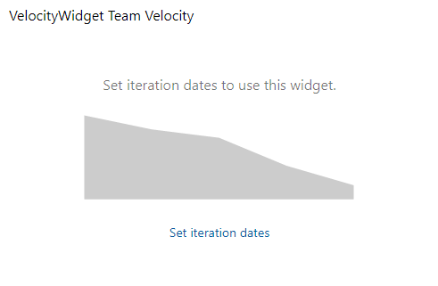
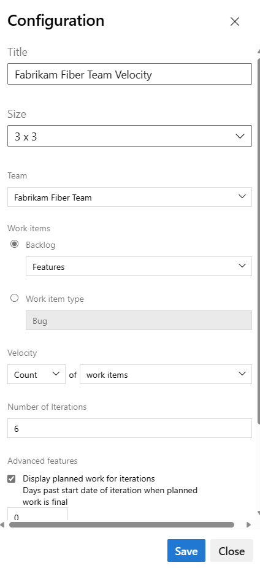
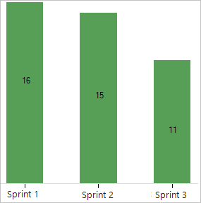

# View and configure team velocity

[!INCLUDE [version-lt-eq-azure-devops](../../includes/version-lt-eq-azure-devops.md)]

::: moniker range=">= azure-devops-2019" 

Teams can track velocity to help determine how much work they can do sprint-over-sprint. Velocity provides an indication of how much work a team can complete during a sprint based on either **a count of work items completed** or **the sum of estimates made** for effort (product backlog items), story points (user stories), or size (requirements).

Once your team completes a few sprints, you can use the velocity to [forecast](../../boards/sprints/forecast.md) how much of the backlog you can finish within upcoming sprints. If your team hasn't completed a sprint or if you're working on items before a sprint start date, there's no data to analyze and forecast. You might see this message: *Set iteration dates to use this widget*. To resolve this situation, set an iteration date range to include present date or wait for the sprint to start. For usage guidance, see [Velocity metrics and usage guidance](velocity-guidance.md).

**Example: Velocity showing Set iteration dates to use this widget**  



[!INCLUDE [temp](../../boards/includes/image-differences-with-wits.md)]  

In this article, learn how to do the following tasks: 

::: moniker range=">= azure-devops-2020" 

> [!div class="checklist"]
> * Configure the Velocity widget (Analytics)
> * View the Velocity in-context report (Analytics) 
> * Support velocity tracking with required and recommended team activities    

::: moniker-end

::: moniker range="azure-devops-2019" 

> [!div class="checklist"] 
> * Configure the Velocity widget (Analytics)
> * View the Velocity in-context report (work tracking data store) 
> * Support velocity tracking with required and recommended team activities  

::: moniker-end

::: moniker range="tfs-2018" 

> [!div class="checklist"] 
> * View the Velocity in-context report (work tracking data store) 
> * Support velocity tracking with required and recommended team activities  

::: moniker-end

::: moniker range=">= azure-devops-2019"

## Prerequisites  

::: moniker-end

[!INCLUDE [temp](../includes/analytics-widgets-prerequisites.md)]

## Open your backlog from the web portal

::: moniker range=">= azure-devops-2020" 

1. Sign in to your organization (```https://dev.azure.com/{yourorganization}```) and go to your project.
2. Select **Boards** > **Backlogs**, and then select your **team** from the dropdown menu.

   :::image type="content" source="../../boards/boards/media/open-boards-backlog.png" alt-text="Screenshot that shows Open Boards, Backlogs, and select a team.":::

3. To view the in-context reports for the product backlog, check that you selected **Stories** for Agile, **Issues** for Basic, **Backlog items** for Scrum, or **Requirements** for CMMI as the backlog level.

   :::image type="content" source="../../boards/sprints/media/assign-items-sprint/select-product-backlog-agile-s155.png" alt-text="Screenshot that shows how to select product backlog level, Backlog items, Stories, or Requirements.":::

::: moniker-end

::: moniker range="azure-devops-2019"

1. Check that you selected the right project, and select **Boards** > **Backlogs**. Then select the correct team from the team selector menu. 

	

    To select another backlog, open the selector and then select a different team or select the :::image type="icon" source="../../media/icons/home-icon.png" border="false":::  **Browse all backlogs** option. Or, enter a keyword in the search box to filter the list of team backlogs for the project.

    > [!div class="mx-imgBorder"]  
    >  

2. To view the in-context reports for the product backlog, check that you selected **Stories** for Agile, **Issues** for Basic, **Backlog items** for Scrum, or **Requirements** for CMMI as the backlog level. 

    > [!div class="mx-imgBorder"]  
    >  

::: moniker-end

::: moniker range="tfs-2018"
From your web portal, open your team's product backlog and select the team from the project and team selector. Then select **Work** > **Backlogs**. Select the product backlog, which is **Backlog items** for Scrum, **Stories** for Agile, or **Requirements** for CMMI. 

> [!div class="mx-imgBorder"]
>  

To select another team, open the project and team selector. Select a different team, or select the **Browse** option. 

> [!div class="mx-imgBorder"]  
>  

::: moniker-end

<a id="velocity-chart">   </a>

## View the Velocity in-context report   

::: moniker range=">= azure-devops-2020" 

Velocity reports are available for each backlog level, both product and portfolio backlogs. Each report provides interactive controls to provide each user the view of interest to them.  

1. Select **Analytics** to open the Velocity report for your product or portfolio backlog. 

   :::image type="content" source="media/cfd/analytics-summary-cfd-velocity.png" alt-text="Screenshot showing Backlogs, open Analytics.":::

2. To change to a different backlog, choose from the backlog selector, and then select **View full report** for Velocity.  

3. Use the interactive controls to select the count or sum field and number of iterations. Select **Custom iterations** to specify any number of iterations between 1 and 15. 

	Hover over a column area to show a summary of planned and completed work items. For example, for the 07_2019 sprint, 131 items are planned.

   :::image type="content" source="media/velocity/analytics-velocity-azure-devops.png" alt-text="Screenshot of Velocity Analytics report.":::

   For more information, see [Velocity metrics and usage guidance](velocity-guidance.md). 

4. To add the report to a dashboard, select the :::image type="icon" source="media/icons/actions-icon.png" border="false"::: actions icon and select **Copy to Dashboard**.

   :::image type="content" source="media/add-charts/add-analytics-chart-abbreviated.png" alt-text="Screenshot of Analytics in-context report, Copy to dashboard option.":::
	
	Select the dashboard and select **OK**.  

5. To return to the Analytics summary, select the :::image type="icon" source="../../media/icons/back-arrow.png" border="false"::: back arrow.

::: moniker-end

::: moniker range="azure-devops-2019"

1. From the web portal, open your product backlog.  

1. (1) Check that you've selected the right project, (2) select **Boards>Backlogs**, and then (3) select the correct team from the team selector menu. 

	

	To select another team, open the selector and select a different team or select the :::image type="icon" source="../../media/icons/home-icon.png" border="false"::: **Browse all backlogs** option. Or, you can enter a keyword in the search box to filter the list of team backlogs for the project.

	> [!div class="mx-imgBorder"]
	>  

	> [!TIP]    
	> Select the :::image type="icon" source="../../media/icons/icon-favorite-star.png" border="false"::: star icon to favorite a team backlog. Favorited artifacts (:::image type="icon" source="../../media/icons/icon-favorited.png" border="false"::: favorited icon) appear at the top of the team selector list. 

1. Check that you have selected **Backlog items** (for Scrum), **Stories** (for Agile), or **Requirements** (for CMMI) as the backlog level. 

	> [!div class="mx-imgBorder"]  
	>  

2. Open the velocity chart.  

	> [!div class="mx-imgBorder"]  
	>  

	For charts to appear, your team must carry out these activities: 
	- Select sprints for your team.
	- Assign backlog items to sprints.   
	- Estimate backlog items by defining the Effort, Story Points, or Size.
 
3. The chart tracks your estimated backlog work (sum of Effort, Story Points, or Size) that's completed (green) in the previous sprints or is in progress (blue).  

   As the following chart shows, velocity tends to fluctuate from sprint-to-sprint for different kinds of reasons. However, you can quickly determine the average velocity by averaging the values shown in green for each sprint. You can then plug the average into the Forecast tool.

     

   > [!NOTE]  
   > Work items based on the [Scrum process](../../boards/work-items/guidance/scrum-process.md) get counted in the chart once their State is set to Committed, whereas items based on the [Agile](../../boards/work-items/guidance/agile-process.md) and [CMMI](../../boards/work-items/guidance/cmmi-process.md) processes get counted once their State is set to Active. This behavior is set through the [workflow states to category state mappings](../../boards/work-items/workflow-and-state-categories.md).
   ::: moniker-end

::: moniker range="tfs-2018"

1.	From the web portal, open the product backlog and then select the velocity chart.  

	  

	For charts to appear, your team must carry out these activities: 
	- Select sprints for your team.
	- Assign backlog items to sprints.
	- Estimate backlog items by defining the Effort, Story Points, or Size.
 
2.	The report tracks your estimated backlog work (sum of Effort, Story Points, or Size) that's completed (green) in the previous sprints or is in progress (blue).  

	As this chart shows, velocity fluctuates from sprint-to-sprint for different kinds of reasons. However, you can quickly determine the average velocity by averaging the values shown in green for each sprint. You can then plug the average into the Forecast tool.

	  

	> [!NOTE]  
	> Work items based on the [Scrum process](../../boards/work-items/guidance/scrum-process.md) get counted in the chart once their State is set to Committed, whereas items based on the [Agile](../../boards/work-items/guidance/agile-process.md) and [CMMI](../../boards/work-items/guidance/cmmi-process.md) processes get counted once their State is set to Active. This behavior is set through the [workflow states to category state mappings](../../boards/work-items/workflow-and-state-categories.md).
	
::: moniker-end

[!INCLUDE [velocity-state-descriptions](../includes/velocity-state-descriptions.md)]

::: moniker range=">= azure-devops-2019" 

## Add the Velocity widget to your dashboard   

::: moniker-end

::: moniker range=">= azure-devops-2020" 

- If you haven't yet [added the Velocity widget to your dashboard](./add-widget-to-dashboard.md), do so now.  

::: moniker-end

::: moniker range="azure-devops-2019"

1. If you haven't yet [enabled or installed Analytics](analytics-extension.md), do so now.    

1. If you haven't yet [added the Velocity widget to your dashboard](./add-widget-to-dashboard.md), do so now.  

::: moniker-end

<a id="configure-widget"></a>

::: moniker range=">= azure-devops-2019"

## Configure the Velocity widget    

You configure your velocity widget for a single team. If you want to view the velocity for several teams, then you must configure a portfolio management team that rolls up from several teams. For more information, see [Add teams](../../organizations/settings/add-teams.md).  

1. Select the  actions icon and select the Configure option to open the configuration dialog. 
	
	Modify the title, select the team, and then select either the backlog level or work item type to track. Select whether you want to track a count of work items or a sum of a numeric field. The most common summed field is that of Effort, Story Points, or Size.     

	    

1. Specify the number of sprints you want to view. The default is 6 and the maximum is 15.    

2. (Optional) Select the check boxes to show additional information for work completed later than planned for each sprint. 

	**Displayed planned work for iterations:** Check this box to
	display the amount of work planned for an iteration at the start of the iteration. 
	It's useful for comparing your planned work to actual deliverables.
	By default, the count of planned work begins on the start date of the iteration. <br/> 
	
   - <b><i>Days past start date of iteration when planned work is final:</i></b>  Specify the number of days past the start date to count planned work. For example, if the first two days of an iteration are for planning, then you can enter "3", and planned work gets counted on the third day. 
	
       For example, if the iteration starts on `01/01/2018`, and three backlog items are assigned to the iteration on `01/01/2018` end-of-day, then those three backlog items are considered as Planned. If your team doesn't complete planning until a few days into the iteration, then you can update the Days past start date of iteration when planned work is final.  

     > [!NOTE]
     > Work is considered Planned if it is assigned to the iteration as-of the Iteration Start Date.  <br/>

     <hr/>

     **Highlight work completed late:** Work items marked complete after the iteration end date are considered to be completed late and show as light green. 
     This is useful for spotting a trend where work items are marked complete after the iteration is complete.

   - <b><i>Days past end date of iteration after which work is late:</i></b>  Specify the number of days past which you consider a work item late if its status is still new or is in progress.  

       For example, entering three days will give the team 3 days after the end of an iteration to mark work items complete or done, before they're considered late.

     > [!NOTE]  
     > A work item is considered late when the work item's Completed Date is later than End Date of the Iteration the work item is _currently_ assigned to.
     > 
     > It will take into account the value you enter for <i>Days past end date of iteration after which work is late</i>.  

3. Select **Save** when done. The following image shows Velocity based on Story Points and eight sprints of data. 
   
	 

::: moniker-end

[!INCLUDE [temp](../includes/velocity-activities.md)] 

[!INCLUDE [temp](../includes/add-teams.md)] 

## Next steps

> [!div class="nextstepaction"]
> [Velocity guidance](velocity-guidance.md)


<!--
The following two velocity charts are available: 
- In-context report you can view from a team backlog or Kanban board
- Velocity widget you can add to a dashboard. 

**Example: Velocity widget showing six sprints of velocity**  
 

> [!NOTE]
> The Velocity widget is based on Analytics data. Analytics is generally available for Azure DevOps Services and Azure DevOps Server 2020 and later versions. Analytics is in preview as an extension for Azure DevOps Server 2019. For TFS 2018 and earlier versions, you have access to the [velocity chart provided by the work tracking data store](#velocity-chart).

::: moniker-end  

::: moniker range="tfs-2018"

Velocity provides a useful metric for gaining insight into how much work your team can complete during a sprint cycle. Each team is associated with one and only one velocity chart.  

> [!NOTE]
> For TFS 2018 and earlier versions, you can only view team velocity. There is no configuration of this report.  

Velocity varies depending on team capacity, sprint over sprint. However, over time, the velocity should indicate a reliable average that can be used to forecast the full backlog.  

**Example Velocity chart from the work tracking data store**  
 

::: moniker-end  
-->