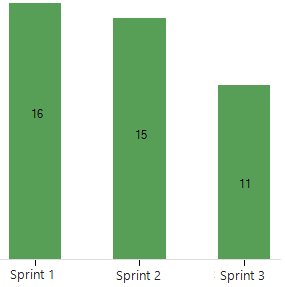
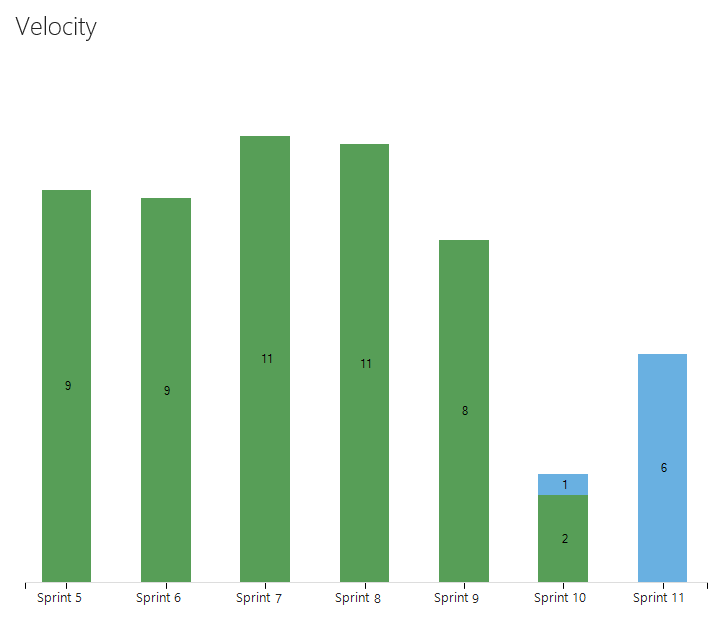

# View and work with the built-in team velocity chart 

[!INCLUDE [temp](../../boards/_shared/version-vsts-tfs-all-versions.md)] 

Teams track their velocity to help them determine how much work they can perform sprint-over-sprint. The built-in team velocity chart provides an indication of how much work a team can complete during a sprint. The chart is only available for the product backlog and is based on the sum of estimates made to Effort (PBIs), Story Points (user stories), or Size (requirements). Velocity calculations rely on the team's ability to estimate backlog items. 

**Example Velocity chart from the work tracking data store**  
 

Use this article to learn: 

> [!div class="checklist"]
> * How to view and work with the Velocity chart (work tracking datastore)  
> * Required and recommended team activities to support velocity tracking   

Once your team has completed a few sprints, they can use their velocity to [forecast](../../boards/sprints/forecast.md) how much of the backlog they can finish within upcoming sprints. For usage guidance, see [Velocity metrics and usage guidance](velocity-guidance.md).

::: moniker range=">= azure-devops-2019"
> [!NOTE]   
> In addition to the built-in velocity chart, Azure DevOps users have access to the [Velocity widget](team-velocity.md). The Velocity widget enables you to view more sprints and additional information than that provided by the velocity chart. 
::: moniker-end  

## Work with the built-in team velocity chart 
Velocity provides a useful metric for gaining insight into how much work your team can complete during a sprint cycle. Each team is associated with one and only one velocity chart.  

Velocity will vary depending on team capacity, sprint over sprint. However, over time, the velocity should indicate a reliable average that can be used to forecast the full backlog.  

[!INCLUDE [temp](../../boards/_shared/image-differences-with-wits.md)]  

From your web browser, open your product backlog.  

::: moniker range=">= azure-devops-2019"
0. (1) Check that you have selected the right project, (2) choose **Boards>Backlogs**, and then (3) select the correct team from the team selector menu. 

	

	To choose another team, open the selector and select a different team or choose the  **Browse all backlogs** option. Or, you can enter a keyword in the search box to filter the list of team backlogs for the project.

	> [!div class="mx-imgBorder"]
	>  

	> [!TIP]    
	> Choose the  star icon to favorite a team backlog. Favorited artifacts ( favorited icon) appear at the top of the team selector list. 

0. Check that you have selected **Backlog items** (for Scrum), **Stories** (for Agile), or **Requirements** (for CMMI) as the backlog level. 

	> [!div class="mx-imgBorder"]  
	>  

0. Open the velocity chart.  

	> [!div class="mx-imgBorder"]  
	>  

	For charts to appear, your team must perform these activities: 
	- Select sprints for your team  
	- Assign backlog items to sprints   
	- Estimate backlog items by defining the Effort, Story Points, or Size.
 
2.	The chart tracks your estimated backlog work (sum of Effort, Story Points, or Size) that your team has completed (green) in the previous sprints, or that are still in progress (blue).  

	As this chart shows, velocity will fluctuate from sprint-to-sprint for a variety of reasons. However, you can quickly determine the average velocity by averaging the values shown in green for each sprint. You can then plug the average into the Forecast tool.

	  

	> [!NOTE]  
	> Work items based on the [Scrum process](../../boards/work-items/guidance/scrum-process.md) get counted in the chart once their State is set to Committed, whereas items based on the [Agile](../../boards/work-items/guidance/agile-process.md) and [CMMI](../../boards/work-items/guidance/cmmi-process.md) processes get counted once their State is set to Active. This behavior is set through the [workflow states to category state mappings](../../boards/work-items/workflow-and-state-categories.md).
::: moniker-end

::: moniker range=">= tfs-2013 <= tfs-2018"

1.	From the backlog page, open the velocity chart.  

	  

	For charts to appear, your team must perform these activities: 
	- Select sprints for your team  
	- Assign backlog items to sprints   
	- Estimate backlog items by defining the Effort, Story Points, or Size.
 
2.	The chart tracks your estimated backlog work (sum of Effort, Story Points, or Size) that your team has completed (green) in the previous sprints, or that are still in progress (blue).  

	As this chart shows, velocity will fluctuate from sprint-to-sprint for a variety of reasons. However, you can quickly determine the average velocity by averaging the values shown in green for each sprint. You can then plug the average into the Forecast tool.

	  

	> [!NOTE]  
	> Work items based on the [Scrum process](../../boards/work-items/guidance/scrum-process.md) get counted in the chart once their State is set to Committed, whereas items based on the [Agile](../../boards/work-items/guidance/agile-process.md) and [CMMI](../../boards/work-items/guidance/cmmi-process.md) processes get counted once their State is set to Active. This behavior is set through the [workflow states to category state mappings](../../boards/work-items/workflow-and-state-categories.md).
	
::: moniker-end

[!INCLUDE [temp](../_shared/velocity-activities.md)] 

[!INCLUDE [temp](../_shared/add-teams.md)] 

## Try this next
> [!div class="nextstepaction"]
> [Velocity guidance](velocity-guidance.md)