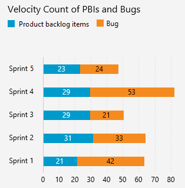

# Velocity metrics and usage guidance  

[!INCLUDE [temp](../_shared/version-azure-devops-all.md)]
 
Velocity provides a useful metric for these activities:  
- Support sprint planning  
- Forecast future sprints and the backlog items that can be completed   
- A guide for determining how well the team estimates and meets their planned commitments 

And, with the velocity widget, you can quickly determine the following:  
- Planned velocity 
- Actual (completed) velocity 
- Work completed later than planned
- Amount of work not completed   

To configure or view Velocity charts, see [Configure and view Velocity charts](team-velocity.md).

The velocity chart requires that teams estimate their backlog items with a number using the [Effort, Story Points, or Size fields](../../boards/queries/query-numeric.md).   

The velocity widget allows teams to track velocity based on the count of backlog items or with estimates for the Effort, Story Points, or Size fields.

## Minimize variability in your estimates 
Estimates, by their nature, don't reflect reality. They represent a best guess by the team as to the effort required to complete an item, relative to the effort of other items on the backlog.  

By minimizing the size variability of your backlog items, you help strengthen the team's ability to  create more accurate estimates.  Variability increases uncertainty. By minimizing the variability of your estimates, you increase the likelihood of more reliable velocity metrics and forecast results.  

## Velocity is not a KPI 
While velocity provides a measure of a team's ability to deliver work over time, you shouldn't confuse it as a key performance indicator of the team. 

Velocity simply provides an aid to determine team capacity. Nothing more, nothing less. Asking a team to increase their velocity, basically asks them to accomplish more with the same resources. This request will mostly likely lead to "Story points inflation" and lead to less desirable outcomes. 

## Other types of velocity charts
While the velocity chart provides a measure of Effort, Story Points, or Size that gets completed sprint-over-sprint, there may be other types of velocity that you may want to track. You can create similar charts by creating a work item query and [chart the count of or sum of items](../dashboards/charts.md).  

For example, you can create a chart of the number of Product backlog items and bugs completed for the last several sprints. For examples on creating this type of chart, see [Query by numeric fields](../../boards/queries/query-numeric.md).

 

## Try this next
> [!div class="nextstepaction"]
> [Configure or view velocity chart](team-velocity.md) 

## Related articles  
- [Forecast your sprints](../../boards/sprints/forecast.md) 
- [Plan your sprint](../../boards/sprints/assign-work-sprint.md) 

### Industry resources
- [How Should We Use Velocity?](https://www.scrumalliance.org/community/articles/2013/2013-april/how-should-we-use-velocity)  
- [Velocity Is Not the Goal](https://www.scrumalliance.org/community/articles/2017/march/sprint-velocity-sense-and-nonsense)   
- [How to Calculate and Use Velocity to Help Your Team and Your Projects](https://www.scrumalliance.org/community/articles/2014/february/velocity)

### Add other teams
If you work with several teams, and each team wants to work with their own backlog view, velocity chart, and forecast tool, you can [add teams](../../organizations/settings/add-teams.md). Each team then gets access to their own set of Agile tools. Each Agile tool filters work items to only include those whose assigned area paths and iteration paths meet those set for the team. 
