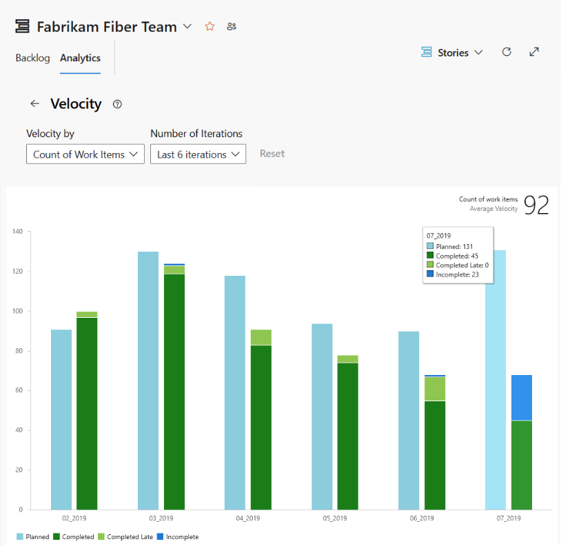

# Velocity metrics and usage guidance  

[!INCLUDE [version-lt-eq-azure-devops](../../includes/version-lt-eq-azure-devops.md)]
 
Velocity metrics provide useful information to support the following team and product management activities:  
- Sprint planning  
- Forecasting future sprints and the backlog items that a team can complete   
- A guide for determining how well the team estimates and meets their planned commitments 

[!INCLUDE [note-delete-area-paths](../../boards/includes/note-delete-area-paths.md)]

::: moniker range=">= azure-devops-2019"

## Velocity chart types

::: moniker-end

::: moniker range=">= azure-devops-2020"

You have a choice of Velocity charts: the in-context Velocity chart you access from a Backlogs page and the Velocity widget you add to a dashboard. With both these charts, you can quickly determine the following information:  
- **Planned** - calculated based on the amount of work assigned to the sprint before the start of the sprint. This count includes work that was moved to a different sprint after the start of the sprint, but doesn't include work that was added later after the sprint started.
	> [!TIP]   
	> To list the work items included in the count, click the velocity bar. A query results page will open with the list of work items included.
- **Completed** - calculated based on the amount of work  assigned to the sprint before the start of the sprint and completed before the sprint end date.
- **Completed Late**  - calculated based on the amount of work assigned to the sprint before the start of the sprint but was completed after the end of the sprint.  
- **Incomplete** - Amount of work not completed, calculated based on the amount of work assigned to the sprint before the start of the sprint and hasn't been set to completed. 

To open the Velocity chart or add the Velocity widget to a dashboard, see [View or configure team velocity](team-velocity.md).

#### [In-context Velocity chart](#tab/in-context)

#### [Velocity widget](#tab/widget)

 

***

You can configure each chart in the following ways: 
- Sum of [Effort, Story Points, or Size fields](../../boards/queries/query-numeric.md) or other supported numeric field assigned to backlog items.
- Count of work items that appear on the backlog
- Number of iterations.   

The widget supports some more configuration options. To configure or view Velocity charts, see [Configure and view Velocity charts](team-velocity.md).
 

::: moniker-end

::: moniker range="azure-devops-2019"

You have a choice of Velocity charts: the in-context Velocity chart you access from a Backlogs page and the Velocity widget you add to a dashboard. With the velocity widget, you can quickly determine the following information:  
- Planned velocity 
- Actual (completed) velocity 
- Work completed later than planned
- Amount of work not completed   

#### [In-context Velocity chart](#tab/in-context)

#### [Velocity widget](#tab/widget)

 

---

Both of these charts support visualizing team velocity for several sprints. The Velocity widget, however, supports the following configuration options: 
- Sum of [Effort, Story Points, or Size fields](../../boards/queries/query-numeric.md) or other supported numeric field assigned to backlog items.
- Count of work items that appear on the backlog
- Number of iterations   
- Advanced features.

::: moniker-end

::: moniker range="tfs-2018"

The in-context Velocity charts are based on the sum of [Effort, Story Points, or Size fields](../../boards/queries/query-numeric.md) assigned to backlog items. These charts are similar to the one shown in the following image. 

  

To configure or view Velocity charts, see [Configure and view Velocity charts](team-velocity.md).

::: moniker-end

[!INCLUDE [temp](../includes/velocity-activities.md)] 

## Minimize variability in your estimates 

Estimates, by their nature, don't reflect reality. They represent a best guess by the team as to the effort required to complete an item, as it relates to the effort to complete other items on the backlog.  

By minimizing the size variability of your backlog items, you help strengthen the team's ability to create truer estimates.  Variability increases uncertainty. By minimizing the variability of your estimates, you increase the likelihood of more reliable velocity metrics and forecast results.  

## Velocity not a key performance indicator 

While velocity provides a measure of a team's ability to deliver work, you shouldn't confuse it as a key performance indicator for the team. 

Velocity simply provides an aid to determine team capacity. Nothing more, nothing less. Asking a team to increase their velocity, basically asks them to accomplish more with the same resources. This request will mostly likely lead to "Story points inflation" and lead to less desirable outcomes. 

## Next steps

> [!div class="nextstepaction"]
> [Forecast your sprints](../../boards/sprints/forecast.md)  

## Related articles  

- [Configure or view velocity chart](team-velocity.md) 
- [Plan your sprint](../../boards/sprints/assign-work-sprint.md) 

### Add other teams

If you work with several teams, and each team wants to work with their own backlog view, velocity chart, and forecast tool, you can [add teams](../../organizations/settings/add-teams.md). Each team then gets access to their own set of Agile tools. Each Agile tool filters work items to only include those items assigned to area paths and iteration paths selected by the team. 
