# Widget catalog 
[!INCLUDE [temp](../_shared/version-ts-tfs-2015-2016.md)] 

Widgets display information and charts on dashboards. Many of them are configurable and display information available from one or more data stores or charts maintained within the system. 

To add a widget to a dashboard or copy a widget from one dashboard to another, see [Add a widget to a dashboard](add-widget-to-dashboard.md).    

The following widgets are organized under the service they support. Widgets that derive their data from the [Analytics service](../powerbi/what-is-analytics.md) are annotated with **Analytics**.  <!--- Team-scoped widgets display data based on the selected team context. User-focused widgets display information based on the logged-in user. -->

::: moniker range=">= azure-devops-2019"

<table valign="top">
<tbody valign="top">
<tr>
<td width="44%"> 
**Boards**
<ul>
<li>[Assigned to me](#assigned-to-me-widget)</li>
<li>[Burndown chart](#burndown-analytics-widget) (Analytics)</li>
<li>[Burnup chart](#burnup-analytics-widget) (Analytics) </li>
<li>[Chart for work items](#chart-wit-widget)</li>
<li>[Cumulative flow diagram](#cfd-widget) (Analytics) </li>
<li>[Cycle time](#cycle-time-widget) (Analytics)</li>
<li>[Lead time](#lead-time-widget) (Analytics) </li>
<li>[New Work item](#new-work-item-widget)</li>
<li>[Query results](#query-results-widget)</li>
<li>[Query tile](#query-tile-widget)</li>
<li>[Sprint burndown](#sprint-burndown-widget) </li>
<li>[Sprint capacity](#sprint-capacity-widget)</li>
<li>[Sprint overview](#sprint-overview-widget) </li>
<li>[Velocity](#velocity-widget) (Analytics) </li>
<li>[Work links](#work-links-widget)</li>
</ul>

</td>
<td width="28%">
**Repos**
<ul>
<li>[Code tile](#code-tile-widget)</li>
<li>[Pull request](#pull-request-widget) </li>
</ul>
 
**Pipelines**
<ul>
<li>[Chart for build history](#build-history-widget)</li>
<li>[Deployment status](#deployment-status-widget)</li>
<li>[Release pipeline overview](#release-definition-widget)</li>
<li>[Test results trend (Advanced)](#test-trend-results-advanced) (Analytics)</li>
<li>[Requirements quality](#requirements-quality-widget)</li>
</ul>
 
**Test Plans**
<li>[Chart for test plans](#chart-test-plan-widget)</li>

</ul>
</td>
<td width="28%">
**Other**
<ul>
<li>[Embedded web page](#embedded-webpage-widget)</li>
<li>[Markdown](#markdown-widget)</li>
<li>[Other links](#other-links-widget) </li>
<li>[Team members](#team-members-widget) </li>
<li>[Visual Studio Shortcuts](#visual-studio-widget)</li>
<li>[Welcome](#how-to-widget)</li>
</ul>
</td>
</tr>
</tbody>
</table>

> [!NOTE]  
> Widgets specific to a service are disabled if the service they depend on has been disabled. For example, if **Boards** is disabled, work tracking Analytics widgets are disabled and won't appear in the widget catalog. To re-enable a service, see [Turn an Azure DevOps service on or off](../../organizations/settings/set-services.md).

::: moniker-end

::: moniker range="tfs-2018"

<table valign="top">
<tbody valign="top">
<tr>
<td width="33%"> 
**Boards**
<ul>
<li>[Assigned to me](#assigned-to-me-widget)</li>
<li>[Chart for work items](#chart-wit-widget)</li>
<li>[Cumulative flow diagram](#cfd-widget)</li>
<li>[New Work item](#new-work-item-widget) </li>
<li>[Query results](#query-results-widget)</li>
<li>[Query tile](#query-tile-widget)</li>
<li>[Sprint burndown](#sprint-burndown-widget) </li>
<li>[Sprint capacity](#sprint-capacity-widget) </li>
<li>[Sprint overview](#sprint-overview-widget)</li>
<li>[Work links](#work-links-widget)</li>
</ul>

</td>
<td width="33%">
**Repos**
<ul>
<li>[Code tile](#code-tile-widget)</li>
</ul>
 
**Pipelines**
<ul>
<li>[Pull request](#pull-request-widget) </li>
<li>[Chart for build history](#build-history-widget)</li>
<li>[Deployment status](#deployment-status-widget)</li>
<li>[Release pipeline overview](#release-definition-widget)</li>
<li>[Requirements quality](#requirements-quality-widget)</li>
</ul>
 
**Test Plans**
<li>[Chart for test plans](#chart-test-plan-widget)</li>
<li>[Test results trend](#test-results-widget)</li>
<li>[Test results trend (Advanced)](#test-trend-results-advanced)</li>
</ul>
</td>
<td width="34%">
**Other**
<ul>
<li>[Embedded web page](#embedded-webpage-widget)</li>
<li>[Markdown](#markdown-widget)</li>
<li>[Other links](#other-links-widget) </li>
<li>[Team members](#team-members-widget) </li>
<li>[Team room](#team-room-widget)</li>
<li>[Visual Studio Shortcuts](#visual-studio-widget)</li>
<li>[Welcome](#how-to-widget)</li>
</ul>
</td>
</tr>
</tbody>
</table>

::: moniker-end

::: moniker range="tfs-2017"

<table valign="top">
<tbody valign="top">
<tr>
<td width="33%"> 
**Work**
<ul>
<li>[Assigned to me](#assigned-to-me-widget) </li>
<li>[Chart for work items](#chart-wit-widget)</li>
<li>[New Work item](#new-work-item-widget) </li>
<li>[Query results](#query-results-widget)</li>
<li>[Query tile](#query-tile-widget)</li>
<li>[Sprint burndown](#sprint-burndown-widget) </li>
<li>[Sprint capacity](#sprint-capacity-widget) </li>
<li>[Sprint overview](#sprint-overview-widget)</li>
<li>[Work links](#work-links-widget)</li>
</ul>

</td>
<td width="33%">
**Code**
<ul>
<li>[Code tile](#code-tile-widget)</li>
</ul>
 
**Build & Release**
<ul>
<li>[Pull request](#pull-request-widget) </li>
<li>[Chart for build history](#build-history-widget)</li>
<li>[Deployment status](#deployment-status-widget)</li>
<li>[Requirements quality](#requirements-quality-widget)</li>
</ul>
 
**Test**
<ul>
<li>[Chart for test plans](#chart-test-plan-widget)</li>
<li>[Test results trend](#test-results-widget)</li>
</ul>
</td>
<td width="34%">
**Other**
<ul>
<li>[Embedded web page](#embedded-webpage-widget)</li>
<li>[Markdown](#markdown-widget)</li>
<li>[Other links](#other-links-widget) </li>
<li>[Team members](#team-members-widget)</li>
<li>[Team room](#team-room-widget)</li>
<li>[Visual Studio Shortcuts](#visual-studio-widget)</li>
<li>[Welcome](#how-to-widget)</li>
</ul>
</td>
</tr>
</tbody>
</table>

::: moniker-end

::: moniker range="tfs-2015"

<table valign="top">
<tbody valign="top">
<tr>
<td width="33%"> 
**Work**
<ul>
<li>[Assigned to me](#assigned-to-me-widget)</li>
<li>[Chart for work items](#chart-wit-widget)</li>
<li>[New Work item](#new-work-item-widget) </li>
<li>[Query results](#query-results-widget)</li>
<li>[Query tile](#query-tile-widget)</li>
<li>[Sprint burndown](#sprint-burndown-widget) </li>
<li>[Sprint capacity](#sprint-capacity-widget) </li>
<li>[Sprint overview](#sprint-overview-widget) </li>
<li>[Work links](#work-links-widget)</li>
</ul>
</td>
<td width="33%">
**Code**
<ul>
<li>[Code tile](#code-tile-widget)</li>
</ul>
 
**Build**
<ul>
<li>[Pull request](#pull-request-widget) </li>
<li>[Chart for build history](#build-history-widget)</li>
</ul>
 
</td>
<td width="34%">
**Other**
<ul>
<li>[Embedded web page](#embedded-webpage-widget)</li>
<li>[Markdown](#markdown-widget)</li>
<li>[Other links](#other-links-widget)</li>
<li>[Team members](#team-members-widget) </li>
<li>[Team room](#team-room-widget) </li>
<li>[Visual Studio Shortcuts](#visual-studio-widget)</li>
<li>[Welcome](#how-to-widget)</li>
</ul>
</td>
</tr>
</tbody>
</table>

> [!NOTE]   
> Widgets and multiple dashboards are not supported features in TFS 2013, instead, you can [pin items to a team homepage](team-dashboard.md).  Consider [upgrading to the latest TFS version](https://visualstudio.microsoft.com/downloads/) to get access to the widget catalog and [multiple team dashboards](dashboards.md).  

::: moniker-end

::: moniker range=">= azure-devops-2019"
## Azure Boards widgets 
::: moniker-end

::: moniker range=">= tfs-2015 <= tfs-2018"
## Work widgets 
::: moniker-end

::: moniker range=">= tfs-2017"

###Assigned to me  
 
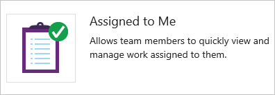  

Displays the list of work items currently assigned to the currently logged in user. The list ignores closed or deleted work items.
 
----
::: moniker-end

::: moniker range=">= azure-devops-2019"
###Burndown chart 
  
	
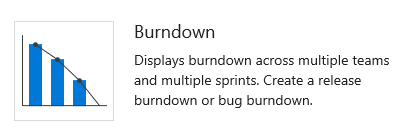  
  
Adds a tile that displays a burndown chart which you can configure to span one or more teams, work item types, and time period. With it, you can create a release burndown, sprint burndown, or any burndown that spans teams and sprints. To learn more, see [Configure a Burndown or Burnup widget](configure-burndown-burnup-widgets.md).  

----

###Burnup chart  
 	

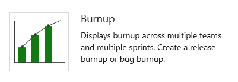    

Adds a tile that displays a burnup chart which you can configure to span one or more teams, work item types, and time period. With it, you can create a release burnup, sprint burnup, or any burnup that spans teams and sprints. To learn more, see [Configure a Burndown or Burnup widget](configure-burndown-burnup-widgets.md).  

----
::: moniker-end

###Chart for work items  
 
	
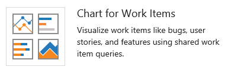  

Adds a tile to display a progress or trend chart that builds off a shared work item query.  
From the configuration dialog, select a shared query and [specify the chart type and values](charts.md#add-chart-widget).   

::: moniker range="tfs-2015"
Requires TFS 2015.2 or later version. For TFS 2015.1 and earlier versions, see [Add charts to a dashboard](add-charts-to-dashboard.md#work-item-query) to add shared query charts to a dashboard.    
::: moniker-end

----

::: moniker range=">= azure-devops-2019"
 

###Cumulative flow diagram   

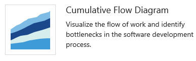  

Displays the cumulative flow of backlog items based on the time frame, team, backlog level and swimlane you select. 

From the configuration dialog, [specify the team, backlog level, and other parameters you want](cumulative-flow.md#configure-widget).

Hover over each color within the chart to see the count of items for a particular Kanban column. 

----

 
###Cycle time  

  

Displays the cycle time of work items closed in a specified timeframe for a single team and backlog level. The cycle time of a work item is defined as the time taken to close a work item after work on it has started. 

Each marker on the chart corresponds to one or more work items with a particular cycle time. The lower the cycle time, the faster work is progressing through your development pipeline. To learn more, see [Configure a Burndown or Burnup widget](configure-burndown-burnup-widgets.md). 

----

 
###Lead time  

   
 
Displays the lead time of work items closed in a specified timeframe for a single team and backlog level. The lead time of a work item is defined as the time taken to close a work item after it was created.

Each marker on the chart corresponds to one or more work items with a particular lead time. The lower the lead time, the faster work is being delivered to the customer.

To learn more, see [ Lead time and cycle time control charts](cycle-time-and-lead-time.md). 
  
----

::: moniker-end

###New Work item
	
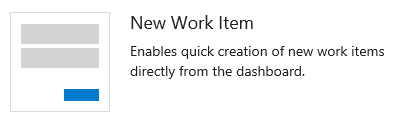

Enables you to add work items from the dashboard. You [use work items to plan and track work](../../boards/backlogs/add-work-items.md).    

Work items that you add using this widget are automatically scoped to the team's default area path and the team's current sprint or default iteration. To change team defaults, see [About teams and Agile tools](../../organizations/settings/about-teams-and-settings.md).

::: moniker range="tfs-2015"
Requires TFS 2015.1 or later version.    
::: moniker-end

----

 
###Other links 

  

Provides links to the following features: 
- Opens a form to initiate a [request to provide feedback](/azure/devops/project/feedback/get-feedback?toc=/azure/devops/project/feedback/toc.json).
- Opens the team's quick dialog to add or modify the active sprints or iteration paths for your team. To learn more see [Define sprints](../../boards/sprints/define-sprints.md).
- Opens the team's quick dialog to modify your [team's area path](../../organizations/settings/set-area-paths.md).

::: moniker range=">= tfs-2015 <= tfs-2018"
The following links are displayed when the corresponding resource is configured for the project: 

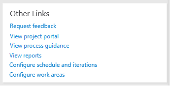  

- [View project portal](../sharepoint-dashboards/share-information-using-the-project-portal.md) (opens either a SharePoint site or URL that's been configured as the project's portal.  
- [View process guidance](../sharepoint-dashboards/configure-or-redirect-process-guidance.md) (opens either a SharePoint site or URL that's been configured as the project's process guidance.  
- [View reports](../sql-reports/reporting-services-reports.md) (opens SQL Server Reporting Services). To add or update reports for a project, see [Add reports to a project](../admin/add-reports-to-a-team-project.md). 

::: moniker-end

----

 
###Query results 
	

Adds a configurable tile that lists the results of a shared query. 
From the configuration dialog, select either a team favorite or shared query.  
To create a shared query, see [Use the query editor to list and manage queries](../../boards/queries/using-queries.md). 

----

 
###Query tile 

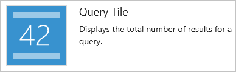

Adds a configurable tile to display the summary of a shared query results.
From the configuration dialog, select either a team favorite or shared query. You can optionally specify rules to change the query tile color based on the number of work items returned by the query. 
To create a shared query, see [Use the query editor to list and manage queries](../../boards/queries/using-queries.md). 
  
----

 
###Sprint burndown 

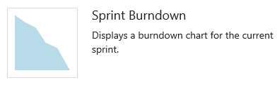

Adds the team's burndown chart for the current sprint to the dashboard. This chart always displays data for the current sprint.
Teams [use the burndown chart to mitigate risk and check for scope creep](../../boards/sprints/sprint-burndown.md) throughout the sprint cycle. 

----

 

###Sprint capacity 

Inserts the team's capacity bar chart for the current sprint. 
To plan and monitor their sprint resources, team set capacity and update Remaining Work throughout the sprint. See [Set capacity](../../boards/sprints/set-capacity.md).  

----

 
###Sprint overview 

 
::: moniker range=">= tfs-2017"

Inserts a configurable overview of sprint progress. You can choose between a count of story points or number of work items. Teams [plan their sprints by defining sprints](../../organizations/settings/set-iteration-paths-sprints.md) and [assigning backlog items to an iteration](../../boards/sprints/assign-work-sprint.md). 
::: moniker-end

::: moniker range=" tfs-2015"

Inserts a visual overview of sprint progress indicating the number of backlog items in progress, completed, or not started. Teams [plan their sprints by defining sprints](../../organizations/settings/set-iteration-paths-sprints.md) and [assign backlog items to an iteration](../../boards/sprints/assign-work-sprint.md). 
::: moniker-end

----

::: moniker range=">= azure-devops-2019"
 
### Velocity   

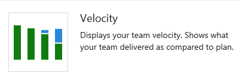

The velocity widget tracks a team's capacity to deliver work sprint after sprint. You configure the widget by selecting a team, a work item type, an aggregation field, and the number of sprints. The widget takes advantage of the Analytics service. You can track the velocity for a single team, not multiple teams.    
For additional guidance, see [Velocity](team-velocity.md). 

----

::: moniker-end

 
###Work links 

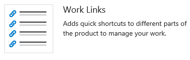  
Provides quick access to open the following Agile tools and team resources:

- [Backlog](../../boards/backlogs/create-your-backlog.md)  
- [Kanban Board](../../boards/boards/kanban-basics.md)  
- [Task board](../../boards/sprints/task-board.md)  
- [Queries](../../boards/queries/using-queries.md)  

----

::: moniker range=">= azure-devops-2019"
## Azure Repos widgets 
::: moniker-end

::: moniker range=">= tfs-2015 <= tfs-2018"
## Code widgets
::: moniker-end

 
###Code tile	

Adds a configurable tile to display the summary of a code folder or Git repository. To configure, simply choose the added tile, select a repository, select a branch (Git only) and select a path. The code tile supports both TFVC and Git repositories. 

::: moniker range="tfs-2015"
Requires TFS 2015.1 or later version.
::: moniker-end

----

 
###Pull request 

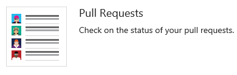

Adds a configurable tile to display active pull requests requested by the team, or assigned to or requested by the person logged in. Select the Git repository for the pull requests of interest. 

You need to add a widget for each Git repository of interest.
To learn more about pull requests, see [Review code with pull requests](../../repos/git/pull-requests.md).

::: moniker range="tfs-2015"
Requires TFS 2015.2 or later version.
::: moniker-end

----

::: moniker range=">= azure-devops-2019"
## Azure Pipelines widgets 
::: moniker-end

::: moniker range=">= tfs-2015 <= tfs-2018"
## Build and Release widgets
::: moniker-end

 
###Chart for build history  

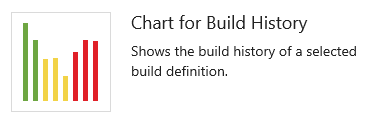   

Adds a tile to display a histogram of all builds run for the configured build pipeline.
From the configuration dialog, select the build you want to monitor. 
Hover over a bar to learn how long the build took to complete. Choose the bar to open the summary for that specific build. Bar color indicates: green-completed, red-failed, and yellow-completed without tests. 

::: moniker range="tfs-2015"
Requires TFS 2015.2 or later version. For TFS 2015.1 and earlier versions, see [Add charts to a dashboard](add-charts-to-dashboard.md#build-history) to add a build summary chart to a dashboard. 
::: moniker-end

----

::: moniker range=">= tfs-2017"

 
### Deployment status 

  

Configurable widget that shows a consolidated view of the deployment status and test pass rate across multiple environments for a recent set of builds. You configure the widget by specifying a build pipeline, branch, and linked release pipelines. 

In order view the test summary across multiple environments in a release, the widget provides a matrix view of each environment and corresponding test pass rate. You can choose any cell to see a more [detailed](../../pipelines/test/review-continuous-test-results-after-build.md) view for the selected environment.

::: moniker-end
::: moniker range="tfs-2017"
Requires TFS 2017.1 or later version. 
::: moniker-end
::: moniker range=">= tfs-2017"

----

::: moniker-end

::: moniker range=">= azure-devops-2019"

 
### Release pipeline overview 

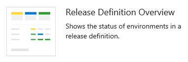  

Configurable widget that you can use to view and track the status of a release pipeline. This widget shows the release as a series of environments, with the name of the release and the date or time it was started. The color of the heading and the icon in each environment indicate the current status of the release, which are the same as are used on the **Releases** page. Select a release pipeline in the left column to filter the list to just releases for that pipeline.

---- 
::: moniker-end

 
::: moniker range=">= tfs-2017"

 
### Requirements quality 
  

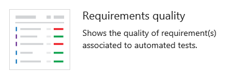  

Configurable widget that you can use to track quality continuously from a build or release pipeline. The widget shows the mapping between a requirement and latest test results executed against that requirement. It provides insights into requirements traceability e.g. requirements not meeting the quality, requirements not tested etc. To learn more about setting up traceability see [Requirements traceability](../../pipelines/test/requirements-traceability.md) 

---- 
::: moniker-end

::: moniker range=">= azure-devops-2019"
## Azure Test Plans widgets 
::: moniker-end

::: moniker range=">= tfs-2017 <= tfs-2018"
## Test widgets  
::: moniker-end

::: moniker range=">= tfs-2017"

 
###Chart for test plans  
	
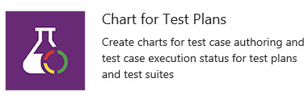  

Adds a configurable widget that lets you track the progress of test case authoring or status of test execution for tests in a test plan. Get started by selecting a test plan and a test suite. Then select test case chart for test authoring progress or test results for test execution progress. Finally, select the chart type and the pivots. 

To learn more, see [Track your test results](../../test/track-test-status.md).

::: moniker-end
::: moniker range="tfs-2017"
Requires TFS 2017.2 or later version.
::: moniker-end
::: moniker range=">= tfs-2017"

----

::: moniker-end

::: moniker range=">= tfs-2017"

### Test results trend 

Adds a configurable tile that displays the trend of test results, such as passed or failed tests, for the selected build or release pipeline. The widget helps you visualize the test trends over a period of time, thereby surfacing patterns about test failures, test duration etc. 

From the configuration dialog, select the build or release whose test results you'd like to monitor. There are multiple chart options to choose from (Line, Column & Stacked Column) based on your preference. Optionally you can map the trend of test duration on the existing chart by adding a secondary line chart. 

The widget provides the basic trend of the test results. To get deeper insights and higher configurability view [Test Analytics](../../pipelines/test/test-analytics.md) 

---- 
::: moniker-end

::: moniker range=">= azure-devops-2019"

### Test Results Trend (Advanced)

<!--- QUESTION - Is this available on 2019? --> 

> [!div class="mx-imgBorder"]  
> 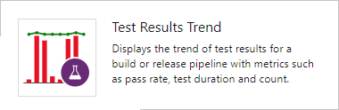

<!---
> [!NOTE]   
> **Feature availability:** The Test Results Trend (Advanced) widget is only available for an Azure DevOps Services organization that has the [Analytics Marketplace extension](https://marketplace.visualstudio.com/items?itemName=ms.vss-analytics) installed. 
-->

The Test Results Trend (Advanced) widget provides near real-time visibility into test data for multiple builds and releases. The widget shows a trend of your test results for selected pipelines. You can use it to track the daily count of test, pass rate, and test duration. Tracking test quality over time and improving test collateral is key to maintaining a healthy DevOps pipeline.

The widget supports tracking advanced metrics for one or more build pipelines or release pipelines. The widget also allows filtering of test results by outcome, stacking metrics, and more. 

To learn more, see [Configure the Test Results Trend (Advanced) widget](./configure-test-results-trend.md).

---- 
::: moniker-end

## Informational content and other links 

::: moniker range=">= tfs-2017"

 
### Embedded web page 

Adds a configurable tile to display the contents of a web page. Only webpages that allow [iframe embedding](http://go.microsoft.com/fwlink/?LinkId=808035) are supported.

----
::: moniker-end

 

### Markdown 

::: moniker range=">= tfs-2017"
Adds a configurable tile to display any type of information, guidance, or links that you want. You can also configure the widget to point to a file stored in your repository. From the configuration dialog, add the information you want to share with your team. To learn more, see [Add Markdown to a dashboard](add-markdown-to-dashboard.md). 
::: moniker-end

::: moniker range="tfs-2015"
Adds a configurable tile to display any type of information, guidance, or links that you want. From the configuration dialog, add the information you want to share with your team. To learn more, see [Add Markdown to a dashboard](add-markdown-to-dashboard.md). 

Requires TFS 2015.1 or later version. For TFS 2015.2 or later versions, you can configure the widget to point to a file stored in your repository.   
::: moniker-end

---- 

 
### Team members 

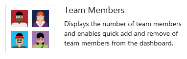

Shows team member profiles and, on-hover, their user alias.
For team admins, supports access to the quick dialog to [add or remove team members](../../organizations/settings/add-teams.md). 

> [!NOTE]  
> This widget is a convenient way to add team members to specific teams within projects.  If you remove it, you can still [add members to your team from the team administration page](../../organizations/settings/add-teams.md#add-team-members). 

::: moniker range="tfs-2015"
Requires TFS 2015.1 or later version.    
::: moniker-end

----

::: moniker range=">= tfs-2015 <= tfs-2017"

 
### Team room  

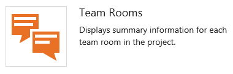

Provides status and access to [team rooms](../../notifications/collaborate-in-a-team-room.md). Available for TFS 2015.1 through TFS 2017.2 versions.  
  
Team rooms support increased team productivity by providing a space to discuss work in progress, ask questions, share status, and clarify issues that arise. Team administrators can create additional team rooms.  

> [!NOTE]  
> Team Rooms have been deprecated as described in [Deprecation of Team Rooms](https://blogs.msdn.microsoft.com/devops/2017/01/04/deprecation-of-the-team-rooms-in-team-services-and-tfs/) blog post. Several good solutions are available that integrate well with TFS that support notifications and chat, such as [Microsoft Teams](https://marketplace.visualstudio.com/items?itemName=ms-vsts.vss-services-teams) and [Slack](../../service-hooks/services/slack.md).  

----

::: moniker-end

 
### Visual Studio Shortcuts 

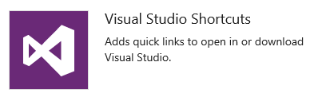

Provides links to open or download Visual Studio. The Visual Studio IDE client comes with the [Team Explorer plug-in](../../user-guide/work-team-explorer.md) which provides quick access to several features (some of which aren't available through the web portal).

::: moniker range="tfs-2015"
Requires TFS 2015.1 or later version.
::: moniker-end

----

### Welcome 

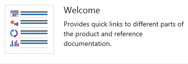

Provides links to the **Boards/Boards (Work/Boards)**, **Repos (Code)**, and **Pipelines (Build or Build-Release)** pages and reference documentation on how to add charts.

::: moniker range="tfs-2015"
Requires TFS 2015.1 or later version.
::: moniker-end

----

## Marketplace widgets

You may find additional widgets of interest from the [Marketplace](https://marketplace.visualstudio.com/search?term=webpage%20widget&target=VSTS&sortBy=Relevance).  

If your organization owner or project collection administrator disables a marketplace widget, you'll see the following image: 

   

To regain access to it, request your admin to reinstate or reinstall the widget. 

## Extensibility 

Using the REST API service, you can [create a dashboard widget](../../extend/develop/add-dashboard-widget.md). To learn more about the REST APIs for dashboards and widgets, see [Dashboards (API)](/rest/api/azure/devops/dashboard/dashboards).

  

## Related articles

- [Add, rename, and delete dashboards](dashboards.md)  
- [Add charts and widgets to a dashboard](add-widget-to-dashboard.md)  
- [Add Markdown to a dashboard](add-markdown-to-dashboard.md)   
