# Widget catalog 

[!INCLUDE [temp](../includes/version-ts-tfs-2015-2016.md)] 

::: moniker range=">= tfs-2018"
Widgets display information and charts on dashboards. Many widgets are configurable or are scoped to a team or to the logged in user account. Many display information available from one or more data stores or charts maintained within the system. You add a widget to a dashboard or copy a widget from one dashboard to another. To learn how, see [Add a widget to a dashboard](add-widget-to-dashboard.md). 

For example, you can add the **Build History** widget from the dashboard's **Add widget** dialog. 
::: moniker-end

::: moniker range="< tfs-2018"
Widgets display information and charts on dashboards. Many widgets are configurable and scoped to a team or to the logged in user account. Many display information available from one or more data stores or charts maintained within the system. You add a widget to a dashboard as described in [Add a widget to a dashboard](add-widget-to-dashboard.md). For example, you can add the **Build History** widget from the dashboard's **Add widget** dialog. 
::: moniker-end

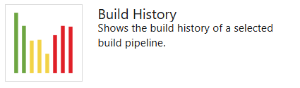   

This article provides a quick reference of all out-of-box (OOB) widgets that you can add to your dashboard. In addition to the OOB widgets, you may find additional widgets from the [Marketplace](#marketplace) or create your own.

## Supported OOB widgets

Widgets listed in the following table are provided out-of-box. They are organized under the service they support. Widgets are annotated as follows: 

::: moniker range=">= azure-devops-2019"
- **Analytics**: Widget derives data from [Analytics data](../powerbi/what-is-analytics.md)  
- **Build**: Widget derives data for a selected build pipeline  
- **Project**: indicates you can select the project and team when configuring the widget
- **Release**: Widget derives data for a selected release pipeline  
- **Team**: Widget is scoped to a single team  
- **Teams**: Widget is scoped to one or more teams
- **User**: Widget is scoped to the logged in user account
::: moniker-end

::: moniker range=">= tfs-2017 <= tfs-2018"
- **Build**: Widget derives data for a selected build pipeline  
- **Release**: Widget derives data for a selected release pipeline  
- **Team**: Widget is scoped to a single team  
- **User**: Widget is scoped to the logged in user account
::: moniker-end

::: moniker range="tfs-2015"
- **Build**: Widget derives data for a selected build pipeline  
- **Team**: Widget is scoped to a single team  
- **User**: Widget is scoped to the logged in user account
::: moniker-end

---
:::row:::
   :::column span="1":::
      ::: moniker range=">= azure-devops-2020"
      **Boards**
      - [Assigned to me](#assigned-to-me-widget) (User)
      - [Burndown chart](#burndown-analytics-widget) (Analytics, Project, Teams)    
      - [Burnup chart](#burnup-analytics-widget) (Analytics, Project, Teams)     
      - [Chart for work items](#chart-wit-widget)  
      - [Cumulative flow diagram](#cfd-widget) (Team)   
      - [Cycle time (Analytics)](#cycle-time-widget) (Analytics, Team)  
      - [Lead time (Analytics)](#lead-time-widget) (Analytics, Team) 
      - [New Work item](#new-work-item-widget)  
      - [Query results](#query-results-widget)  
      - [Query tile](#query-tile-widget)  
      - [Sprint burndown](#sprint-burndown-analytics-widget) (Analytics, Team)  
      - [Sprint burndown - Legacy](#sprint-burndown-widget) (Team)   
      - [Sprint capacity](#sprint-capacity-widget) (Team) 
      - [Sprint overview](#sprint-overview-widget) (Team)   
      - [Velocity](#velocity-widget) (Analytics, Team)  
      - [Work links](#work-links-widget)  
      ::: moniker-end
      ::: moniker range="azure-devops-2019"
      **Boards**
      - [Assigned to me](#assigned-to-me-widget) (User)
      - [Burndown chart](#burndown-analytics-widget) (Analytics)    
      - [Burnup chart](#burnup-analytics-widget) (Analytics)    
      - [Chart for work items](#chart-wit-widget)  
      - [Cumulative flow diagram](#cfd-widget)  
      - [Cycle time (Analytics)](#cycle-time-widget) (Analytics)    
      - [Lead time (Analytics)](#lead-time-widget) (Analytics)   
      - [New Work item](#new-work-item-widget)  
      - [Query results](#query-results-widget)  
      - [Query tile](#query-tile-widget)  
      - [Sprint burndown](#sprint-burndown-widget)  
      - [Sprint capacity](#sprint-capacity-widget)  
      - [Sprint overview](#sprint-overview-widget)  
      - [Velocity](#velocity-widget) (Analytics)  
      - [Work links](#work-links-widget)  
      ::: moniker-end
      ::: moniker range=">= tfs-2017 <= tfs-2018"
      **Work**
      - [Assigned to me](#assigned-to-me-widget) (User)
      - [Chart for work items](#chart-wit-widget)  
      - [New Work item](#new-work-item-widget)  
      - [Query results](#query-results-widget)  
      - [Query tile](#query-tile-widget)  
      - [Sprint burndown](#sprint-burndown-widget)  
      - [Sprint capacity](#sprint-capacity-widget)  
      - [Sprint overview](#sprint-overview-widget)  
      - [Work links](#work-links-widget)  
      ::: moniker-end
      ::: moniker range="tfs-2015"
      **Work**
      - [Chart for work items](#chart-wit-widget)  
      - [New Work item](#new-work-item-widget)  
      - [Query results](#query-results-widget)  
      - [Query tile](#query-tile-widget)  
      - [Sprint burndown](#sprint-burndown-widget)  
      - [Sprint capacity](#sprint-capacity-widget)  
      - [Sprint overview](#sprint-overview-widget)  
      - [Work links](#work-links-widget)  
      ::: moniker-end
      ---
      ::: moniker range="<= tfs-2018"
      **Repos** 
      - [Code tile](#code-tile-widget) (Repository, Branch, Folder)
      - [Pull request](#pull-request-widget) (Team, User)
      ::: moniker-end
      ::: moniker range=">= azure-devops-2019"
      **Code** 
      - [Code tile](#code-tile-widget) (Repository, Branch, Folder)
      - [Pull request](#pull-request-widget) (Team)
      ::: moniker-end
   :::column-end:::
   :::column span="1":::
      ::: moniker range=">= azure-devops-2019"
      **Pipelines**
      - [Build history](#build-history-widget) (Build pipeline)
      - [Deployment status](#deployment-status-widget) (Build pipeline)
      - [Release pipeline overview](#release-definition-widget) (Release pipeline)
      - [Requirements quality](#requirements-quality-widget) (Query, Build or Release pipeline)
      ---
      **Test Plans**
      - [Chart for test plans](#chart-test-plan-widget)
      - [Test results trend (Advanced)](#test-trend-results-advanced) (Analytics, Build or Release pipeline) 
      - [Test results trend](#test-trend-results) (Build or Release pipeline)  
      ---
      **Information and links**
      - [Embedded web page](#embedded-webpage-widget)  
      - [Markdown](#markdown-widget)  
      - [Other links](#other-links-widget)  
      - [Team members](#team-members-widget) (Team) 
      - [Visual Studio Shortcuts](#visual-studio-widget) 
      - [Welcome](#how-to-widget) 
      ::: moniker-end
      ::: moniker range=">= tfs-2017 <= tfs-2018"
      **Build & Release**
      - [Build history](#build-history-widget) (Build pipeline)
      - [Deployment status](#deployment-status-widget) (Build pipeline)
      - [Release pipeline overview](#release-definition-widget) (Release pipeline)
      - [Requirements quality](#requirements-quality-widget) (Query, Build or Release pipeline)
      ---
      **Test**
      - [Chart for test plans](#chart-test-plan-widget)
      - [Test results trend](#test-trend-results) (Build or Release pipeline)  
      ::: moniker-end
      ---
      ::: moniker range="tfs-2018"
      **Information and links**
      - [Embedded web page](#embedded-webpage-widget)  
      - [Markdown](#markdown-widget)  
      - [Other links](#other-links-widget-2018)  
      - [Team members](#team-members-widget) (Team) 
      - [Visual Studio Shortcuts](#visual-studio-widget) 
      - [Welcome](#how-to-widget) 
      ::: moniker-end
      ::: moniker range="tfs-2017"
      **Information and links**
      - [Embedded web page](#embedded-webpage-widget)  
      - [Markdown](#markdown-widget)  
      - [Other links](#other-links-widget-2018)  
      - [Team members](#team-members-widget) (Team) 
      - [Team room](#team-room-widget) (Team) 
      - [Visual Studio Shortcuts](#visual-studio-widget) 
      - [Welcome](#how-to-widget) 
      ::: moniker-end
      ::: moniker range="tfs-2015"
      **Build**
      - [Build history](#build-history-widget) (Build pipeline)
      ---
      **Information and links**
      - [Markdown](#markdown-widget)  
      - [Other links](#other-links-widget-2018)  
      - [Team members](#team-members-widget) (Team) 
      - [Team room](#team-room-widget) (Team) 
      - [Visual Studio Shortcuts](#visual-studio-widget) 
      - [Welcome](#how-to-widget) 
      ::: moniker-end
   :::column-end:::
:::row-end:::
---
 
::: moniker range="tfs-2015"
> [!NOTE]   
> Widgets and multiple dashboards are not supported features in TFS 2013, instead, you can [pin items to a team homepage](team-dashboard.md).  Consider [upgrading to the latest TFS version](https://visualstudio.microsoft.com/downloads/) to get access to the widget catalog and [multiple team dashboards](dashboards.md).  
::: moniker-end

## Prerequisites

::: moniker range="azure-devops"
- To add widgets to a dashboard, you must be a member of a project. If you don't have a project yet, [create one](../../organizations/accounts/set-up-vs.md). 
- To add widgets from the marketplace, you must be a member of the [Project Collection Administrators group or be an organization owner](../../organizations/security/lookup-organization-owner-admin.md).
- If you haven't been added as a project member, [get added now](../../organizations/accounts/add-organization-users.md).
- To add, edit, or manage a dashboard, you must have **Basic** access or greater.  
::: moniker-end

::: moniker range=">= azure-devops-2019 < azure-devops"

- To add widgets to a dashboard, you must be a member of a project. If you don't have a project yet, [create one](../../organizations/projects/create-project.md). 
- To add widgets from the marketplace, you must be a member of the [Project Collection Administrators group or be an organization owner](../../organizations/security/lookup-organization-owner-admin.md).
- If you haven't been added as a project member, [get added now](../../organizations/accounts/add-organization-users.md).
- To add, edit, or manage a dashboard, you must have **Basic** access or greater.  
::: moniker-end

::: moniker range="tfs-2017 || tfs-2018"

- To add widgets to a dashboard, you must be a member of a project. If you don't have a project yet, [create one](../../organizations/projects/create-project.md). 
- To add widgets from the marketplace, you must be a member of the [Project Collection Administrators group or be an organization owner](../../organizations/security/lookup-organization-owner-admin.md).
- If you haven't been added as a project member, [get added now](../../organizations/accounts/add-organization-users.md).
- To add, edit, or manage a team dashboard, you must have **Basic** access or greater and be a team admin, a project admin, or have [dashboard permissions](../dashboards/dashboard-permissions.md). In general, you need to be a team admin for the currently selected team to edit dashboards. Request your current team or project admin to add you as a [team admin](../../organizations/settings/add-team-administrator.md).  
::: moniker-end

::: moniker range="tfs-2015"
- To add widgets to a dashboard, you must be a member of a project. If you don't have a project yet, [create one](../../organizations/projects/create-project.md). 
- To add widgets from the marketplace, you must be a member of the [Project Collection Administrators group or be an organization owner](../../organizations/security/lookup-organization-owner-admin.md).
- If you haven't been added as a project member, [get added now](../../organizations/security/add-users-team-project.md).
- To add, edit, or manage a team dashboard, you must have **Basic** access or greater and be added to the [team administrator role for the team](../../organizations/settings/add-team-administrator.md).    

::: moniker-end

::: moniker range=">= azure-devops-2019"
## Azure Boards widgets 
::: moniker-end

::: moniker range="<= tfs-2018"
## Work widgets 
::: moniker-end

Add work tracking widgets to your dashboards to show status, progress, or trends. You [use work items to plan and track work](../../boards/backlogs/add-work-items.md). 

In addition to the widgets listed here, you can add a work item query chart to your dashboard. To learn more, see [Track progress with status and trend query-based charts](charts.md).

::: moniker range=">= tfs-2017"
:::row:::
   :::column span="1":::
      ### Assigned to me  
      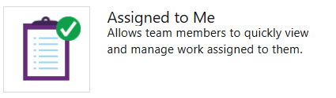  
   :::column-end:::
   :::column span="1":::
       
      
      Displays the list of active work items assigned to the currently logged in user. The list ignores closed, removed, cut, or deleted work items.
   :::column-end:::
:::row-end:::
::: moniker-end
::: moniker range=">= azure-devops-2019"
:::row:::
   :::column span="1":::
      ### Burndown chart  
      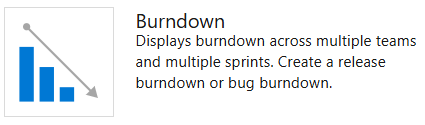  
   :::column-end:::
   :::column span="1":::
       
        
      Adds a tile that displays a burndown chart which you can configure to span one or more teams, work item types, and time period. With it, you can create a release burndown, sprint burndown, or any burndown that spans teams and sprints.    
      
      To learn more, see [Configure a Burndown or Burnup widget](configure-burndown-burnup-widgets.md).
   :::column-end:::
:::row-end:::  
::: moniker-end
::: moniker range=">= azure-devops-2019"
:::row:::
   :::column span="1":::
      ### Burnup chart  
      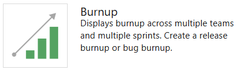  
   :::column-end:::
   :::column span="1":::
       
       	    
      Adds a tile that displays a burnup chart which you can configure to span one or more teams, work item types, and time period. With it, you can create a release burnup, sprint burnup, or any burnup that spans teams and sprints.  
      
      To learn more, see [Configure a Burndown or Burnup widget](configure-burndown-burnup-widgets.md).
   :::column-end:::
:::row-end:::  
::: moniker-end
:::row:::
   :::column span="1":::
      ### Chart for work items  
      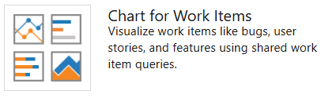  
   :::column-end:::
   :::column span="1":::
       
      <a id="chart-wit-widget" />   
      Adds a tile to display a progress or trend chart that builds off a shared work item query.   
        
      From the configuration dialog, select a shared query and [specify the chart type and values](charts.md#add-chart-widget).     
      
      ::: moniker range="tfs-2015"  
      Requires TFS 2015.2 or later version. For TFS 2015.1 and earlier versions, see [Add charts to a dashboard](add-charts-to-dashboard.md#work-item-query) to add shared query charts to a dashboard.  
      ::: moniker-end  
   :::column-end:::
:::row-end:::  
::: moniker range=">= azure-devops-2019"
:::row:::
   :::column span="1":::
      ### Cumulative flow diagram   
      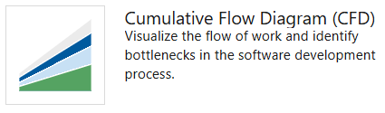  
   :::column-end:::
   :::column span="1":::
       
         
      Displays the cumulative flow of backlog items based on the time frame, team, backlog level and swimlane you select. Hover over each color within the chart to see the count of items for a particular Kanban column.  
      
      From the configuration dialog, [specify the team, backlog level, and other parameters you want](cumulative-flow.md#configure-widget). 
   :::column-end:::
:::row-end:::  
::: moniker-end
::: moniker range=">= azure-devops-2019"
:::row:::
   :::column span="1":::
      ### Cycle time  
      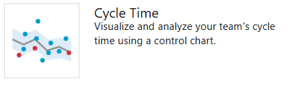  
   :::column-end:::
   :::column span="1":::
       
         
      Displays the cycle time of work items closed in a specified timeframe for a single team and backlog level. The cycle time of a work item is defined as the time taken to close a work item after work on it has started. Each marker on the chart corresponds to one or more work items with a particular cycle time. The lower the cycle time, the faster work is progressing through your development pipeline.  
      
      To learn more, see [Lead time and cycle time control charts](cycle-time-and-lead-time.md).
   :::column-end:::
:::row-end:::  
::: moniker-end
::: moniker range=">= azure-devops-2019"
:::row:::
   :::column span="1":::
      ### Lead time  
      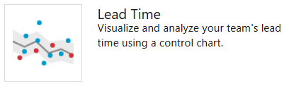  
   :::column-end:::
   :::column span="1":::
       
          
      Displays the lead time of work items closed in a specified timeframe for a single team and backlog level. The lead time of a work item is defined as the time taken to close a work item after it was created.  
      Each marker on the chart corresponds to one or more work items with a particular lead time. The lower the lead time, the faster work is being delivered to the customer.   
      
      To learn more, see [Lead time and cycle time control charts](cycle-time-and-lead-time.md). 
   :::column-end:::
:::row-end:::  
::: moniker-end
:::row:::
   :::column span="1":::
      ### New Work item
      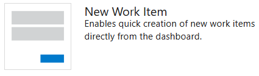  
   :::column-end:::
   :::column span="1":::
       
      
      Enables you to add work items from the dashboard. Work items that you add using this widget are automatically scoped to the team's default area path and the team's current sprint or default iteration.  
      
      To change team defaults, see [About teams and Agile tools](../../organizations/settings/about-teams-and-settings.md).  
      ::: moniker range="tfs-2015"
      Requires TFS 2015.1 or later version. 
      ::: moniker-end
   :::column-end:::
:::row-end:::  
:::row:::
   :::column span="1":::
      ### Query results 
      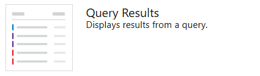  
   :::column-end:::
   :::column span="1":::
       
       
      Adds a configurable tile that lists the results of a shared query. 
      From the configuration dialog, select either a team favorite or shared query.  
      
      To create a shared query, see [Use the query editor to list and manage queries](../../boards/queries/using-queries.md).
   :::column-end:::
:::row-end:::  
:::row:::
   :::column span="1":::
      ### Query tile 
      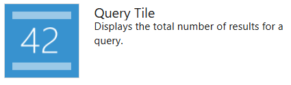  
   :::column-end:::
   :::column span="1":::
       
       
      Adds a configurable tile to display the summary of a shared query results.
      From the configuration dialog, select either a team favorite or shared query. You can optionally specify rules to change the query tile color based on the number of work items returned by the query. 
      
      To create a shared query, see [Use the query editor to list and manage queries](../../boards/queries/using-queries.md). 
   :::column-end:::
:::row-end:::  
::: moniker range=">= azure-devops-2020"
:::row:::
   :::column span="1":::
      ### Sprint burndown (Analytics)  
      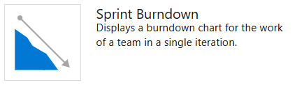  
   :::column-end:::
   :::column span="1":::
       
      
      Adds a team's burndown chart for a sprint to the dashboard. This widget is based on Analytics data. You have several configuration options for this widget, including selecting a team, iteration, and time period.   
      
      Teams [use the burndown chart to mitigate risk and check for scope creep](configure-sprint-burndown.md) throughout the sprint cycle. 
   :::column-end:::
:::row-end:::
::: moniker-end
::: moniker range=">= azure-devops-2020"
:::row:::
   :::column span="1":::
      ### Sprint burndown (Legacy) 
      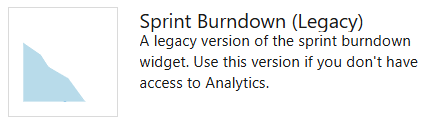  
   :::column-end:::
   :::column span="1":::
       
        
      Adds the team's burndown chart for the current sprint to the dashboard. This chart always displays data for the current sprint.   
      
      Teams [use the burndown chart to mitigate risk and check for scope creep](configure-sprint-burndown.md) throughout the sprint cycle. 
   :::column-end:::
:::row-end::: 
::: moniker-end
::: moniker range="< azure-devops-2020"
:::row:::
   :::column span="1":::
      ### Sprint burndown 
     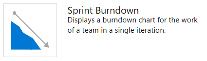  
   :::column-end:::
   :::column span="1":::
       
      
      Adds the team's burndown chart for the current sprint to the dashboard. This chart always displays data for the current sprint.    
      
      Teams [use the burndown chart to mitigate risk and check for scope creep](configure-sprint-burndown.md) throughout the sprint cycle. 
   :::column-end:::
:::row-end:::
::: moniker-end
:::row:::
   :::column span="1":::
      ### Sprint capacity 
      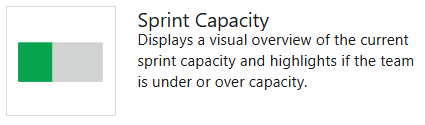  
   :::column-end:::
   :::column span="1":::
       
       
      Inserts the team's capacity bar chart for the current sprint. 
      To plan and monitor their sprint resources, team set capacity and update Remaining Work throughout the sprint.    
      
      See [Set capacity](../../boards/sprints/set-capacity.md).
   :::column-end:::
:::row-end:::
:::row:::
   :::column span="1":::
      ### Sprint overview 
      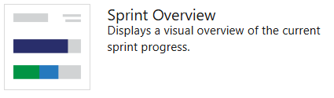  
   :::column-end:::
   :::column span="1":::
       
            
      
      
      ::: moniker range=">= tfs-2017"
      Inserts a configurable overview of sprint progress. You can choose between a count of story points or number of work items.    
      
      Teams [plan their sprints by defining sprints](../../organizations/settings/set-iteration-paths-sprints.md) and [assigning backlog items to an iteration](../../boards/sprints/assign-work-sprint.md). 
      ::: moniker-end   
      
      
      ::: moniker range=" tfs-2015"
      Inserts a visual overview of sprint progress indicating the number of backlog items in progress, completed, or not started.    
      
      Teams [plan their sprints by defining sprints](../../organizations/settings/set-iteration-paths-sprints.md) and [assign backlog items to an iteration](../../boards/sprints/assign-work-sprint.md). 
      ::: moniker-end
   :::column-end:::
:::row-end:::
::: moniker range=">= azure-devops-2019"
:::row:::
   :::column span="1":::
      ### Velocity   
     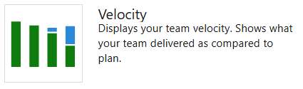  
   :::column-end:::
   :::column span="1":::
       
      The Velocity widget tracks a team's capacity to deliver work sprint after sprint. You configure the widget by selecting a team, a work item type, an aggregation field, and the number of sprints. The widget takes advantage of Analytics data. You can track the velocity for a single team, not multiple teams.    
      
      For additional guidance, see [Velocity](team-velocity.md).
   :::column-end:::
:::row-end:::
::: moniker-end
:::row:::
   :::column span="1":::
      ### Work links 
     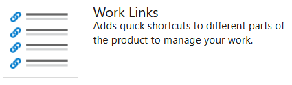  
   :::column-end:::
   :::column span="1":::
       
       
      Provides quick access to open the following Agile tools and team resources:     
      
      - [Backlog](../../boards/backlogs/create-your-backlog.md)   
      - [Kanban board](../../boards/boards/kanban-basics.md)    
      - [Task board](../../boards/sprints/task-board.md)    
      - [Queries](../../boards/queries/using-queries.md)  
   :::column-end:::
:::row-end:::

::: moniker range=">= azure-devops-2019"
## Azure Repos widgets 
::: moniker-end

::: moniker range=">= tfs-2015 <= tfs-2018"
## Code widgets
::: moniker-end

Add code tracking widgets to track changes made within a repository or get quick access to Git pull requests for your team.  

:::row:::
   :::column span="1":::
      ### Code tile 
     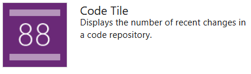  
   :::column-end:::
   :::column span="1":::
       
       
      Adds a configurable tile to display the summary of a code folder or Git repository. To configure, simply choose the added tile, select a repository, select a branch (Git only) and select a path. The code tile supports both TFVC and Git repositories. 
   :::column-end:::
:::row-end:::
:::row:::
   :::column span="1":::
      ### Pull request 
      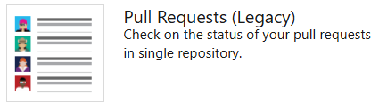  
   :::column-end:::
   :::column span="1":::
       
       
      Adds a configurable widget to display active pull requests requested by the team, or assigned to or requested by the person logged in. Select the team and  Git repository for the pull requests of interest.   
      
      To learn more about pull requests, see [Review code with pull requests](../../repos/git/pull-requests.md).
   :::column-end:::
:::row-end:::

::: moniker range=">= azure-devops-2019"
## Azure Pipelines widgets 

Add build and release pipeline widgets to track the health of your builds and releases.  
::: moniker-end

::: moniker range=">= tfs-2017 <= tfs-2018"
## Build and Release widgets

Add build and release pipeline widgets to track the health of your builds and releases.  
::: moniker-end

::: moniker range="tfs-2015"
## Build and Release widgets
Add the Build History pipeline widget to track the health of your builds.  
::: moniker-end

:::row:::
   :::column span="1":::
      ### Build history  
        
   :::column-end:::
   :::column span="1":::
       
       
      Adds a tile to display a histogram of all builds run for the configured build pipeline.
      From the configuration dialog, select the build you want to monitor. 
      Hover over a bar to learn how long the build took to complete. Choose the bar to open the summary for that specific build. Bar color indicates: green-completed, red-failed, and yellow-completed without tests. 
   :::column-end:::
:::row-end:::
::: moniker range=">= tfs-2017"
:::row:::
   :::column span="1":::
      ### Deployment status 
      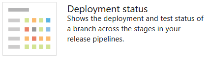  
   :::column-end:::
   :::column span="1":::
       
       
      Configurable widget that shows a consolidated view of the deployment status and test pass rate across multiple environments for a recent set of builds. You configure the widget by specifying a build pipeline, branch, and linked release pipelines.  
      In order to view the test summary across multiple environments in a release, the widget provides a matrix view of each environment and corresponding test pass rate.   
      
      You can choose any cell to see a more [detailed view](../../pipelines/test/review-continuous-test-results-after-build.md) for the selected environment.  
      Requires TFS 2017.1 or later version. 
   :::column-end:::
:::row-end:::
::: moniker-end
::: moniker range=">= azure-devops-2019"
:::row:::
   :::column span="1":::
      ### Release pipeline overview 
      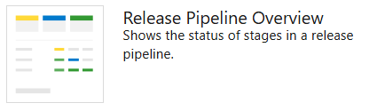  
   :::column-end:::
   :::column span="1":::
       
       
      Configurable widget that you can use to view and track the status of a release pipeline. This widget shows the release as a series of environments, with the name of the release and the date or time it was started.   
      
      The color of the heading and the icon in each environment indicate the current status of the release, which are the same as are used on the **Releases** page. Select a release pipeline in the left column to filter the list to just releases for that pipeline.
   :::column-end:::
:::row-end:::
::: moniker-end
::: moniker range=">= tfs-2017"
:::row:::
   :::column span="1":::
      ### Requirements quality 
      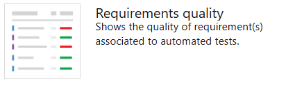  
   :::column-end:::
   :::column span="1":::
       
        
      Configurable widget that you can use to track quality continuously from a build or release pipeline. The widget shows the mapping between a requirement and latest test results executed against that requirement. It provides insights into requirements traceability e.g. requirements not meeting the quality, requirements not tested etc.   
      
      To learn more about setting up traceability see [Requirements traceability](../../pipelines/test/requirements-traceability.md) 
   :::column-end:::
:::row-end:::
::: moniker-end

::: moniker range=">= azure-devops-2019"
## Azure Test Plans widgets 
::: moniker-end

::: moniker range=">= tfs-2017 <= tfs-2018"
## Test widgets  
::: moniker-end

Add test tracking widgets to your dashboards to show status, progress, or trends of your testing efforts. In addition to the widgets listed here, you can add test tracking charts to your dashboard. To learn more, see [Track test status](../../test/track-test-status.md).

::: moniker range=">= tfs-2017"
:::row:::
   :::column span="1":::
      ### Chart for test plans  
      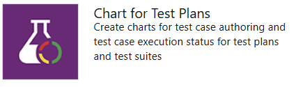 
   :::column-end:::
   :::column span="1":::
       
       
      Adds a configurable widget that lets you track the progress of test case authoring or status of test execution for tests in a test plan. Get started by selecting a test plan and a test suite. Then select test case chart for test authoring progress or test results for test execution progress. Finally, select the chart type and the pivots.    
      
      To learn more, see [Track your test results](../../test/track-test-status.md).
   :::column-end:::
:::row-end:::
::: moniker-end
::: moniker range=">= tfs-2017"
:::row:::
   :::column span="1":::
      ### Test results trend 
      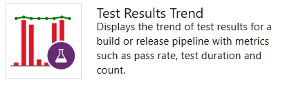 
   :::column-end:::
   :::column span="1":::
       
       
      Adds a configurable tile that displays the trend of test results, such as passed or failed tests, for the selected build or release pipeline. The widget helps you visualize the test trends over a period of time, thereby surfacing patterns about test failures, test duration etc.    
      
      From the configuration dialog, select the build or release whose test results you'd like to monitor. There are multiple chart options to choose from (Line, Column & Stacked Column) based on your preference. Optionally you can map the trend of test duration on the existing chart by adding a secondary line chart.    
      
      To get deeper insights and higher configurability view [Test Analytics](../../pipelines/test/test-analytics.md)
   :::column-end:::
:::row-end:::
::: moniker-end
::: moniker range=">= azure-devops-2019"
:::row:::
   :::column span="1":::
      ### Test Results Trend (Advanced)
   :::column span="1":::
      > [!div class="mx-imgBorder"]  
      > 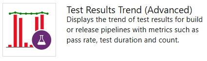 
   :::column-end:::
   :::column span="1":::
       
      
      The Test Results Trend (Advanced) widget provides near real-time visibility into test data for multiple builds and releases. The widget shows a trend of your test results for selected pipelines. You can use it to track the daily count of test, pass rate, and test duration. Tracking test quality over time and improving test collateral is key to maintaining a healthy DevOps pipeline.  
      The widget supports tracking advanced metrics for one or more build pipelines or release pipelines. The widget also allows filtering of test results by outcome, stacking metrics, and more.     
      
      To learn more, see [Configure the Test Results Trend (Advanced) widget](./configure-test-results-trend.md).
   :::column-end:::
:::row-end:::
::: moniker-end

## Informational content and other links 

Add one or more of the following widgets to support adding configurable content or links to features or functions your team accesses often.

::: moniker range=">= tfs-2017"
:::row:::
   :::column span="1":::
      ### Embedded web page 
      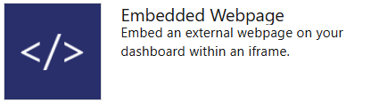 
   :::column-end:::
   :::column span="1":::
       
       
      Adds a configurable tile to display the contents of a web page.    
      
      Only webpages that allow [iframe embedding](https://go.microsoft.com/fwlink/?LinkId=808035) are supported.
   :::column-end:::
:::row-end:::
::: moniker-end
:::row:::
   :::column span="1":::
      ### Markdown 
      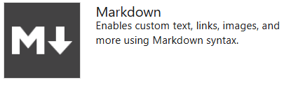 
   :::column-end:::
   :::column span="1":::
       
           
      
      ::: moniker range=">= tfs-2017"
      Adds a configurable tile to display any type of information, guidance, or links that you want. You can also configure the widget to point to a file stored in your repository. From the configuration dialog, add the information you want to share with your team.    
      
      To learn more, see [Add Markdown to a dashboard](add-markdown-to-dashboard.md). 
      ::: moniker-end   
      
      
      ::: moniker range="tfs-2015"
      Adds a configurable tile to display any type of information, guidance, or links that you want. From the configuration dialog, add the information you want to share with your team.    
      
      To learn more, see [Add Markdown to a dashboard](add-markdown-to-dashboard.md).  
      Requires TFS 2015.1 or later version. For TFS 2015.2 or later versions, you can configure the widget to point to a file stored in your repository.   
      ::: moniker-end
   :::column-end:::
:::row-end::: 
::: moniker range=">= azure-devops-2019"
:::row:::
   :::column span="1":::
      ### Other links 
      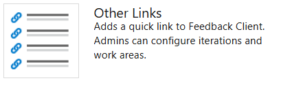  
   :::column-end:::
   :::column span="1":::
       
         
      Provides links to the following features:   
      
      - [Opens a form to initiate a request to provide feedback](../../project/feedback/get-feedback.md)   
      - [Opens the team's quick dialog to add or modify the active sprints or iteration paths for your team](../../boards/sprints/define-sprints.md)   
      - [Opens the team's quick dialog to modify your team's area path](../../organizations/settings/set-area-paths.md).   
   :::column-end:::
:::row-end:::  
::: moniker-end
::: moniker range="< azure-devops-2019"
:::row:::
   :::column span="1":::
      ### Other links 
        
   :::column-end:::
   :::column span="1":::
       
         
      The following links are displayed when the corresponding resource is configured for the project:    
      
      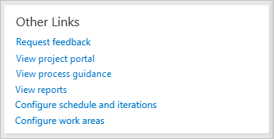  
      - [View project portal](/previous-versions/azure/devops/report/sharepoint-dashboards/share-information-using-the-project-portal)  
      - [View process guidance](../../project/configure-or-redirect-process-guidance.md)  
      - [View reports](../sql-reports/reporting-services-reports.md)  
      
      To add or update reports for a project, see [Add reports to a project](../admin/add-reports-to-a-team-project.md).
   :::column-end:::
:::row-end:::  
::: moniker-end
:::row:::
   :::column span="1":::
      ### Team members 
      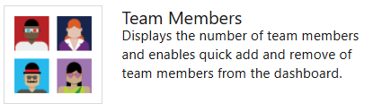 
   :::column-end:::
   :::column span="1":::
       
       
      Shows team member profiles and, on-hover, their user alias.    
      
      For team admins, supports access to the quick dialog to [add or remove team members](../../organizations/settings/add-teams.md).     
      
      > [!NOTE]  
      > This widget is a convenient way to add team members to specific teams within projects.  If you remove it, you can still [add members to your team from the team administration page](../../organizations/settings/add-teams.md#add-team-members).  
   :::column-end:::
:::row-end:::
::: moniker range=">= tfs-2015 <= tfs-2017"
:::row:::
   :::column span="1":::
      ### Team room  
       
   :::column-end:::
   :::column span="1":::
       
       
      Provides status and access to [team rooms](/previous-versions/azure/devops/notifications/collaborate-in-a-team-room). Available for TFS 2015.1 through TFS 2017.2 versions.  
      Team rooms support increased team productivity by providing a space to discuss work in progress, ask questions, share status, and clarify issues that arise. Team administrators can create additional team rooms.     
      
      > [!NOTE]  
      > Team Rooms have been deprecated as described in [Deprecation of Team Rooms](https://devblogs.microsoft.com/devops/deprecation-of-the-team-rooms-in-team-services-and-tfs/) blog post. Several good solutions are available that integrate well with TFS that support notifications and chat, such as [Microsoft Teams](https://marketplace.visualstudio.com/items?itemName=ms-vsts.vss-services-teams) and [Slack](../../service-hooks/services/slack.md).
   :::column-end:::
:::row-end:::
::: moniker-end
:::row:::
   :::column span="1":::
      ### Visual Studio Shortcuts 
      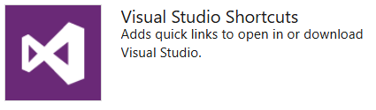 
   :::column-end:::
   :::column span="1":::
       
       
      Provides links to open or download Visual Studio.    
      
      The Visual Studio IDE client comes with the [Team Explorer plug-in](../../user-guide/work-team-explorer.md) which provides quick access to several features (some of which aren't available through the web portal).
   :::column-end:::
:::row-end:::
:::row:::
   :::column span="1":::
      ### Welcome 
      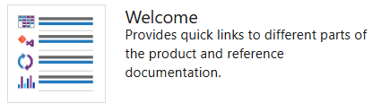 
   :::column-end:::
   :::column span="1":::
       
          
      Provides links to the **Boards/Boards (Work/Boards)**, **Repos (Code)**, and **Pipelines (Build or Build-Release)** pages and reference documentation on how to add charts.
   :::column-end:::
:::row-end:::

<a id="marketplace" />

## Marketplace widgets

You may find additional widgets of interest from the [Marketplace](https://marketplace.visualstudio.com/search?term=webpage%20widget&target=VSTS&sortBy=Relevance).  

If your organization owner or project collection administrator disables a marketplace widget, you'll see the following image: 

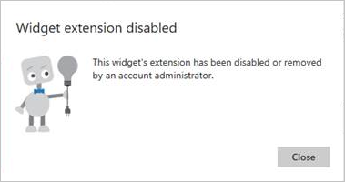   

To regain access to it, request your admin to reinstate or reinstall the widget. 

## Extensibility 

Using the REST API service, you can [create a dashboard widget](../../extend/develop/add-dashboard-widget.md). To learn more about the REST APIs for dashboards and widgets, see [Dashboards (API)](/rest/api/azure/devops/dashboard/dashboards).

  

## Related articles

- [Track progress with status and trend query-based charts](charts.md)
- [Add, rename, and delete dashboards](dashboards.md)  
- [Add charts and widgets to a dashboard](add-widget-to-dashboard.md)  
- [Add Markdown to a dashboard](add-markdown-to-dashboard.md)
