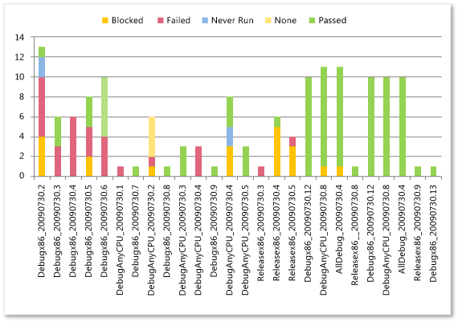

# Build Quality Excel Report

[!INCLUDE [temp](../_shared/tfs-sharepoint-version.md)]

> [!IMPORTANT]  
> This report is only applicable for XAML builds, which are deprecated for TFS 2018 and later versions. If your build process isn't based on XAML builds, this report and the TFS Warehouse for builds won't yield any meaningful data.  

Teams who are responsible for testing software can use the Build Quality report to help monitor the success or failure rate of test activity with each build. The Build Quality report provides the following reports, which show the test results for all build pipelines for a team project.  
  
-   **Build Verification Testing**: Helps the team monitor the quality of builds by showing test results for all automated tests that are marked as Build Verification Test (BVT) that are run during the build process.  
  
-   **Test Activity Per Build**: Helps the team monitor the quality of builds by showing test results for all tests that have been run against the build for all or selected test plans.  
  
    > [!NOTE]
    >  You can view the Build Quality report if you open Team Explorer, open the team project, open the **Excel Reports** folder, and open the **Test Team Management** folder. You can access this folder only if your team project portal has been enabled and is configured to use SharePoint Server Enterprise Edition. For more information, see [Share information using the project portal](../sharepoint-dashboards/share-information-using-the-project-portal.md).  
  
 These reports are available only when the team creates test plans and starts to run tests by using Microsoft Test Manager. For information about how to define test suites and test plans, see [Plan your tests](../../test/create-test-cases.md). For information about how to access this report, see [Excel reports](excel-reports.md).  
  
 **Required permissions**  
  
 To view the report, you must be assigned or belong to a group that has been assigned the **Read** permissions in SharePoint Products for the team project.  
  
 To modify or customize the report, you must be a member of the **TfsWarehouseDataReaders** security role in SQL Server Analysis Services. You must also be assigned or belong to a group that has been assigned the **Members** permissions in SharePoint Products for the team project. For more information, see [Grant Access to the Databases of the Data Warehouse for Team System](../admin/grant-permissions-to-reports.md).  
  
##   Data in the reports  
 The Build Quality reports illustrate the cumulative count of test results for all build pipelines for a team project. Both reports are based on PivotTable reports that access data that is stored in the data warehouse. The count that is shown in each report is a count of the most recent version of each test result in a particular build.  
  
 **Build verification testing**  
  
   
  
 **Test activity per build**  
  
   
  
 The following table describes the report filters and fields that are used in the PivotTables that generate the Build Quality reports.  
  
|Filters|Fields|  
|-------------|------------|  
|-   **Team Project - Team Project Hierarchy**: Includes build results for build pipelines that are defined for the selected team project. -   **Test Result - Iteration Hierarchy**: Includes test results that were run from test cases that were assigned to the selected iterations. -   **Test Result - Area Hierarchy**: Includes test results that were run from test cases that were assigned to the selected product areas. -   **Build - Build Pipeline Name**: Includes test results that were run against builds that belong to the selected build pipelines.   **Filter specific to the Build Verification Testing report**:   -   **Test Run - Is Build Verification Run**: Includes test results from all automated tests that were run during the build process and configured as BVT.|-   **Test Result - Outcome**: The outcome of the test (for example, Blocked, Never Run, Failed, None, and Passed). -   **(Measure) Test Result - Build Result Count Trend**: Counts the most recent version of each test result in a particular build. -   **Build - Build Name**: The name of the build. Each time that a build is run, it is assigned a name that contains the build pipeline name as its prefix.|  
  
###   Required activities for monitoring build quality  
 For the Build Quality report to be useful and accurate, the team must perform the following activities:  
  
-   Define test cases and test plans, and assign test cases to the test plans.  
  
-   **Define tests to run automatically as part of the build**. As part of the build pipeline, you can define tests to run as part of the build or to fail if the tests fail.  
  
     For more information, see [Run tests in your build process](../../pipelines/test/test-build.md).  
  
-   **Run builds regularly**. You can run builds at set intervals or after every check-in. You can create regular builds when you use the schedule trigger.  
  
     For more information, see [Get started with CI/CD](../../pipelines/get-started-designer.md).  
  
-   **Run tests**. For more information, see [Run your tests](../../test/run-manual-tests.md).  
  
-   (Optional) To support filtering, assign **Iteration** and **Area** paths to each test case.  
  
    > [!NOTE]
    >  The project administrator for each team project defines area and iteration paths for that project so that the team can track progress by those designations. For more information, see[Define area paths](../../organizations/settings/set-area-paths.md) or [Define iteration paths](../../organizations/settings/set-iteration-paths-sprints.md) .  
  
##   Updating and customizing the report  
 You can update the Build Quality report by opening it in Office Excel and changing the filter options for the PivotTable report for one of the worksheets. You can customize each report to support other views, as the following table describes.  
  
|View|Action|  
|----------|------------|  
|Build quality for select iterations|Change the filter for **Iteration** (default=All)|  
|Build quality for select product areas|Change the filter for **Area** (default=All)|  
|Build quality for select build pipelines|Change the filter for **Build Pipeline Name** (default=All)|  
|Build quality for the most recent six, eight, or more weeks|In the Columns PivotTable Field List, add the **Date - Sets** field and select **@@Last 6 weeks@@** or other set|  
  
 For more information about how to work with and customize PivotTables and PivotChart reports, see the following pages on the Microsoft Web site:  
  
-   [Ways to customize PivotTable reports](http://go.microsoft.com/fwlink/?LinkId=165722)  
  
-   [Edit or remove a workbook from Excel Services](http://go.microsoft.com/fwlink/?LinkId=165723)  
  
-   [Publish a workbook to Excel Services](http://go.microsoft.com/fwlink/?LinkId=165724)  
  
-   [Save a file to a SharePoint library or another Web location](http://go.microsoft.com/fwlink/?LinkId=165725)  
  
## Related notes 
 [Excel reports](excel-reports.md)
