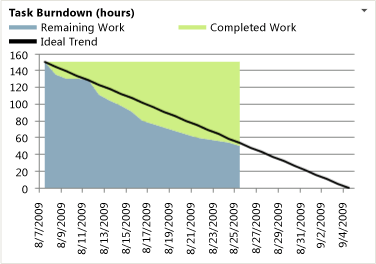

# Burndown Excel Report

[!INCLUDE [temp](../_shared/tfs-sharepoint-version.md)]

You can use the Burndown report to help determine how much progress the team has made in completing work for an iteration or other interval of time. The report shows how many hours of work the team has completed and how many hours remain. For information about how to access this report, see [Excel reports](excel-reports.md).  
  
> [!NOTE]
>  You can view the Burndown report from the Progress dashboard. You can access this dashboard only if your team project portal has been enabled and is provisioned to use Microsoft Office SharePoint Server 2007. For more information, see [Configure or redirect process guidance](../sharepoint-dashboards/configure-or-redirect-process-guidance.md).  
  
 **Required Permissions**  
  
 To view the report, you must be assigned or belong to a group that has been assigned the **Read** permissions in SharePoint Products for the team project.  
  
 To modify or customize the report, you must be a member of the **TfsWarehouseDataReaders** security role in SQL Server Analysis Services. You must also be assigned or belong to a group that has been assigned the **Members** permissions in SharePoint Products for the team project. For more information, see [Grant Access to the Databases of the Data Warehouse for Team System](../admin/grant-permissions-to-reports.md).  
  
##   Data in the Report  
 The Burndown report shows a stacked area chart of the **Completed Work** and **Remaining Work** hours that have been tracked for all Tasks during the time interval set for the report. The default interval is the current week through the next three weeks.  
  
   
  
 The **Ideal Trend** line calculates a slope or trajectory for when the team will complete work based on the amount of work that remains and the end date of the report. A healthy Burndown chart shows that the team is making steady progress toward finishing the work. The line is drawn from the remaining work on the start date and intersects the x-axis on the end date.  
  
##   Required Activities for Tracking Burndown  
 For the Burndown chart to be useful and accurate, the team must perform the following activities:  
  
-   Define Tasks, and specify the **Iteration** and **Area** paths for each.  
  
-   Specify and update the **Completed** and **Remaining** fields for each Task as the team works on it.  
  
    > [!IMPORTANT]
    >  If you subdivide a Task into subtasks, specify hours only for the subtasks. These hours are rolled up as summary values for the parent Task and User Story.  
  
##   Interpreting the Report  
 You can review the Burndown report to determine the progress that the team made during an iteration. For example, you can find answers to the following questions:  
  
-   How fast is the team completing remaining work?  
  
-   Is the team adding work during the iteration? Is the team allowing scope creep?  
  
-   How much work can the team complete in the available time?  
  
-   When can the team finish the work?  
  
-   When can the team finish the current iteration?  
  
##   Updating and Customizing the Report  
 You can update the Burndown report by opening the report in Office Excel and changing the filter options for the PivotTable report or change the start date for the report. You can customize this report to support other views as the following table describes.  
  
|View|Action|  
|----------|------------|  
|Burndown for an iteration|Change the filter for **Iteration** (default=All)|  
|Burndown for a product area|Change the filter for **Area** (default=All)|  
|Burndown for a specific time interval|In the **Reports** worksheet, perform the following steps:   1.  In the cell under **Date**, specify the start date of the time interval in either mm/dd or mm/dd/yyyy format. 2.  Click the cell that contains the start date that you just specified, and then drag the fill handle across the cells that you want to fill. 3.  (Optional) Use the **Auto Fill Options** button  to specify how to fill the selection. For example, you can specify **Fill Series** or **Fill Weekdays**.      For more information, see the following page on the Microsoft Web site: [Fill data in worksheet cells](http://go.microsoft.com/fwlink/?LinkID=165808). 4.  On the **Data** tab, in the **Connections** group, click **Refresh All.**|  
  
 For more information about how to work with and customize PivotTable and PivotChart reports, see the following pages on the Microsoft Web site:  
  
-   [Ways to customize PivotTable reports](http://go.microsoft.com/fwlink/?LinkId=165722)  
  
-   [Edit or remove a workbook from Excel Services](http://go.microsoft.com/fwlink/?LinkId=165723)  
  
-   [Publish a workbook to Excel Services](http://go.microsoft.com/fwlink/?LinkId=165724)  
  
-   [Save a file to a SharePoint library or another Web location](http://go.microsoft.com/fwlink/?LinkId=165725)  
  
## Related notes
 [Excel reports](excel-reports.md)