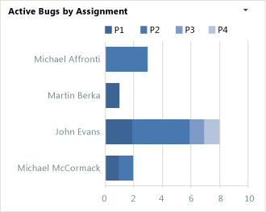
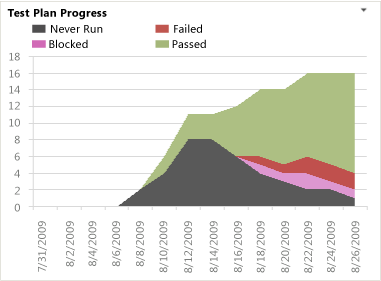
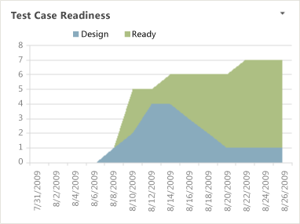

# Excel reports (CMMI)

[!INCLUDE [temp](../_shared/tfs-sharepoint-version.md)]

You can use the Excel reports to display information from the data warehouse for your team project. this article describes reports that are provided with the [CMMI process template](../../boards/work-items/guidance/cmmi-process.md).  
  
If you want to export work items to Excel, see [Bulk add or modify work items with Excel](../../boards/backlogs/office/bulk-add-modify-work-items-excel.md). Or, if you want to create an Excel report from a query, see [Create Excel reports from a work item query](create-status-and-trend-excel-reports.md).  

> [!NOTE]
>  These reports require your team project portal to be configured with SharePoint Server Enterprise Edition. Also, you can view these reports in your team project's [portal dashboards](../sharepoint-dashboards/project-portal-dashboards.md).  
>   
>  If the project collection where your team project is stored is configured with SQL Server Reporting Services, you can use Report Manager to view and filter the same information that the Excel reports provide. See [Reporting Services Reports](../sql-reports/reporting-services-reports.md).  
  
 You can access the Microsoft Excel reports from the **Documents** folder  
  
## Requirements  
 To access and use the Microsoft Excel reports, the following configurations must be met:  
  
-   To access an Microsoft Excel report, your team project must have been configured with a project portal based on SharePoint Server Enterprise Edition.  
  
-   To open a report in Microsoft Excel that connects to the operational data store for Team Foundation, you must have the Team Foundation Office Integration add-in installed on your client computer. This add-in is installed when you install any product in Visual Studio ALM.  
  
 To view or modify an Excel report that is stored under the Documents node for a team project, you must be assigned or belong to a group that has been assigned **Read** permissions for Team Foundation. You must also be assigned the **Visitors** or **Members** permissions, respectively, in SharePoint Products for the team project.  
  
 In addition, all Microsoft Excel reports that appear in the enterprise dashboards contain data from the Analysis Services cube. You can view enterprise dashboards only if the team project portal is hosted on a server that is running SharePoint Server Enterprise Edition.  
  
 To view, refresh, or create an Excel report from an enterprise dashboard, you must configure the SharePoint web application definition to either use Single Sign-On or Windows Authentication. The following restrictions apply based on the authentication service that you configure.  
  
> [!IMPORTANT]
>  You must configure the SharePoint web application for Single Sign-On if you do not want to add users as members of the **TfsWarehouseDataReaders** security role in SQL Server Analysis Services. You must also configure the application for Single Sign-on if the team project portal is configured to use NTLM authentication and is not installed on the data-tier server.  
  
-   **For Single Sign-On Authentication (Recommended)**  
  
     To authenticate viewers of enterprise dashboards by using Single Sign-On, you must perform the following actions:  
  
    -   You must configure the SharePoint web application to use Single Sign-on. For more information about how to configure Single Sign-on, see [Configure authentication infrastructure in SharePoint 2013](http://msdn.microsoft.com/library/jj219795.aspx).  
  
    -   You must add dashboard viewers to a group that is granted access to the Single Sign-on enterprise application definition.  
  
-   **For Windows Authentication**  
  
     To authenticate viewers of enterprise dashboards by using Windows Authentication, you must perform the following actions:  
  
    -   You must either host the team project portal on the data-tier server, or you must configure the SharePoint web application to use Kerberos authentication.  
  
    -   You must add users to the **TfsWarehouseDataReaders** security role in SQL Server Analysis Services.  
  
 The following table summarizes the required permissions based on activity. For information about how to grant these permissions to team members, see [Add users to team projects](../../organizations/security/add-users-team-project.md). For information about permissions that are required to work with Excel reports in general, see [Grant permissions to view and manage reports](../admin/grant-permissions-to-reports.md).  
  
|Activity|Team Foundation Server|Team project portal|SQL Server Analysis Services cube (Tfs_Analysis)|Notes|  
|--------------|------------------------------------------------------------------|-------------------------|----------------------------------------------------------------------------------------------------------|-----------|  
|View or refresh an Excel report that is opened from the Documents node for Team Explorer|Readers|Visitors|TfsWarehouseDataReader role|To access the Documents node for a team project, you must belong to the **Team Foundation Valid Users** security group. If the necessary security permissions are set explicitly, your **View project-level information** permission on the team project must be set to **Allow**.|  
|View or refresh an Excel report that appears in an enterprise dashboard||Visitors|Requirements depend on the authentication that is configured for the SharePoint web application|In addition to **Visitors** or **Read** permissions, you must belong to a group that is granted access to the `TfsWarehouseDataReader` role or the Single Sign-on enterprise application definition for the SharePoint web application.|  
|Run a work item query, and then use the **Create Report in Microsoft Excel** feature|Readers||TfsWarehouseDataReader role|In addition to these permissions, you may need permission to open a team query. For more information, see [Set permissions on queries](../../boards/queries/set-query-permissions.md).   Also, if you want to save the resulting workbook to the project portal, you must belong to the **Members** group for the portal.|  
|Open a dashboard, and use the **New Excel Report** feature||Visitors|TfsWarehouseDataReader role|The **New Excel Report** button is available only if reporting is configured for the project collection that hosts the team project.|  
|Create a report from Microsoft Excel that connects directly to the Analysis Services cube|||TfsWarehouseDataReader role|If you want to save the resulting workbook to the project portal, you must belong to the **Members** group for the portal.|  
|Manage Excel reports from the Documents node|Readers|Members||To save files under the Documents node, you must belong to the **Members** group for the team project portal. For more information, see [Manage documents and document libraries](../sharepoint-dashboards/manage-documents-and-document-libraries.md).|  
  
  
##   Project management  
 Team members can use the reports in the following table to help track the rate of the team's progress toward completing Tasks, finishing Requirements, and meeting their iteration plan.  
  
|Data in the report|Report and related topic|  
|------------------------|------------------------------|  
|A visual representation of the cumulative count of all hours for all Tasks for the past four weeks.   |[Burndown](burndown-excel-report.md)|  
|A visual representation of the cumulative count of all active and closed Tasks for the past four weeks.   |[Task Progress](task-progress-excel-report.md)|  
|A visual representation of the cumulative count of all Requirements, grouped by their state, for the past four weeks.   |[Requirements Progress Excel Report](requirements-progress-excel-report-cmmi.md)|  
|Line chart that shows the rolling average of the number of Issues that the team has opened and closed for the past four weeks. The rolling average is based on the seven days before the date for which it is calculated.   |[Issue Trends](issue-trends-excel-report.md)|  
  
##   Bug backlog management  
 Team members can use the reports in the following table to help track the bugs that the team finds and the progress that the team makes towards fixing them. These reports are displayed in the Bugs dashboard, For more information, see [Bugs](../sharepoint-dashboards/bugs-dashboard-agile-cmmi.md).  
  
|Data in the report|Report and related topic|  
|------------------------|------------------------------|  
|A visual representation of the cumulative count of all Bugs, grouped by their state for the past four weeks.   |[Bug Progress](bug-progress-excel-report.md)|  
|Line chart that shows the rolling average of the number of Bugs that the team has opened, resolved, and closed for the past four weeks. The rolling average is based on the seven days before the date for which it is calculated.   |[Bug Trends](bug-trends-excel-report.md)|  
|A visual representation of the cumulative count of all Bugs, grouped by their priority for the past four weeks.   |[Bugs by Priority](bugs-by-priority-excel-report.md)|  
|A horizontal bar chart with the total count of Bugs that each team member has currently assigned to them in the active state, grouped by priority.   |[Bugs by Assignment](bugs-by-assignment-excel-report.md)|  
|A stacked area graph of the number of Bugs that have been reactivated from the resolved or closed state within the past four weeks.    **Note:**  The Bug Reactivations report is displayed on the Quality dashboard. For more information, see [Quality](../sharepoint-dashboards/quality-dashboard-agile-cmmi.md).|[Bug Reactivations](bug-reactivations-excel-report.md)|  
  
##   Build management  
 Team members can use the Code Churn and Code Coverage reports to help track how source files are changing over time and how well the source code is being tested over time. These reports are displayed in the Build dashboard. For more information, see [Build](../sharepoint-dashboards/build-dashboard-agile-cmmi.md).  
  
|Data in the report|Report and related topic|  
|------------------------|------------------------------|  
|Line chart that depicts the percentage of code that was tested under Build Verification Test over the last four weeks.   |[Code Coverage](code-coverage-excel-report.md)|  
|Stacked area chart that depicts the number of lines of code that the team added, removed, and changed in the checkins before the build within the last four weeks.   |[Code Churn](code-churn-excel-report.md)|  
|Stacked column that shows the count of builds that **Failed** or **Succeeded** within the last four weeks.    **Note:**  The Builds Status report is displayed on the Quality dashboard. For more information, see [Quality](../sharepoint-dashboards/quality-dashboard-agile-cmmi.md).|[Build Status](build-status-excel-report.md)|  
  
##   Test management  
 Team members can use the reports described in the following table to help monitor test activities, report on progress, find gaps in test coverage, and identify test areas that may require further investigation. These reports are displayed in the Test dashboard, For more information, see [Test](../sharepoint-dashboards/test-dashboard-agile-cmmi.md).  
  
|Data in the report|Report and related topic|  
|------------------------|------------------------------|  
|Stacked area graph of the test results of all Test Cases grouped into their last recorded outcome - **Never Run**, **Blocked**, **Failed**, or **Passed** - within the past four weeks.   |[Test Plan Progress](../sql-reports/test-plan-progress-report.md)|  
|Stacked area graph that shows how many Test Cases are in the **Design** or **Ready** state for the past four weeks.   |[Test Case Readiness](../sql-reports/test-case-readiness-report.md)|  
|Horizontal bar chart that shows the count of test results for each Test Case and test configuration combination that is defined for each Requirement. The chart groups the test results according to their most recent test run, where the options are **Passed** (green), **Failed** (red), **Blocked** (purple), or **Not Run** (gray).|[Requirement Test Status](requirement-test-status-excel-report-cmmi.md)|  
|Line chart that shows the cumulative count of all results run for Test Cases, according to their recorded status of **Passed**, **Failed**, **Blocked**, or **Never Run** during the past four weeks.    **Note:**  The **Manual Test Activity** report differs from the **Test Plan Progress** report as it shows the cumulative count of all test results for all Test Cases and their test configurations run on each day. Whereas, the **Test Plan Progress** report shows only the last recorded test result for each Test Case on each day.|[Test Activity](test-activity-excel-report.md)|  
|Stacked area graph that shows the cumulative count of all failed outcome results for Test Cases, according to their failure type of **Regression**, **New Issue**, or **Known Issue**, during the past four weeks.   |[Failure Analysis](failure-analysis-excel-report.md)|  
  
##   Software quality and release management  
 Team members can use the reports described in the following table to obtain an overview of progress occurring in the test, development, and build areas as they relate to the quality of the software under development. These reports are displayed in the Quality dashboard. For more information, see [Quality](../sharepoint-dashboards/quality-dashboard-agile-cmmi.md).  
  
|Data in the report|Report and related topic|  
|------------------------|------------------------------|  
|Stacked area graph of the test results of all Test Cases grouped into their last recorded outcome - **Never Run**, **Blocked**, **Failed**, or **Passed** - within the past four weeks.   |[Test Plan Progress](../sql-reports/test-plan-progress-report.md)|  
|Stacked column that shows the count of builds that **Failed** or **Succeeded** within the last four weeks.   |[Build Status](build-status-excel-report.md)|  
|A stacked area graph of the cumulative count of all Bugs, grouped by their state for the past four weeks.   |[Bug Progress](bug-progress-excel-report.md)|  
|A stacked area graph of the number of Bugs that have been reactivated from the resolved or closed state within the past four weeks.   |[Bug Reactivations](bug-reactivations-excel-report.md)|  
|Line chart that depicts the percentage of code that was tested under Build Verification Test over the last four weeks.   |[Code Coverage](code-coverage-excel-report.md)|  
|Stacked area chart that depicts the number of lines of code that the team added, removed, and changed in the checkins before the build within the last four weeks.   |[Code Churn](code-churn-excel-report.md)|  
  
## Related notes  
 [Charts](../charts.md)   
 [Create Excel reports from a work item query](create-status-and-trend-excel-reports.md)