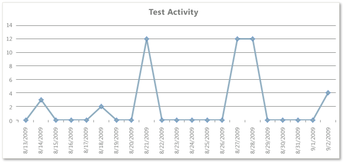
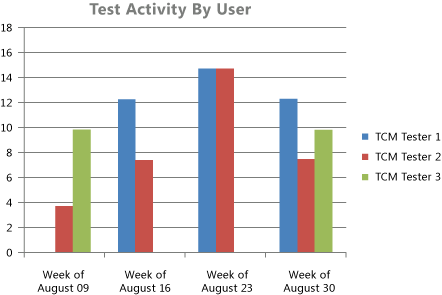

# Test Team Productivity Excel Report

[!INCLUDE [temp](../_shared/tfs-sharepoint-version.md)]

Teams who are responsible for testing software can use the Test Team Productivity report to help track the overall activity of the team and individual team members in testing the product and finding and reporting bugs. The Test Team Productivity report provides four reports that show test and bug activity:  
  
-   **Test Activity**: Helps the team monitor the volume of tests it has run over the past four weeks.  
  
-   **Test Activity Per User**: Helps the team track the volume of tests that individual team members have run over the past eight weeks. The team can use this to help load balance the test activity across team members.  
  
-   **Bugs Created By User**: Helps the team track how many bugs each team member creates.  
  
-   **Bug Effectiveness**: Supports the team in determining how effective it is in defining bugs that are useful and that help build a quality product.  
  
    > [!NOTE]
    >  You can view the Test Team Productivity report from the **Test Team Management** folder that is located under the **Excel Reports** folder for the team project in Team Explorer. You can access this folder only if your team project portal has been enabled and is configured to use SharePoint Products. For more information, see [Share information using the project portal](../sharepoint-dashboards/share-information-using-the-project-portal.md).  
  
 **Required permissions**  
  
 To view the report, you must be assigned or belong to a group that has been assigned the **Read** permissions in SharePoint Products for the team project.  
  
 To modify or customize the report, you must be a member of the **TfsWarehouseDataReaders** security role in SQL Server Analysis Services. You must also be assigned or belong to a group that has been assigned the **Members** permissions in SharePoint Products for the team project. For more information, see [Grant Access to the Databases of the Data Warehouse for Team System](../admin/grant-permissions-to-reports.md).  
  
##   Data in the Reports  
 The test activity reports are available only when the team creates test plans and starts to run tests by using Microsoft Test Manager. For information about how to define test suites and test plans, see [Plan your tests](../../test/create-test-cases.md).  
  
 The bug activity reports are available only when the team creates bugs and starts to resolve bugs.  
  
 These reports are based on PivotTable reports that show activity that is recorded for a specific team project and data that is stored in the data warehouse.  
  
### Test Activity and Test Activity by User Reports  
 The Test Activity report provides a line graph that shows the number of individual tests that were run each day. If a particular test case was run three times in one day, it is counted three times for that day.  
  
   
  
 The Test Activity per User report provides a bar chart that indicates how many tests each test team member ran each week.  
  
   
  
 The following table describes the report filters and fields that are used in the PivotTables that generate the test activity reports.  
  
|Filters|Fields|  
|-------------|------------|  
|-   **Team Project - Team Project Hierarchy**: Includes data that is collected for the selected team project. -   **Test Result - Area Hierarchy**: Includes test results that were run from test cases that were assigned to the selected product areas. -   **Test Result - Iteration Hierarchy**: Includes test results that were run from test cases that were assigned to the selected iterations. -   **Test Plan - Test Plan Name**: Includes test results that were run from test cases that belong to the selected test plans.   **Filter specific to the Test Activity report**:   -   **Test Result - Outcome**: Includes test results that had an outcome of Passed, Failed, Never Run. **Note:**      The **Outcome** field is not listed under the Report Filter. However, it is set in the **PivotTable Field List**.   **Filter specific to the Test Activity by User report**:   -   **Test Run - Is Automated**: Includes only test results from manual test cases. (**Is Automated**=**False**)|-   **(Measure) Test - Result Count**: Counts all the results for each test run individually. -   **Date - Sets - Last 4 or 8 weeks**: Defines the time span of activity to report.   **Field specific to the Test Activity by User report**:   -   **Test - Test Results Executed By**: Groups the count of test results according to the team member who ran the tests.|  
  
### Bugs Created by User and Bug Effectiveness Reports  
 The Bugs Created by User report provides a bar chart that indicates how many bugs each test team member created each week.  
  
   
  
 The Bug Effectiveness report provides a bar chart that indicates the count of resolved bugs that were created by each test team member, grouped by their bug resolution.  
  
   
  
 The following table describes the report filters and fields that are used in the PivotTables that generate the bug activity reports.  
  
|Filters|Fields|  
|-------------|------------|  
|-   **Team Project - Team Project Hierarchy**: Includes work items that are defined for the selected team project. -   **Work Item - Work Item.Iteration Hierarchy**: Includes work items that are assigned to the selected iteration paths. -   **Work Item - Work Item.Area Hierarchy**: Includes work items that are assigned to the selected product areas. -   **Work Item - Work Item.Work Item Type**: Includes only the selected work items. For these reports, bug is selected.   **Filter specific to the Bugs Created by User report**:   -   **Work Item - Rev=1**: Selects data that is contained in the first revision of the work item to include in the report.   **Filters specific to the Bug Effectiveness report**:   -   **Work Item - State**: Includes work items that are in the selected state. For this report, includes bugs that are in the **Resolved** state. -   **Work Item - Work Item.Previous State**: Includes work items whose previous state was in one of the selected states. For this report, includes bugs whose previous state was **Active**. -   **Date - Year Month Date=All**: Includes work items that contain data that corresponds to the previous filters in the list during the selected time periods. For this report, **All** time periods are included.|**Fields specific to Bugs Created by User report**:   -   **Work Item - Created By**: Groups the report of bugs based on the test team member who created the bugs. -   **(Measure) Work Item - Revision Count**: Counts the number of times that a work item has been modified. Because the report is filtered to only consider data contained in Revision 1 of each bug, the **Revision Count** provides the total number of new bugs that the test team member created. -   **Date - Sets - Last 8 weeks**: The time span of activity to include in the report.   **Fields specific to Bug Effectiveness report**:   -   **Work Item - Reason**: The reason that the state of the work item changed. For the Bug Effectiveness report, this provides the groupings of **As Designed**, **Cannot Reproduce**, **Duplicate**, and **Fixed**. -   **(Measure) Work Item - State Change Count**: Indicates the number of times that a team member changed the state of the work item. For the Bug Effectiveness report, this field indicates how often the bug has been reactivated. -   **Work Item - Created By**: Groups the report of bugs based on the test team member who created the bugs.|  
  
##   Required Activities for Tracking Test and Bug Activity  
 For the test activity reports to be useful and accurate, the team must perform the following activities:  
  
-   [Define test cases and test plans](../../test/create-test-cases.md), and assign test cases to the test plans.  
  
-   [Run tests](../../test/run-manual-tests.md).  
  
-   (Optional) To filter the reports by product area and iteration, specify the **Area** and **Iteration** paths of each test case.  
  
    > [!NOTE]
    >  The project administrator for each team project [defines area and iteration paths](../../organizations/settings/set-area-paths.md) for that project so that the team can track progress by those designations.  
  
 For the bug activity reports to be useful and accurate, the team must perform the following activities:  
  
-   Create a bug for each code defect that was found by testing.  
  
-   Update the **State** of each bug as the team fixes, verifies, closes, or reactivates it and accurately set the **Reason** field every time that the bug changes state.  
  
-   (Optional) To filter the reports by product area and iteration, specify the **Area** and **Iteration** paths of each bug.  
  
##   Updating and customizing the reports  
 You can update the Test Team Productivity report by opening it in Office Excel and changing the filter options for the PivotTable report for one of the worksheets. You can customize each report to support other views, as the following table describes.  
  
|View|Action|  
|----------|------------|  
|Test or bug activity for a product area|Change the filter for **Area** (default=All)|  
|Test or bug activity for an iteration|Change the filter for **Iteration** (default=All)|  
|Test activity for a specific test plan or set of test plans|Change the filter for **Test Plan** (default=All)|  
|Test or bug activity for the most recent six, eight, or more weeks|In the Columns PivotTable Field List, replace **@@Last 4 weeks@@** or **@@Last 8 weeks@@** with a different **Set**|  
|Bug effectiveness for a particular time period|Change the filter for **Year Month Date** (default=All)|  
  
 For more information about how to work with and customize PivotTables and PivotChart reports, see the following pages on the Microsoft Web site:  
  
-   [Ways to customize PivotTable reports](http://go.microsoft.com/fwlink/?LinkId=165722)  
  
-   [Edit or remove a workbook from Excel Services](http://go.microsoft.com/fwlink/?LinkId=165723)  
  
-   [Publish a workbook to Excel Services](http://go.microsoft.com/fwlink/?LinkId=165724)  
  
-   [Save a file to a SharePoint library or another Web location](http://go.microsoft.com/fwlink/?LinkId=165725)  
  
## Related notes
 [Excel reports](excel-reports.md)
