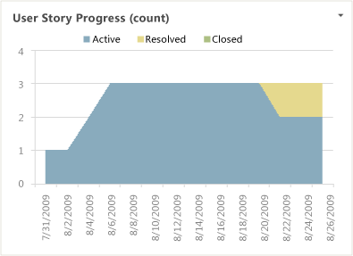

# User Story Progress Excel Report (Agile)

[!INCLUDE [temp](../_shared/tfs-sharepoint-version.md)]

You can use the User Stories Progress report to track the rate at which the team is implementing user stories. This report shows the distribution of active, resolved, and closed User Stories over time. For information about how to access this report, see [Excel reports](excel-reports.md).  
  
> [!NOTE]
>  You can view the User Story Progress report from the Progress dashboard. You can access this dashboard only if your team project portal has been enabled and is provisioned to use Microsoft Office SharePoint Server 2007. For more information, see [Configure or redirect process guidance](../sharepoint-dashboards/configure-or-redirect-process-guidance.md).  
  
 **Required Permissions**  
  
 To view the report, you must be assigned or belong to a group that has been assigned the **Read** permissions in SharePoint Products for the team project.  
  
 To modify or customize the report, you must be a member of the **TfsWarehouseDataReaders** security role in SQL Server Analysis Services. You must also be assigned or belong to a group that has been assigned the **Members** permissions in SharePoint Products for the team project. For more information, see [Grant Access to the Databases of the Data Warehouse for Team System](../admin/grant-permissions-to-reports.md).  
  
##   Data in the Report  
 You can use the User Stories Progress report to understand how well the team is completing the stories that it defined for an iteration or release. This report is based on a PivotChart report that shows the last four weeks of data that was captured for User Stories and that is stored in the data warehouse.  
  
   
  
### Required Activities for Tracking User Stories  
 For the User Stories Progress report to be useful and accurate, the team must perform the following activities:  
  
-   define user stories.  
  
-   Update the **State** of each user story as it transitions from **Active** to **Resolved** to **Closed**.  
  
-   (optional) Specify the **Iteration** path, **Area** path, or both of each user story if you want to filter by those fields.  
  
##   Interpreting the Report  
 You should expect the User Stories Progress report to vary based on where you are in your product development cycle. Early iterations should show a gradual increase in the number of active User Stories. Iterations that are near the end of a product cycle should show a wide band of resolved and closed User Stories.  
  
 You can review the chart to determine the team's progress over time or during an iteration. Specifically, you can determine how much progress the team is making  toward resolving and closing user stories.  
  
##   Updating and Customizing the Report  
 You can update the User Stories Progress report by opening the report in Office Excel and changing the filter options for the PivotTable report. You can customize this report to support other views as the following table describes.  
  
|View|Action|  
|----------|------------|  
|Burndown of user stories for an iteration|Change the filter for **Iteration** (default=All)|  
|Burndown of user stories for a product area|Change the filter for **Area** (default=All)|  
|Burndown of user stories for the last six, eight, or more weeks|In the Columns PivotTable Field List, replace **@@Last 4 weeks@@** with a different **Set**|  
  
 For more information about how to work with and customize PivotTable and PivotChart reports, see the following pages on the Microsoft Web site:  
  
-   [Ways to customize PivotTable reports](http://go.microsoft.com/fwlink/?LinkId=165722)  
  
-   [Edit or remove a workbook from Excel Services](http://go.microsoft.com/fwlink/?LinkId=165723)  
  
-   [Publish a workbook to Excel Services](http://go.microsoft.com/fwlink/?LinkId=165724)  
  
-   [Save a file to a SharePoint library or another Web location](http://go.microsoft.com/fwlink/?LinkId=165725)  
  
## Related notes
 [Excel reports](excel-reports.md)