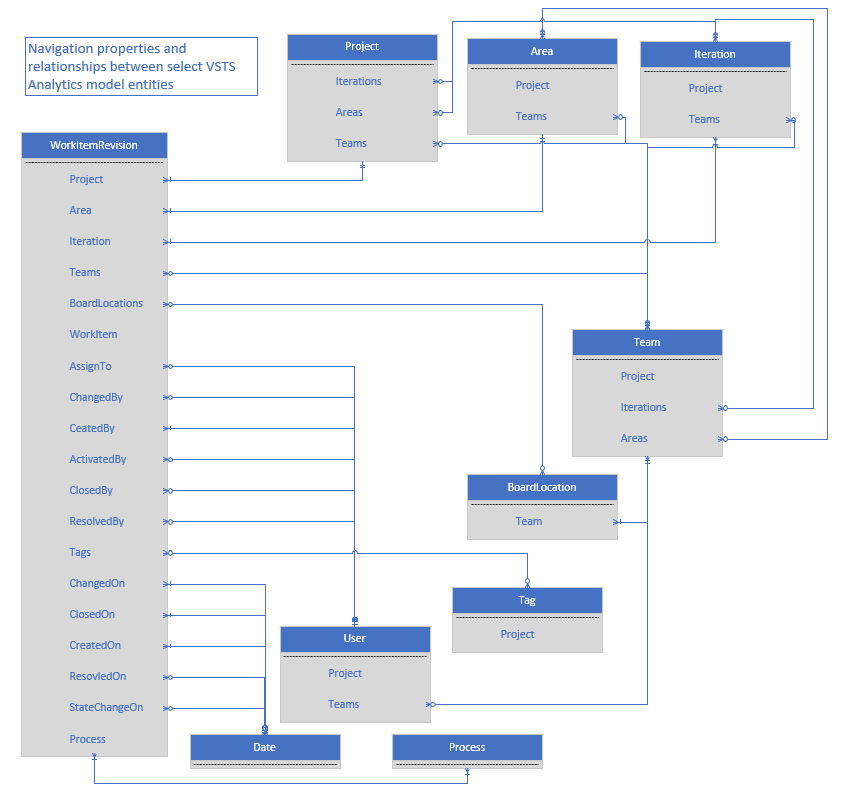

# Data model for the Analytics Service  


[!INCLUDE [temp](../_shared/version-azure-devops.md)]

The Analytics service data model for Azure DevOps consists of entity sets, whose members (entities) contains properties that can be filtered, aggregated, and summarized. Additionally, they contain [navigation properties](http://www.odata.org/getting-started/basic-tutorial/#relationship) that relate entities to one other, providing access to additional properties for selecting, filtering, and grouping.

[!INCLUDE [temp](../_shared/analytics-preview.md)]


<a id="entities" />

## Entities  

> [!NOTE]  
>Entity sets are described in OData metadata, and vary by project. A complete list of entity sets, entity types, and properties can be discovered by requesting the OData metadata for your project: 

::: moniker range="azure-devops"

> [!div class="tabbedCodeSnippets"]
```OData
https://analytics.dev.azure.com/{OrganizationName}/{ProjectName}/_odata/{version}/$metadata
``` 

::: moniker-end

::: moniker range="azure-devops-2019"

> [!div class="tabbedCodeSnippets"]
```OData
https://{servername}:{port}/tfs/{OrganizationName}/{ProjectName}/_odata/{version}/$metadata
```

::: moniker-end

[!INCLUDE [temp](../_shared/api-versioning.md)]

The following EntitySets are supported with the indicated API versions. For the latest version information, see [OData API versioning](odata-api-version.md).

## Work tracking EntitySets

>  [!div class="mx-tdCol2BreakAll"]  
> | EntitySet | Description | v1.0 | v2.0 | v3.0-preview |
> |-----------|-------------|------|------|--------------|
> |Areas | The work item Area Paths, with properties for grouping and filtering by area hierarchy | ✔️|✔️|✔️ |
> |Iterations | The work item Iteration Paths, with properties for grouping and filtering by iteration hierarchy |✔️|✔️|✔️ |  
> |BoardLocations | The Kanban board cell locations, as identified by board column, lane, and split, includes historic board settings| ✔️|✔️|✔️ | 
> |Dates | The dates used to filter and group other entities using relationships | ✔️|✔️|✔️ | 
> |Projects | All projects defined for an organization |✔️|✔️|✔️ |
> |Processes | Backlog information - used to expand or filter work items and work item types|  |✔️|✔️ | 
> |Tags | All work item tags for each project | ✔️|✔️|✔️ | 
> |Teams | All teams defined for the project (To add a team, see [Add teams](../../organizations/settings/add-teams.md)) | ✔️|✔️|✔️ | 
> |Users | User information that is used to expand or filter various work item properties (e.g. Assigned To, Created By)| ✔️|✔️|✔️ | 
> |WorkItems | The current state of work items| ✔️|✔️|✔️ | 
> |WorkItemLinks | The links between work items (e.g. child, parent, related) - includes only latest revision of links (no history) - hyperlinks not included | ✔️|✔️|✔️ | 
> |WorkItemRevisions | All historic work item revisions, including the current revision - does not include deleted work items| ✔️|✔️|✔️ | 
> |WorkItemSnapshot | (Composite) The state of each work item on each calendar date - used for trend reporting| ✔️|✔️|✔️ | 
> |WorkItemBoardSnapshot | (Composite) The state of each work item on each calendar date, including Kanban board location - used for trend reporting| ✔️|✔️|✔️ | 
> |WorkItemTypeFields | The work item properties for each work item type and process - used for report building| ✔️|✔️|✔️ | 


## Branch, Pipelines, and Test EntitySets

The following EntitySets are only supported with the **v3.0-preview** API version.

>  [!div class="mx-tdCol2BreakAll"]  
> | EntitySet | Description | v3.0-preview |
> |-----------|-------------|------|
> |Branches | Basic information about branches used in tests or pipelines |  ✔️ |
> |BuildPipelines| Properties for a build pipeline |  ✔️ |
> |BuildPipelineTasks | Properties for tasks that are used within a pipeline |  ✔️ |
> |BuildTaskResults | Merged log of all the stages/steps/jobs/tasks within a specific pipeline execution |   ✔️ |
> |Builds | Execution information for builds |  ✔️ |
> |ReleaseEnvironments | Experimental, properties of the release environments |  ✔️ |
> |ReleasePipelines| Experimental, properties for a release pipeline |  ✔️ |
> |ReleaseStages |  Experimental, properties for stages defined within a release pipeline |  ✔️ |
> |Releases | Experimental, execution information for releases  |  ✔️ |
> |TestResultsDaily | A daily snapshot aggregate of TestResult executions, grouped by Test (not TestRun) |  ✔️ |
> |TestRuns | Execution information for tests run under a build or release pipeline with aggregate TestResult |  ✔️ |
> |Tests | Properties for a test | ✔️ |
> |TestsResults | Individual execution results for a specific Test associated with a TestRun |  ✔️ |


## Composite entities

Composite entities support specific scenarios. They are composed from simpler entities, often require more computing resources to generate, and may return larger result sets. To achieve the best performance and avoid unnecessary throttling, ensure that you query the correct entity for your scenario.

For example, WorkItemSnapshot combines WorkItemRevisions and Dates such that each date has one revision for each work item. This representation supports OData queries that focus on trend data for a filtered set of work items. However, you should not use this composite entity to query the current state of work items. Instead, you should use the WorkItems entity set to generate a more quick-running query.

Similarly, some entities may contain all historic values, while others may only contain current values. WorkItemRevision contains all work item history, which you should not use in scenarios where the current values are of interest.

## Relationships

To generate more complex query results, you can combine entities using relationships. You can employ relationships to expand, filter, or summarize data.

Some navigation properties result in a single entity, while others result in a collection of entities. The following diagram shows select entities and their navigation properties. For clarity, some composite entities and relationships have been omitted.



## Relationship keys

 Entity relationships are also represented as foreign keys so that external tools can join entities. These properties have the suffix "SK", and are either integer or GUID data types. Date properties have corresponding integer date key properties with the following format: YYYYMMDD.

## Entity Properties

The following table provides a partial list of the WorkItemRevision entity properties to illustrate some common details. The last three properties&mdash;CreatedDate, CreatedDateSK, CreatedOn&mdash;show that the same value is often expressed in multiple properties, each designed for different scenarios.

| Property | Type | Description|  
|--------|------------|------------|  
|WorkItemRevisionSK | Int32 | The Analytics unique key for the work item revision - used by external tools to join related entities.
|WorkItemId | Int32 | The Id for the work item.
|Revision | Int32 | The revision of the work item. 
|Title | String | The work item title. 
|WorkItemType | String | The work item type (e.g. Bug, Task, User Story).
|StoryPoints | Double | The points assigned to this work item - commonly aggregated as a sum.
| Tags | Navigation | Navigation property to a Tag entity collection. Commonly used in ```$expand``` statements to access the Name property for multiple work item tags.
|CreatedDate | DateTimeOffset | The date the work item was created, expressed in the [time zone defined for the organization](../../organizations/accounts/change-organization-location.md). Commonly used for filtering and for display.
|CreatedDateSK | Int32 | The date the work item was created, expressed as YYYYMMDD in the time zone defined for the organization. Used by external tools to join related entities.
|CreatedOn | Navigation | Navigation property to the Date entity for the date the work item was created, in the time zone defined for the organization. Commonly used to reference properties from the Date entity in ```groupby``` statements.

> [!NOTE]
>Changes to custom work item fields will affect the shape of your data model and will affect all work item revisions. For instance, if you add a new field, queries on pre-existing revision data will reflect the presence of the new field. 


## Related articles 

- [WIT analytics](wit-analytics.md)  
- [Aggregate data](aggregated-data-analytics.md)
- [Exploring Analytics OData metadata](analytics-metadata.md) 


