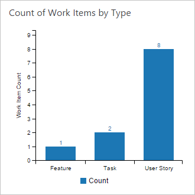
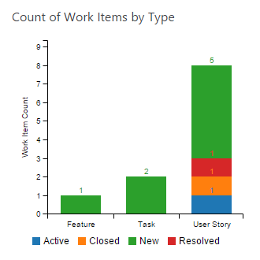

# Add configuration to an extension that calls the Analytics Service

[!INCLUDE [temp](../../_shared/version-vsts-only.md)] 

[Access analytics data through a dashboard widget extension](widget-extensions-against-analytics-service.md) describes how to create a chart that pulls a
pre-determined set of data from the Analytics Service. Rarely will consumers of your extension want to pull just the data
that has been coded into the widget. Therefore, you can give your users the ability to alter the data returned and to chart that appropriately.

[!INCLUDE [temp](../_shared/analytics-preview.md)]

In this topic, we'll take the chart on the left and give users the ability to slice it by another data point creating the chart on the right. We'll also let the user change the title of the widget.





To do this you need to add a configuration page, populate it with options, store those options and communicate them back to the widget. Finally, you need to register the
configuration page as part of the extension and associate it with the widget.

**Add a configuration page**

Add a new HTML page in the root of your project (the same folder that Analytics.html is in) called **Configuration.html**. Add a corresponding **configuration.js** file in the
**scripts** folder.

**Note: Because you can have many widgets in a single extension it is advisable to call each configuration page a specific name to associate it with the correct widget.
This goes for any javascript files as well so it's easier to locate the related files.**

Add the following HTML to the **configuration.html** page:

```
<!DOCTYPE html>
<html>
<head>
    <link href="content/widget.css" rel="stylesheet" />
</head>
<body>
    <div class="container">
        <fieldset>
            <label class="label">Title</label>
            <br/>
            <input class="userInput" type="text" id="widgetTitleInput" value="Count of Work Items by Type" />
        </fieldset>
        <fieldset>
            <label class="label">Category</label>
            <br />
            <select class="userInput" id="categorySelector"></select>
        </fieldset>
        <fieldset>
            <label class="label">Group By</label>
            <br />
            <select class="userInput" id="groupBySelector"></select>
        </fieldset>
    </div>
    <script src="sdk/scripts/VSS.SDK.min.js"></script>
    <script src="scripts/configuration.js"></script>
</body>
</html>
```

Append some additional css to the **widget.css** file:

```
.label {
    font-family: "Segoe UI";
    font-size: 12px;
    color: black;
}

.userInput {
    width: 80%;
    margin-bottom: 20px;
}
```

Copy the following code to the **configuration.js** page:

```
VSS.init({
    explicitNotifyLoaded: true,
    usePlatformStyles: true
});

VSS.require(["TFS/Dashboards/WidgetHelpers", "VSS/Authentication/Services"], function (WidgetHelpers, VSS_Auth_Service) {
    VSS.register("analyticsWidget.Configuration", function () {
        return {
            load: function (widgetSettings, widgetConfigurationContext) {
                //Set up the configuration pane

                //Restore the saved settings

                //Notify the widget that the configuration has changed

            },
            onSave: function () {
                return WidgetHelpers.WidgetConfigurationSave.Valid(getCustomSettings());
            }
        }
    });
    VSS.notifyLoadSucceeded();
});

function loadSelector(selector, dataList, addNone) {
    var optionList = "";
    if (addNone) {
        optionList += "<option value=''>(None)</option>";
    }

    for (var i = 0; i < dataList.length; i++) {
        optionList += "<option value='" + dataList[i].value + "'>" + dataList[i].name + "</option>";
    }

    selector.html(optionList);
}

function getCustomSettings() {
    return {
        data: JSON.stringify({
            widgetTitle: $("#widgetTitleInput").val(),
            groupBy: $("#groupBySelector").val(),
            category: $("#categorySelector").val()
        })
    }
}
```

The code here is virtually identical in many respects to the code in the actual widget. But, there are a couple of minor differences.

* The register function returns a load and an onSave function
* onSave calls WidgetConfigurationSave.Valid and returns custom settings instead of calling success or error

The onSave function calls the reload function in the widget (which hasn't been coded yet) and this is how the configuration communicates changes to the widget.

The load function has to do four things:

* Set up the configuration pane
* Restore the saved settings
* Notify the widget that the configuration has changed
* Save any changes to the settings and communicate them to the widget

The loadSelect and getCustomSettings functions are simply small functions that keep everything cleaner.

The **loadSelector** function will simply load the fields that the widget will allow a user to choose from for the categories
and groups.

The **getCustomSettings** function simply returns a string with the configuration data so it can be saved by the configuration
window and passed back to the widget. 

In this widget we'll give the users a basic list of items they can select from for the group and category aspects of the bar chart. We also want the user to
be able to say that they only want to categorize the values and don't want to group by anything else (i.e. a standard bar chart versus a stacked bar chart).

**Set up the drop down lists**

Replace the **//Set up the configuration pane** comment with the following code:

```
var dataList = [];
dataList.push({ name: "Area", value: "Area/AreaName" });
dataList.push({ name: "Iteration", value: "Iteration/IterationName" });
dataList.push({ name: "State", value: "State" });
dataList.push({ name: "Work Item Type", value: "WorkItemType" });

loadSelector($("#categorySelector"), dataList, false);
loadSelector($("#groupBySelector"), dataList, true);
```

This code simply provides the users with two drop downs to select the category and group for the chart. Note that the
"value" of the option is the item needed by the Analytics Service to group the data, that's why the value for Area
is **Area/AreaName** because it is a navigation property from the WorkItems entity to the Areas entity. This code also
adds a **(none)** option to the group by selector. When a user has (none) selected they will get a standard bar chart
instead of a stacked area bar chart.

**Read the settings data and restore the selections**

Replace the **//Restore the saved settings** comment with the following code:

```
var settings = JSON.parse(widgetSettings.customSettings.data);

if ((settings != null) && (settings.groupBy != null)) {
    $("#categorySelector").val(settings.category);
}
else {
    $("#categorySelector").val("");
}

if ((settings != null) && (settings.groupBy != null)) {
    $("#groupBySelector").val(settings.groupBy);
}
else {
    $("#groupBySelector").val("WorkItemType");
}
```

The first line reads the settings data. The next two blocks check to see that a) there were settings (which you won't have 
on a new install of the widget) and b) that there are settings for the category and group by and if not, it sets the
drop downs to default values.

Finally, the configuration needs to notify the widget that it has changed. Replace the **//Notify the widget that the configuration has changed**
comment with the following code:

```
$("#widgetTitleInput").change(function () {
    var eventName = WidgetHelpers.WidgetEvent.ConfigurationChange;
    var eventArgs = WidgetHelpers.WidgetEvent.Args(getCustomSettings());
    widgetConfigurationContext.notify(eventName, eventArgs);
});

$("#categorySelector").change(function () {
    var eventName = WidgetHelpers.WidgetEvent.ConfigurationChange;
    var eventArgs = WidgetHelpers.WidgetEvent.Args(getCustomSettings());
    widgetConfigurationContext.notify(eventName, eventArgs);
});

$("#groupBySelector").change(function () {
    var eventName = WidgetHelpers.WidgetEvent.ConfigurationChange;
    var eventArgs = WidgetHelpers.WidgetEvent.Args(getCustomSettings());
    widgetConfigurationContext.notify(eventName, eventArgs);
});
```

For simplicity purposes, this code could be abstracted into a re-usable method but this works for demonstration
purposes. Essentially, when any control on the configuration page changes, get the settings and raise an event to
the widget. In this case the widgetConfigurationContext.notify triggers the **reload** function in the widget to
be called.

At this point the configuration page is done. Time to switch back to the **analytics.js** file to accept data from
a configuration and respond to changes of the configuration.

**Revisiting the widget**

Now that the widget actually has settings, replace the load function with the following code:

```
load: function (widgetSettings) {
    var titleDiv = $("#title");
    var settings = JSON.parse(widgetSettings.customSettings.data);

    if (!settings || !settings.widgetTitle) {
        titleDiv.text('Count of Work Items by Type');
    }
    else {
        titleDiv.text(settings.widgetTitle);
    }

    createChart(VSS_Auth_Service, WidgetHelpers, widgetSettings);

    return WidgetHelpers.WidgetStatusHelper.Success();
},
```

This code is the same code that was there before, except now the settings are being read and the title of the widget is
being set dynamically (or given a default if it was never configured before). The other change is that the **createChart**
method has been updated to accept one more parameter - the **widgetSettings**.

Next, replace the **//Widget reload function** comment with the following code:

```
reload: function (widgetSettings) {
    var titleDiv = $("#title");
    var settings = JSON.parse(widgetSettings.customSettings.data);

    if (!settings || !settings.widgetTitle) {
        titleDiv.text('Count of Work Items by Type');
    }
    else {
        titleDiv.text(settings.widgetTitle);
    }

    createChart(VSS_Auth_Service, WidgetHelpers, widgetSettings);

    return WidgetHelpers.WidgetStatusHelper.Success();
}
```

This code, not so oddly enough, is identical to the load function. Refactoring this to a single set of code that is called
from both places is a good idea!

**Creating the chart**

For the updated chart, quite a bit of work needs to be done. The following changes are needed:

1. Allow for the user to include a grouping value or not which means dynamically constructing the group by clause of the
query string
2. If the widget is configured to include a group by, pivot the data to the format that C3 expects

For the purposes of this walkthrough, delete the code from the existing createChart function and replace it with the 
following:


This work is dependent on the charting framework that you
use. Some of the frameworks don't require this type of manipulation. For any D3 based charting framework, the data is
expected in a very specific form for stacked bar charts and this is not the form that the Analytics Service returns.

The Analytics Service returns data in this form (in part):

```
{
  "@odata.id": null,
  "WorkItemType": "User Story",
  "State": "Active",
  "Count": 1
}, {
  "@odata.id": null,
  "WorkItemType": "User Story",
  "State": "Closed",
  "Count": 1
}
```

However, D3 based frameworks expect the data in this form (for a stacked bar chart):

```
{
["Active", 1, 2, 3],
["Resolved", 4, 5, 6]
}
```

The first element is the group and the remaining columns correspond with the categories which are not even
defined in this set of data. Because of this, a bit of data manipulation has to be done when presenting a stacked bar
chart.

With this in mind, replace the entire **createChart** function with the following code:

```
function createChart(VSS_Auth_Service, WidgetHelpers, settings) {
    VSS.getAccessToken().then(function (token) {
        authToken = VSS_Auth_Service.authTokenManager.getAuthorizationHeader(token);

        var accountName = VSS.getWebContext().account.name;
        var projectName = VSS.getWebContext().project.name;
        var groupBy = "";
        var category = "";
        var groupByClause = "";

        //Create the groupby clause
        if ((settings != null) && (settings.category != "")) {
            category = settings.category;
        }
        else {
            category = "WorkItemType";
        }
        
        groupByClause = category;

        if ((settings != null) && (settings.groupBy != "")) {
            groupBy = settings.groupBy;
            groupByClause = category + "," + groupBy;
        }
        else {
            groupBy = "";
        }

        var urlString = "https://" + accountName + ".analytics.visualstudio.com/" + projectName
            + "/_odata/v1.0-preview/WorkItems?$apply=groupby((" + groupByClause + "), aggregate($count as Count))";

        $.ajax({
            type: "GET",
            url: urlString,
            contentType: "application/json; charset=utf-8",
            dataType: "json",
            beforeSend: function (xhr) {
                xhr.setRequestHeader('Authorization', authToken);
            }
        })
        .success(function (data, textStatus, jqXHR) {
            var jsonData = data.value;
            var final = [];

            //Read the categories and if a group was specified, read that too
            //We'll end up with an array of data  for the categories and groups
            var groups = [];
            var categories = [];
            //Get the groups and categories
            for (var i = 0; i < jsonData.length; i++) {
                if (categories.indexOf(jsonData[i][category]) == -1) {
                    categories.push(jsonData[i][category]);
                }
                if (groupBy != "") {
                    if (groups.indexOf(jsonData[i][groupBy]) == -1) {
                        groups.push(jsonData[i][groupBy]);
                    }
                }
            }

            categories.sort();

            if (groupBy != "") {
                groups.sort();
                //Convert the array into the expected format
                for (var j = 0; j < groups.length; j++) {
                    var tempData = [];
                    tempData.push(groups[j]);
                    for (var k = 0; k < categories.length; k++) {
                        var found = false;
                        for (var i = 0; i < jsonData.length; i++) {
                            if (jsonData[i][groupBy] == groups[j]) {
                                if (jsonData[i][category] == categories[k]) {
                                    tempData.push(jsonData[i].Count);
                                    found = true;
                                    break;
                                }
                            }
                        }
                        if (!found) {
                            tempData.push(null);
                        }
                    }
                    final.push(tempData);
                }

                //generate the chart if using groups
                var chart = c3.generate({
                    bindto: '#chart',
                    data: {
                        columns: final,
                        groups: [
                            groups
                        ],
                        type: 'bar',
                        labels: true
                    },
                    axis: {
                        x: {
                            type: 'category',
                            categories: categories
                        },
                        y: {
                            label: {
                                text: 'Work Item Count',
                                position: 'outer-middle'
                            }
                        }
                    },
                    legend: {
                        position: 'bottom'
                    }
                });
            }
            else {
                //Generate the chart in the "standard" way if not using groups
                var chart = c3.generate({
                    bindto: '#chart',
                    data: {
                        json: jsonData,
                        keys: {
                            x: category,
                            value: ['Count']
                        },
                        type: 'bar',
                        labels: true
                    },
                    axis: {
                        x: {
                            type: 'category'
                        },
                        y: {
                            label: {
                                text: 'Work Item Count',
                                position: 'outer-middle'
                            }
                        }
                    },
                    legend: {
                        position: 'bottom'
                    }
                });
            }

            
        })
        .error(function (jqXHR, textStatus, errorThrown) {
            return WidgetHelpers.WidgetStatusHelper.Failure(errorThrown);
        });
    });
}
```

At this point the code is complete and it's time to register the configuration with the extension so that
the configuration is associated with this widget. In the vss-extension.json file, update the analyticsWidget
contribution so that the **targets** section reads as follows:

```
"targets": [
    "ms.vss-dashboards-web.widget-catalog",
    "<author>.<extension ID>.analyticsWidget.Configuration"
    ],
```

The key item here is that we're adding the configuration as a target of the widget. In this case the 
extension ID is "sampleODataWidget".

Next, add the following
contribution to the file:

```
{
    "id": "analyticsWidget.Configuration",
    "type": "ms.vss-dashboards-web.widget-configuration",
    "targets": [ "ms.vss-dashboards-web.widget-configuration" ],
    "properties": {
    "name": "Analytics Widget Configuration",
    "description": "Configures the Analytics Widget",
    "uri": "Configuration.html"
    }
}
```

And finally, include the Configuration.html in the manifest:

```
{
    "path": "Configuration.html",
    "addressable": true
},
```

Deploy the widget and configure it!
