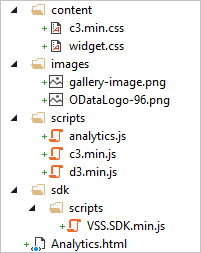

# Build a dashboard widget extension that calls the Analytics Service

[!INCLUDE [temp](../../_shared/version-vsts-only.md)] 

Building an dashboard widget extension that calls the Analytics Service is identical to building any other extension. However,
in this early stage, a few things have to be done manually at this point - and then there's working
with the returned data. This documentation will show you how to do both.

[!INCLUDE [temp](../_shared/analytics-preview.md)]

The following topics describe how to build an extension and a widet extension:  
- [Overview of extensions for VSTS](../../extend/get-started/node.md)  
- [Add a dashboard widget](../../extend/develop/add-dashboard-widget.md)  
 
For the purposes of this example we'll use the open source C3 charting library which sits on top of the D3 graphics library.

At the end of this walk-through you will have a working dashboard widget which allows you to decompose work in several different ways in a column chart.

##Set up the project

**Before your begin, download the following items:**

* [Client SDK](https://github.com/microsoft/vss-sdk)
* [D3](https://github.com/mbostock/d3/releases/download/v3.5.13/d3.zip)
* [C3](https://github.com/masayuki0812/c3/archive/0.4.10.zip)

**Create the widget page**

1. Create a new folder called "AnalyticsWidgetExtensionSample"
2. Unzip the Client SDK and copy the VSS.SDK.js file into the **AnalyticsWidgetExtensionSample\sdk\scripts** folder
3. Unzip D3 and copy the d3.min.js file into the **AnalyticsWidgetExtensionSample\scripts** folder
4. Unzip C3 and copy the c3.min.js file into the **AnalyticsWidgetExtensionSample\scripts** folder
5. Add an empty file called **analytics.js** to the **AnalyticsWidgetExtensionSample\scripts** folder - this is where the code
for the widget will go
6. Add another folder called **images** to the AnalyticsWidgetExtensionSample folder and copy an image you would like to use
as your extension image (see [Add a dashboard widget](../../extend/develop/add-dashboard-widget.md#image) for details on the image)
7. Copy the c3.min.css file into the **AnalyticsWidgetExtensionSample\content** folder
8. Add a file called **widget.css** into the content folder
8. In the AnalyticsWidgetExtensionSample folder create a new web page called **Analytics.html**

At this point the folder structure should look like the following:



Next copy the following HTML to the **Analytics.html** file:
```
<!DOCTYPE html>
<html xmlns="http://www.w3.org/1999/xhtml">
<head>
    <link href="content/c3.min.css" rel="stylesheet" type="text/css" />
    <link href="content/widget.css" rel="stylesheet" type="text/css" />
</head>
<body>
    <div id="title"></div>
    <div id="chart" style="width:300px; height:275px;"></div>
    <script src="sdk/scripts/VSS.SDK.js"></script>
    <script src="scripts/d3.min.js" charset="utf-8"></script>
    <script src="scripts/c3.min.js"></script>
    <script src="scripts/analytics.js"></script>
</body>
</html>
```

This code simply sets up the structure of the page - we'll write the code in a separate javascript file. The **title** div is the title of the 
widget and the **chart** div will hold the chart. The size dimensions allow for room around the chart for asthetics.

Add the following css to the **widget.css** file:

```
 #title {
    font-size: 16px; 
 	font-weight: normal; 
 	color: #424245;	
    margin-bottom: 15px;
    padding-left: 15px; 
    padding-top: 10px;
}

 #chart {
    margin-left: 10px;
}
```


Next, add the following code to the **analytics.js** file:

```
    VSS.init({
        explicitNotifyLoaded: true,
        usePlatformStyles: true
    });
    VSS.require(["TFS/Dashboards/WidgetHelpers", "VSS/Authentication/Services"], function (WidgetHelpers, VSS_Auth_Service) {
        //Register the widget
        //Widget load function
        //Widget reload function
        VSS.notifyLoadSucceeded();
    });
    //Reusable function to call the Analytics Service and build the chart
```

The init method does just what it says, it initializes the SDK. The second block of code you will make changes to over the next several steps and it does the 
heavy lifting.

**Register the widget**

To register the widget, update the **analytics.js** as shown here, replacing the **//Register the widget comment**:

```
VSS.require(["TFS/Dashboards/WidgetHelpers", "VSS/Authentication/Services"], function (WidgetHelpers, VSS_Auth_Service) {
    VSS.register("analyticsWidget", function () {
        //Widget load function
        //Widget reload function
    });
    VSS.notifyLoadSucceeded();
});
//Reusable function to call the Analytics Service and build the chart
```

The [register](https://www.visualstudio.com/docs/integrate/extensions/reference/client/core-sdk#method_register) method takes the name of the widget, 
as defined in the manifest which hasn't been created yet, and a function to execute.

**Retrieve data and build the chart**

The next step is to retrieve data from the Analytics Service. To do that we first need an OAuth access token that we can use to authenticate
against the service. Once we have the token, we need to append it to the header of our request and we're good to go. Update the code in the **analytics.js**
file by replacing the **//Reusable function to call the Analytics Service** comment:

```
function createChart(VSS_Auth_Service, WidgetHelpers) {
    VSS.getAccessToken().then(function (token) {
        authToken = VSS_Auth_Service.authTokenManager.getAuthorizationHeader(token);

        var accountName = VSS.getWebContext().account.name;
        var projectName = VSS.getWebContext().project.name;
        var urlString = "https://" + accountName + ".analytics.visualstudio.com/" + projectName
            + "/_odata/v1.0-preview/WorkItems?$apply=groupby((WorkItemType), aggregate($count as Count))";

        $.ajax({
            type: "GET",
            url: urlString,
            contentType: "application/json; charset=utf-8",
            dataType: "json",
            beforeSend: function (xhr) {
                xhr.setRequestHeader('Authorization', authToken);
            }
        })
        .success(function (data, textStatus, jqXHR) {
            //success function
        })
        .error(function (jqXHR, textStatus, errorThrown) {
            return WidgetHelpers.WidgetStatusHelper.Failure(errorThrown);
        });
    });
}
```

VSS.getAccessToken retrieves the authentication token for us. Once we have the token, an authorization header is created based on the token.

The next three lines are used to construct the Analytics Service URL to retrieve the data. This initial URL will return a count of work items 
for the account and project the widget is in, grouped by work item type.

The ajax call actually retrieves the data from the Analytics Service. The beforeSend function adds the authetication token to the header. The error function
called is boilerplate code which allows any errors to be passed to the widget infrastructure for handling. The success function is where the chart is
built.

Replace the **//success function** comment with the following code which actually draws the chart:

```
var jsonData = data.value;

var chart = c3.generate({
    bindto: '#chart',
    data: {
        json: jsonData,
        keys: {
            x: 'WorkItemType',
            value: ['Count']
        },
        type: 'bar',
        labels: true
    },
    axis: {
        x: {
            type: 'category'
        },
        y: {
            label: {
                text: 'Work Item Count',
                position: 'outer-middle'
            }
        }
    },
    legend: {
        position: 'bottom'
    }
});
```

C3 has a full [reference](http://c3js.org/reference.html) on their site, but this code does the following:

1. Sets the div in which to draw the chart
2. Sets the data to use in the chart
3. Sets the x axis category (WorkItemType) and the y axis data (Count)
4. Sets the chart type to a bar
5. Says that the x axis is a category type rather than a numerical type
6. Sets the y axis label and the legend position

**Hook the chart up to the widget**

At this point in the process, we have code to retrieve the data and draw a chart but we don't have the functions that will
be called by the extension framework which will trigger the data load.

Replace the **//Widget load function** comment with the following code:

```
return {
    load: function (widgetSettings) {
        var titleDiv = $("#title");
        titleDiv.text("Count of Work Items by Type");

        createChart(VSS_Auth_Service, WidgetHelpers);

        return WidgetHelpers.WidgetStatusHelper.Success();
    }
    //Widget reload function
}
```

This function simply sets the title of the widget and calls the createChart function. For the moment, we'll leave the reload method alone. It's time to
put the finishing touches on the widget and see what it looks like.

**Add an extension manifest**

For detailed information on extension manifests for widgets, see  can be found [Add a dashboard widget](../../extend/develop/add-dashboard-widget.md).

Add a file called **vss-extension.json** to the root of the project. Add the following to this file:

```
{
  "manifestVersion": 1,
  "id": "sampleODataWidget",
  "version": "0.1.0",
  "name": "Sample OData Widget",
  "publisher": "[your publisher name here]",
  "description": "A javascript based OData widget sample",
  "public": false,
  "targets": [
    {
      "id": "Microsoft.VisualStudio.Services"
    }
  ],
  "icons": {
    "default": "images/ODataLogo-96.png"
  },
  "categories": [
    "Plan and track"
  ],
  "tags": [
    "OData",
    "Reporting",
    "Analytics",
    "Widget"
  ],
  "branding": {
    "color": "blue",
    "theme": "light"
  },
  "scopes": [
    "vso.analytics"
  ],
  "contributions": [
    {
      "id": "analyticsWidget",
      "type": "ms.vss-dashboards-web.widget",
      "targets": [
        "ms.vss-dashboards-web.widget-catalog"
      ],
      "properties": {
        "title": "Analytics Widget",
        "name": "Analytics Widget",
        "uri": "Analytics.html",
        "description": "Demonstration widget which returns the count of work items by work item type",
        "previewImageUrl": "images/gallery-image.png",
        "supportedSizes": [
          {
            "rowSpan": 2,
            "columnSpan": 2
          }
        ],
        "supportedScopes": [ "project_team" ]
      }
    }
  ],
  "files": [
    {
      "path": "Analytics.html",
      "addressable": true
    },
    {
      "path": "sdk/scripts",
      "addressable": true
    },
    {
      "path": "images",
      "addressable": true
    },
    {
      "path": "scripts",
      "addressable": true
    },
    {
      "path": "content",
      "addressable": true
    }
  ]
}
```

Remember to replace the author value denoted by [your publisher name here] with your publisher name. 
For details on extension manifests, see [Extension manifest reference](../../extend/develop/manifest.md).

There are a few key things to note here:

* This extension will show up in the widget gallery as denoted by this target: **ms.vss-dashboards-web.widget-catalog**
* The scope is **vso.analytics** which is the OAuth scope required to access the Analytics Service
* The supported size is 330x330 which is a 2x2 sized tile (160+160+10 pixels for spacing)

At this point the extension can be compiled, deployed, installed and executed following the steps described in 
[Write your first extension for VSTS](../../extend/get-started/node.md) starting from the Create your publisher section. 

You should end up with a widget that looks like this:


Continue to the next topic, [Add configuration to the analytics chart](widget-extension-against-analytics-service-configuration.md) to learn how to give users the ability to customize your extension.
