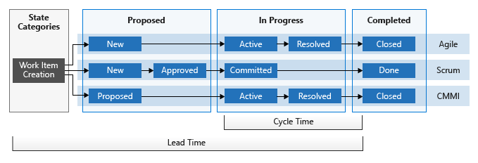
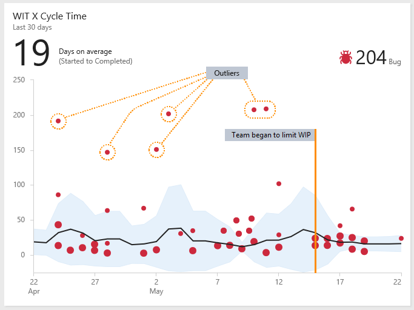
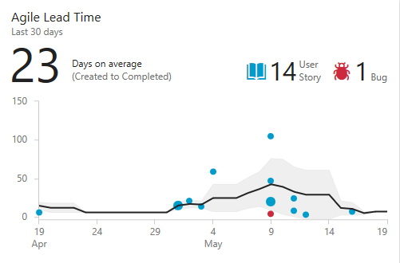

# Lead time and cycle time control charts

**Team Services**

> [!NOTE]  
> <b>Feature availability:</b> The Lead Time and Cycle Time  widgets are only available for Team Services at this time.

Both lead time and cycle time measures are extremely useful to teams as they indicate how long it takes for work to flow through their development pipeline. Lead time measures the total time elapsed from the creation of work items to their completion. Cycle time measures the time it takes for your team to complete work items once they begin actively working on them.  

These measures help teams plan, spot variations in efficiency, and identify potential process issues. The lower the lead and cycle times, the faster the throughput your team has.
 
Both Lead Time and Cycle Time widgets display as scatter-plot control charts. They display summary information as well as provide several interactive elements. 

**Example Lead Time widget**  

The chart dots represent completed work items where their position on the horizontal axis represents the date they were completed. Their position on the vertical axis represents the calculated lead time or cycle time. 
- Larger dots represent multiple work items with the same lead/cycle time 
- Dot color corresponds to the work item type displayed in the legend
- Dark gray dots correspond to a mix of work item types.
  

#### *Summary elements include:* 
- Days on average (average lead time or cycle time) for the main work item types configured for the chart 
- The number of backlog work items used in the chart calculations; if there are more than three types of work items, you'll see a summary for Other  
- The black trend line indicates the moving average 
- The band around the trend line shows the standard deviation.

#### *Interactive elements include:*  
- Hover over any dot to see which work items contributed to the data point and the lead/cycle time for those items  
- Click a dot to open the work item or query that lists the work items   
- To filter the chart, click a work item type in the legend (,, or other icon)  to filter on that type; to return to the original chart, refresh the dashboard.  

## Moving average and standard deviation calculations 

The daily moving average value corresponds to the average of data points that fall within the moving average window. 
The time-based moving average window is calculated based on the current day and previous *N* days, where *N* corresponds to 20% of the number of days the chart displays, rounded down to the nearest odd number. 

For example, if the chart displays the last 30 days, then *N*=5 days (20% of 30 days=6 days, rounded down to 5). The moving average window for April 10th corresponds to the previous 5 days. Therefore, the April 10th moving average is the average of all data points that fall on April 5th through April 10th.  

If there are no data points that fall within the moving average window, the chart doesn't show a moving average line. This can happen if you are starting out and there aren't enough days to calculate a moving average. 

The standard deviation appears as a band that encompasses the moving average. Standard deviation is calculated based on all data points falling within the same moving average window. Like moving average, if no data points fall within the moving average window, the chart doesn't plot standard deviation.  

## Lead time versus cycle time   

The diagram below illustrates how lead time differs from cycle time. Lead time is calculated from work item creation to entering a Completed state. Cycle time is calculated from first entering an In Progress state to entering a Completed state. 

#### Illustration of lead time versus cycle time 

If a work item enters a Completed state and then is reactivated and moved out of that state, then any additional time it spends in a Proposed/In Progress state will contribute to its lead/cycle time when it enters a Completed state for the second time.

If your team uses the Kanban board, you’ll want to understand how your Kanban columns map to workflow states. For more information on configuring your Kanban board, see [Add columns](../../work/kanban/add-columns.md). 

To learn more about how the system uses the state categories&mdash;Proposed, In Progress, and Completed&mdash;see [Workflow states and state categories](../../work/concepts/workflow-and-state-categories.md).   

## Plan using estimate delivery times based on lead/cycle times  
You can use the average lead/cycle times and standard deviations to estimate delivery times. 

When you create a work item, you can use your team’s average lead time to estimate when your team will complete that work item. Your team’s standard deviation tells you the variability of the estimate. Likewise, you can use cycle time and its standard deviation to estimate the completion of a work item once work has begun.  

In the following chart, the average cycle time is 8 days. The standard deviation is +/- 6 days. Using this data, we can estimate that the team will complete future user stories about 2-14 days after they begin work. The narrower the standard deviation, the more predictable your estimates.

#### Example Cycle Time widget

## Identify process issues 
Review your team’s control chart for outliers. Outliers often represent an underlying process issue. For example, waiting too long to complete pull request reviews or not resolving an external dependency in a timely manner.

As you can see in the following chart, which shows several outliers, several bugs took significantly longer to complete than the team's average. Investigating why these bugs took longer may help uncover process issues. Addressing the process issues can help reduce your team's standard deviation and improve your team's predictability. 

#### Example Cycle Time widget showing several outliers 

You can also see how process changes affect your lead and cycle time. For example, on May 15th the team made a concerted effort to limit the work in progress and address stale bugs. You can see that the standard deviation narrows after that date, showing improved predictability. 

## Configure the Cycle Time and Lead Time widgets    

The Configuration dialog for the Cycle Time and Lead Time widgets is the same. You configure these widgets for a team. To learn more about teams, see [Add teams and team members](../../work/scale/multiple-teams.md).  

### Pre-requisites
In order to configure the Cycle Time and Lead Time widgets, you must have the following in place:  
- Installed the [Analyics Marketplace extension](https://marketplace.visualstudio.com/items?itemName=ms.vss-analytics). You must be an account owner or a member of the [Project Collection Administrator group](../../setup-admin/add-administrator-tfs.md) to add extensions.  
- [Added the widget to a dashboard](../add-widget-to-dashboard.md). You must be a [team administrator](../../work/scale/manage-team-assets.md#add-team-admin) or have [permissions to add and edit dashboards](../dashboards.md#set-permissions). 

> [!NOTE]   
> While the Cycle Time and Lead Time widgets use the Analytics data store, access to the data store for other report purposes is not supported at this time. 

### Configuration dialog 
1. If you haven't yet added the [Analyics Marketplace extension](https://marketplace.visualstudio.com/items?itemName=ms.vss-analytics), do that now. 

2. (Optional) If you haven't yet configured your team's Kanban board, do that now. Define the [columns](../../work/kanban/add-columns.md) and [swimlanes](../../work/kanban/expedite-work.md) that support your workflow processes.  

3. If you haven't yet [added the widgets to your dashboard](../add-widget-to-dashboard.md), do that now.  

4. Click the  configure icon to open the configuration dialog. Modify the title, and then select the team, backlog level, swimlanes, and time period you want to monitor.  

	    

5. For a continuous flow, choose Rolling period and specify the number of days you want to view on the chart.  

	Or, for a fixed scope view, choose and specify the Start date. Choose this view if your team employs a Scrumban process or follows a standard sprint process.  

	The main difference between these two types of charts is that the fixed scope chart will provide information (in most cases) of scope change.    

7. Click Save when done. The following image shows an example Lead Time chart showing 60 days of data. 
   
	 

	For your lead/cycle time charts to provide useful data, your team must [Update the status](../../work/kanban/kanban-basics.md#track-work) in a timely manner those work items that the widgets track.  

## Related notes

We recommend your team review the lead/cycle time charts before or during each retrospective. Use lead time to help estimate delivery times and track service level agreements (SLAs). Use cycle time to identify potential process issues, spot variations in trends, and help with planning.   

- [Kanban basics](../../work/kanban/kanban-basics.md)  
- [Cumulative flow diagram](cumulative-flow.md)
- [Workflow states and state categories](../../work/concepts/workflow-and-state-categories.md)
- [Agile](../../work/guidance/agile-process.md), [Scrum](../../work/guidance/scrum-process.md), and [CMMI](../../work/guidance/cmmi-process.md) processes

 
<!---
## Team activities to generate useful data 
    
- Define backlog items that the widgets will track (see [Create your backlog](../../work/backlogs/create-your-backlog.md))
- [Update the status](../../work/kanban/kanban-basics.md#track-work) in a timely manner those work items that the widgets track 
	- The lead time timer begins when the work item is created, which corresponds to the proposed state category (New, Approved, Proposed) and the work item is only presented on the chart when it is in the closed state  
	- The cycle time timer begins when the work item first enters an In-Progress state category (Active, Committed, Resolved)
	- For both charts, a work item will only contribute to calculations if it was assigned to a Completed state category (Closed or Done) within the time period shown in the chart.        

### Lead time versus cycle time   

Your team can use the lead time and cycle time control charts whether they follow Scrum, Kanban, or other methods or the team project is based on the [Agile](../../work/guidance/agile-process.md), [Scrum](../../work/guidance/scrum-process.md), or [CMMI](../../work/guidance/cmmi-process.md) processes. 

The diagram below illustrates how lead time differs from cycle time. These measures are calculated based on when work items are created (lead time), when work is started (cycle time), and when they are completed (both lead and cycle time). The system determines these times based on the workflow state, such as New, Proposed, or Approved, and the state category it is mapped to.  

Only completed work items&mdash;ones that have entered a Done or Closed state&mdash;factor into the calculations of lead time and cycle time. If a work item is marked completed and then reenters an in progress state, then it will contribute to the lead/cycle time measures when it is marked completed for a second time.  

If your team uses the Kanban board, you'll want to understand how your workflow states and custom Kanban columns map to state categories. For more information on configuring your Kanban board, see [Add columns](../../work/kanban/add-columns.md). And, to learn more about how workflow states map to state categories, see [Workflow states and state categories](../../work/concepts/workflow-and-state-categories.md).   

-->