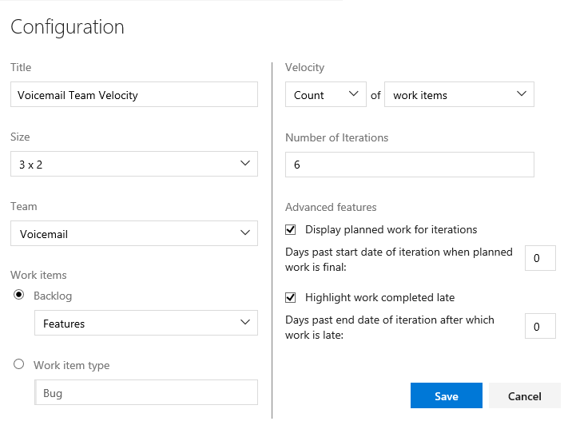
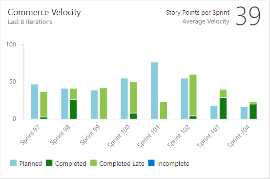

<!--- provides support for FWLINK https://go.microsoft.com/fwlink/?linkid=841878; Update when topic goes live --> 

# Configure and view Velocity charts 

[!INCLUDE [temp](../_shared/vsts-tfs-header-17-15.md)]

Teams track their velocity to help them determine how much work they can perform sprint-over-sprint. Velocity provides an indication of how much work a team can complete during a sprint based either on a count of work items completed or the sum of estimates made to Effort (PBIs), Story Points (user stories), or Size (requirements). Velocity calculations rely on the team's ability to estimate backlog items. 

Once your team has completed a few sprints, they can use their velocity to [forecast](../../work/scrum/forecast.md) how much of the backlog they can finish within upcoming sprints. 

Use this topic to learn: 

> [!div class="checklist"]
> * Install and configure the Velocity widget (Analytics service)  
> * How to work with the Velocity chart (work tracking datastore)     
> * Required and recommended team activities to support velocity tracking      

For usage guidance, see [Velocity metrics and usage guidance ](velocity-guidance.md).

There are two velocity charts, the one viewed from the backlog of a team and the one you access by adding the Velocity widget to a dashboard. The Velocity widget enables you to view more sprints and additional information than that provided by the velocity chart.   

> [!NOTE]   
> **Feature availability:** The Velocity widget is available only for VSTS at this time. 

<table>
<tr valign="top">
<td>
**Velocity chart** 
 
</td>
<td>
**Velocity widget** 
 
</td>
</tr>
</table>
 

## Configure the Velocity widget    

You configure your velocity widget for a team. To learn more about teams, see [Add teams and team members](../../work/scale/multiple-teams.md).  

### Pre-requisites
In order to add a Velocity widget to a dashboard, you must have the following in place:  
- Installed the [Analyics Marketplace extension](https://marketplace.visualstudio.com/items?itemName=ms.vss-analytics). You must be an account owner or a member of the [Project Collection Administrator group](../../tfs-server/add-administrator-tfs.md) to add extensions.  
- [Added the widget to a dashboard](../add-widget-to-dashboard.md). You must be a [team administrator](../../work/scale/add-team-administrator.md)or have [permissions to add and edit dashboards](../dashboard-permissions.md#set-permissions). 

> [!NOTE]   
> While the Velocity widget uses the Analytics data store, access to the data store for other report purposes is not supported at this time. 

### Configuration dialog 
1. If you haven't yet added the [Analyics Marketplace extension](https://marketplace.visualstudio.com/items?itemName=ms.vss-analytics), do that now. 

2. If you haven't yet [added the Velocity widget to your dashboard](../add-widget-to-dashboard.md), do that now.  

3. Click the  actions icon and choose the Configure option to open the configuration dialog. 
	
	Modify the title, select the team, and then choose either the backlog level or work item type to track. Select whether you want to track a count of work items or a sum of a numeric field. The most common summed field is that of Effort, Story Points, or Size.     

	    

4. Specify the number of sprints you want to view. The default is 6 and the maximum is 15.    

5. (Optional) Select the check boxes to show additional information for work completed later than planned for each sprint. 

	**Displayed planned work for iterations:** Check this box to
	display the amount of work planned for an iteration at the start of the iteration. 
	This is useful for comparing your planned work to actual deliverables.
	By default, the count of planned work begins as of the start date of the iteration.  

	<b><i>Days past start date of iteration when planned work is final:</i></b>  Specify a number of days past the start date to count planned work. 
	For example, if the first 2 days of an iteration are for planning, then you can enter "3", and planned work will be counted on the 3rd day. 

	**Highlight work completed late**
	Work items marked complete after the iteration end date are considered to be completed late and will show as light green. 
	This is useful for spotting a trend where work items are marked complete after the iteration is complete.

	> [!NOTE]  
	> A work item is considered late when the work item's Completed Date is later than End Date of the Iteration the work item is _currently_ assigned to.
	> 
	> It will take into account the value you enter for <i>Days past end date of iteration after which work is late<i>.
		
	<b><i>Days past end date of iteration after which work is late:</i></b>  Specify a number of days past which a work item is considered late if it's status is still new or in progress. 
	For example, entering 3 days will give the team 3 days after the end of an iteration to mark work items complete or done, before they are considered late.

6. Click Save when done. The following image shows Velocity based on Story Points and 8 sprints of data. 
   
	  

## Work with the built-in team velocity chart 
Velocity provides a useful metric for gaining insight into how much work your team can complete during a sprint cycle. Each team is associated with one and only one velocity chart.  

Velocity will vary depending on team capacity, sprint over sprint. However, over time, the velocity should indicate a reliable average that can be used to forecast the full backlog.  

[!INCLUDE [temp](../_shared/image-differences.md)]

1.	From the backlog page, open the velocity chart.  

	  

	For charts to appear, your team must perform these activities: 
	- Select sprints for your team  
	- Assign backlog items to sprints   
	- Estimate backlog items by defining the Effort, Story Points, or Size.
 
2.	The chart tracks your estimated backlog work (sum of Effort, Story Points, or Size) that your team has completed (green) in the previous sprints, or that are still in progress (blue).  

	As this chart shows, velocity will fluctuate from sprint-to-sprint for a variety of reasons. However, you can quickly determine the average velocity by averaging the values shown in green for each sprint. You can then plug the average into the Forecast tool.

	

	>[!NOTE]  
	>Work items based on the [Scrum process](../../work/work-items/guidance/scrum-process.md) get counted in the chart once their State is set to Committed, whereas items based on the [Agile](../../work/work-items/guidance/agile-process.md) and [CMMI](../../work/work-items/guidance/cmmi-process.md) processes get counted once their State is set to Active. This behavior is set through the [workflow states to category state mappings](../../work/customize/workflow-and-state-categories.md).
	
## Required and recommended activities   

For your team to gain the greatest utility from the velocity chart or velocity widget, follow these required and recommended tasks.  

**Required:** 
*	[Define sprints for the team project](../../work/customize/set-iteration-paths-sprints.md) - Sprints should be of the same duration. 
*	[Select sprints for each team](../../work/scale/set-team-defaults.md#activate)
*	[Define and estimate backlog items](../../work/backlogs/create-your-backlog.md#estimates). If you work from your team's backlog, the items you create will automatically be assigned to the current sprint (Iteration) and to your team's default Area Path.  
*	Update the status of backlog items once work starts and when completed. Only backlog items whose State maps to a metastate of In Progress or Done will show up on the velocity chart or velocity widget. 

**Recommended:**  
*	Define and size backlog items to [minimize variability](velocity-guidance.md).  
*	Determine how your team wants to [treat bugs](../../work/customize/show-bugs-on-backlog.md). If your team chooses to treat bugs like requirements, bugs will show up on the backlog and be counted within the Velocity chart and forecasting. 
*	[Set your team's area path](../../work/customize/set-area-paths.md). The forecast tool will forecast those items based on your team's default settings. These settings can specify to include items in area paths under the team's default or exclude them.     
*	Don't  create a hierarchy of backlog items and bugs. The Kanban board, sprint backlog, and task board only show the last node in a hierarchy, called the leaf node. For example, if you link items within a hierarchy that is four levels deep, only the items at the fourth level appear on the Kanban board, sprint backlog, and task board.  Instead of nesting requirements, bugs, and tasks, we recommend that you maintain a flat list─only creating parent-child links one level deep between items. Use [Features to group requirements or user stories](../../work/backlogs/organize-backlog.md). You can quickly map stories to features, which creates parent-child links in the background.  
*	At the end of the sprint, update the status of those backlog items that the team has fully completed. Incomplete items should be moved back to the product backlog and considered in a future sprint planning meeting.   

## Try this next

> [!div class="nextstepaction"]
> [Velocity guidance](velocity-guidance.md)

 
### Add other teams
If you work with several teams, and each team wants to work with their own backlog view, velocity chart, and forecast tool, you can [add teams](../../work/scale/multiple-teams.md). Each team then gets access to their own set of Agile tools. Each Agile tool filters work items to only include those whose assigned area paths and iteration paths meet those [set for the team](../../work/scale/set-team-defaults.md). 

