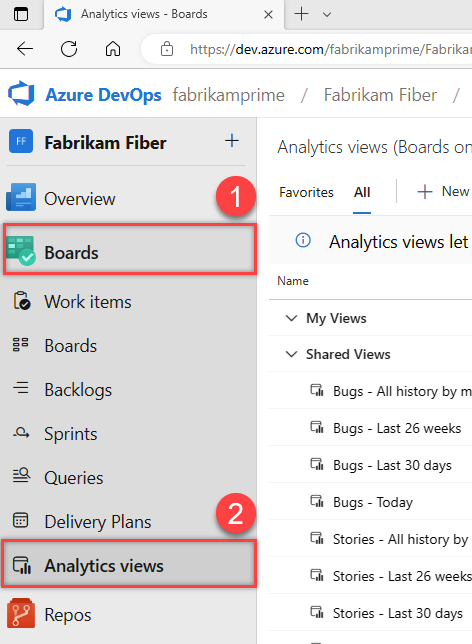

## Open Analytics to access views

From your web portal, expand **Overview** and choose **Analytics views**. 

If you don't see **Analytics**, check that it's enabled and that you have permissions to view Analytics. See the [Permissions and prerequisites to access Analytics](../analytics/analytics-permissions-prerequisites.md).

> [!div class="mx-imgBorder"]  
>   

