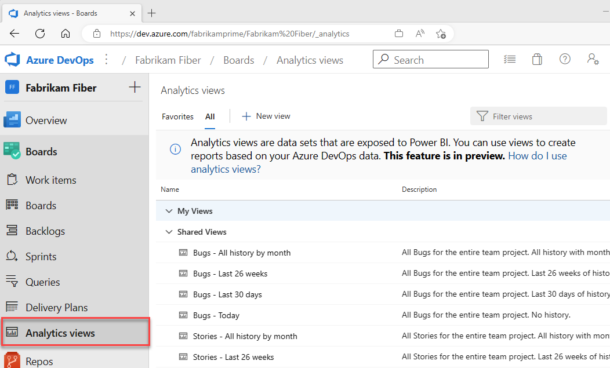

## Open Analytics to access views

From your web portal, select **Boards** > **Analytics views**. 

If you don't see **Analytics views**, check that you have permissions to view Analytics. See the [Permissions and prerequisites to access Analytics](../analytics/analytics-permissions-prerequisites.md).

> [!div class="mx-imgBorder"]  
>   

