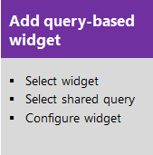
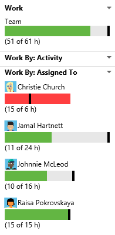
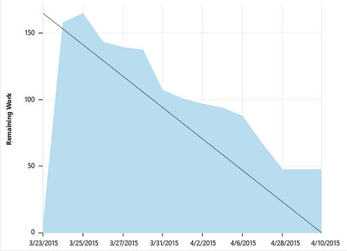
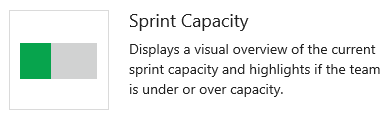
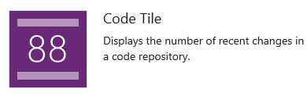

# Get started with Agile tools to monitor progress and trends   

[!INCLUDE [temp](../work/_shared/dev15-version-header.md)] 

With Agile tools you gain access to a number of light-weight charts and tracking tools. You can add most charts to a team dashboard to get a unified picture of trends you want to monitor. These methods serve the needs of most teams to track their progress and provide status to their stakeholders.  

##Create light-weight charts  
To get started, you can open a shared query and create a chart based on your tracking interests. Chart types include status--pie, bar, column, stacked bar, and pivot--and trend -- stacked area, line, and area--charts.   

[](../work/track/using-queries.md)[](charts.md)[](add-widget-to-dashboard.md#add-charts)  

The available queries differ based on the process--[Agile](../work/guidance/agile-process.md), [Scrum](../work/guidance/scrum-process.md), or [CMMI](../work/guidance/cmmi-process.md)--selected to create your team project.  

####Sample Agile tool light-weight charts   

   

##Add chart widgets to a dashboard   
Dashboards allow you to configure an array of charts that you want to monitor. From the dashboard you can add chart widgets and configure them. Charts that track work require you to first define the query.   

[](dashboards.md)[](widget-catalog.md) [](widget-catalog.md)


**Sample Agile tool chart widgets**  

    


## Sprint charts     

Each sprint provides access to two charts. The first [tracks capacity](../work/scrum/define-sprints.md) for the team, team activities--such as Development, Test, Design--and individual team members. The second tracks the [sprint burndown](../work/scrum/sprint-burndown.md) in terms of remaining work. 

| Capacity bars | Burndown  |
|-------| ----- |
| |   |


**Sprint chart widgets**  

      


## Test progress, results, and trends  

The steps to creating charts that track test progress and results are similar to those for tracking work. The starting point, however, begins with the test plan rather than a query. For example, you can find out how many test cases are ready to run, or how many tests are passing and failing in each test suite. 

[](../test/manual-exploratory-testing/getting-started/track-test-status.md)[](charts.md)[](add-widget-to-dashboard.md#add-charts)


And, just like work item query-based charts, you can add these charts to a dashboard.  

####Sample light-weight test charts   


## Monitor code activity, build progress and trends  

With the code tile widgets, you can monitor the activity occuring within a repo or branch folder. Build history displays a histogram of all builds run for a specific build definition. Bar color indicates: green-completed, red-failed, and yellow-completed without tests. 

**Code and build history chart widgets**  


  


##Try this next  

Take these tools for a test run by [creating an account on Team Services for free](../setup-admin/team-services/sign-up-for-visual-studio-team-services.md).  

##Related notes

Prior to monitoring progress and trends, you'll need to have [planned your project and made progress on work you're tracking](../work/agile-project-management.md). 

In addition to the lightweight charts, you also have access to these reports, subject to platform and resource requirements being met.   


<a id="shared-queries">  </a>
### Predefined shared queries   

| Area| Agile | Scrum | CMMI | 
|-------|-------| ----- | ---- |   
|Project | Product Backlog<br/>Product Planning | Product Backlog | Customer Requirements<br/>Open Requirements<br/>Product Requirements <br/> |  
|Sprint | Iteration Backlog<br/> | Sprint Backlog<br/>Unfinished Work<br/>Work in Progress | none defined <sup>1</sup> |  
|Bug | Active Bugs<br/>Bug Triage<br/>Resolved Bugs | none defined <sup>2</sup>| Active Bugs<br/>Resolved Bugs |  
|Test | Open Test Cases<br/>User Stories without Test Cases | Test Cases | Open Test Cases<br/>Test Tasks |  

1. Create sprint-specific queries by adding a filter clause ```Iteration Path=@CurrentIteration``` to an existing project status query.    
2. The Scrum process treats bugs the same as product backlog items, so no bug-specific queries are predefined. To monitor bugs, add a filter clause with ```Work Item Type=Bug```.   

### Extensibility  
In addition to the widgets described in the Widget catalog, you may also add widgets made available through the [Marketplace (Team Services only)](https://marketplace.visualstudio.com/#VSTS) or create your own widgets using the [Widget REST APIs](https://www.visualstudio.com/integrate/extensions/develop/add-dashboard-widget). 

Or, you can [add a custom field](../work/process/customize-process.md) to support additional tracking needs.   


