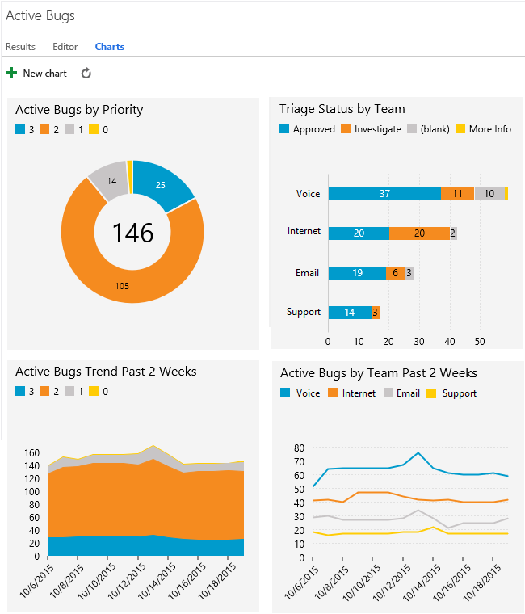
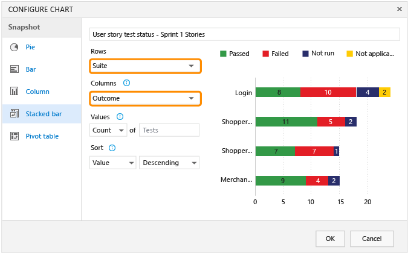
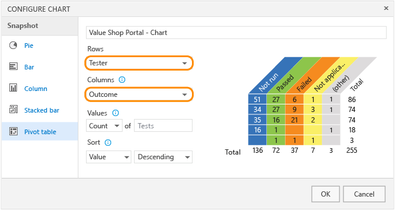

# Dashboards and reports overview  

[!INCLUDE [temp](_shared/vsts-tfs-header-17-15.md)]

Gain insight into the progress you're making and the quality of your software development projects. You can collect status and trend charts into dashboards that you share with your team and stakeholders.  

For more complex reporting requirements, you can open or customize a dashboard or report. Your choices depend on whether you're working in the cloud or on-premises, and resources configured for your on-premises TFS.  

If you're new to working in Team Services or TFS, see [Get started with Agile tools to monitor progress and trends tools](monitor-progress-trends.md).   

>[!NOTE]  
><b>Feature availability: </b>The following charts, dashboards, reports and tasks are available from Team Services (cloud service) or from the web portal of the listed on-premises TFS version or a later version. Those not annotated are available from all platforms and versions. Visit the [Visual Studio Downloads](https://www.visualstudio.com/downloads/download-visual-studio-vs) page to get the latest TFS update. Additional resources may be required as annotated.  

Lightweight work tracking charts  1

<ul style="padding-left:30px">

<li style="margin-bottom:2px">[Work tracking status and progress charts](charts.md)</li>
<li style="margin-bottom:2px">[Cumulative flow chart](./guidance/cumulative-flow.md)</li>
<li style="margin-bottom:2px">[Velocity chart](../work/scrum/velocity-and-forecasting.md) </li>
<li style="margin-bottom:2px">[Sprint burndown chart](../work/scrum/sprint-burndown.md)</li>
<li style="margin-bottom:2px">[Team capacity chart](../work/scale/capacity-planning.md) </li>
</ul>

DevOps charts and widgets

<ul style="padding-left:30px">
<li style="margin-bottom:2px">[Build history](add-widget-to-dashboard.md#build-history) (TFS 2015.1)</li>
<li style="margin-bottom:2px">[Release summary](../build/actions/view-manage-releases.md#add-widget) (TFS 2017.1)</li>
<li style="margin-bottom:2px">[Requirements quality](widget-catalog.md#requirements-quality-widget) (TFS 2017)</li>
<li style="margin-bottom:2px">[Test status, progress, and result charts](../test/manual-exploratory-testing/getting-started/track-test-status.md)</li>
<li style="margin-bottom:2px">[Test quality trend chart](add-widget-to-dashboard.md#test-quality) (TFS 2015)</li>
</ul>

Dashboards (Web portal)

<ul style="padding-left:30px">
<li style="margin-bottom:2px">[Create and manage team dashboards](dashboards.md) (TFS 2015.1)</li>
<li style="margin-bottom:2px">[Add charts and widgets to a dashboard](add-widget-to-dashboard.md) (TFS 2015)</li>
<li style="margin-bottom:2px">[Pin an item to a team dashboard](team-dashboard.md) (TFS 2015)</li>
<li style="margin-bottom:2px">[Add markdown guidance to a dashboard](../reference/markdown-guidance.md) (TFS 2015.1)</li>
<li style="margin-bottom:2px">[Widget catalog](widget-catalog.md) (TFS 2015.1)</li>
</ul>

<b>Excel and SQL Server Reports</b> (TFS only)

<ul style="padding-left:30px">
<li style="margin-bottom:2px">[Create adhoc Excel status and trend charts](#excel-reports)  2 </li>
<li style="margin-bottom:2px">[View default Excel reports](#excel-reports)  3 </li>
<li style="margin-bottom:2px">[View default SQL Server Reports](#sql-reports)   4  </li>
<li style="margin-bottom:2px">[Create custom SQL Server Reports](https://msdn.microsoft.com/library/ff730837.aspx) 4 </li> 

</ul>

<b>Dashboards (Project portal) 5</b> (TFS only)

<ul style="padding-left:30px">
<li style="margin-bottom:2px">[Work with SharePoint dashboards](#sharepoint-dashboards) </li>
</ul>

<!---

<b>Power BI dashboards and reports</b> (Team Services, Private Preview)

<ul style="padding-left:30px">
<li style="margin-bottom:0px">[Power BI integration overview](./powerbi/overview.md)  </li>
<li style="margin-bottom:0px">[Connect to Power BI, Content Pack](./powerbi/connect-vso-pbi-vs.md)  </li>
<li style="margin-bottom:0px">[Connect to Power BI, Data Connector](./powerbi/connect-vso-pbi-vs.md)  </li>
<li style="margin-bottom:0px">[Create dashboards and reports](./powerbi/report-on-vso-with-power-bi-vs.md)  </li>
<li style="margin-bottom:0px">[Data available](./powerbi/vso-pbi-whats-available-vs.md)  </li>
<li style="margin-bottom:0px">[Create trend charts](./powerbi/create-trend-charts.md)  </li>
<li style="margin-bottom:0px">[Create rollup charts](./powerbi/create-rollup-charts.md)    </li>
</ul>

<b>Analytics service (in preview) 7</b> (Team Services only)

<ul style="padding-left:30px">
<li style="margin-bottom:2px">[Analytics service overview](analytics/overview-analytics-service.md)  </li>
</ul>

-->

**Notes:**
1. These charts are built from the real-time, work tracking data store.   
2. These reports are built from the SQL Server data warehouse and cube and require that your team project is configured with SQL Server Analysis Services.
3. These reports are built from the SQL Server data warehouse and cube and require that your team project is configured with SQL Server Analysis Services and SharePoint Products. 
4. These reports are built from the SQL Server data warehouse and cube and require that your team project is configured with SQL Server Analysis Services and SQL Server Reporting Services.
5. Project portal dashboards available to you depend on the [version of SharePoint Products configured to integrate with TFS](http://msdn.microsoft.com/library/dd380719.aspx). 
 

<!---
These charts are built from the VS Team Services data connector data model. 

The Analytics service is in preview and only available to select customers of Team Services at this time. If you're a Team Services customer and are interested in working with the preview version of the Analytics service, contact the [Analytics service team](mailto:vsts-analytics-supp@microsoft.com).  
--> 

## Charts
The quickest way to view progress is to create work item or test result charts. 
These charts are always up-to-date because they get data directly from the TFS data stores.

### Status or trend charts 

You can create several types of charts -- such as pie, column, or trend -- for the [same flat-list query](charts.md).  

   

### Test results and test status charts  

Visualize the [test status](../test/manual-exploratory-testing/getting-started/track-test-status.md) for a specific test suite or progress made in testing a user story.

   

You can also see how many tests each tester has left to run.
 
   

## Dashboards (Web portal)
Teams can [create multiple dashboards](dashboards.md) to share information, access quick links and other functions, and view status, progress, and trends. Easily add and rearrange widgets on the dashboard to show recent changes made to source control folders, build status, and charts created from work item queries.
 

## Excel Reports (TFS)  
You can track your team project's burn rate, bug backlog, software quality, test progress, and other metrics by viewing a [default Excel report](excel/excel-reports.md).  

Here are examples of two of the Excel reports.

   

Default Excel reports require that your team project is configured with SharePoint Products and SQL Server Analysis Services. If these reports aren't available to you, you can [create ad-hoc reports in Excel from a work item query](#excel-adhoc-query-report) or by connecting to the Analysis Services cube. 

<table>
<tbody valign="top">
<tr>
<td width="25%"> 
**Adhoc status and trend reports**
<ul>
    <li>[Create Excel reports from a query](./excel/create-status-and-trend-excel-reports.md)</li>
</ul>
**Build and code quality**  
<ul>
<li>[Build Quality](excel/build-quality-excel-report.md)</li>
<li>[Build Status](excel/build-status-excel-report.md)</li>
<li>[Code Churn](excel/code-churn-excel-report.md)</li>
<li>[Code Coverage](excel/code-coverage-excel-report.md)</li>
</ul>
</td>
<td width="25%"> 

**Progress**
<ul>
    <li>[Burndown](excel/burndown-excel-report.md)</li>
    <li>[Issue Trends](excel/issue-trends-excel-report.md)</li>
    <li>[Task Progress](excel/task-progress-excel-report.md)</li>
    <li>[User Story Progress (Agile)](excel/user-story-progress-excel-report-agile.md)</li>
    <li>[Requirements Progress (CMMI)](excel/requirements-progress-excel-report-cmmi.md)</li>
</ul>

</td>
<td width="25%"> 

**Bug tracking**
<ul>
    <li>[Bug Progress](excel/bug-progress-excel-report.md)</li>
    <li>[Bug Reactivations](excel/bug-reactivations-excel-report.md)</li>
    <li>[Bug Trends](excel/bug-trends-excel-report.md)</li>
    <li>[Bugs by Assignment](excel/bugs-by-assignment-excel-report.md)</li>
    <li>[Bugs by Priority](excel/bugs-by-priority-excel-report.md)</li>
</ul>

</td>
<td width="25%">
**Test tracking**
<ul>
    <li>[Failure Analysis](excel/failure-analysis-excel-report.md)</li>
    <li>[Test Activity](excel/test-activity-excel-report.md)</li>
    <li>[Test Case Readiness](excel/test-case-readiness-excel-report.md)</li>
    <li>[Test Plan Progress](excel/test-plan-progress-excel-report.md)</li>
    <li>[Test management reports](excel/test-management-reports.md)</li>
    <li>[Testing Gaps (Agile)](excel/testing-gaps-excel-report-agile.md)</li>
    <li>[Test Team Progress](excel/test-team-progress-excel-report.md)</li>
    <li>[Test Team Productivity](excel/test-team-productivity-excel-report.md)</li>
    <li>[User Story Test Status (Agile)](excel/user-story-test-status-excel-report-agile.md)</li>
    <li>[Requirement Test Status (CMMI)](excel/requirement-test-status-excel-report-cmmi.md)</li>

</ul>
</td>
</tr>
</tbody>
</table>

## SQL Server Reporting Services Reports (TFS)  
Default SQL Server reports reports differ based on the process used to create your team project. Also, several of these reports gather data points into a single report. For example, 
the [Stories Overview (Agile)](sql-reports/stories-overview-report-agile.md) report presents a snapshot of the work that has been performed for the filtered set of user stories to the current date.

Each process&mdash;[Agile, Scrum, CMMI](../work/guidance/choose-process.md)&mdash;provides several default Reporting Services reports. These reports require that your on-premises TFS was configured with SQL Server Analysis Services and Reporting Services Reports.  
If you didn't add these services previously and want to add them now, see [Add reports to a team project](./admin/add-reports-to-a-team-project.md).

<table>
<tbody valign="top">
<tr>
<td width="25%"> 
**Build and code quality**
<ul>
    <li>[Build Quality Indicators](sql-reports/build-quality-indicators-report.md)</li>
    <li>[Build Success Over Time](sql-reports/build-success-over-time-report.md)</li>
    <li>[Build Summary](sql-reports/build-summary-report.md)</li>
</ul>
</td>
<td width="25%">
**Progress (Scrum-specific)**
<ul>
    <li>[Backlog Overview (Scrum)](sql-reports/backlog-overview-scrum.md)</li>
    <li>[Release Burndown](sql-reports/release-burndown.md)</li>
    <li>[Sprint Burndown (Scrum)](sql-reports/sprint-burndown-scrum.md)</li>
    <li>[Velocity (Scrum)](sql-reports/velocity.md)</li>
</ul>
</td>
<td width="25%">

**Progress (Agile and CMMI)**

<ul>
    <li>[Burndown and Burn Rate](sql-reports/burndown-and-burn-rate-report.md)</li>
    <li>[Remaining Work](sql-reports/remaining-work-report.md)</li>
    <li>[Requirements Overview (CMMI)](sql-reports/requirements-overview-report-cmmi.md)</li>
    <li>[Requirements Progress (CMMI)](sql-reports/requirements-progress-report-cmmi.md)</li>
    <li>[Status on All Iterations](sql-reports/status-on-all-iterations-report.md)</li>
    <li>[Stories Overview (Agile)](sql-reports/stories-overview-report-agile.md)</li>
    <li>[Stories Progress (Agile)](sql-reports/stories-progress-report-agile.md)</li>
    <li>[Unplanned Work](sql-reports/unplanned-work.md)</li>

</ul>
</td>
<td width="25%">

**Bug and test tracking**
<ul>
    <li>[Bug Status](sql-reports/bug-status-report.md)</li>
    <li>[Bug Trends](sql-reports/bug-trends-report.md)</li>
    <li>[Reactivations](sql-reports/reactivations-report.md)</li>
    <li>[Test Case Readiness](sql-reports/test-case-readiness-report.md)</li>
    <li>[Test Plan Progress](sql-reports/test-plan-progress-report.md)</li>
</ul>
</td>
</tr>
</tbody>
</table>

To manage the data warehouse or troubleshoot problems that occur, you use the Warehouse Control Web Service. See [Manage TFS reports, data warehouse, and analysis services cube](./admin/manage-reports-data-warehouse-cube.md)

##Project portal (SharePoint) dashboards (TFS only)

SharePoint dashboards collect a number of Excel reports and team project data within a single view hosted on the project portal. 
For example, the Quality dashboard provides an overview of progress occurring in the test, development, and build areas as they 
relate to the quality of the software under development. 

Dashboards available to you depend on the [version of SharePoint Products configured to integrate with TFS](sharepoint-dashboards/project-portal-dashboards.md). 

Different dashboards are available to you based on the [process](../work/guidance/choose-process.md) you selected to create your team project. 

#### Scrum 
<ul>
    <li>[Release (Scrum)](sharepoint-dashboards/release-scrum.md)</li>
</ul>

#### Agile and CMMI
<ul>
    <li>[My  ](sharepoint-dashboards/my-dashboard-agile-cmmi.md) </li>
    <li>[Bugs](sharepoint-dashboards/bugs-dashboard-agile-cmmi.md) </li>
    <li>[Build ](sharepoint-dashboards/build-dashboard-agile-cmmi.md) </li>
    <li>[Project](sharepoint-dashboards/project-dashboard-agile-cmmi.md) </li>
    <li>[Progress](sharepoint-dashboards/progress-dashboard-agile-cmmi.md) </li>
    <li>[Quality](sharepoint-dashboards/quality-dashboard-agile-cmmi.md) </li>
    <li>[Test ](sharepoint-dashboards/test-dashboard-agile-cmmi.md) </li>

</ul>

##Related notes  

If you're new to working in Team Services or TFS, see [Get started with Agile tools to monitor progress and trends tools](monitor-progress-trends.md).   

Other useful resources include:  
- [Choose a process](../work/guidance/choose-process.md) provides an overview of the three default processes used to create and update team projects 
- [Support rollup of work and other fields](https://msdn.microsoft.com/library/dn217871.aspx) provides information on how to generate rollup data when working with parent-child linked work items
- [Components of the TFS data warehouse](http://msdn.microsoft.com/library/ms244687.aspx) provides more information on the structure and relationship of the warehouse and reports
- [Feature index for Team Services and TFS](../alm-devops-features.md)

### Add custom fields  
You can add data to support reporting requirements in the following ways:

*   [Add a custom field (Inheritance process model, Team Services)](../work/process/customize-process-field.md) or [Add or modify a field (Hosted XML or On-premises XML)](../work/customize/add-modify-field.md)  

*   Add work item fields to the data store, relational database, or data warehouse. See [Add or modify work item fields to support reporting (TFS)](../work/reference/add-or-modify-work-item-fields-to-support-reporting.md).

*   Incorporate data from other resources to an Excel report using PowerPivot.
    PowerPivot for Excel 2010 is a data analysis add-in for Microsoft Excel 2010. By using this add-in, you can generate reports that combine data from other data stores or databases with data from Team Foundation Server. For more information, see [Microsoft PowerPivot](https://msdn.microsoft.com/library/gg399131.aspx). 

*   Create an adapter to add new data types to the data warehouse (TFS).
    An adapter is a managed assembly that implements [IWarehouseAdapter](http://msdn.microsoft.com/library/microsoft.teamfoundation.adapter.iwarehouseadapter.aspx). An adapter uses the warehouse object model to interact with the TFS data warehouse. When an adapter adds data fields to the warehouse, it programmatically extends the schema that defines data that is moved to the warehouse. For more information, see [Data Warehouse Extensibility](http://msdn.microsoft.com/library/bb130342.aspx) and [How to: Create an Adapter](http://msdn.microsoft.com/library/bb286956.aspx). 

[excel-adhoc-query-report]: ./excel/create-status-and-trend-excel-reports.md
[add-a-team]: ../Work/scale/multiple-teams.md
[team-assets]: ../Work/scale/manage-team-assets.md
[add-team-members]: ../Work/scale/multiple-teams.md#add-team-members
[add-team-admin]: ../Work/scale/manage-team-assets.md#add-team-admin
   