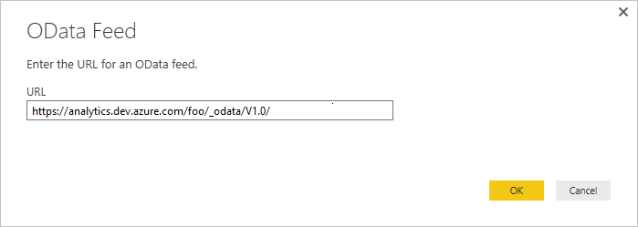

# Access data through Excel 

[!INCLUDE [temp](../_shared/version-azure-devops.md)]

You can access data through Excel, generate reports and then publish the charts to PowerBI.com or use the Excel file
as a basis for Power BI reports. At this time you will need to have alternate credentials enabled to access data
the Analytics Service via Excel.

[!INCLUDE [temp](../_shared/analytics-preview.md)]

1. To get started, Open Excel 2016 (this will work with earlier versions of Excel. You will need to have installed
the Power Query add-in which you can do from [Microsoft Power Query for Excel](https://www.microsoft.com/download/details.aspx?id=39379&CorrelationId=3f2bb5d7-8db9-4e8f-ad58-bfa2789c877c). 

2. Create a blank workbook

3. In the **Data** tab, choose **New Query>From Other Sources>From OData Feed**.

	 


4. Enter the URL in the format below and choose **OK**:  
	::: moniker range="azure-devops"

	```
	https://analytics.dev.azure.com/{OrganizationName}/_odata/{version}/
	```  

	If the *OrganizationName* is **fabrikam** and the *version* is **v1.0**, then the URL is `https://analytics.dev.azure.com/fabrikam/_odata/v1.0/`.

	  

	> [!NOTE]  
	> Alternatively, you can enter the URL with the *ProjectName* specified which will trim the results by the specified project across all entities related to that project. 
	>
	> `https://analytics.dev.azure.com/{OrganizationName}/{ProjectName}/_odata/{version}/` 
	
	::: moniker-end

	::: moniker range="azure-devops-2019"

	```
	https://{ServerName}:{Port}/tfs/{CollectionName}/_odata/{version}/
	```  

	If the *CollectionName* is **fabrikam** and the *version* is **v1.0**, then the URL is 
	`https://{ServerName}:{Port}/tfs/fabrikam/_odata/{v1.0}/`.

	  

	> [!NOTE]  
	> Alternatively, you can enter the URL with the *ProjectName* specified which will trim the results by the specified project across all entities related to that project. 
	>
	> `https://{ServerName}:{Port}/tfs/{CollectionName}/{ProjectName}/_odata/{version}/` 
	
	::: moniker-end

5. At this point you will be prompted to authenticate against the service. If you have not done so previously, see this article: [Client Authentication Options](client-authentication-options.md).

6. Either select a single entity to retrieve the data for or check **Select multiple items** and choose the data to return.

    

	At this point, if you click **Load**, Excel will load all of the data in each entity into Power Query. However, this may be more data than you want (or than Excel can handle). 
    To filter the data, select the entity to filter and choose **Edit**. This brings up the Query Editor. For each column you want to filter on, select it and set your filter. When this is complete choose **Close & Apply** in the upper left corner.

	> [!IMPORTANT]  
    > Do *not* select any entity with the name **Snapshot** in it. These entities contain the state of every work item
    on every day since each work item was created. For repositories of any size this will lead to tens or hundreds of millions of work items which will
    not load correctly. In order to perform trend analysis, narrow the scope of data being retrieved to the specific items and time frame and pull this information in with a separate OData query. 

As an alternative to loading the data into Power Query, you can click the drop-down arrow next to Load and select Load To instead.
This allows the following options:

* Load the data to table which is Power Query
* Create a connection without loading the data (essentially deferring the data load until later)
* To a worksheet which will just load the one entity per worksheet
* To a model (which can be selected in addition to the other options) which loads the data into PowerPivot

More information on these options can be found in the [Excel documentation](https://support.office.com/article/Add-a-query-to-an-Excel-worksheet-Power-Query-ca69e0f0-3db1-4493-900c-6279bef08df4?ui=en-US&rs=en-US&ad=US#querytoworksheet).

## Handling relationships
 
By default, when basic data is returned from the Analytics Service, the data is related as shown in the figure below:

  

You will note that the Tags, Teams and Users are not related to any of the other data. This is due to how those entities
are related. They are related by either many-to-many relationships which are not easily handled in these models or 
there are multiple relationships between the entities such as between users and work items (they are related by Assigned To,
Created By, Changed By, and others).

Multiple relationships can be handled in fairly simply. For example, in the default model you can edit the query, select the
AssignedTo column of the WorkItems table and expand the column to include all of the data from the Users table and you can repeat
this process for the Created By and Changed By columns as well. This gets you around having multiple links from one table to another
which is not allowed.
