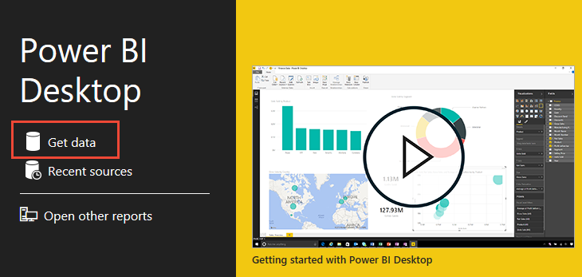
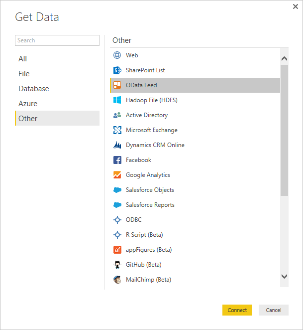
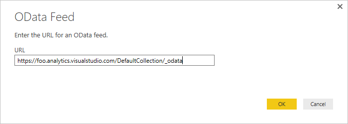
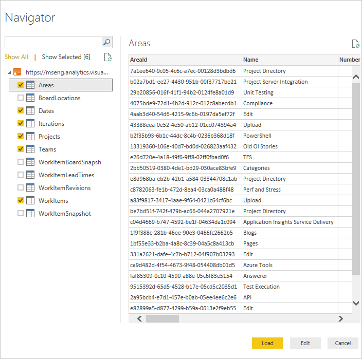

# Connect using the Power BI OData feed

[!INCLUDE [temp](../_shared/version-azure-devops.md)] 

You can access the Analytics service data through the Power BI Desktop OData feed. This method works for any organization that has alternate credentials enabled in Azure DevOps. OAuth is currently not supported. 

## Access the Analytics service OData feed

::: moniker range="azure-devops-2019"
0. Make sure you have installed the [Analytics extension](../dashboards/analytics-extension.md).  
::: moniker-end  
0. Make sure you have configured the [permissions required to access the Analytics service](analytics-security.md).  

0. Open Power BI Desktop. If you need to install it, [do that now](https://powerbi.microsoft.com/desktop).  

0. Choose **Get Data** from either the welcome page or the Home ribbon.  

	> [!div class="mx-imgBorder"] 
	>  

5. Next, select **Other>OData Feed** and choose **Connect**.  

	  

6.	In a supported browser, enter the URL in the following format:  

	```OData
	https://analytics.dev.azure.com/{OrganizationName}/_odata/{version}/
	```  

	If the *OrganizationName* is **fabrikam** and the *version* is **v1.0**, then the URL is `https://analytics.dev.azure.com/fabrikam/_odata/v1.0/`.

	   

	> [!NOTE]  
	>Alternatively, you can enter the URL with the *ProjectName* specified which will trim the results by the specified project across all entities related to that project. 
	>
	>`https://analytics.dev.azure.com/{OrganizationName}/{ProjectName}/_odata/{version}/` 

7. You'll see a prompt to authenticate against the service. If you have not done so previously, see [Client Authentication Options](client-authentication-options.md).  

8. Next, select the entities you want to retrieve data for by checking those entities.

	> [!IMPORTANT]  
	>Do *not* select any entity with the name **Snapshot** in it. These entities contain the state of every work item on every day since each work item was created. For repositories of any size this will lead to tens or hundreds of millions of work items which will not load. **Snapshot** tables are intended only for [aggregation queries](../extend-analytics/odata-query-guidelines.md)

	 

	At this point, if you choose **Load**, Power BI Desktop will load all of the data in each entity. However, this may be more data than you want. To filter the data, select the entity to filter and choose **Edit**. This brings up the Query Editor. For each column on which you want to filter, select it and set your filter. When this is complete choose **Close & Apply** in the upper left corner.  

## Related articles

- [Dataset design for the Power BI Connector for Azure DevOps](data-connector-dataset.md)
- [Data Connector - Example reports](data-connector-examples.md)