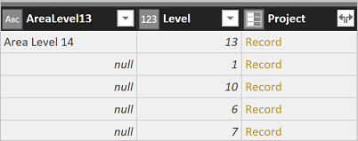
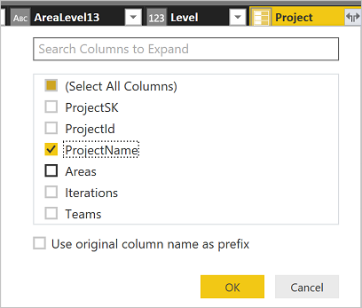

# Connect using the Power BI OData feed

[!INCLUDE [temp](../../_shared/version-vsts-only.md)] 

You can access the Analytics service data through the Power BI Desktop OData feed. This method works for any Azure DevOps organization that has alternate credentials enabled. OAuth is currently not supported. 

## Access the Analytics service OData feed
1. Make sure you have installed the [Analytics extension](https://marketplace.visualstudio.com/items?itemName=ms.vss-analytics).  

2. Make sure you have configured the [permissions required to access the Analytics service](../analytics/analytics-security.md).  

3. Open Power BI Desktop. If you need to install it, [do that now](https://powerbi.microsoft.com/desktop).  

4. Choose **Get Data** from either the welcome page or the Home ribbon.  

	 

5. Next, select **Other>OData Feed** and choose **Connect**.  

	  

6.	In a supported browser, enter the URL in the following format:  

	```OData
	https://analytics.dev.azure.com/{OrganizationName}/_odata/{version}/
	```  

	If the *OrganizationName* is **fabrikam** and the *version* is **v1.0**, then the URL is `https://analytics.dev.azure.com/fabrikam/_odata/v1.0/`.

	   

	>[!NOTE]  
	>Alternatively, you can enter the URL with the *ProjectName* specified which will trim the results by the specified project across all entities related to that project. 
	>
	>`https://analytics.dev.azure.com/{OrganizationName}/{ProjectName}/_odata/{version}/` 

7. You'll see a prompt to authenticate against the service. If you have not done so previously, see [Client Authentication Options](../analytics/client-authentication-options.md).  

8. Next, select the entities you want to retrieve data for by checking those entities.

	>[!IMPORTANT]  
	>Do *not* select any entity with the name **Snapshot** in it. These entities contain the state of every work item on every day since each work item was created. For repositories of any size this will lead to tens or hundreds of millions of work items which will not load. **Snapshot** tables are intended only for [aggregation queries](../extend-analytics/odata-query-guidelines.md)

	 

	At this point, if you choose **Load**, Power BI Desktop will load all of the data in each entity. However, this may be more data than you want. To filter the data, select the entity to filter and choose **Edit**. This brings up the Query Editor. For each column on which you want to filter, select it and set your filter. When this is complete choose **Close & Apply** in the upper left corner.  

### Handle relationships

Understanding the [Analytics data model](../extend-analytics/data-model-analytics-service.md) is critical to building good relationships between entities. 

By default, when basic data is returned from the Analytics Service, the data is related as shown in the figure below:

  

You will note that the Tags, Teams and Users are not related to any of the other data. This is due to how those entities
are related. They are related by either many-to-many relationships which are not easily handled in these models or 
there are multiple relationships between the entities such as between users and work items (they are related by Assigned To,
Created By, Changed By, and others).

Multiple relationships can be handled in fairly simply. For example, in the default model you can edit the query, select the
AssignedTo column of the WorkItems table and expand the column to include all of the data from the Users table and you can repeat
this process for the Created By and Changed By columns as well. This gets you around having multiple links from one table to another
which is not allowed.

Another reason for expanding columns in this way is to handle circular relationships which are also not allowed. For example, 
take the following path: Projects > Areas > Work Items > Projects. This presents a typical circular problem. What if you
wanted to see which ares were part of a given project? The model as it is build has relationships between Areas and Work Items and 
Projects and Work Items but Projects cannot be related to Areas because that completes the circular relationship and so it is 
not allowed. To handle this, you could expand the Project column in the Areas table. To do that, take the following steps:

1. Select **Edit Queries** from the **Home tab**  
2. Select the **Areas query**  
3. Scroll to the **Project column** (the last column) and click the Expand icon at the top of the column  

     

4. Uncheck all of the columns except for the ProjectName and click OK

     

Now you can list Areas by Project and get a count of Areas in each project.
