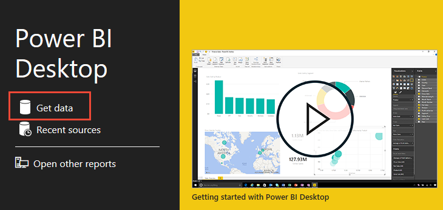
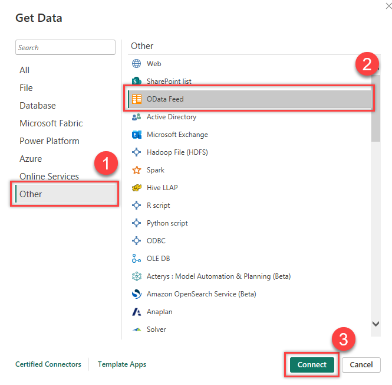
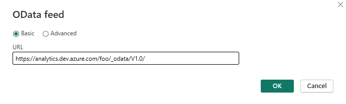
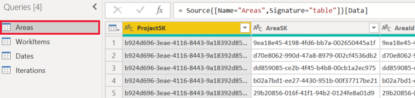

# Connect to Analytics data by using the Power BI OData feed

[!INCLUDE [temp](../includes/version-azure-devops.md)] 

You can access Analytics data through the Power BI Desktop OData feed. 

> [!IMPORTANT]  
> The method demonstrated in this article works for small organizations, because it always pulls in all the data into Power BI. Most of the filtering that's specified in the Power Query Editor is done client-side. For information about other approaches, see [Power BI integration Overview](overview.md). 

[!INCLUDE [temp](./includes/prerequisites-power-bi.md)]

## Access the Analytics OData feed

::: moniker range="azure-devops-2019"

> [!IMPORTANT]  
> Make sure that you've [enabled or installed Analytics](../dashboards/analytics-extension.md).  

::: moniker-end  

1. Make sure that you've [configured the permissions required to access Analytics](analytics-security.md).

1. Open Power BI Desktop. If you haven't already done so, [install Power BI Desktop now](https://powerbi.microsoft.com/desktop).  

1. On the Power BI Desktop welcome page or home ribbon, select **Get Data**.

	 

1. In the left pane, select **Other** > **OData Feed**, and then select **Connect**.  

      

1. In a supported browser, enter the URL in the format 
`https://analytics.dev.azure.com/{OrganizationName}/_odata/{version}/`.  

   For example, if {*OrganizationName*} is **fabrikam** and {*version*} is **v1.0**, the URL is `https://analytics.dev.azure.com/fabrikam/_odata/v1.0/`.

      

   > [!NOTE]  
   >Alternatively, you can enter the URL with the *ProjectName* specified, as shown in the following example:  
   >`https://analytics.dev.azure.com/{OrganizationName}/{ProjectName}/_odata/{version}/`
   >Using this format trims the results by the specified project across all entities related to that project.

1. At the prompt, authenticate against the service. If you have not already done so, see [Client Authentication Options](client-authentication-options.md). 

1. Select the check boxes next to the entities whose data you want to retrieve.

	> [!IMPORTANT]  
	> Do *not* select entities whose name includes *Snapshot*. Such entities contain the state of every work item on each day since the work item was created. For repositories of any size, selecting these entities will cause tens to hundreds of millions of work items to fail to load. *Snapshot* tables are intended only for [aggregation queries](../extend-analytics/odata-query-guidelines.md).

    

1. Select **Transform Data**. Do *not* select **Load**. 

   > [!IMPORTANT]
   > For each entity that you've selected, Power Query creates a query. Each query must be updated manually, because doing so *prevents throttling errors*. Power Query attempts to resolve null values as errors by generating an additional query for every null value it encounters. This can result in thousands of queries, which will quickly exceed your usage threshold, beyond which your user account will be throttled.
   >   
   > To prevent this issue:  
   > - Instruct Power BI to reference OData v4.
   > - Instruct the Analytics service to omit any values that are null, which improves query performance.

1. For each entity that you've selected in the preceding steps, do the following:

    a. In the **Queries** list, select an entity whose query you want to. In this example, **Areas** is selected.
      
      
    
    b. In the ribbon, select **Advanced Editor**.
    
    
    
    c. In the **Query** pane, scroll horizontally to view the `[Implementation="2.0"]` parameter.
    
    
    
    d. Replace `[Implementation="2.0"]` with the following string:  
        `[Implementation="2.0",OmitValues = ODataOmitValues.Nulls,ODataVersion = 4]` 
    
    
    
1. Select **Close & Apply**. 

## Related articles

- [Dataset design for the Power BI Connector for Azure DevOps](data-connector-dataset.md)
- [Data Connector - Example reports](data-connector-examples.md)
