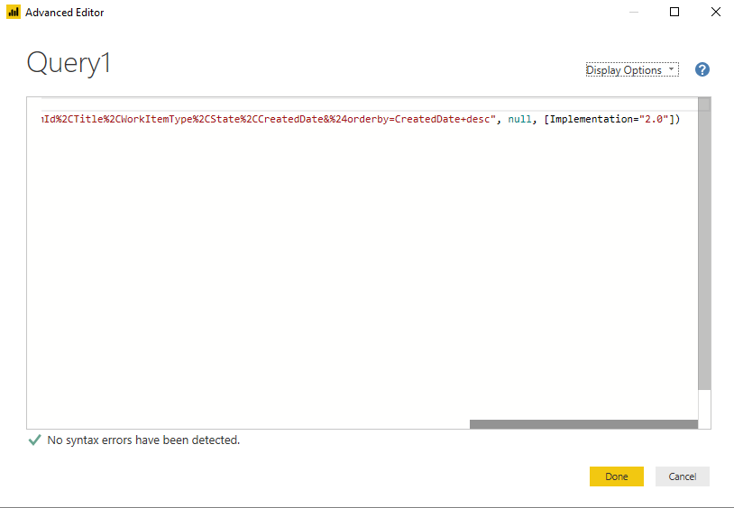
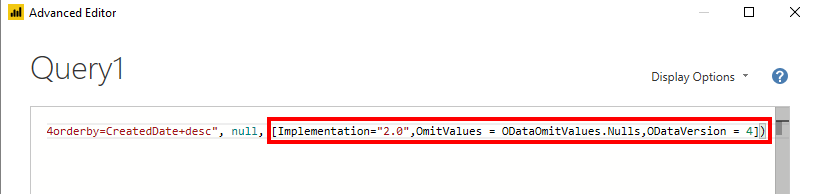

# Connect using the Power BI OData feed

[!INCLUDE [temp](../_shared/version-azure-devops.md)] 

You can access Analytics data through the Power BI Desktop OData feed. 

> [!IMPORTANT]  
> This method works for small organizations, as it always pulls in all the data into Power BI. Most filtering specified in the Power Query Editor are done client-side. For information on other approaches, read the [Power BI Integration Overview](overview.md). 

## Access Analytics OData feed

::: moniker range="azure-devops-2019"

1. Make sure you have [enabled or installed Analytics](../dashboards/analytics-extension.md).  
::: moniker-end  
1. Make sure you have configured the [permissions required to access Analytics](analytics-security.md).  

2. Open Power BI Desktop. If you need to install it, [do that now](https://powerbi.microsoft.com/desktop).  

3. Choose **Get Data** from either the welcome page or the Home ribbon.  

	> [!div class="mx-imgBorder"] 
	>  

4. Next, select **Other>OData Feed** and choose **Connect**.  

	  

5. In a supported browser, enter the URL in the following format:  

   ```OData
   https://analytics.dev.azure.com/{OrganizationName}/_odata/{version}/
   ```  

   If the *OrganizationName* is **fabrikam** and the *version* is **v1.0**, then the URL is `https://analytics.dev.azure.com/fabrikam/_odata/v1.0/`.

      

   > [!NOTE]  
   >Alternatively, you can enter the URL with the *ProjectName* specified which will trim the results by the specified project across all entities related to that project. 
   >
   >`https://analytics.dev.azure.com/{OrganizationName}/{ProjectName}/_odata/{version}/` 

6. You'll see a prompt to authenticate against the service. If you have not done so previously, see [Client Authentication Options](client-authentication-options.md).  

7. Next, select the entities you want to retrieve data for by checking those entities.

	> [!IMPORTANT]  
	>Do *not* select any entity with the name **Snapshot** in it. These entities contain the state of every work item on every day since each work item was created. For repositories of any size this will lead to tens or hundreds of millions of work items which will not load. **Snapshot** tables are intended only for [aggregation queries](../extend-analytics/odata-query-guidelines.md)

	 

	Do not select **Load**, but select **Transform Data** instead. 

8. For each entity that was selected, you must update the query using the Advanced Editor

    For every entity you selected, PowerQuery will create a query. Each of these queries must be updated manually. **This is required for the following reasons**:
    - **Prevent throttling errors** - Power Query will attempt to resolve null values as errors, by generating an additional query for every null it encounters. This can result in 1000's of queries, which will  quickly exceed the usage threshold where your user account will be throttled.
    - Instruct Power BI to reference OData v4
    - Instruct the Analytics Service to omit any values that are null, which improves query performance

    For each entity:

    A) Select the entity. In this example, we selected **Areas**
      
    > [!div class="mx-imgBorder"] 
    >   
    
    B) Select **Advanced Editor**.
    
    > [!div class="mx-imgBorder"] 
    > 
    
    C) Scroll the view pane horizontally to the right, to view the "[Implementation='2.0']" parameter.
    
    > [!div class="mx-imgBorder"] 
    > 
    
    D) Replace the "[Implementation='2.0']" with the following string:
    
    ```
    [Implementation="2.0",OmitValues = ODataOmitValues.Nulls,ODataVersion = 4]
    ``` 
    
    > [!div class="mx-imgBorder"] 
    > 
    


    Repeat steps A-D for every entity you've selected.
    

At this point, you may select **Close & Apply** in the upper left corner. 

## Related articles

- [Dataset design for the Power BI Connector for Azure DevOps](data-connector-dataset.md)
- [Data Connector - Example reports](data-connector-examples.md)