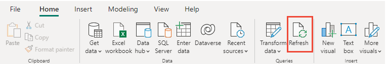

# Create an active bugs report in Power BI based on a custom Analytics view

[!INCLUDE [version-gt-eq-2019](../../includes/version-gt-eq-2019.md)]

Analytics views support creating status and trend reports for work items based on teams or field criteria of your choosing. This article provides a tutorial for creating a custom Analytics view, loading it into Power BI, and then creating a stacked area trend report similar to the following image. 

:::image type="content" source="media/active-bugs-report/active-bugs-stacked-area-chart.png" alt-text="Screenshot of Active Bug trends stacked area chart report.":::

In this article, you learn how to:
> [!div class="checklist"]  
> - Create a custom Analytics view for active bugs 
> - Generate a Power BI report based on that view 
> - Create a trend chart 

For an overview of Analytics views, see [About Analytics views](what-are-analytics-views.md).

[!INCLUDE [prerequisites-simple](../includes/analytics-prerequisites-simple.md)]

### Power BI prerequisites  

- Have installed *Power BI Desktop* *October 2018 Update* or later version. You can download this client application from the official [Power BI Desktop download page](/power-bi/desktop-what-is-desktop).  
- To learn more about using Power BI, see [Get started with Power BI Desktop](/power-bi/fundamentals/desktop-getting-started).

[!INCLUDE [temp](../includes/analytics-open.md)] 

## Create your custom view

From the web portal, **Analytics view**, choose  **New View** to create a custom view. Fill out the forms provided in each tab as shown in the following steps. 

Choose **Save** to move to the next tab in the panel. If you need to revisit a tab, select the tab title. 

### Name your view 

1. Give your view a name, such as *Active Bugs*. Select **Private view** to save it under **My Views**. Only you have access to views saved under **My Views**. Otherwise, you can select **Shared view** to save it under **Shared Views**. 

   > [!div class="mx-imgBorder"]
   > 

    Choose **Save** to move to the next tab. 

2. From the **Work items** tab, select the top-level filter for the work items. 

	- Choose **Filter by team** to select work items defined for one or more projects and teams.
	- Choose **Filter by area path** to select work items defined for one or more projects and area paths. 
 
    Here we choose the *Fabrikam Fiber* project and the *Production* area path.
    
    > [!div class="mx-imgBorder"]
    > 

    To add more projects or teams, select :::image type="icon" source="../media/icons/add_row_icon.png" border="false"::: **Add** to add a new row, and then select the project and team. 

3. Under **Backlogs and work items**, select :::image type="icon" source="../media/icons/add_row_icon.png" border="false"::: **Add**, and then select **Bug** from the list of work items types.

    > [!div class="mx-imgBorder"]
    > 

4. Under **Field criteria**, make the following selections to filter work items to only active bugs. Note, the bug states for your project may differ from those states used in this example. 
	- Select :::image type="icon" source="../media/icons/add_row_icon.png" border="false"::: **Add**, select **State**, choose **≠**, and then choose **Closed** .   
	- Select :::image type="icon" source="../media/icons/add_row_icon.png" border="false"::: **Add**, select **State**, choose **≠**, and then choose **Removed** .   

    > [!div class="mx-imgBorder"]
    >
  
    Choose **Save** to move to the next tab. 

5. In the next tab, **Fields**, keep the set of fields automatically selected. Add any custom fields you may want to report on.  
    
    > [!div class="mx-imgBorder"]
    > 

    Choose **Save** to move to the next tab. 

6. In the **History** tab, select **Rolling period in days** and enter the number of days of interest. Here we enter **90** days. For **Granularity**, choose **Weekly**. (For smaller or larger time periods, consider choosing **Daily** or **Monthly**, respectively.
    
    > [!div class="mx-imgBorder"]
    > 

	These selections generate a snapshot for each bug and for each week the bug is in a new, proposed, active, or resolved state. 
    To learn more about these defining trend data options, see [Create an Analytics view, History](analytics-views-create.md#history).

    Choose **Save** to move to the next tab. 

7. On the last tab, **Verification**, select **Verify view**. Azure DevOps verifies your view by running a test query against the dataset to your filter criteria. 

    > [!div class="mx-imgBorder"]
    > 
  
    > [!NOTE]   
    > Verification time will vary based on the amount of data defined in your view. Verify your view to make sure all the definitions are correct.  

    Once your view successfully verifies, choose **Save**. You can then start using it in Power BI. Verification also returns an estimate of the number of rows in the dataset.

    > [!div class="mx-imgBorder"]
    > 

    If your view fails to verify successfully, you get an error explaining the issue and pointing to a possible fix. Try changing the options you selected in the **Work Items** and **History** tabs to include less data, and then verify the view again. 

## Open Power BI desktop and load your view 

1. Open Power BI Desktop.  

::: moniker range="azure-devops"  
2. Choose (1) **Get Data** and select **More...**, (2) **Online Services**, (3) **Azure DevOps (Boards only)**, and then (4) **Connect**. 

    > [!div class="mx-imgBorder"]
    > 

3. Enter your organization name, the same Azure DevOps name you used to create the Active Bugs view, and the same project for which you defined the Active Bugs view. 

	:::image type="content" source="media/create-report/specify-account.png" alt-text="Dialog to enter Azure DevOps Organization and project name.":::
::: moniker-end

::: moniker range=">= azure-devops-2019 < azure-devops"  
2. Choose (1) **Get Data** and select **More...**, (2) **Online Services**, (3) **Azure DevOps Server (Boards only)**, and then (4) **Connect**.  

    > [!div class="mx-imgBorder"]
    > 

3. Enter the URL for your server and collection, the same project for which you defined the Active Bugs view. 

	:::image type="content" source="media/create-report/specify-collection-project.png" alt-text="Screenshot of Power BI, Dialog to enter Azure DevOps Project Collection and project name.":::
::: moniker-end

4. Expand the folders as needed, and choose the **Active Bugs** view you saved in the previous section, and then select **Load**. 

	:::image type="content" source="media/active-bugs-report/choose-view.png" alt-text="Screenshot of Power BI, Dialog of Navigator to choose Analytics view. ":::

*Need help with connecting?* See [Connect with Power BI Data Connector](data-connector-connect.md).

[!INCLUDE [temp](includes/close-apply.md)]

## Create a stacked area chart report 

1. In Power BI, choose the **Report** view. 

	:::image type="content" source="media/active-bugs-report/choose-report-view.png" alt-text="Screenshot of Power BI Report view selection.":::

2. Under **Visualizations**, choose **Stacked area chart** report. 

	:::image type="content" source="media/active-bugs-report/visualizations-stacked-area-chart.png" alt-text="Screenshot of Power BI Visualizations and Fields selections for Active Bugs Stacked area chart report. ":::

	- Add  `Date`" to **X-axis**, and right-click `Date` and select `Date` rather than `Date Hierarchy`.  
	
	- Add `State` to **Y-axis**, and right-click `Count`.
	
	- Add `State` to **Legend**. 

1. The example report displays.  

	:::image type="content" source="media/active-bugs-report/active-bugs-stacked-area-chart.png" alt-text="Screenshot of Sample Active Bug trends stacked area chart.":::

> [!TIP]    
> If you need to modify your Analytics view, you can do so and then return to your Power BI report and refresh the data. Simply select the **Refresh** option as shown.  
> 
> 

## Save and publish your report 

1. Choose **File > Save As** to save your report to your local workspace. 

2. To publish your report to Power BI, choose the **Publish** tab. For more information, see [Collaborate in your Power BI app workspace](/power-bi/service-collaborate-power-bi-workspace).

    > [!div class="mx-imgBorder"]
    > 

## Continue to explore your data

Analytics views provide you with a great deal of power and flexibility to filter your data and generate useful reports quickly and easily using Power BI. Within a custom view, you can create datasets that span multiple teams or projects. 

 

## Related articles 

- [Power BI integration overview](overview.md) 
- [Create Analytics views](analytics-views-create.md)
- [Connect with Power BI Data Connector](data-connector-connect.md)
- [Dataset design for the Power BI Data Connector](data-connector-dataset.md)
- [Functions available in Power BI Data Connector](data-connector-functions.md)
- [Get started with Power BI Desktop](/power-bi/fundamentals/desktop-getting-started)
